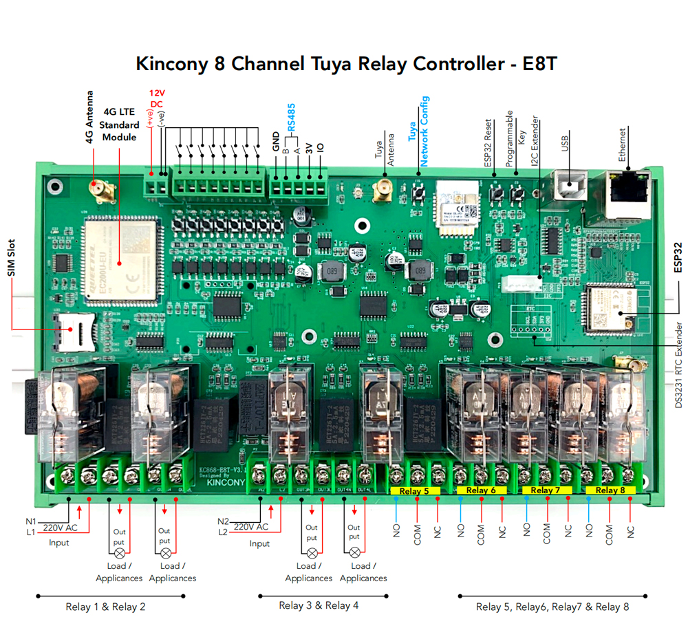

## GPIO Pinout

| Pin    | Function                      |
| ------ | ------------------------------|
| GPIO4  | IIC_SDA                       |
| GPIO5  | IIC_SCL                       |
| GPIO14 | 1-Wire GPIO                   |
| GPIO32 | 433MHz Receiver               |
| GPIO2  | Buzzer                        |
| GPIO34 | RS485_RXD                     |
| GPIO2  | RS485_TXD                     |
| GPIO39 | BL0939 Power Sensor 1-2CH RXD |
| GPIO12 | BL0939 Power Sensor 1-2CH TXD |
| GPIO36 | BL0939 Power Sensor 3-4CH RXD |
| GPIO33 | BL0939 Power Sensor 3-4CH TXD |

[Additional pinout/design details](https://www.kincony.com/esp32-tuya-4g-energy-meter-relay-module.html)

## Basic Configuration

```yaml
# Basic Config
esphome:
  name: KC868-E8T
  on_boot:  #Power chip BL0939 initialization
    priority: 600
    then:
      - uart.write:
          id: uart_1
          data: [0xA5, 0x39, 0x42, 0x00, 0x00, 0xDF]
      - delay: 1ms
      - uart.write:
          id: uart_1
          data: [0xA5, 0x38, 0x3C, 0x00, 0x00, 0xE6]
      - delay: 1ms
      - uart.write:
          id: uart_1
          data: [0xA5, 0x39, 0x42, 0x00, 0x00, 0xDF]
      - delay: 1ms
      - uart.write:
          id: uart_1
          data: [0xA5, 0x3A, 0x01, 0x00, 0x00, 0x1F]
      - delay: 1ms
      - uart.write:
          id: uart_1
          data: [0xA5, 0x39, 0x00, 0x00, 0x00, 0x21]

esp32:
  board: esp32dev
uart:
  - id: uart_1
    tx_pin: GPIO12
    rx_pin: GPIO39
    baud_rate: 4800
    parity: NONE
    stop_bits: 2

  - id: uart_2
    tx_pin: GPIO33
    rx_pin: GPIO36
    baud_rate: 4800
    parity: NONE
    stop_bits: 2

# Enable logging
logger:

# Enable Home Assistant API
api:

ota:
  password: "d83d604e4f0ae287fb041dbaf31524d9"

# Example configuration entry
ethernet:
  type: LAN8720
  mdc_pin: GPIO23
  mdio_pin: GPIO18
  clk_mode: GPIO17_OUT
  phy_addr: 0

sensor:
  - platform: bl0939
    uart_id: uart_1
    update_interval: 10s
    voltage:
      name: 'BL0939A Voltage'
    current_1:
      name: 'BL0939A Current 1'
    current_2:
      name: 'BL0939A Current 2'
    active_power_1:
      name: 'BL0939A Active Power 1'
    active_power_2:
      name: 'BL0939A Active Power 2'
    energy_1:
      name: 'BL0939A Energy 1'
    energy_2:
      name: 'BL0939A Energy 2'
    energy_total:
      name: 'BL0939A Energy Total'

  - platform: bl0939
    uart_id: uart_2
    update_interval: 10s
    voltage:
      name: 'BL0939B Voltage'
    current_1:
      name: 'BL0939B Current 1'
    current_2:
      name: 'BL0939B Current 2'
    active_power_1:
      name: 'BL0939B Active Power 1'
    active_power_2:
      name: 'BL0939B Active Power 2'
    energy_1:
      name: 'BL0939B Energy 1'
    energy_2:
      name: 'BL0939B Energy 2'
    energy_total:
      name: 'BL0939B Energy Total'

# Example configuration entry for ESP32
i2c:
  sda: 4
  scl: 5
  scan: true
  id: bus_a

pcf8574:
  - id: 'pcf8574_hub_out_1'  # for output channel 1-8
    address: 0x24

  - id: 'pcf8574_hub_in_1'  # for input channel 1-8
    address: 0x22

# Individual outputs
switch:
  - platform: gpio
    name: "e8t-light1"
    pin:
      pcf8574: pcf8574_hub_out_1
      number: 0
      mode: OUTPUT
      inverted: true

  - platform: gpio
    name: "e8t-light2"
    pin:
      pcf8574: pcf8574_hub_out_1
      number: 1
      mode: OUTPUT
      inverted: true

  - platform: gpio
    name: "e8t-light3"
    pin:
      pcf8574: pcf8574_hub_out_1
      number: 2
      mode: OUTPUT
      inverted: true

  - platform: gpio
    name: "e8t-light4"
    pin:
      pcf8574: pcf8574_hub_out_1
      number: 3
      mode: OUTPUT
      inverted: true

  - platform: gpio
    name: "e8t-light5"
    pin:
      pcf8574: pcf8574_hub_out_1
      number: 4
      mode: OUTPUT
      inverted: true

  - platform: gpio
    name: "e8t-light6"
    pin:
      pcf8574: pcf8574_hub_out_1
      number: 5
      mode: OUTPUT
      inverted: true

  - platform: gpio
    name: "e8t-light7"
    pin:
      pcf8574: pcf8574_hub_out_1
      number: 6
      mode: OUTPUT
      inverted: true

  - platform: gpio
    name: "e8t-light8"
    pin:
      pcf8574: pcf8574_hub_out_1
      number: 7
      mode: OUTPUT
      inverted: true

binary_sensor:
  - platform: gpio
    name: "e8t-input1"
    pin:
      pcf8574: pcf8574_hub_in_1
      number: 0
      mode: INPUT
      inverted: true

  - platform: gpio
    name: "e8t-input2"
    pin:
      pcf8574: pcf8574_hub_in_1
      number: 1
      mode: INPUT
      inverted: true

  - platform: gpio
    name: "e8t-input3"
    pin:
      pcf8574: pcf8574_hub_in_1
      number: 2
      mode: INPUT
      inverted: true

  - platform: gpio
    name: "e8t-input4"
    pin:
      pcf8574: pcf8574_hub_in_1
      number: 3
      mode: INPUT
      inverted: true

  - platform: gpio
    name: "e8t-input5"
    pin:
      pcf8574: pcf8574_hub_in_1
      number: 4
      mode: INPUT
      inverted: true

  - platform: gpio
    name: "e8t-input6"
    pin:
      pcf8574: pcf8574_hub_in_1
      number: 5
      mode: INPUT
      inverted: true

  - platform: gpio
    name: "e8t-input7"
    pin:
      pcf8574: pcf8574_hub_in_1
      number: 6
      mode: INPUT
      inverted: true

  - platform: gpio
    name: "e8t-input8"
    pin:
      pcf8574: pcf8574_hub_in_1
      number: 7
      mode: INPUT
      inverted: true
```
