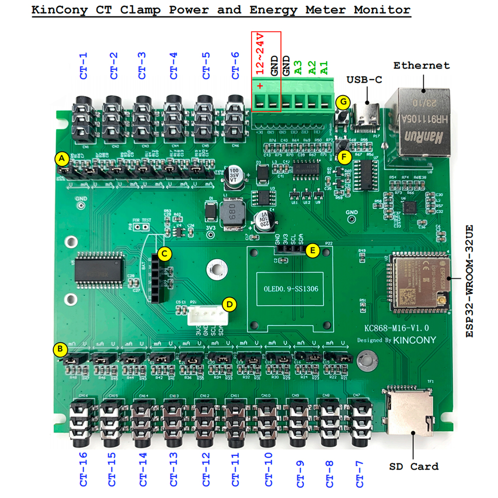

## GPIO Pinout

| Pin    | Function            |
| ------ | ------------------- |
| GPIO36 | ANALOG_A1           |
| GPIO34 | ANALOG_A2           |
| GPIO39 | ANALOG_A3           |
| GPIO35 | ANALOG_For_74HC4067 |
| GPIO4  | IIC_SDA             |
| GPIO5  | IIC_SCL             |
| GPIO14 | 1-Wire GPIO         |
| GPIO16 | 433MHz Receiver     |
| GPIO32 | 74HC4067_S0         |
| GPIO33 | 74HC4067_S1         |
| GPIO13 | 74HC4067_S2         |
| GPIO16 | 74HC4067_S3         |

[Additional pinout/design details](https://www.kincony.com/16-channel-ct-clamp-energy-monitor.html)

## Basic Configuration

```yaml
# Basic Config
esphome:
  name: KC868-M16

esp32:
  board: esp32dev
  framework:
    type: arduino

# Enable logging
logger:

# Enable Home Assistant API
api:
  encryption:
    key: "D69bY/GXlmjYkovak6WIhgmbOH8vwyqvMxIHBriYoaY="

ota:
  password: "9984b688b9646975bfd1b760a9c2df8b"

# Example configuration entry
ethernet:
  type: LAN8720
  mdc_pin: GPIO23
  mdio_pin: GPIO18
  clk_mode: GPIO17_OUT
  phy_addr: 0

cd74hc4067:
  - id: cd74hc4067_1
    pin_s0: 32
    pin_s1: 33
    pin_s2: 13
    pin_s3: 16

# Example configuration entry
sensor:
  - platform: adc
    pin: 35
    id: adc35
    update_interval: never
    attenuation: 12db

  - platform: adc
    name: "m16--AI-1"
    pin: 36
    id: adc36
    update_interval: 15s
    attenuation: 12db

  - platform: adc
    pin: 34
    name: "m16--AI-2"
    id: adc34
    update_interval: 15s
    attenuation: 12db

  - platform: adc
    pin: 39
    name: "m16--AI-3"
    id: adc39
    update_interval: 15s
    attenuation: 12db

  - platform: cd74hc4067
    id: ai1
    number: 0
    sensor: adc35
    update_interval: 5s

  - platform: cd74hc4067
    id: ai2
    number: 1
    sensor: adc35
    update_interval: 5s

  - platform: cd74hc4067
    id: ai3
    number: 2
    sensor: adc35
    update_interval: 5s

  - platform: cd74hc4067
    id: ai4
    number: 3
    sensor: adc35
    update_interval: 5s

  - platform: cd74hc4067
    id: ai5
    number: 4
    sensor: adc35
    update_interval: 5s

  - platform: cd74hc4067
    id: ai6
    number: 5
    sensor: adc35
    update_interval: 5s

  - platform: cd74hc4067
    id: ai7
    number: 6
    sensor: adc35
    update_interval: 5s

  - platform: cd74hc4067
    id: ai8
    number: 7
    sensor: adc35
    update_interval: 5s

  - platform: cd74hc4067
    id: ai9
    number: 8
    sensor: adc35
    update_interval: 5s

  - platform: cd74hc4067
    id: ai10
    number: 9
    sensor: adc35
    update_interval: 5s

  - platform: cd74hc4067
    id: ai11
    number: 10
    sensor: adc35
    update_interval: 5s

  - platform: cd74hc4067
    id: ai12
    number: 11
    sensor: adc35
    update_interval: 5s

  - platform: cd74hc4067
    id: ai13
    number: 12
    sensor: adc35
    update_interval: 5s

  - platform: cd74hc4067
    id: ai14
    number: 13
    sensor: adc35
    update_interval: 5s

  - platform: cd74hc4067
    id: ai15
    number: 14
    sensor: adc35
    update_interval: 5s

  - platform: cd74hc4067
    id: ai16
    number: 15
    sensor: adc35
    update_interval: 5s

  - platform: ct_clamp
    sensor: ai1
    name: "Measured Current-1"
    update_interval: 5s
    filters:
      - calibrate_linear:
          # Measured value of 0 maps to 0A
          - 0 -> 0
          # Known load: 4.0A
          # Value shown in logs: 0.1333A
          - 0.31749 -> 8.95608

  - platform: ct_clamp
    sensor: ai2
    name: "Measured Current-2"
    update_interval: 5s
    filters:
      - calibrate_linear:
          # Measured value of 0 maps to 0A
          - 0 -> 0
          # Known load: 4.0A
          # Value shown in logs: 0.1333A
          - 0.31749 -> 8.95608

  - platform: ct_clamp
    sensor: ai3
    name: "Measured Current-3"
    update_interval: 5s
    filters:
      - calibrate_linear:
          # Measured value of 0 maps to 0A
          - 0 -> 0
          # Known load: 4.0A
          # Value shown in logs: 0.1333A
          - 0.31749 -> 8.95608

  - platform: ct_clamp
    sensor: ai4
    name: "Measured Current-4"
    update_interval: 5s
    filters:
      - calibrate_linear:
          # Measured value of 0 maps to 0A
          - 0 -> 0
          # Known load: 4.0A
          # Value shown in logs: 0.1333A
          - 0.31749 -> 8.95608

  - platform: ct_clamp
    sensor: ai5
    name: "Measured Current-5"
    update_interval: 5s
    filters:
      - calibrate_linear:
          # Measured value of 0 maps to 0A
          - 0 -> 0
          # Known load: 4.0A
          # Value shown in logs: 0.1333A
          - 0.31749 -> 8.95608

  - platform: ct_clamp
    sensor: ai6
    name: "Measured Current-6"
    update_interval: 5s
    filters:
      - calibrate_linear:
          # Measured value of 0 maps to 0A
          - 0 -> 0
          # Known load: 4.0A
          # Value shown in logs: 0.1333A
          - 0.31749 -> 8.95608

  - platform: ct_clamp
    sensor: ai7
    name: "Measured Current-7"
    update_interval: 5s
    filters:
      - calibrate_linear:
          # Measured value of 0 maps to 0A
          - 0 -> 0
          # Known load: 4.0A
          # Value shown in logs: 0.1333A
          - 0.31749 -> 8.95608

  - platform: ct_clamp
    sensor: ai8
    name: "Measured Current-8"
    update_interval: 5s
    filters:
      - calibrate_linear:
          # Measured value of 0 maps to 0A
          - 0 -> 0
          # Known load: 4.0A
          # Value shown in logs: 0.1333A
          - 0.31749 -> 8.95608

  - platform: ct_clamp
    sensor: ai9
    name: "Measured Current-9"
    update_interval: 5s
    filters:
      - calibrate_linear:
          # Measured value of 0 maps to 0A
          - 0 -> 0
          # Known load: 4.0A
          # Value shown in logs: 0.1333A
          - 0.31749 -> 8.95608

  - platform: ct_clamp
    sensor: ai10
    name: "Measured Current-10"
    update_interval: 5s
    filters:
      - calibrate_linear:
          # Measured value of 0 maps to 0A
          - 0 -> 0
          # Known load: 4.0A
          # Value shown in logs: 0.1333A
          - 0.31749 -> 8.95608

  - platform: ct_clamp
    sensor: ai11
    name: "Measured Current-11"
    update_interval: 5s
    filters:
      - calibrate_linear:
          # Measured value of 0 maps to 0A
          - 0 -> 0
          # Known load: 4.0A
          # Value shown in logs: 0.1333A
          - 0.31749 -> 8.95608

  - platform: ct_clamp
    sensor: ai12
    name: "Measured Current-12"
    update_interval: 5s
    filters:
      - calibrate_linear:
          # Measured value of 0 maps to 0A
          - 0 -> 0
          # Known load: 4.0A
          # Value shown in logs: 0.1333A
          - 0.31749 -> 8.95608

  - platform: ct_clamp
    sensor: ai13
    name: "Measured Current-13"
    update_interval: 5s
    filters:
      - calibrate_linear:
          # Measured value of 0 maps to 0A
          - 0 -> 0
          # Known load: 4.0A
          # Value shown in logs: 0.1333A
          - 0.31749 -> 8.95608

  - platform: ct_clamp
    sensor: ai14
    name: "Measured Current-14"
    update_interval: 5s
    filters:
      - calibrate_linear:
          # Measured value of 0 maps to 0A
          - 0 -> 0
          # Known load: 4.0A
          # Value shown in logs: 0.1333A
          - 0.31749 -> 8.95608

  - platform: ct_clamp
    sensor: ai15
    name: "Measured Current-15"
    update_interval: 5s
    filters:
      - calibrate_linear:
          # Measured value of 0 maps to 0A
          - 0 -> 0
          # Known load: 4.0A
          # Value shown in logs: 0.1333A
          - 0.31749 -> 8.95608

  - platform: ct_clamp
    sensor: ai16
    name: "Measured Current-16"
    update_interval: 5s
    filters:
      - calibrate_linear:
          # Measured value of 0 maps to 0A
          - 0 -> 0
          # Known load: 4.0A
          # Value shown in logs: 0.1333A
          - 0.31749 -> 8.95608
```
