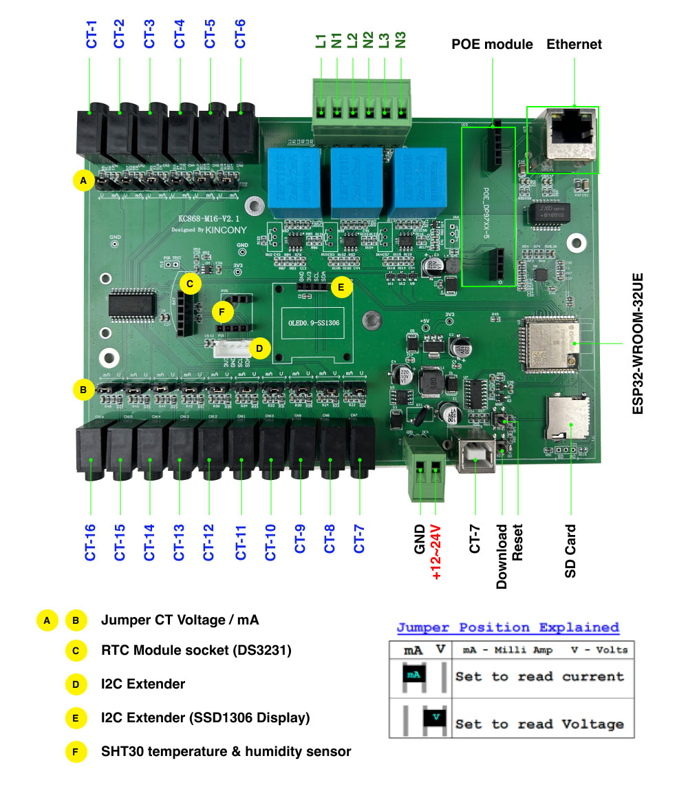

[ESP32 pin define details](https://www.kincony.com/forum/showthread.php?tid=3087)

[YouTube video tour](https://youtu.be/JfqzXulZ73A)

esphome:
  name: KC868-m16v2
  includes:
    - zmpt101b/ZMPT101B.h
    - zmpt101b/ZMPT101B.cpp
    - zmpt101b/zmpt101b_custom_sensor.h

esp32:
  board: esp32dev
  framework:
    type: arduino

## Enable logging

logger:

## Enable Home Assistant API

api:
  encryption:
    key: "D69bY/GXlmjYkovak6WIhgmbOH8vwyqvMxIHBriYoaY="

## Example configuration entry

ethernet:
  type: LAN8720
  mdc_pin: GPIO23
  mdio_pin: GPIO18
  clk_mode: GPIO17_OUT
  phy_addr: 0

i2c:
  sda: 4
  scl: 5
  scan: true
  id: bus_a

cd74hc4067:

  - id: cd74hc4067_1
    pin_s0: 32
    pin_s1: 33
    pin_s2: 13
    pin_s3: 16

web_server:
  port: 80

font:

  - file: "gfonts://Roboto"
    id: roboto
    size: 20

display:

  - platform: ssd1306_i2c
    model: "SSD1306 128x64"
    address: 0x3C
    lambda: |-
      it.printf(0, 0, id(roboto), "T: %.1f°C", id(temperature).state);
      it.printf(0, 20, id(roboto), "H: %.1f%%", id(humidity).state);
      it.printf(0, 40, id(roboto), "AC:%.1fV", id(voltage_1).state);

## Sensor configuration

sensor:

  - platform: custom
    lambda: |-
      auto my_sensor34 = new ZMPT101BSensor(34);
      auto my_sensor36 = new ZMPT101BSensor(36);
      auto my_sensor39 = new ZMPT101BSensor(39);
      App.register_component(my_sensor34);
      App.register_component(my_sensor36);
      App.register_component(my_sensor39);
      return {my_sensor34, my_sensor36, my_sensor39};
    sensors:
      - name: "m16--AI zmpt 34"
        id: voltage_1
        unit_of_measurement: V
        accuracy_decimals: 1
        state_class: "measurement"
      - name: "m16--AI zmpt 36"
        id: voltage_2
        unit_of_measurement: V
        accuracy_decimals: 1
        state_class: "measurement"
      - name: "m16--AI zmpt 39"
        id: voltage_3
        unit_of_measurement: V
        accuracy_decimals: 1
        state_class: "measurement"

  - platform: sht3xd
    temperature:
      name: "sht Temperature"
      id: temperature
    humidity:
      name: "sht Humidity"
      id: humidity
    address: 0x44
    update_interval: 5s

  - platform: adc
    pin: 35
    id: adc35
    update_interval: never
    attenuation: 11db

  - platform: cd74hc4067
    id: ai1
    number: 0
    sensor: adc35
    update_interval: 60s

  - platform: cd74hc4067
    id: ai2
    number: 1
    sensor: adc35
    update_interval: 60s

  - platform: cd74hc4067
    id: ai3
    number: 2
    sensor: adc35
    update_interval: 60s

  - platform: cd74hc4067
    id: ai4
    number: 3
    sensor: adc35
    update_interval: 60s

  - platform: cd74hc4067
    id: ai5
    number: 4
    sensor: adc35
    update_interval: 60s

  - platform: cd74hc4067
    id: ai6
    number: 5
    sensor: adc35
    update_interval: 60s

  - platform: cd74hc4067
    id: ai7
    number: 6
    sensor: adc35
    update_interval: 60s

  - platform: cd74hc4067
    id: ai8
    number: 7
    sensor: adc35
    update_interval: 60s

  - platform: cd74hc4067
    id: ai9
    number: 8
    sensor: adc35
    update_interval: 60s

  - platform: cd74hc4067
    id: ai10
    number: 9
    sensor: adc35
    update_interval: 60s

  - platform: cd74hc4067
    id: ai11
    number: 10
    sensor: adc35
    update_interval: 60s

  - platform: cd74hc4067
    id: ai12
    number: 11
    sensor: adc35
    update_interval: 60s

  - platform: cd74hc4067
    id: ai13
    number: 12
    sensor: adc35
    update_interval: 60s

  - platform: cd74hc4067
    id: ai14
    number: 13
    sensor: adc35
    update_interval: 60s

  - platform: cd74hc4067
    id: ai15
    number: 14
    sensor: adc35
    update_interval: 60s

  - platform: cd74hc4067
    id: ai16
    number: 15
    sensor: adc35
    update_interval: 60s

  - platform: ct_clamp
    sensor: ai1
    id: Measured_Current_1
    name: "Measured Current-1"
    update_interval: 5s
    filters:
      - calibrate_linear:
          - 0.0034 -> 0
          - 0.31749 -> 8.95608

  - platform: template
    id: power1
    name: "power1"
    lambda: return id(Measured_Current_1).state * id(voltage_1).state;
    device_class: power
    unit_of_measurement: 'W'
    update_interval: 60s

  - platform: total_daily_energy
    name: "Total Daily Energy1"
    power_id: power1
    filters:
      - multiply: 0.001
    unit_of_measurement: kWh
    accuracy_decimals: 3
    icon: mdi:clock-alert
    device_class: energy

  - platform: ct_clamp
    sensor: ai2
    name: "Measured Current-2"
    update_interval: 60s
    filters:
      - calibrate_linear:
          - 0 -> 0
          - 0.31749 -> 8.95608

  - platform: ct_clamp
    sensor: ai3
    name: "Measured Current-3"
    update_interval: 60s
    filters:
      - calibrate_linear:
          - 0 -> 0
          - 0.31749 -> 8.95608

  - platform: ct_clamp
    sensor: ai4
    name: "Measured Current-4"
    update_interval: 60s
    filters:
      - calibrate_linear:
          - 0 -> 0
          - 0.31749 -> 8.95608

  - platform: ct_clamp
    sensor: ai5
    name: "Measured Current-5"
    update_interval: 60s
    filters:
      - calibrate_linear:
          - 0 -> 0
          - 0.31749 -> 8.95608

  - platform: ct_clamp
    sensor: ai6
    name: "Measured Current-6"
    update_interval: 60s
    filters:
      - calibrate_linear:
          - 0 -> 0
          - 0.31749 -> 8.95608

  - platform: ct_clamp
    sensor: ai7
    name: "Measured Current-7"
    update_interval: 60s
    filters:
      - calibrate_linear:
          - 0 -> 0
          - 0.31749 -> 8.95608

  - platform: ct_clamp
    sensor: ai8
    name: "Measured Current-8"
    update_interval: 60s
    filters:
      - calibrate_linear:
          - 0 -> 0
          - 0.31749 -> 8.95608

  - platform: ct_clamp
    sensor: ai9
    name: "Measured Current-9"
    update_interval: 60s
    filters:
      - calibrate_linear:
          - 0 -> 0
          - 0.31749 -> 8.95608

  - platform: ct_clamp
    sensor: ai10
    name: "Measured Current-10"
    update_interval: 60s
    filters:
      - calibrate_linear:
          - 0 -> 0
          - 0.31749 -> 8.95608

  - platform: ct_clamp
    sensor: ai11
    name: "Measured Current-11"
    update_interval: 60s
    filters:
      - calibrate_linear:
          - 0 -> 0
          - 0.31749 -> 8.95608

  - platform: ct_clamp
    sensor: ai12
    name: "Measured Current-12"
    update_interval: 60s
    filters:
      - calibrate_linear:
          - 0 -> 0
          - 0.31749 -> 8.95608

  - platform: ct_clamp
    sensor: ai13
    name: "Measured Current-13"
    update_interval: 60s
    filters:
      - calibrate_linear:
          - 0 -> 0
          - 0.31749 -> 8.95608

  - platform: ct_clamp
    sensor: ai14
    name: "Measured Current-14"
    update_interval: 60s
    filters:
      - calibrate_linear:
          - 0 -> 0
          - 0.31749 -> 8.95608

  - platform: ct_clamp
    sensor: ai15
    name: "Measured Current-15"
    update_interval: 60s
    filters:
      - calibrate_linear:
          - 0 -> 0
          - 0.31749 -> 8.95608

  - platform: ct_clamp
    sensor: ai16
    name: "Measured Current-16"
    update_interval: 60s
    filters:
      - calibrate_linear:
          - 0 -> 0
          - 0.31749 -> 8.95608

time:
  - platform: sntp
    id: my_time
