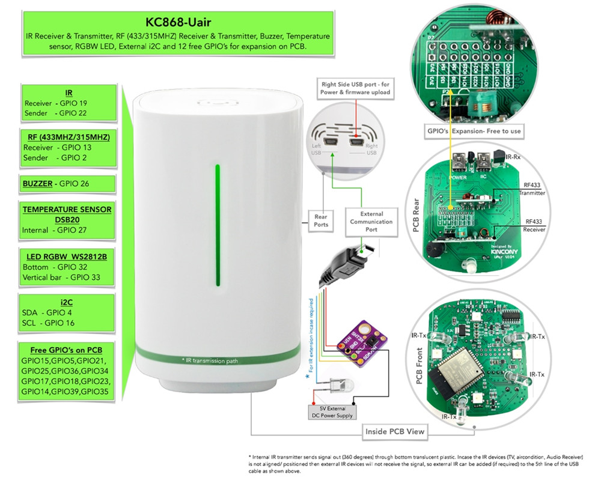

## GPIO Pinout

| Pin    | Function                   |
| ------ | ---------------------------|
| GPIO2  | 433MHz Transmitter         |
| GPIO13 | 433MHz Receiver            |
| GPIO19 | IR Receiver                |
| GPIO22 | IR Transmitter             |
| GPIO26 | Buzzer                     |
| GPIO4  | IIC_SDA                    |
| GPIO16 | IIC_SCL                    |
| GPIO27 | DS18B20 Temperature sensor |
| GPIO32 | 4*WS2812B LED Bottom       |
| GPIO33 | 1*WS2812B LED vertical bar |
| GPIO15 | Free GPIO                  |
| GPIO5  | Free GPIO                  |
| GPIO21 | Free GPIO                  |
| GPIO25 | Free GPIO                  |
| GPIO36 | Free GPIO                  |
| GPIO34 | Free GPIO                  |
| GPIO17 | Free GPIO                  |
| GPIO18 | Free GPIO                  |
| GPIO23 | Free GPIO                  |
| GPIO14 | Free GPIO                  |
| GPIO39 | Free GPIO                  |
| GPIO35 | Free GPIO                  |

[Additional pinout/design details](https://www.kincony.com/esp32-wifi-temperatur)

## Basic Configuration

```yaml
# Basic Config
esphome:
  name: KC868-Uair

esp32:
  board: esp32dev
  framework:
    type: arduino

# Enable logging
logger:

# Enable Home Assistant API
api:
  encryption:
    key: "hx8eSqbwjWs9/2bK0qK55QfTIOpI4gCfzLOeaOXZMaU="

i2c:
  sda: 4
  scl: 16
  scan: true
  id: bus_a

# Example configuration entry
one_wire:
  - pin: GPIO27
    update_interval: 15s

# Individual sensors
sensor:
  - platform: dallas_temp
    address: 0xC000000004D81528
    name: "internal Temperature"

# Example configuration entry
  - platform: sht3xd
    temperature:
      name: "extend Temperature"
    humidity:
      name: "extend Humidity"
    address: 0x44
    update_interval: 15s

light:
  - platform: fastled_clockless
    chipset: WS2812B
    pin: GPIO32    # Pin Define connected with LED strip
    num_leds: 4  #LEDs number
    rgb_order: GRB
    name: "Uair-Bottom-LED"
    effects:
      - addressable_rainbow:        ##defined 7 effects styles
      - addressable_color_wipe:
      - addressable_scan:
      - addressable_twinkle:
      - addressable_random_twinkle:
      - addressable_fireworks:
      - addressable_flicker:

  - platform: fastled_clockless
    chipset: WS2812B
    pin: GPIO33    # Pin Define connected with LED strip
    num_leds: 1  #LEDs number
    rgb_order: RGB
    name: "Uair-VVertical-LED"
    effects:
      - addressable_rainbow:        ##defined 7 effects styles
      - addressable_color_wipe:
      - addressable_scan:
      - addressable_twinkle:
      - addressable_random_twinkle:
      - addressable_fireworks:
      - addressable_flicker:
```
