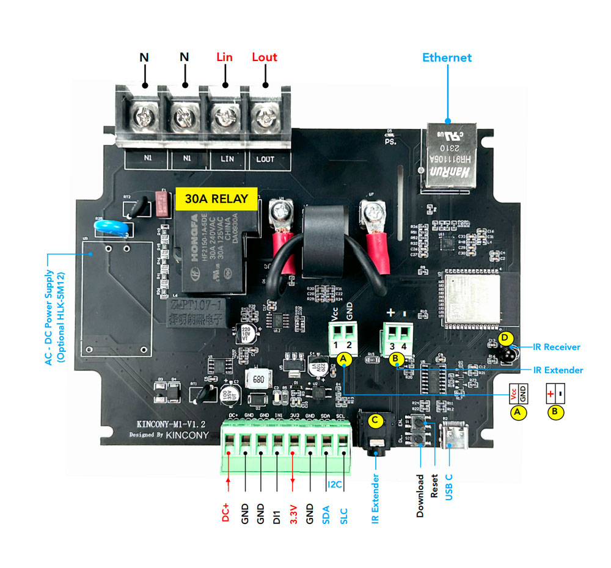

## Resources

- [ESP32 pin define details](https://www.kincony.com/forum/showthread.php?tid=3300)
- [YouTube video tour](https://youtu.be/uKbUdrj3T1M)

## ESPHome Configuration

Here is an example YAML configuration for the KinCony-KC868-M1 board with custom sensor integration.

```yaml
esphome:
  name: m1

esp32:
  board: esp32dev
uart:
  - id: uart_bus
    tx_pin: GPIO13
    rx_pin: GPIO14
    baud_rate: 9600
    stop_bits: 1

# Enable logging
logger:

# Enable Home Assistant API
api:

# Example configuration entry
ethernet:
  type: LAN8720
  mdc_pin: GPIO23
  mdio_pin: GPIO18
  clk_mode: GPIO17_OUT
  phy_addr: 0

sensor:
  - platform: bl0942
    uart_id: uart_bus
    update_interval: 3s
    voltage:
      name: 'M1 Voltage'
    current:
      name: 'M1 Current'
      filters:
        multiply: 0.1965
    power:
      name: 'M1 Power'
    energy:
      name: 'M1 Energy'
    frequency:
      name: "M1 Frequency"
      accuracy_decimals: 2

switch:
  - platform: gpio
    pin: 33
    name: "M1-relay"

binary_sensor:
  - platform: gpio
    pin: 32
    name: "M1-sensor-DI"
```
