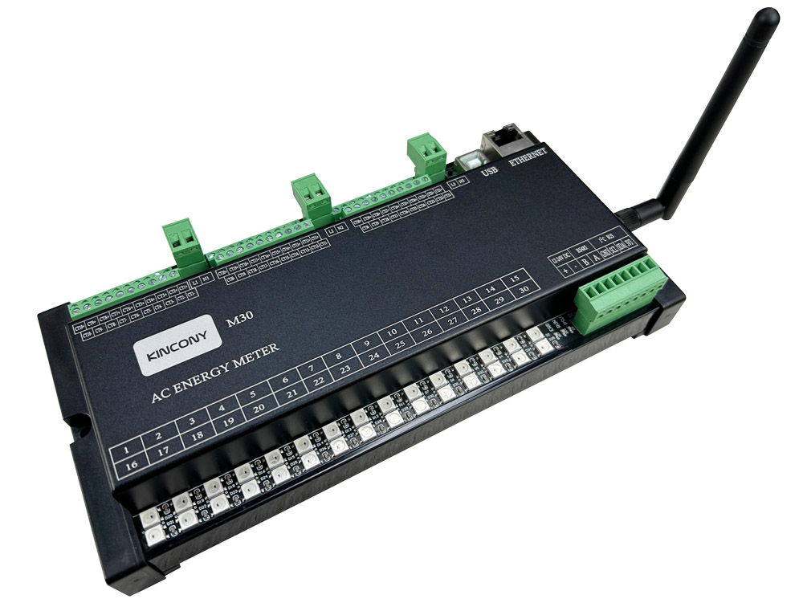

## Resources

- [ESP32 pin define details](https://www.kincony.com/forum/showthread.php?tid=4087)
- [YouTube video tour](https://youtu.be/rVrclJCS3Cg)

## ESPHome Configuration

Here is an example YAML configuration for the KinCony-KC868-M16v2 board with custom sensor integration.

```yaml
substitutions:
  max_current_range1: "10"
  max_current_range2: "10"
  max_current_range3: "10"
  max_current_range4: "10"
  max_current_range5: "10"
  max_current_range6: "10"
  max_current_range7: "10"
  max_current_range8: "10"
  max_current_range9: "10"
  max_current_range10: "10"
  max_current_range11: "10"
  max_current_range12: "10"
  max_current_range13: "10"
  max_current_range14: "10"
  max_current_range15: "10"
  max_current_range16: "10"
  max_current_range17: "10"
  max_current_range18: "10"
  max_current_range19: "10"
  max_current_range20: "10"
  max_current_range21: "10"
  max_current_range22: "10"
  max_current_range23: "10"
  max_current_range24: "10"
  max_current_range25: "10"
  max_current_range26: "10"
  max_current_range27: "10"
  max_current_range28: "10"
  max_current_range29: "10"
  max_current_range30: "10"

esphome:
  name: m30
  friendly_name: m30

esp32:
  board: esp32dev
  framework:
    type: arduino

# Enable logging
logger:
  # baud_rate: 0

# Enable Home Assistant API
api:

ota:
  - platform: esphome

ethernet:
  type: LAN8720
  mdc_pin: GPIO23
  mdio_pin: GPIO18
  clk_mode: GPIO17_OUT
  phy_addr: 0

uart:
  id: modbus_uart
  rx_pin: 32
  tx_pin: 33
  baud_rate: 115200
  stop_bits: 1
  data_bits: 8
  parity: NONE

modbus:
  id: modbus_hub
  uart_id: modbus_uart

modbus_controller:
  - id: modbus_hub_m30
    address: 1
    modbus_id: modbus_hub
    update_interval: 5s

sensor:
  - platform: modbus_controller
    modbus_controller_id: modbus_hub_m30
    address: 100
    register_type: holding
    name: m30_1_current_1
    id: m30_1_current_1
    unit_of_measurement: A
    accuracy_decimals: 3
    value_type: U_WORD
    filters:
      - multiply: 0.00098
    on_value:
      - then:
          - lambda: |-
              float current = id(m30_1_current_1).state;
              float red = (current - 0.0) / ${max_current_range1};
              float green = (${max_current_range1} - current) / ${max_current_range1};
              float blue = 0.0;

              auto call = id(M30_LED1).turn_on();
              call.set_brightness(0.6);
              call.set_rgb(red, green, blue);
              call.set_color_mode(ColorMode::RGB);
              call.perform();

  - platform: modbus_controller
    modbus_controller_id: modbus_hub_m30
    address: 101
    register_type: holding
    name: m30_1_current_2
    id: m30_1_current_2
    unit_of_measurement: A
    accuracy_decimals: 3
    value_type: U_WORD
    filters:
      - multiply: 0.00098
    on_value:
      - then:
          - lambda: |-
              float current = id(m30_1_current_2).state;
              float red = (current - 0.0) / ${max_current_range2};
              float green = (${max_current_range2} - current) / ${max_current_range2};
              float blue = 0.0;

              auto call = id(M30_LED2).turn_on();
              call.set_brightness(0.6);
              call.set_rgb(red, green, blue);
              call.set_color_mode(ColorMode::RGB);
              call.perform();

# Continue similar pattern for other modbus controllers and LEDs...

light:
  - platform: partition
    name: "M30_LED1"
    id: M30_LED1
    segments:
      - id: light1
        from: 14
        to: 14

  - platform: partition
    name: "M30_LED2"
    id: M30_LED2
    segments:
      - id: light1
        from: 13
        to: 13

  # Continue with other LED segments...

  - platform: esp32_rmt_led_strip
    id: light1
    rgb_order: GRB
    pin: GPIO12
    num_leds: 30
    rmt_channel: 0
    chipset: ws2812
``` 
   
```yaml 
substitutions:

  max_current_range1: "10"
  max_current_range2: "10"
  max_current_range3: "10"
  max_current_range4: "10"
  max_current_range5: "10"
  max_current_range6: "10"
  max_current_range7: "10"
  max_current_range8: "10"
  max_current_range9: "10"
  max_current_range10: "10"
  max_current_range11: "10"
  max_current_range12: "10"
  max_current_range13: "10"
  max_current_range14: "10"
  max_current_range15: "10"
  max_current_range16: "10"
  max_current_range17: "10"
  max_current_range18: "10"
  max_current_range19: "10"
  max_current_range20: "10"
  max_current_range21: "10"
  max_current_range22: "10"
  max_current_range23: "10"
  max_current_range24: "10"
  max_current_range25: "10"
  max_current_range26: "10"
  max_current_range27: "10"
  max_current_range28: "10"
  max_current_range29: "10"
  max_current_range30: "10"

esphome:
  name: m30
  friendly_name: m30

esp32:
  board: esp32dev
  framework:
    type: arduino


# Enable logging
logger:
  # baud_rate: 0

# Enable Home Assistant API
api:

ota:
  - platform: esphome

ethernet:
  type: LAN8720
  mdc_pin: GPIO23
  mdio_pin: GPIO18
  clk_mode: GPIO17_OUT
  phy_addr: 0

uart:
  id: modbus_uart
  rx_pin: 32
  tx_pin: 33
  baud_rate: 115200
  stop_bits: 1
  data_bits: 8
  parity: NONE


modbus:
  id: modbus_hub
  uart_id: modbus_uart


modbus_controller:
  - id: modbus_hub_m30
    address: 1
    modbus_id: modbus_hub
    update_interval: 5s

sensor:
  - platform: modbus_controller
    modbus_controller_id: modbus_hub_m30
    address: 100
    register_type: holding
    name: m30_1_current_1
    id: m30_1_current_1
    unit_of_measurement: A
    accuracy_decimals: 3
    value_type: U_WORD
    filters:
      - multiply: 0.00098
    on_value:
      - then:
          - lambda: |-
              float current = id(m30_1_current_1).state;
              float red = (current - 0.0) / ${max_current_range1};
              float green = (${max_current_range1} - current) / ${max_current_range1};
              float blue = 0.0;

              auto call = id(M30_LED1).turn_on();
              call.set_brightness(0.6);
              call.set_rgb(red, green, blue);
              call.set_color_mode(ColorMode::RGB);
              call.perform();
  - platform: modbus_controller
    modbus_controller_id: modbus_hub_m30
    address: 101
    register_type: holding
    name: m30_1_current_2
    id: m30_1_current_2
    unit_of_measurement: A
    accuracy_decimals: 3
    value_type: U_WORD
    filters:
      - multiply: 0.00098
    on_value:
      - then:
          - lambda: |-
              float current = id(m30_1_current_2).state;
              float red = (current - 0.0) / ${max_current_range2};
              float green = (${max_current_range2} - current) / ${max_current_range2};
              float blue = 0.0;

              auto call = id(M30_LED2).turn_on();
              call.set_brightness(0.6);
              call.set_rgb(red, green, blue);
              call.set_color_mode(ColorMode::RGB);
              call.perform();
  - platform: modbus_controller
    modbus_controller_id: modbus_hub_m30
    address: 102
    register_type: holding
    name: m30_1_current_3
    id: m30_1_current_3
    unit_of_measurement: A
    accuracy_decimals: 3
    value_type: U_WORD
    filters:
      - multiply: 0.00098
    on_value:
      - then:
          - lambda: |-
              float current = id(m30_1_current_3).state;
              float red = (current - 0.0) / ${max_current_range3};
              float green = (${max_current_range3} - current) / ${max_current_range3};
              float blue = 0.0;

              auto call = id(M30_LED3).turn_on();
              call.set_brightness(0.6);
              call.set_rgb(red, green, blue);
              call.set_color_mode(ColorMode::RGB);
              call.perform();
  - platform: modbus_controller
    modbus_controller_id: modbus_hub_m30
    address: 103
    register_type: holding
    name: m30_1_current_4
    id: m30_1_current_4
    unit_of_measurement: A
    accuracy_decimals: 3
    value_type: U_WORD
    filters:
      - multiply: 0.00098
    on_value:
      - then:
          - lambda: |-
              float current = id(m30_1_current_4).state;
              float red = (current - 0.0) / ${max_current_range4};
              float green = (${max_current_range4} - current) / ${max_current_range4};
              float blue = 0.0;

              auto call = id(M30_LED4).turn_on();
              call.set_brightness(0.6);
              call.set_rgb(red, green, blue);
              call.set_color_mode(ColorMode::RGB);
              call.perform();
  - platform: modbus_controller
    modbus_controller_id: modbus_hub_m30
    address: 104
    register_type: holding
    name: m30_1_current_5
    id: m30_1_current_5
    unit_of_measurement: A
    accuracy_decimals: 3
    value_type: U_WORD
    filters:
      - multiply: 0.00098
    on_value:
      - then:
          - lambda: |-
              float current = id(m30_1_current_5).state;
              float red = (current - 0.0) / ${max_current_range5};
              float green = (${max_current_range5} - current) / ${max_current_range5};
              float blue = 0.0;

              auto call = id(M30_LED5).turn_on();
              call.set_brightness(0.6);
              call.set_rgb(red, green, blue);
              call.set_color_mode(ColorMode::RGB);
              call.perform();
  - platform: modbus_controller
    modbus_controller_id: modbus_hub_m30
    address: 105
    register_type: holding
    name: m30_1_current_6
    id: m30_1_current_6
    unit_of_measurement: A
    accuracy_decimals: 3
    value_type: U_WORD
    filters:
      - multiply: 0.00098
    on_value:
      - then:
          - lambda: |-
              float current = id(m30_1_current_6).state;
              float red = (current - 0.0) / ${max_current_range6};
              float green = (${max_current_range6} - current) / ${max_current_range6};
              float blue = 0.0;

              auto call = id(M30_LED6).turn_on();
              call.set_brightness(0.6);
              call.set_rgb(red, green, blue);
              call.set_color_mode(ColorMode::RGB);
              call.perform();
  - platform: modbus_controller
    modbus_controller_id: modbus_hub_m30
    address: 106
    register_type: holding
    name: m30_1_current_7
    id: m30_1_current_7
    unit_of_measurement: A
    accuracy_decimals: 3
    value_type: U_WORD
    filters:
      - multiply: 0.00098
    on_value:
      - then:
          - lambda: |-
              float current = id(m30_1_current_7).state;
              float red = (current - 0.0) / ${max_current_range7};
              float green = (${max_current_range7} - current) / ${max_current_range7};
              float blue = 0.0;

              auto call = id(M30_LED7).turn_on();
              call.set_brightness(0.6);
              call.set_rgb(red, green, blue);
              call.set_color_mode(ColorMode::RGB);
              call.perform();
  - platform: modbus_controller
    modbus_controller_id: modbus_hub_m30
    address: 107
    register_type: holding
    name: m30_1_current_8
    id: m30_1_current_8
    unit_of_measurement: A
    accuracy_decimals: 3
    value_type: U_WORD
    filters:
      - multiply: 0.00098
    on_value:
      - then:
          - lambda: |-
              float current = id(m30_1_current_8).state;
              float red = (current - 0.0) / ${max_current_range8};
              float green = (${max_current_range8} - current) / ${max_current_range8};
              float blue = 0.0;

              auto call = id(M30_LED8).turn_on();
              call.set_brightness(0.6);
              call.set_rgb(red, green, blue);
              call.set_color_mode(ColorMode::RGB);
              call.perform();
  - platform: modbus_controller
    modbus_controller_id: modbus_hub_m30
    address: 108
    register_type: holding
    name: m30_1_current_9
    id: m30_1_current_9
    unit_of_measurement: A
    accuracy_decimals: 3
    value_type: U_WORD
    filters:
      - multiply: 0.00098
    on_value:
      - then:
          - lambda: |-
              float current = id(m30_1_current_9).state;
              float red = (current - 0.0) / ${max_current_range9};
              float green = (${max_current_range9} - current) / ${max_current_range9};
              float blue = 0.0;

              auto call = id(M30_LED9).turn_on();
              call.set_brightness(0.6);
              call.set_rgb(red, green, blue);
              call.set_color_mode(ColorMode::RGB);
              call.perform();
  - platform: modbus_controller
    modbus_controller_id: modbus_hub_m30
    address: 109
    register_type: holding
    name: m30_1_current_10
    id: m30_1_current_10
    unit_of_measurement: A
    accuracy_decimals: 3
    value_type: U_WORD
    filters:
      - multiply: 0.00098
    on_value:
      - then:
          - lambda: |-
              float current = id(m30_1_current_10).state;
              float red = (current - 0.0) / ${max_current_range10};
              float green = (${max_current_range10} - current) / ${max_current_range10};
              float blue = 0.0;

              auto call = id(M30_LED10).turn_on();
              call.set_brightness(0.6);
              call.set_rgb(red, green, blue);
              call.set_color_mode(ColorMode::RGB);
              call.perform();
  - platform: modbus_controller
    modbus_controller_id: modbus_hub_m30
    address: 110
    register_type: holding
    name: m30_1_voltage
    id: m30_1_voltage
    unit_of_measurement: V
    accuracy_decimals: 1
    value_type: U_WORD
    filters:
      - multiply: 0.01
  - platform: modbus_controller
    modbus_controller_id: modbus_hub_m30
    address: 111
    register_type: holding
    name: m30_1_watt_1
    id: m30_1_watt_1
    unit_of_measurement: W
    accuracy_decimals: 1
    value_type: U_WORD
    filters:
      - multiply: 0.1
  - platform: modbus_controller
    modbus_controller_id: modbus_hub_m30
    address: 112
    register_type: holding
    name: m30_1_watt_2
    id: m30_1_watt_2
    unit_of_measurement: W
    accuracy_decimals: 1
    value_type: U_WORD
    filters:
      - multiply: 0.1
  - platform: modbus_controller
    modbus_controller_id: modbus_hub_m30
    address: 113
    register_type: holding
    name: m30_1_watt_3
    id: m30_1_watt_3
    unit_of_measurement: W
    accuracy_decimals: 1
    value_type: U_WORD
    filters:
      - multiply: 0.1
  - platform: modbus_controller
    modbus_controller_id: modbus_hub_m30
    address: 114
    register_type: holding
    name: m30_1_watt_4
    id: m30_1_watt_4
    unit_of_measurement: W
    accuracy_decimals: 1
    value_type: U_WORD
    filters:
      - multiply: 0.1
  - platform: modbus_controller
    modbus_controller_id: modbus_hub_m30
    address: 115
    register_type: holding
    name: m30_1_watt_5
    id: m30_1_watt_5
    unit_of_measurement: W
    accuracy_decimals: 1
    value_type: U_WORD
    filters:
      - multiply: 0.1
  - platform: modbus_controller
    modbus_controller_id: modbus_hub_m30
    address: 116
    register_type: holding
    name: m30_1_watt_6
    id: m30_1_watt_6
    unit_of_measurement: W
    accuracy_decimals: 1
    value_type: U_WORD
    filters:
      - multiply: 0.1
  - platform: modbus_controller
    modbus_controller_id: modbus_hub_m30
    address: 117
    register_type: holding
    name: m30_1_watt_7
    id: m30_1_watt_7
    unit_of_measurement: W
    accuracy_decimals: 1
    value_type: U_WORD
    filters:
      - multiply: 0.1
  - platform: modbus_controller
    modbus_controller_id: modbus_hub_m30
    address: 118
    register_type: holding
    name: m30_1_watt_8
    id: m30_1_watt_8
    unit_of_measurement: W
    accuracy_decimals: 1
    value_type: U_WORD
    filters:
      - multiply: 0.1
  - platform: modbus_controller
    modbus_controller_id: modbus_hub_m30
    address: 119
    register_type: holding
    name: m30_1_watt_9
    id: m30_1_watt_9
    unit_of_measurement: W
    accuracy_decimals: 1
    value_type: U_WORD
    filters:
      - multiply: 0.1
  - platform: modbus_controller
    modbus_controller_id: modbus_hub_m30
    address: 120
    register_type: holding
    name: m30_1_watt_10
    id: m30_1_watt_10
    unit_of_measurement: W
    accuracy_decimals: 1
    value_type: U_WORD
    filters:
      - multiply: 0.1
  - platform: modbus_controller
    state_class: total_increasing
    device_class: energy
    modbus_controller_id: modbus_hub_m30
    address: 121
    register_type: holding
    name: m30_1_energy_1
    id: m30_1_energy_1
    unit_of_measurement: kWh
    accuracy_decimals: 1
    value_type: U_WORD
  - platform: modbus_controller
    state_class: total_increasing
    device_class: energy
    modbus_controller_id: modbus_hub_m30
    address: 122
    register_type: holding
    name: m30_1_energy_2
    id: m30_1_energy_2
    unit_of_measurement: kWh
    accuracy_decimals: 1
    value_type: U_WORD
  - platform: modbus_controller
    state_class: total_increasing
    device_class: energy
    modbus_controller_id: modbus_hub_m30
    address: 123
    register_type: holding
    name: m30_1_energy_3
    id: m30_1_energy_3
    unit_of_measurement: kWh
    accuracy_decimals: 1
    value_type: U_WORD
  - platform: modbus_controller
    state_class: total_increasing
    device_class: energy
    modbus_controller_id: modbus_hub_m30
    address: 124
    register_type: holding
    name: m30_1_energy_4
    id: m30_1_energy_4
    unit_of_measurement: kWh
    accuracy_decimals: 1
    value_type: U_WORD
  - platform: modbus_controller
    state_class: total_increasing
    device_class: energy
    modbus_controller_id: modbus_hub_m30
    address: 125
    register_type: holding
    name: m30_1_energy_5
    id: m30_1_energy_5
    unit_of_measurement: kWh
    accuracy_decimals: 1
    value_type: U_WORD
  - platform: modbus_controller
    state_class: total_increasing
    device_class: energy
    modbus_controller_id: modbus_hub_m30
    address: 126
    register_type: holding
    name: m30_1_energy_6
    id: m30_1_energy_6
    unit_of_measurement: kWh
    accuracy_decimals: 1
    value_type: U_WORD
  - platform: modbus_controller
    state_class: total_increasing
    device_class: energy
    modbus_controller_id: modbus_hub_m30
    address: 127
    register_type: holding
    name: m30_1_energy_7
    id: m30_1_energy_7
    unit_of_measurement: kWh
    accuracy_decimals: 1
    value_type: U_WORD
  - platform: modbus_controller
    state_class: total_increasing
    device_class: energy
    modbus_controller_id: modbus_hub_m30
    address: 128
    register_type: holding
    name: m30_1_energy_8
    id: m30_1_energy_8
    unit_of_measurement: kWh
    accuracy_decimals: 1
    value_type: U_WORD
  - platform: modbus_controller
    state_class: total_increasing
    device_class: energy
    modbus_controller_id: modbus_hub_m30
    address: 129
    register_type: holding
    name: m30_1_energy_9
    id: m30_1_energy_9
    unit_of_measurement: kWh
    accuracy_decimals: 1
    value_type: U_WORD
  - platform: modbus_controller
    state_class: total_increasing
    device_class: energy
    modbus_controller_id: modbus_hub_m30
    address: 130
    register_type: holding
    name: m30_1_energy_10
    id: m30_1_energy_10
    unit_of_measurement: kWh
    accuracy_decimals: 1
    value_type: U_WORD
  - platform: modbus_controller
    modbus_controller_id: modbus_hub_m30
    address: 131
    register_type: holding
    name: m30_1_energy_sum
    id: m30_1_energy_sum
    unit_of_measurement: kWh
    accuracy_decimals: 1
    value_type: U_WORD
  - platform: modbus_controller
    modbus_controller_id: modbus_hub_m30
    address: 132
    register_type: holding
    name: m30_1_period
    id: m30_1_period
    unit_of_measurement: Hz
    accuracy_decimals: 1
    value_type: U_WORD
    filters:
      - multiply: 0.01
  - platform: modbus_controller
    modbus_controller_id: modbus_hub_m30
    address: 133
    register_type: holding
    name: m30_1_tps_1
    id: m30_1_tps_1
    unit_of_measurement: °C
    accuracy_decimals: 1
    value_type: U_WORD
    filters:
      - multiply: 0.1
  # - platform: modbus_controller
  #   modbus_controller_id: modbus_hub_m30
  #   address: 134
  #   register_type: holding
  #   name: m30_1_tps_2
  #   id: m30_1_tps_2
  #   unit_of_measurement: °C
  #   accuracy_decimals: 1
  #   value_type: U_WORD
  - platform: modbus_controller
    modbus_controller_id: modbus_hub_m30
    address: 200
    register_type: holding
    name: m30_2_current_1
    id: m30_2_current_1
    unit_of_measurement: A
    accuracy_decimals: 3
    value_type: U_WORD
    filters:
      - multiply: 0.00098
    on_value:
      - then:
          - lambda: |-
              float current = id(m30_2_current_1).state;
              float red = (current - 0.0) / ${max_current_range11};
              float green = (${max_current_range11} - current) / ${max_current_range11};
              float blue = 0.0;

              auto call = id(M30_LED11).turn_on();
              call.set_brightness(0.6);
              call.set_rgb(red, green, blue);
              call.set_color_mode(ColorMode::RGB);
              call.perform();
  - platform: modbus_controller
    modbus_controller_id: modbus_hub_m30
    address: 201
    register_type: holding
    name: m30_2_current_2
    id: m30_2_current_2
    unit_of_measurement: A
    accuracy_decimals: 3
    value_type: U_WORD
    filters:
      - multiply: 0.00098
    on_value:
      - then:
          - lambda: |-
              float current = id(m30_2_current_2).state;
              float red = (current - 0.0) / ${max_current_range12};
              float green = (${max_current_range12} - current) / ${max_current_range12};
              float blue = 0.0;

              auto call = id(M30_LED12).turn_on();
              call.set_brightness(0.6);
              call.set_rgb(red, green, blue);
              call.set_color_mode(ColorMode::RGB);
              call.perform();
  - platform: modbus_controller
    modbus_controller_id: modbus_hub_m30
    address: 202
    register_type: holding
    name: m30_2_current_3
    id: m30_2_current_3
    unit_of_measurement: A
    accuracy_decimals: 3
    value_type: U_WORD
    filters:
      - multiply: 0.00098
    on_value:
      - then:
          - lambda: |-
              float current = id(m30_2_current_3).state;
              float red = (current - 0.0) / ${max_current_range13};
              float green = (${max_current_range13} - current) / ${max_current_range13};
              float blue = 0.0;

              auto call = id(M30_LED13).turn_on();
              call.set_brightness(0.6);
              call.set_rgb(red, green, blue);
              call.set_color_mode(ColorMode::RGB);
              call.perform();
  - platform: modbus_controller
    modbus_controller_id: modbus_hub_m30
    address: 203
    register_type: holding
    name: m30_2_current_4
    id: m30_2_current_4
    unit_of_measurement: A
    accuracy_decimals: 3
    value_type: U_WORD
    filters:
      - multiply: 0.00098
    on_value:
      - then:
          - lambda: |-
              float current = id(m30_2_current_4).state;
              float red = (current - 0.0) / ${max_current_range14};
              float green = (${max_current_range14} - current) / ${max_current_range14};
              float blue = 0.0;

              auto call = id(M30_LED14).turn_on();
              call.set_brightness(0.6);
              call.set_rgb(red, green, blue);
              call.set_color_mode(ColorMode::RGB);
              call.perform();
  - platform: modbus_controller
    modbus_controller_id: modbus_hub_m30
    address: 204
    register_type: holding
    name: m30_2_current_5
    id: m30_2_current_5
    unit_of_measurement: A
    accuracy_decimals: 3
    value_type: U_WORD
    filters:
      - multiply: 0.00098
    on_value:
      - then:
          - lambda: |-
              float current = id(m30_2_current_5).state;
              float red = (current - 0.0) / ${max_current_range15};
              float green = (${max_current_range15} - current) / ${max_current_range15};
              float blue = 0.0;

              auto call = id(M30_LED15).turn_on();
              call.set_brightness(0.6);
              call.set_rgb(red, green, blue);
              call.set_color_mode(ColorMode::RGB);
              call.perform();
  - platform: modbus_controller
    modbus_controller_id: modbus_hub_m30
    address: 205
    register_type: holding
    name: m30_2_current_6
    id: m30_2_current_6
    unit_of_measurement: A
    accuracy_decimals: 3
    value_type: U_WORD
    filters:
      - multiply: 0.00098
    on_value:
      - then:
          - lambda: |-
              float current = id(m30_2_current_6).state;
              float red = (current - 0.0) / ${max_current_range16};
              float green = (${max_current_range16} - current) / ${max_current_range16};
              float blue = 0.0;

              auto call = id(M30_LED16).turn_on();
              call.set_brightness(0.6);
              call.set_rgb(red, green, blue);
              call.set_color_mode(ColorMode::RGB);
              call.perform();
  - platform: modbus_controller
    modbus_controller_id: modbus_hub_m30
    address: 206
    register_type: holding
    name: m30_2_current_7
    id: m30_2_current_7
    unit_of_measurement: A
    accuracy_decimals: 3
    value_type: U_WORD
    filters:
      - multiply: 0.00098
    on_value:
      - then:
          - lambda: |-
              float current = id(m30_2_current_7).state;
              float red = (current - 0.0) / ${max_current_range17};
              float green = (${max_current_range17} - current) / ${max_current_range17};
              float blue = 0.0;

              auto call = id(M30_LED17).turn_on();
              call.set_brightness(0.6);
              call.set_rgb(red, green, blue);
              call.set_color_mode(ColorMode::RGB);
              call.perform();
  - platform: modbus_controller
    modbus_controller_id: modbus_hub_m30
    address: 207
    register_type: holding
    name: m30_2_current_8
    id: m30_2_current_8
    unit_of_measurement: A
    accuracy_decimals: 3
    value_type: U_WORD
    filters:
      - multiply: 0.00098
    on_value:
      - then:
          - lambda: |-
              float current = id(m30_2_current_8).state;
              float red = (current - 0.0) / ${max_current_range18};
              float green = (${max_current_range18} - current) / ${max_current_range18};
              float blue = 0.0;

              auto call = id(M30_LED18).turn_on();
              call.set_brightness(0.6);
              call.set_rgb(red, green, blue);
              call.set_color_mode(ColorMode::RGB);
              call.perform();
  - platform: modbus_controller
    modbus_controller_id: modbus_hub_m30
    address: 208
    register_type: holding
    name: m30_2_current_9
    id: m30_2_current_9
    unit_of_measurement: A
    accuracy_decimals: 3
    value_type: U_WORD
    filters:
      - multiply: 0.00098
    on_value:
      - then:
          - lambda: |-
              float current = id(m30_2_current_9).state;
              float red = (current - 0.0) / ${max_current_range19};
              float green = (${max_current_range19} - current) / ${max_current_range19};
              float blue = 0.0;

              auto call = id(M30_LED19).turn_on();
              call.set_brightness(0.6);
              call.set_rgb(red, green, blue);
              call.set_color_mode(ColorMode::RGB);
              call.perform();
  - platform: modbus_controller
    modbus_controller_id: modbus_hub_m30
    address: 209
    register_type: holding
    name: m30_2_current_10
    id: m30_2_current_10
    unit_of_measurement: A
    accuracy_decimals: 3
    value_type: U_WORD
    filters:
      - multiply: 0.00098
    on_value:
      - then:
          - lambda: |-
              float current = id(m30_2_current_10).state;
              float red = (current - 0.0) / ${max_current_range20};
              float green = (${max_current_range20} - current) / ${max_current_range20};
              float blue = 0.0;

              auto call = id(M30_LED20).turn_on();
              call.set_brightness(0.6);
              call.set_rgb(red, green, blue);
              call.set_color_mode(ColorMode::RGB);
              call.perform();
  - platform: modbus_controller
    modbus_controller_id: modbus_hub_m30
    address: 210
    register_type: holding
    name: m30_2_voltage
    id: m30_2_voltage
    unit_of_measurement: V
    accuracy_decimals: 1
    value_type: U_WORD
    filters:
      - multiply: 0.01
  - platform: modbus_controller
    modbus_controller_id: modbus_hub_m30
    address: 211
    register_type: holding
    name: m30_2_watt_1
    id: m30_2_watt_1
    unit_of_measurement: W
    accuracy_decimals: 1
    value_type: U_WORD
    filters:
      - multiply: 0.1
  - platform: modbus_controller
    modbus_controller_id: modbus_hub_m30
    address: 212
    register_type: holding
    name: m30_2_watt_2
    id: m30_2_watt_2
    unit_of_measurement: W
    accuracy_decimals: 1
    value_type: U_WORD
    filters:
      - multiply: 0.1
  - platform: modbus_controller
    modbus_controller_id: modbus_hub_m30
    address: 213
    register_type: holding
    name: m30_2_watt_3
    id: m30_2_watt_3
    unit_of_measurement: W
    accuracy_decimals: 1
    value_type: U_WORD
    filters:
      - multiply: 0.1
  - platform: modbus_controller
    modbus_controller_id: modbus_hub_m30
    address: 214
    register_type: holding
    name: m30_2_watt_4
    id: m30_2_watt_4
    unit_of_measurement: W
    accuracy_decimals: 1
    value_type: U_WORD
    filters:
      - multiply: 0.1
  - platform: modbus_controller
    modbus_controller_id: modbus_hub_m30
    address: 215
    register_type: holding
    name: m30_2_watt_5
    id: m30_2_watt_5
    unit_of_measurement: W
    accuracy_decimals: 1
    value_type: U_WORD
    filters:
      - multiply: 0.1
  - platform: modbus_controller
    modbus_controller_id: modbus_hub_m30
    address: 216
    register_type: holding
    name: m30_2_watt_6
    id: m30_2_watt_6
    unit_of_measurement: W
    accuracy_decimals: 1
    value_type: U_WORD
    filters:
      - multiply: 0.1
  - platform: modbus_controller
    modbus_controller_id: modbus_hub_m30
    address: 217
    register_type: holding
    name: m30_2_watt_7
    id: m30_2_watt_7
    unit_of_measurement: W
    accuracy_decimals: 1
    value_type: U_WORD
    filters:
      - multiply: 0.1
  - platform: modbus_controller
    modbus_controller_id: modbus_hub_m30
    address: 218
    register_type: holding
    name: m30_2_watt_8
    id: m30_2_watt_8
    unit_of_measurement: W
    accuracy_decimals: 1
    value_type: U_WORD
    filters:
      - multiply: 0.1
  - platform: modbus_controller
    modbus_controller_id: modbus_hub_m30
    address: 219
    register_type: holding
    name: m30_2_watt_9
    id: m30_2_watt_9
    unit_of_measurement: W
    accuracy_decimals: 1
    value_type: U_WORD
    filters:
      - multiply: 0.1
  - platform: modbus_controller
    modbus_controller_id: modbus_hub_m30
    address: 220
    register_type: holding
    name: m30_2_watt_10
    id: m30_2_watt_10
    unit_of_measurement: W
    accuracy_decimals: 1
    value_type: U_WORD
    filters:
      - multiply: 0.1
  - platform: modbus_controller
    state_class: total_increasing
    device_class: energy
    modbus_controller_id: modbus_hub_m30
    address: 221
    register_type: holding
    name: m30_2_energy_1
    id: m30_2_energy_1
    unit_of_measurement: kWh
    accuracy_decimals: 1
    value_type: U_WORD
  - platform: modbus_controller
    state_class: total_increasing
    device_class: energy
    modbus_controller_id: modbus_hub_m30
    address: 222
    register_type: holding
    name: m30_2_energy_2
    id: m30_2_energy_2
    unit_of_measurement: kWh
    accuracy_decimals: 1
    value_type: U_WORD
  - platform: modbus_controller
    state_class: total_increasing
    device_class: energy
    modbus_controller_id: modbus_hub_m30
    address: 223
    register_type: holding
    name: m30_2_energy_3
    id: m30_2_energy_3
    unit_of_measurement: kWh
    accuracy_decimals: 1
    value_type: U_WORD
  - platform: modbus_controller
    state_class: total_increasing
    device_class: energy
    modbus_controller_id: modbus_hub_m30
    address: 224
    register_type: holding
    name: m30_2_energy_4
    id: m30_2_energy_4
    unit_of_measurement: kWh
    accuracy_decimals: 1
    value_type: U_WORD
  - platform: modbus_controller
    state_class: total_increasing
    device_class: energy
    modbus_controller_id: modbus_hub_m30
    address: 225
    register_type: holding
    name: m30_2_energy_5
    id: m30_2_energy_5
    unit_of_measurement: kWh
    accuracy_decimals: 1
    value_type: U_WORD
  - platform: modbus_controller
    state_class: total_increasing
    device_class: energy
    modbus_controller_id: modbus_hub_m30
    address: 226
    register_type: holding
    name: m30_2_energy_6
    id: m30_2_energy_6
    unit_of_measurement: kWh
    accuracy_decimals: 1
    value_type: U_WORD
  - platform: modbus_controller
    state_class: total_increasing
    device_class: energy
    modbus_controller_id: modbus_hub_m30
    address: 227
    register_type: holding
    name: m30_2_energy_7
    id: m30_2_energy_7
    unit_of_measurement: kWh
    accuracy_decimals: 1
    value_type: U_WORD
  - platform: modbus_controller
    state_class: total_increasing
    device_class: energy
    modbus_controller_id: modbus_hub_m30
    address: 228
    register_type: holding
    name: m30_2_energy_8
    id: m30_2_energy_8
    unit_of_measurement: kWh
    accuracy_decimals: 1
    value_type: U_WORD
  - platform: modbus_controller
    state_class: total_increasing
    device_class: energy
    modbus_controller_id: modbus_hub_m30
    address: 229
    register_type: holding
    name: m30_2_energy_9
    id: m30_2_energy_9
    unit_of_measurement: kWh
    accuracy_decimals: 1
    value_type: U_WORD
  - platform: modbus_controller
    state_class: total_increasing
    device_class: energy
    modbus_controller_id: modbus_hub_m30
    address: 230
    register_type: holding
    name: m30_2_energy_10
    id: m30_2_energy_10
    unit_of_measurement: kWh
    accuracy_decimals: 1
    value_type: U_WORD
  - platform: modbus_controller
    modbus_controller_id: modbus_hub_m30
    address: 231
    register_type: holding
    name: m30_2_energy_sum
    id: m30_2_energy_sum
    unit_of_measurement: kWh
    accuracy_decimals: 1
    value_type: U_WORD
  - platform: modbus_controller
    modbus_controller_id: modbus_hub_m30
    address: 232
    register_type: holding
    name: m30_2_period
    id: m30_2_period
    unit_of_measurement: Hz
    accuracy_decimals: 1
    value_type: U_WORD
    filters:
      - multiply: 0.01
  - platform: modbus_controller
    modbus_controller_id: modbus_hub_m30
    address: 233
    register_type: holding
    name: m30_2_tps_1
    id: m30_2_tps_1
    unit_of_measurement: °C
    accuracy_decimals: 1
    value_type: U_WORD
    filters:
      - multiply: 0.1
  # - platform: modbus_controller
  #   modbus_controller_id: modbus_hub_m30
  #   address: 234
  #   register_type: holding
  #   name: m30_2_tps_2
  #   id: m30_2_tps_2
  #   unit_of_measurement: °C
  #   accuracy_decimals: 1
  #   value_type: U_WORD
  - platform: modbus_controller
    modbus_controller_id: modbus_hub_m30
    address: 300
    register_type: holding
    name: m30_3_current_1
    id: m30_3_current_1
    unit_of_measurement: A
    accuracy_decimals: 3
    value_type: U_WORD
    filters:
      - multiply: 0.00098
    on_value:
      - then:
          - lambda: |-
              float current = id(m30_3_current_1).state;
              float red = (current - 0.0) / ${max_current_range21};
              float green = (${max_current_range21} - current) / ${max_current_range21};
              float blue = 0.0;

              auto call = id(M30_LED21).turn_on();
              call.set_brightness(0.6);
              call.set_rgb(red, green, blue);
              call.set_color_mode(ColorMode::RGB);
              call.perform();
  - platform: modbus_controller
    modbus_controller_id: modbus_hub_m30
    address: 301
    register_type: holding
    name: m30_3_current_2
    id: m30_3_current_2
    unit_of_measurement: A
    accuracy_decimals: 3
    value_type: U_WORD
    filters:
      - multiply: 0.00098
    on_value:
      - then:
          - lambda: |-
              float current = id(m30_3_current_2).state;
              float red = (current - 0.0) / ${max_current_range22};
              float green = (${max_current_range22} - current) / ${max_current_range22};
              float blue = 0.0;

              auto call = id(M30_LED22).turn_on();
              call.set_brightness(0.6);
              call.set_rgb(red, green, blue);
              call.set_color_mode(ColorMode::RGB);
              call.perform();
  - platform: modbus_controller
    modbus_controller_id: modbus_hub_m30
    address: 302
    register_type: holding
    name: m30_3_current_3
    id: m30_3_current_3
    unit_of_measurement: A
    accuracy_decimals: 3
    value_type: U_WORD
    filters:
      - multiply: 0.00098
    on_value:
      - then:
          - lambda: |-
              float current = id(m30_3_current_3).state;
              float red = (current - 0.0) / ${max_current_range23};
              float green = (${max_current_range23} - current) / ${max_current_range23};
              float blue = 0.0;

              auto call = id(M30_LED23).turn_on();
              call.set_brightness(0.6);
              call.set_rgb(red, green, blue);
              call.set_color_mode(ColorMode::RGB);
              call.perform();
  - platform: modbus_controller
    modbus_controller_id: modbus_hub_m30
    address: 303
    register_type: holding
    name: m30_3_current_4
    id: m30_3_current_4
    unit_of_measurement: A
    accuracy_decimals: 3
    value_type: U_WORD
    filters:
      - multiply: 0.00098
    on_value:
      - then:
          - lambda: |-
              float current = id(m30_3_current_4).state;
              float red = (current - 0.0) / ${max_current_range24};
              float green = (${max_current_range24} - current) / ${max_current_range24};
              float blue = 0.0;

              auto call = id(M30_LED24).turn_on();
              call.set_brightness(0.6);
              call.set_rgb(red, green, blue);
              call.set_color_mode(ColorMode::RGB);
              call.perform();
  - platform: modbus_controller
    modbus_controller_id: modbus_hub_m30
    address: 304
    register_type: holding
    name: m30_3_current_5
    id: m30_3_current_5
    unit_of_measurement: A
    accuracy_decimals: 3
    value_type: U_WORD
    filters:
      - multiply: 0.00098
    on_value:
      - then:
          - lambda: |-
              float current = id(m30_3_current_5).state;
              float red = (current - 0.0) / ${max_current_range25};
              float green = (${max_current_range25} - current) / ${max_current_range25};
              float blue = 0.0;

              auto call = id(M30_LED25).turn_on();
              call.set_brightness(0.6);
              call.set_rgb(red, green, blue);
              call.set_color_mode(ColorMode::RGB);
              call.perform();
  - platform: modbus_controller
    modbus_controller_id: modbus_hub_m30
    address: 305
    register_type: holding
    name: m30_3_current_6
    id: m30_3_current_6
    unit_of_measurement: A
    accuracy_decimals: 3
    value_type: U_WORD
    filters:
      - multiply: 0.00098
    on_value:
      - then:
          - lambda: |-
              float current = id(m30_3_current_6).state;
              float red = (current - 0.0) / ${max_current_range26};
              float green = (${max_current_range26} - current) / ${max_current_range26};
              float blue = 0.0;

              auto call = id(M30_LED26).turn_on();
              call.set_brightness(0.6);
              call.set_rgb(red, green, blue);
              call.set_color_mode(ColorMode::RGB);
              call.perform();
  - platform: modbus_controller
    modbus_controller_id: modbus_hub_m30
    address: 306
    register_type: holding
    name: m30_3_current_7
    id: m30_3_current_7
    unit_of_measurement: A
    accuracy_decimals: 3
    value_type: U_WORD
    filters:
      - multiply: 0.00098
    on_value:
      - then:
          - lambda: |-
              float current = id(m30_3_current_7).state;
              float red = (current - 0.0) / ${max_current_range27};
              float green = (${max_current_range27} - current) / ${max_current_range27};
              float blue = 0.0;

              auto call = id(M30_LED27).turn_on();
              call.set_brightness(0.6);
              call.set_rgb(red, green, blue);
              call.set_color_mode(ColorMode::RGB);
              call.perform();
  - platform: modbus_controller
    modbus_controller_id: modbus_hub_m30
    address: 307
    register_type: holding
    name: m30_3_current_8
    id: m30_3_current_8
    unit_of_measurement: A
    accuracy_decimals: 3
    value_type: U_WORD
    filters:
      - multiply: 0.00098
    on_value:
      - then:
          - lambda: |-
              float current = id(m30_3_current_8).state;
              float red = (current - 0.0) / ${max_current_range28};
              float green = (${max_current_range28} - current) / ${max_current_range28};
              float blue = 0.0;

              auto call = id(M30_LED28).turn_on();
              call.set_brightness(0.6);
              call.set_rgb(red, green, blue);
              call.set_color_mode(ColorMode::RGB);
              call.perform();
  - platform: modbus_controller
    modbus_controller_id: modbus_hub_m30
    address: 308
    register_type: holding
    name: m30_3_current_9
    id: m30_3_current_9
    unit_of_measurement: A
    accuracy_decimals: 3
    value_type: U_WORD
    filters:
      - multiply: 0.00098
    on_value:
      - then:
          - lambda: |-
              float current = id(m30_3_current_9).state;
              float red = (current - 0.0) / ${max_current_range29};
              float green = (${max_current_range29} - current) / ${max_current_range29};
              float blue = 0.0;

              auto call = id(M30_LED29).turn_on();
              call.set_brightness(0.6);
              call.set_rgb(red, green, blue);
              call.set_color_mode(ColorMode::RGB);
              call.perform();
  - platform: modbus_controller
    modbus_controller_id: modbus_hub_m30
    address: 309
    register_type: holding
    name: m30_3_current_10
    id: m30_3_current_10
    unit_of_measurement: A
    accuracy_decimals: 3
    value_type: U_WORD
    filters:
      - multiply: 0.00098
    on_value:
      - then:
          - lambda: |-
              float current = id(m30_3_current_10).state;
              float red = (current - 0.0) / ${max_current_range30};
              float green = (${max_current_range30} - current) / ${max_current_range30};
              float blue = 0.0;

              auto call = id(M30_LED30).turn_on();
              call.set_brightness(0.6);
              call.set_rgb(red, green, blue);
              call.set_color_mode(ColorMode::RGB);
              call.perform();
  - platform: modbus_controller
    modbus_controller_id: modbus_hub_m30
    address: 310
    register_type: holding
    name: m30_3_voltage
    id: m30_3_voltage
    unit_of_measurement: V
    accuracy_decimals: 1
    value_type: U_WORD
    filters:
      - multiply: 0.01
  - platform: modbus_controller
    modbus_controller_id: modbus_hub_m30
    address: 311
    register_type: holding
    name: m30_3_watt_1
    id: m30_3_watt_1
    unit_of_measurement: W
    accuracy_decimals: 1
    value_type: U_WORD
    filters:
      - multiply: 0.1
  - platform: modbus_controller
    modbus_controller_id: modbus_hub_m30
    address: 312
    register_type: holding
    name: m30_3_watt_2
    id: m30_3_watt_2
    unit_of_measurement: W
    accuracy_decimals: 1
    value_type: U_WORD
    filters:
      - multiply: 0.1
  - platform: modbus_controller
    modbus_controller_id: modbus_hub_m30
    address: 313
    register_type: holding
    name: m30_3_watt_3
    id: m30_3_watt_3
    unit_of_measurement: W
    accuracy_decimals: 1
    value_type: U_WORD
    filters:
      - multiply: 0.1
  - platform: modbus_controller
    modbus_controller_id: modbus_hub_m30
    address: 314
    register_type: holding
    name: m30_3_watt_4
    id: m30_3_watt_4
    unit_of_measurement: W
    accuracy_decimals: 1
    value_type: U_WORD
    filters:
      - multiply: 0.1
  - platform: modbus_controller
    modbus_controller_id: modbus_hub_m30
    address: 315
    register_type: holding
    name: m30_3_watt_5
    id: m30_3_watt_5
    unit_of_measurement: W
    accuracy_decimals: 1
    value_type: U_WORD
    filters:
      - multiply: 0.1
  - platform: modbus_controller
    modbus_controller_id: modbus_hub_m30
    address: 316
    register_type: holding
    name: m30_3_watt_6
    id: m30_3_watt_6
    unit_of_measurement: W
    accuracy_decimals: 1
    value_type: U_WORD
    filters:
      - multiply: 0.1
  - platform: modbus_controller
    modbus_controller_id: modbus_hub_m30
    address: 317
    register_type: holding
    name: m30_3_watt_7
    id: m30_3_watt_7
    unit_of_measurement: W
    accuracy_decimals: 1
    value_type: U_WORD
    filters:
      - multiply: 0.1
  - platform: modbus_controller
    modbus_controller_id: modbus_hub_m30
    address: 318
    register_type: holding
    name: m30_3_watt_8
    id: m30_3_watt_8
    unit_of_measurement: W
    accuracy_decimals: 1
    value_type: U_WORD
    filters:
      - multiply: 0.1
  - platform: modbus_controller
    modbus_controller_id: modbus_hub_m30
    address: 319
    register_type: holding
    name: m30_3_watt_9
    id: m30_3_watt_9
    unit_of_measurement: W
    accuracy_decimals: 1
    value_type: U_WORD
    filters:
      - multiply: 0.1
  - platform: modbus_controller
    modbus_controller_id: modbus_hub_m30
    address: 320
    register_type: holding
    name: m30_3_watt_10
    id: m30_3_watt_10
    unit_of_measurement: W
    accuracy_decimals: 1
    value_type: U_WORD
    filters:
      - multiply: 0.1
  - platform: modbus_controller
    state_class: total_increasing
    device_class: energy
    modbus_controller_id: modbus_hub_m30
    address: 321
    register_type: holding
    name: m30_3_energy_1
    id: m30_3_energy_1
    unit_of_measurement: kWh
    accuracy_decimals: 1
    value_type: U_WORD
  - platform: modbus_controller
    state_class: total_increasing
    device_class: energy
    modbus_controller_id: modbus_hub_m30
    address: 322
    register_type: holding
    name: m30_3_energy_2
    id: m30_3_energy_2
    unit_of_measurement: kWh
    accuracy_decimals: 1
    value_type: U_WORD
  - platform: modbus_controller
    state_class: total_increasing
    device_class: energy
    modbus_controller_id: modbus_hub_m30
    address: 323
    register_type: holding
    name: m30_3_energy_3
    id: m30_3_energy_3
    unit_of_measurement: kWh
    accuracy_decimals: 1
    value_type: U_WORD
  - platform: modbus_controller
    state_class: total_increasing
    device_class: energy
    modbus_controller_id: modbus_hub_m30
    address: 324
    register_type: holding
    name: m30_3_energy_4
    id: m30_3_energy_4
    unit_of_measurement: kWh
    accuracy_decimals: 1
    value_type: U_WORD
  - platform: modbus_controller
    state_class: total_increasing
    device_class: energy
    modbus_controller_id: modbus_hub_m30
    address: 325
    register_type: holding
    name: m30_3_energy_5
    id: m30_3_energy_5
    unit_of_measurement: kWh
    accuracy_decimals: 1
    value_type: U_WORD
  - platform: modbus_controller
    state_class: total_increasing
    device_class: energy
    modbus_controller_id: modbus_hub_m30
    address: 326
    register_type: holding
    name: m30_3_energy_6
    id: m30_3_energy_6
    unit_of_measurement: kWh
    accuracy_decimals: 1
    value_type: U_WORD
  - platform: modbus_controller
    state_class: total_increasing
    device_class: energy
    modbus_controller_id: modbus_hub_m30
    address: 327
    register_type: holding
    name: m30_3_energy_7
    id: m30_3_energy_7
    unit_of_measurement: kWh
    accuracy_decimals: 1
    value_type: U_WORD
  - platform: modbus_controller
    state_class: total_increasing
    device_class: energy
    modbus_controller_id: modbus_hub_m30
    address: 328
    register_type: holding
    name: m30_3_energy_8
    id: m30_3_energy_8
    unit_of_measurement: kWh
    accuracy_decimals: 1
    value_type: U_WORD
  - platform: modbus_controller
    state_class: total_increasing
    device_class: energy
    modbus_controller_id: modbus_hub_m30
    address: 329
    register_type: holding
    name: m30_3_energy_9
    id: m30_3_energy_9
    unit_of_measurement: kWh
    accuracy_decimals: 1
    value_type: U_WORD
  - platform: modbus_controller
    state_class: total_increasing
    device_class: energy
    modbus_controller_id: modbus_hub_m30
    address: 330
    register_type: holding
    name: m30_3_energy_10
    id: m30_3_energy_10
    unit_of_measurement: kWh
    accuracy_decimals: 1
    value_type: U_WORD
  - platform: modbus_controller
    modbus_controller_id: modbus_hub_m30
    address: 331
    register_type: holding
    name: m30_3_energy_sum
    id: m30_3_energy_sum
    unit_of_measurement: kWh
    accuracy_decimals: 1
    value_type: U_WORD
  - platform: modbus_controller
    modbus_controller_id: modbus_hub_m30
    address: 332
    register_type: holding
    name: m30_3_period
    id: m30_3_period
    unit_of_measurement: Hz
    accuracy_decimals: 1
    value_type: U_WORD
    filters:
      - multiply: 0.01
  - platform: modbus_controller
    modbus_controller_id: modbus_hub_m30
    address: 333
    register_type: holding
    name: m30_3_tps_1
    id: m30_3_tps_1
    unit_of_measurement: °C
    accuracy_decimals: 1
    value_type: U_WORD
    filters:
      - multiply: 0.1
  # - platform: modbus_controller
  #   modbus_controller_id: modbus_hub_m30
  #   address: 334
  #   register_type: holding
  #   name: m30_3_tps_2
  #   id: m30_3_tps_2
  #   unit_of_measurement: °C
  #   accuracy_decimals: 1
  #   value_type: U_WORD


light:
  - platform: partition
    name: "M30_LED1"
    id: M30_LED1
    segments:
      - id: light1
        from: 14
        to: 14


  - platform: partition
    name: "M30_LED2"
    id: M30_LED2
    segments:
      - id: light1
        from: 13
        to: 13

  - platform: partition
    name: "M30_LED3"
    id: M30_LED3
    segments:
      - id: light1
        from: 12
        to: 12

  - platform: partition
    name: "M30_LED4"
    id: M30_LED4
    segments:
      - id: light1
        from: 11
        to: 11

  - platform: partition
    name: "M30_LED5"
    id: M30_LED5
    segments:
      - id: light1
        from: 10
        to: 10

  - platform: partition
    name: "M30_LED6"
    id: M30_LED6
    segments:
      - id: light1
        from: 9
        to: 9

  - platform: partition
    name: "M30_LED7"
    id: M30_LED7
    segments:
      - id: light1
        from: 8
        to: 8

  - platform: partition
    name: "M30_LED8"
    id: M30_LED8
    segments:
      - id: light1
        from: 7
        to: 7

  - platform: partition
    name: "M30_LED9"
    id: M30_LED9
    segments:
      - id: light1
        from: 6
        to: 6

  - platform: partition
    name: "M30_LED10"
    id: M30_LED10
    segments:
      - id: light1
        from: 5
        to: 5

  - platform: partition
    name: "M30_LED11"
    id: M30_LED11
    segments:
      - id: light1
        from: 4
        to: 4

  - platform: partition
    name: "M30_LED12"
    id: M30_LED12
    segments:
      - id: light1
        from: 3
        to: 3

  - platform: partition
    name: "M30_LED13"
    id: M30_LED13
    segments:
      - id: light1
        from: 2
        to: 2

  - platform: partition
    name: "M30_LED14"
    id: M30_LED14
    segments:
      - id: light1
        from: 1
        to: 1

  - platform: partition
    name: "M30_LED15"
    id: M30_LED15
    segments:
      - id: light1
        from: 0
        to: 0

  - platform: partition
    name: "M30_LED16"
    id: M30_LED16
    segments:
      - id: light1
        from: 15
        to: 15

  - platform: partition
    name: "M30_LED17"
    id: M30_LED17
    segments:
      - id: light1
        from: 16
        to: 16

  - platform: partition
    name: "M30_LED18"
    id: M30_LED18
    segments:
      - id: light1
        from: 17
        to: 17

  - platform: partition
    name: "M30_LED19"
    id: M30_LED19
    segments:
      - id: light1
        from: 18
        to: 18

  - platform: partition
    name: "M30_LED20"
    id: M30_LED20
    segments:
      - id: light1
        from: 19
        to: 19

  - platform: partition
    name: "M30_LED21"
    id: M30_LED21
    segments:
      - id: light1
        from: 20
        to: 20

  - platform: partition
    name: "M30_LED22"
    id: M30_LED22
    segments:
      - id: light1
        from: 21
        to: 21

  - platform: partition
    name: "M30_LED23"
    id: M30_LED23
    segments:
      - id: light1
        from: 22
        to: 22

  - platform: partition
    name: "M30_LED24"
    id: M30_LED24
    segments:
      - id: light1
        from: 23
        to: 23

  - platform: partition
    name: "M30_LED25"
    id: M30_LED25
    segments:
      - id: light1
        from: 24
        to: 24

  - platform: partition
    name: "M30_LED26"
    id: M30_LED26
    segments:
      - id: light1
        from: 25
        to: 25

  - platform: partition
    name: "M30_LED27"
    id: M30_LED27
    segments:
      - id: light1
        from: 26
        to: 26

  - platform: partition
    name: "M30_LED28"
    id: M30_LED28
    segments:
      - id: light1
        from: 27
        to: 27

  - platform: partition
    name: "M30_LED29"
    id: M30_LED29
    segments:
      - id: light1
        from: 28
        to: 28

  - platform: partition
    name: "M30_LED30"
    id: M30_LED30
    segments:
      - id: light1
        from: 29
        to: 29

  # Example for light segment source
  - platform: esp32_rmt_led_strip
    id: light1
    rgb_order: GRB
    pin: GPIO12
    num_leds: 30
    rmt_channel: 0
    chipset: ws2812
```

