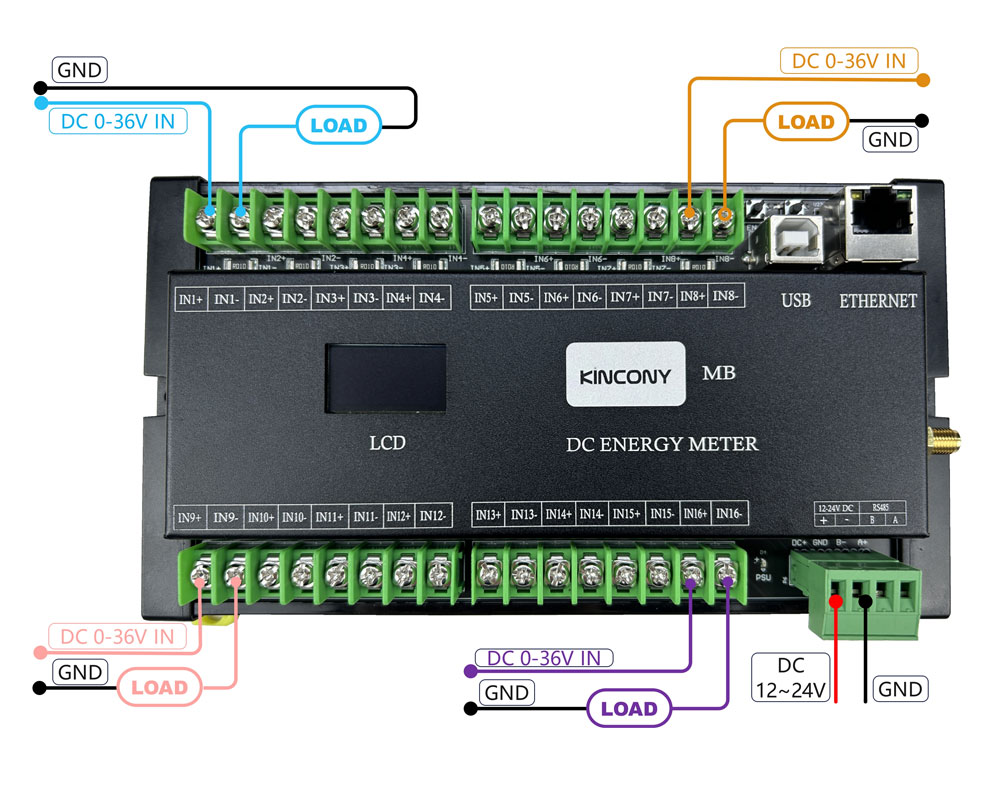
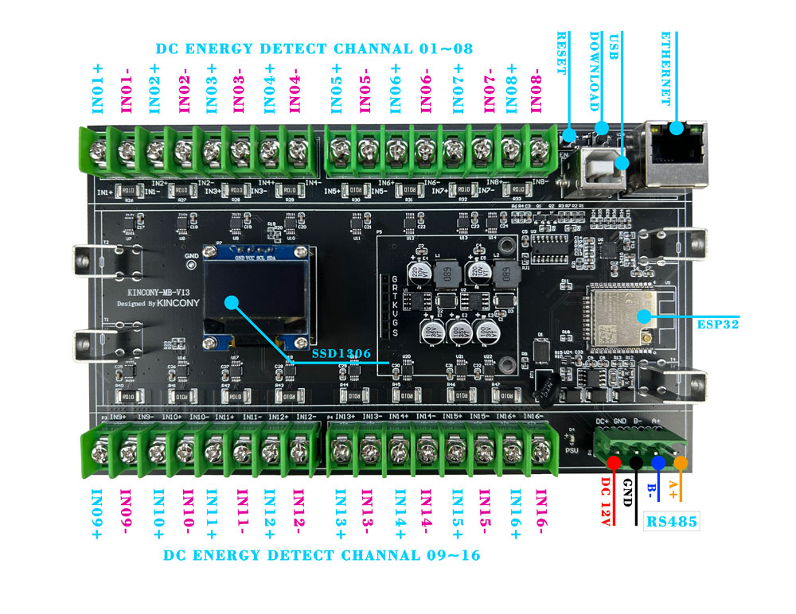

## Resources

- [ESP32 pin define details](https://www.kincony.com/forum/showthread.php?tid=3974)
- [YouTube video tour](https://youtu.be/2vSVhQPLPz8)

## ESPHome Configuration

Here is an example YAML configuration for the KinCony-MB board.

```yaml
esphome:
  name: mb

esp32:
  board: esp32dev

 # Example configuration entry
i2c:
   - id: bus_a
     sda: 15
     scl: 4
     scan: true
     frequency: 400kHz
   - id: bus_b
     sda: 5
     scl: 16
     scan: true
     frequency: 400kHz

# Example configuration entry
ethernet:
  type: LAN8720
  mdc_pin: GPIO23
  mdio_pin: GPIO18
  clk_mode: GPIO17_OUT
  phy_addr: 0

sensor:
  - platform: ina226
    address: 0x40
    i2c_id: bus_a
    shunt_resistance: 0.01 ohm
    current:
      name: "INA226 Current-1"
      id: current_1
    power:
      name: "INA226 Power-1"
    bus_voltage:
      name: "INA226 Bus Voltage-1"
      id: voltage_1
    shunt_voltage:
      name: "INA226 Shunt Voltage-1"
    max_current: 15A
    update_interval: 5s

  - platform: ina226
    address: 0x41
    i2c_id: bus_a
    shunt_resistance: 0.01 ohm
    current:
      name: "INA226 Current-2"
      id: current_2
    power:
      name: "INA226 Power-2"
    bus_voltage:
      name: "INA226 Bus Voltage-2"
      id: voltage_2
    shunt_voltage:
      name: "INA226 Shunt Voltage-2"
    max_current: 15A
    update_interval: 5s

  - platform: ina226
    address: 0x42
    i2c_id: bus_a
    shunt_resistance: 0.01 ohm
    current:
      name: "INA226 Current-3"
      id: current_3
    power:
      name: "INA226 Power-3"
    bus_voltage:
      name: "INA226 Bus Voltage-3"
      id: voltage_3
    shunt_voltage:
      name: "INA226 Shunt Voltage-3"
    max_current: 15A
    update_interval: 5s

  - platform: ina226
    address: 0x43
    i2c_id: bus_a
    shunt_resistance: 0.01 ohm
    current:
      name: "INA226 Current-4"
      id: current_4
    power:
      name: "INA226 Power-4"
    bus_voltage:
      name: "INA226 Bus Voltage-4"
      id: voltage_4
    shunt_voltage:
      name: "INA226 Shunt Voltage-4"
    max_current: 15A
    update_interval: 5s

  - platform: ina226
    address: 0x44
    i2c_id: bus_a
    shunt_resistance: 0.01 ohm
    current:
      name: "INA226 Current-5"
      id: current_5
    power:
      name: "INA226 Power-5"
    bus_voltage:
      name: "INA226 Bus Voltage-5"
      id: voltage_5
    shunt_voltage:
      name: "INA226 Shunt Voltage-5"
    max_current: 15A
    update_interval: 5s

  - platform: ina226
    address: 0x45
    i2c_id: bus_a
    shunt_resistance: 0.01 ohm
    current:
      name: "INA226 Current-6"
      id: current_6
    power:
      name: "INA226 Power-6"
    bus_voltage:
      name: "INA226 Bus Voltage-6"
      id: voltage_6
    shunt_voltage:
      name: "INA226 Shunt Voltage-6"
    max_current: 15A
    update_interval: 5s

  - platform: ina226
    address: 0x46
    i2c_id: bus_a
    shunt_resistance: 0.01 ohm
    current:
      name: "INA226 Current-7"
      id: current_7
    power:
      name: "INA226 Power-7"
    bus_voltage:
      name: "INA226 Bus Voltage-7"
      id: voltage_7
    shunt_voltage:
      name: "INA226 Shunt Voltage-7"
    max_current: 15A
    update_interval: 5s

  - platform: ina226
    address: 0x47
    i2c_id: bus_a
    shunt_resistance: 0.01 ohm
    current:
      name: "INA226 Current-8"
      id: current_8
    power:
      name: "INA226 Power-8"
    bus_voltage:
      name: "INA226 Bus Voltage-8"
      id: voltage_8
    shunt_voltage:
      name: "INA226 Shunt Voltage-8"
    max_current: 15A
    update_interval: 5s


  - platform: ina226
    address: 0x40
    i2c_id: bus_b
    shunt_resistance: 0.1 ohm
    current:
      name: "INA226 Current-9"
      id: current_9
    power:
      name: "INA226 Power-9"
    bus_voltage:
      name: "INA226 Bus Voltage-9"
      id: voltage_9
    shunt_voltage:
      name: "INA226 Shunt Voltage-9"
    max_current: 15A
    update_interval: 5s

  - platform: ina226
    address: 0x41
    i2c_id: bus_b
    shunt_resistance: 0.01 ohm
    current:
      name: "INA226 Current-10"
      id: current_10
    power:
      name: "INA226 Power-10"
    bus_voltage:
      name: "INA226 Bus Voltage-10"
      id: voltage_10
    shunt_voltage:
      name: "INA226 Shunt Voltage-10"
    max_current: 15A
    update_interval: 5s

  - platform: ina226
    address: 0x42
    i2c_id: bus_b
    shunt_resistance: 0.01 ohm
    current:
      name: "INA226 Current-11"
      id: current_11
    power:
      name: "INA226 Power-11"
    bus_voltage:
      name: "INA226 Bus Voltage-11"
      id: voltage_11
    shunt_voltage:
      name: "INA226 Shunt Voltage-11"
    max_current: 15A
    update_interval: 5s

  - platform: ina226
    address: 0x43
    i2c_id: bus_b
    shunt_resistance: 0.01 ohm
    current:
      name: "INA226 Current-12"
      id: current_12
    power:
      name: "INA226 Power-12"
    bus_voltage:
      name: "INA226 Bus Voltage-12"
      id: voltage_12
    shunt_voltage:
      name: "INA226 Shunt Voltage-12"
    max_current: 15A
    update_interval: 5s

  - platform: ina226
    address: 0x44
    i2c_id: bus_b
    shunt_resistance: 0.01 ohm
    current:
      name: "INA226 Current-13"
      id: current_13
    power:
      name: "INA226 Power-13"
    bus_voltage:
      name: "INA226 Bus Voltage-13"
      id: voltage_13
    shunt_voltage:
      name: "INA226 Shunt Voltage-13"
    max_current: 15A
    update_interval: 5s

  - platform: ina226
    address: 0x45
    i2c_id: bus_b
    shunt_resistance: 0.01 ohm
    current:
      name: "INA226 Current-14"
      id: current_14
    power:
      name: "INA226 Power-14"
    bus_voltage:
      name: "INA226 Bus Voltage-14"
      id: voltage_14
    shunt_voltage:
      name: "INA226 Shunt Voltage-14"
    max_current: 15A
    update_interval: 5s

  - platform: ina226
    address: 0x46
    i2c_id: bus_b
    shunt_resistance: 0.01 ohm
    current:
      name: "INA226 Current-15"
      id: current_15
    power:
      name: "INA226 Power-15"
    bus_voltage:
      name: "INA226 Bus Voltage-15"
      id: voltage_15
    shunt_voltage:
      name: "INA226 Shunt Voltage-15"
    max_current: 15A
    update_interval: 5s

  - platform: ina226
    address: 0x47
    i2c_id: bus_b
    shunt_resistance: 0.01 ohm
    current:
      name: "INA226 Current-16"
      id: current_16
    power:
      name: "INA226 Power-16"
    bus_voltage:
      name: "INA226 Bus Voltage-16"
      id: voltage_16
    shunt_voltage:
      name: "INA226 Shunt Voltage-16"
    max_current: 15A
    update_interval: 5s

font:
  - file: "gfonts://Roboto"
    id: roboto
    size: 20

display:
  - platform: ssd1306_i2c
    i2c_id: bus_a
    model: "SSD1306 128x64"
    address: 0x3C
    lambda: |-
      it.printf(0, 0, id(roboto), "Monitor");
      it.printf(0, 20, id(roboto), "V1: %.1fV", id(voltage_1).state);
      it.printf(0, 40, id(roboto), "A1: %.1fA", id(current_1).state);

# Enable logging
logger:

# Enable Home Assistant API
api:
```
