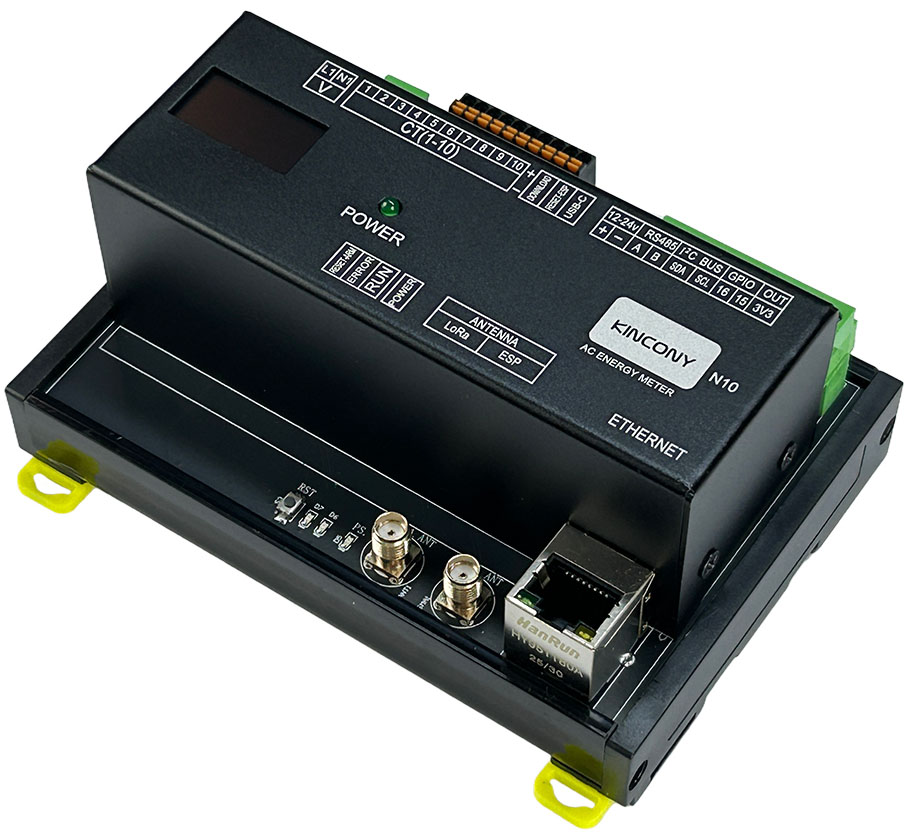

## Resources

- [ESP32 pin define details](https://www.kincony.com/forum/showthread.php?tid=8596)

## ESPHome Configuration

Here is an example YAML configuration for the KinCony N10 AC energy meter board.
```yaml
esphome:
  name: n10
  friendly_name: n10

esp32:
  board: esp32-s3-devkitc-1
  framework:
    type: arduino

# Enable logging
logger:
  # baud_rate: 0

# Enable Home Assistant API
api:

ota:
  platform: esphome

ethernet:
  type: W5500
  clk_pin: GPIO42
  mosi_pin: GPIO43
  miso_pin: GPIO44
  cs_pin: GPIO41
  interrupt_pin: GPIO2
  reset_pin: GPIO1

uart:
  rx_pin: 9
  tx_pin: 10
  baud_rate: 115200
  stop_bits: 1
  data_bits: 8
  parity: NONE

text_sensor:
  - platform: ethernet_info
    ip_address:
      name: ESP IP Address
      id: eth_ip
      address_0:
        name: ESP IP Address 0
      address_1:
        name: ESP IP Address 1
      address_2:
        name: ESP IP Address 2
      address_3:
        name: ESP IP Address 3
      address_4:
        name: ESP IP Address 4
    dns_address:
      name: ESP DNS Address
    mac_address:
      name: ESP MAC Address

font:
  - file: "gfonts://Roboto"
    id: roboto
    size: 15

i2c:
  sda: 18
  scl: 17

display:
  - platform: ssd1306_i2c
    model: "SSD1306 128x64"
    address: 0x3C
    lambda: |-
      it.printf(0, 15, id(roboto), "IP: %s", id(eth_ip).state.c_str());

modbus:

modbus_controller:
  - address: 1
    update_interval: 5s

sensor:
  - platform: modbus_controller
    address: 100
    register_type: holding
    name: bl0910_1_current_1
    id: n10_1_current_1
    unit_of_measurement: A
    device_class: current
    accuracy_decimals: 3
    value_type: U_DWORD_R
    filters:
      - multiply: 0.001

  - platform: modbus_controller
    address: 102
    register_type: holding
    name: bl0910_1_current_2
    id: n10_1_current_2
    unit_of_measurement: A
    device_class: current
    accuracy_decimals: 3
    value_type: U_DWORD_R
    filters:
      - multiply: 0.001

  - platform: modbus_controller
    address: 104
    register_type: holding
    name: bl0910_1_current_3
    id: n10_1_current_3
    unit_of_measurement: A
    device_class: current
    accuracy_decimals: 3
    value_type: U_DWORD_R
    filters:
      - multiply: 0.001

  - platform: modbus_controller
    address: 106
    register_type: holding
    name: bl0910_1_current_4
    id: n10_1_current_4
    unit_of_measurement: A
    device_class: current
    accuracy_decimals: 3
    value_type: U_DWORD_R
    filters:
      - multiply: 0.001

  - platform: modbus_controller
    address: 108
    register_type: holding
    name: bl0910_1_current_5
    id: n10_1_current_5
    unit_of_measurement: A
    device_class: current
    accuracy_decimals: 3
    value_type: U_DWORD_R
    filters:
      - multiply: 0.001

  - platform: modbus_controller
    address: 110
    register_type: holding
    name: bl0910_1_current_6
    id: n10_1_current_6
    unit_of_measurement: A
    device_class: current
    accuracy_decimals: 3
    value_type: U_DWORD_R
    filters:
      - multiply: 0.001

  - platform: modbus_controller
    address: 112
    register_type: holding
    name: bl0910_1_current_7
    id: n10_1_current_7
    unit_of_measurement: A
    device_class: current
    accuracy_decimals: 3
    value_type: U_DWORD_R
    filters:
      - multiply: 0.001

  - platform: modbus_controller
    address: 114
    register_type: holding
    name: bl0910_1_current_8
    id: n10_1_current_8
    unit_of_measurement: A
    device_class: current
    accuracy_decimals: 3
    value_type: U_DWORD_R
    filters:
      - multiply: 0.001

  - platform: modbus_controller
    address: 116
    register_type: holding
    name: bl0910_1_current_9
    id: n10_1_current_9
    unit_of_measurement: A
    device_class: current
    accuracy_decimals: 3
    value_type: U_DWORD_R
    filters:
      - multiply: 0.001

  - platform: modbus_controller
    address: 118
    register_type: holding
    name: bl0910_1_current_10
    id: n10_1_current_10
    unit_of_measurement: A
    device_class: current
    accuracy_decimals: 3
    value_type: U_DWORD_R
    filters:
      - multiply: 0.001

  - platform: modbus_controller
    address: 120
    register_type: holding
    name: bl0910_1_power_1
    id: n10_1_watt_1
    unit_of_measurement: W
    device_class: power
    accuracy_decimals: 1
    value_type: U_DWORD_R
    filters:
      - multiply: 0.1

  - platform: modbus_controller
    address: 122
    register_type: holding
    name: bl0910_1_power_2
    id: n10_1_watt_2
    unit_of_measurement: W
    device_class: power
    accuracy_decimals: 1
    value_type: U_DWORD_R
    filters:
      - multiply: 0.1

  - platform: modbus_controller
    address: 124
    register_type: holding
    name: bl0910_1_power_3
    id: n10_1_watt_3
    unit_of_measurement: W
    device_class: power
    accuracy_decimals: 1
    value_type: U_DWORD_R
    filters:
      - multiply: 0.1

  - platform: modbus_controller
    address: 126
    register_type: holding
    name: bl0910_1_power_4
    id: n10_1_watt_4
    unit_of_measurement: W
    device_class: power
    accuracy_decimals: 1
    value_type: U_DWORD_R
    filters:
      - multiply: 0.1

  - platform: modbus_controller
    address: 128
    register_type: holding
    name: bl0910_1_power_5
    id: n10_1_watt_5
    unit_of_measurement: W
    device_class: power
    accuracy_decimals: 1
    value_type: U_DWORD_R
    filters:
      - multiply: 0.1

  - platform: modbus_controller
    address: 130
    register_type: holding
    name: bl0910_1_power_6
    id: n10_1_watt_6
    unit_of_measurement: W
    device_class: power
    accuracy_decimals: 1
    value_type: U_DWORD_R
    filters:
      - multiply: 0.1

  - platform: modbus_controller
    address: 132
    register_type: holding
    name: bl0910_1_power_7
    id: n10_1_watt_7
    unit_of_measurement: W
    device_class: power
    accuracy_decimals: 1
    value_type: U_DWORD_R
    filters:
      - multiply: 0.1

  - platform: modbus_controller
    address: 134
    register_type: holding
    name: bl0910_1_power_8
    id: n10_1_watt_8
    unit_of_measurement: W
    device_class: power
    accuracy_decimals: 1
    value_type: U_DWORD_R
    filters:
      - multiply: 0.1

  - platform: modbus_controller
    address: 136
    register_type: holding
    name: bl0910_1_power_9
    id: n10_1_watt_9
    unit_of_measurement: W
    device_class: power
    accuracy_decimals: 1
    value_type: U_DWORD_R
    filters:
      - multiply: 0.1

  - platform: modbus_controller
    address: 138
    register_type: holding
    name: bl0910_1_power_10
    id: n10_1_watt_10
    unit_of_measurement: W
    device_class: power
    accuracy_decimals: 1
    value_type: U_DWORD_R
    filters:
      - multiply: 0.1

  - platform: modbus_controller
    state_class: total_increasing
    device_class: energy
    address: 140
    register_type: holding
    name: bl0910_1_energy_1
    id: n10_1_energy_1
    unit_of_measurement: kWh
    accuracy_decimals: 1
    value_type: U_DWORD_R

  - platform: modbus_controller
    state_class: total_increasing
    device_class: energy
    address: 142
    register_type: holding
    name: bl0910_1_energy_2
    id: n10_1_energy_2
    unit_of_measurement: kWh
    accuracy_decimals: 1
    value_type: U_DWORD_R

  - platform: modbus_controller
    state_class: total_increasing
    device_class: energy
    address: 144
    register_type: holding
    name: bl0910_1_energy_3
    id: n10_1_energy_3
    unit_of_measurement: kWh
    accuracy_decimals: 1
    value_type: U_DWORD_R

  - platform: modbus_controller
    state_class: total_increasing
    device_class: energy
    address: 146
    register_type: holding
    name: bl0910_1_energy_4
    id: n10_1_energy_4
    unit_of_measurement: kWh
    accuracy_decimals: 1
    value_type: U_DWORD_R

  - platform: modbus_controller
    state_class: total_increasing
    device_class: energy
    address: 148
    register_type: holding
    name: bl0910_1_energy_5
    id: n10_1_energy_5
    unit_of_measurement: kWh
    accuracy_decimals: 1
    value_type: U_DWORD_R

  - platform: modbus_controller
    state_class: total_increasing
    device_class: energy
    address: 150
    register_type: holding
    name: bl0910_1_energy_6
    id: n10_1_energy_6
    unit_of_measurement: kWh
    accuracy_decimals: 1
    value_type: U_DWORD_R

  - platform: modbus_controller
    state_class: total_increasing
    device_class: energy
    address: 152
    register_type: holding
    name: bl0910_1_energy_7
    id: n10_1_energy_7
    unit_of_measurement: kWh
    accuracy_decimals: 1
    value_type: U_DWORD_R

  - platform: modbus_controller
    state_class: total_increasing
    device_class: energy
    address: 154
    register_type: holding
    name: bl0910_1_energy_8
    id: n10_1_energy_8
    unit_of_measurement: kWh
    accuracy_decimals: 1
    value_type: U_DWORD_R

  - platform: modbus_controller
    state_class: total_increasing
    device_class: energy
    address: 156
    register_type: holding
    name: bl0910_1_energy_9
    id: n10_1_energy_9
    unit_of_measurement: kWh
    accuracy_decimals: 1
    value_type: U_DWORD_R

  - platform: modbus_controller
    state_class: total_increasing
    device_class: energy
    address: 158
    register_type: holding
    name: bl0910_1_energy_10
    id: n10_1_energy_10
    unit_of_measurement: kWh
    accuracy_decimals: 1
    value_type: U_DWORD_R

  - platform: modbus_controller
    state_class: total_increasing
    device_class: energy
    address: 160
    register_type: holding
    name: bl0910_1_energy_sum
    id: n10_1_energy_sum
    unit_of_measurement: kWh
    accuracy_decimals: 1
    value_type: U_DWORD_R

  - platform: modbus_controller
    address: 162
    register_type: holding
    name: bl0910_1_voltage
    id: n10_1_voltage
    unit_of_measurement: V
    device_class: voltage
    accuracy_decimals: 1
    value_type: U_WORD
    filters:
      - multiply: 0.01

  - platform: modbus_controller
    address: 163
    register_type: holding
    name: bl0910_1_frequency
    id: n10_1_period
    unit_of_measurement: Hz
    device_class: frequency
    accuracy_decimals: 1
    value_type: U_WORD
    filters:
      - multiply: 0.01

  - platform: modbus_controller
    address: 164
    register_type: holding
    name: bl0910_1_tps1
    id: n10_1_tps_1
    unit_of_measurement: °C
    device_class: temperature
    accuracy_decimals: 1
    value_type: FP32_R
```
