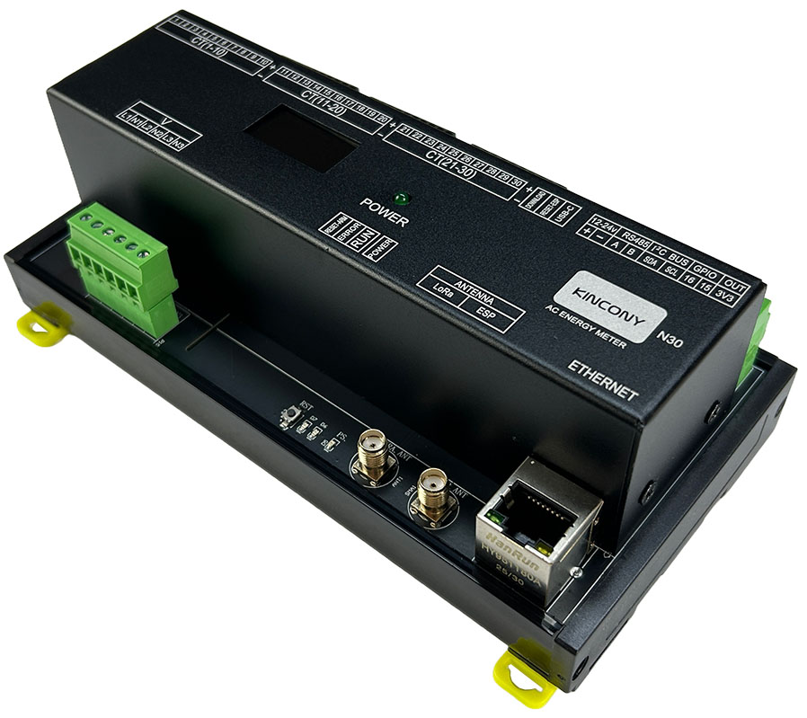

## Resources

- [ESP32 pin define details](https://www.kincony.com/forum/showthread.php?tid=8619)

## ESPHome Configuration

Here is an example YAML configuration for the KinCony N10 AC energy meter board.

```yaml
esphome:
  name: n30
  friendly_name: n30

esp32:
  variant: esp32s3
  framework:
    type: arduino

# Enable logging
logger:
  # baud_rate: 0

# Enable Home Assistant API
api:

ota:
  id: esphome_ota
  platform: esphome

ethernet:
  type: W5500
  clk_pin: GPIO42
  mosi_pin: GPIO43
  miso_pin: GPIO44
  cs_pin: GPIO41
  interrupt_pin: GPIO2
  reset_pin: GPIO1

uart:
  rx_pin: 9
  tx_pin: 10
  baud_rate: 115200
  stop_bits: 1
  data_bits: 8
  parity: NONE

text_sensor:
  - platform: ethernet_info
    ip_address:
      name: ESP IP Address
      id: eth_ip
      address_0:
        name: ESP IP Address 0
      address_1:
        name: ESP IP Address 1
      address_2:
        name: ESP IP Address 2
      address_3:
        name: ESP IP Address 3
      address_4:
        name: ESP IP Address 4
    dns_address:
      name: ESP DNS Address
    mac_address:
      name: ESP MAC Address

font:
  - file: "gfonts://Roboto"
    id: roboto
    size: 15

i2c:
  sda: 18
  scl: 17

display:
  - platform: ssd1306_i2c
    model: "SSD1306 128x64"
    address: 0x3C
    lambda: |-
      it.printf(0, 15, id(roboto), "IP: %s", id(eth_ip).state.c_str());

modbus:

modbus_controller:
  - address: 1
    update_interval: 5s

sensor:
  - platform: modbus_controller
    address: 100
    register_type: holding
    name: bl0910_1_current_1
    id: n30_1_current_1
    unit_of_measurement: A
    device_class: current
    accuracy_decimals: 3
    value_type: U_DWORD_R
    filters:
      - multiply: 0.001

  - platform: modbus_controller
    address: 102
    register_type: holding
    name: bl0910_1_current_2
    id: n30_1_current_2
    unit_of_measurement: A
    device_class: current
    accuracy_decimals: 3
    value_type: U_DWORD_R
    filters:
      - multiply: 0.001

  - platform: modbus_controller
    address: 104
    register_type: holding
    name: bl0910_1_current_3
    id: n30_1_current_3
    unit_of_measurement: A
    device_class: current
    accuracy_decimals: 3
    value_type: U_DWORD_R
    filters:
      - multiply: 0.001

  - platform: modbus_controller
    address: 106
    register_type: holding
    name: bl0910_1_current_4
    id: n30_1_current_4
    unit_of_measurement: A
    device_class: current
    accuracy_decimals: 3
    value_type: U_DWORD_R
    filters:
      - multiply: 0.001

  - platform: modbus_controller
    address: 108
    register_type: holding
    name: bl0910_1_current_5
    id: n30_1_current_5
    unit_of_measurement: A
    device_class: current
    accuracy_decimals: 3
    value_type: U_DWORD_R
    filters:
      - multiply: 0.001

  - platform: modbus_controller
    address: 110
    register_type: holding
    name: bl0910_1_current_6
    id: n30_1_current_6
    unit_of_measurement: A
    device_class: current
    accuracy_decimals: 3
    value_type: U_DWORD_R
    filters:
      - multiply: 0.001

  - platform: modbus_controller
    address: 112
    register_type: holding
    name: bl0910_1_current_7
    id: n30_1_current_7
    unit_of_measurement: A
    device_class: current
    accuracy_decimals: 3
    value_type: U_DWORD_R
    filters:
      - multiply: 0.001

  - platform: modbus_controller
    address: 114
    register_type: holding
    name: bl0910_1_current_8
    id: n30_1_current_8
    unit_of_measurement: A
    device_class: current
    accuracy_decimals: 3
    value_type: U_DWORD_R
    filters:
      - multiply: 0.001

  - platform: modbus_controller
    address: 116
    register_type: holding
    name: bl0910_1_current_9
    id: n30_1_current_9
    unit_of_measurement: A
    device_class: current
    accuracy_decimals: 3
    value_type: U_DWORD_R
    filters:
      - multiply: 0.001

  - platform: modbus_controller
    address: 118
    register_type: holding
    name: bl0910_1_current_10
    id: n30_1_current_10
    unit_of_measurement: A
    device_class: current
    accuracy_decimals: 3
    value_type: U_DWORD_R
    filters:
      - multiply: 0.001

  - platform: modbus_controller
    address: 120
    register_type: holding
    name: bl0910_1_power_1
    id: n30_1_watt_1
    unit_of_measurement: W
    device_class: power
    accuracy_decimals: 1
    value_type: U_DWORD_R
    filters:
      - multiply: 0.1

  - platform: modbus_controller
    address: 122
    register_type: holding
    name: bl0910_1_power_2
    id: n30_1_watt_2
    unit_of_measurement: W
    device_class: power
    accuracy_decimals: 1
    value_type: U_DWORD_R
    filters:
      - multiply: 0.1

  - platform: modbus_controller
    address: 124
    register_type: holding
    name: bl0910_1_power_3
    id: n30_1_watt_3
    unit_of_measurement: W
    device_class: power
    accuracy_decimals: 1
    value_type: U_DWORD_R
    filters:
      - multiply: 0.1

  - platform: modbus_controller
    address: 126
    register_type: holding
    name: bl0910_1_power_4
    id: n30_1_watt_4
    unit_of_measurement: W
    device_class: power
    accuracy_decimals: 1
    value_type: U_DWORD_R
    filters:
      - multiply: 0.1

  - platform: modbus_controller
    address: 128
    register_type: holding
    name: bl0910_1_power_5
    id: n30_1_watt_5
    unit_of_measurement: W
    device_class: power
    accuracy_decimals: 1
    value_type: U_DWORD_R
    filters:
      - multiply: 0.1

  - platform: modbus_controller
    address: 130
    register_type: holding
    name: bl0910_1_power_6
    id: n30_1_watt_6
    unit_of_measurement: W
    device_class: power
    accuracy_decimals: 1
    value_type: U_DWORD_R
    filters:
      - multiply: 0.1

  - platform: modbus_controller
    address: 132
    register_type: holding
    name: bl0910_1_power_7
    id: n30_1_watt_7
    unit_of_measurement: W
    device_class: power
    accuracy_decimals: 1
    value_type: U_DWORD_R
    filters:
      - multiply: 0.1

  - platform: modbus_controller
    address: 134
    register_type: holding
    name: bl0910_1_power_8
    id: n30_1_watt_8
    unit_of_measurement: W
    device_class: power
    accuracy_decimals: 1
    value_type: U_DWORD_R
    filters:
      - multiply: 0.1

  - platform: modbus_controller
    address: 136
    register_type: holding
    name: bl0910_1_power_9
    id: n30_1_watt_9
    unit_of_measurement: W
    device_class: power
    accuracy_decimals: 1
    value_type: U_DWORD_R
    filters:
      - multiply: 0.1

  - platform: modbus_controller
    address: 138
    register_type: holding
    name: bl0910_1_power_10
    id: n30_1_watt_10
    unit_of_measurement: W
    device_class: power
    accuracy_decimals: 1
    value_type: U_DWORD_R
    filters:
      - multiply: 0.1

  - platform: modbus_controller
    state_class: total_increasing
    device_class: energy
    address: 140
    register_type: holding
    name: bl0910_1_energy_1
    id: n30_1_energy_1
    unit_of_measurement: kWh
    accuracy_decimals: 1
    value_type: U_DWORD_R

  - platform: modbus_controller
    state_class: total_increasing
    device_class: energy
    address: 142
    register_type: holding
    name: bl0910_1_energy_2
    id: n30_1_energy_2
    unit_of_measurement: kWh
    accuracy_decimals: 1
    value_type: U_DWORD_R

  - platform: modbus_controller
    state_class: total_increasing
    device_class: energy
    address: 144
    register_type: holding
    name: bl0910_1_energy_3
    id: n30_1_energy_3
    unit_of_measurement: kWh
    accuracy_decimals: 1
    value_type: U_DWORD_R

  - platform: modbus_controller
    state_class: total_increasing
    device_class: energy
    address: 146
    register_type: holding
    name: bl0910_1_energy_4
    id: n30_1_energy_4
    unit_of_measurement: kWh
    accuracy_decimals: 1
    value_type: U_DWORD_R

  - platform: modbus_controller
    state_class: total_increasing
    device_class: energy
    address: 148
    register_type: holding
    name: bl0910_1_energy_5
    id: n30_1_energy_5
    unit_of_measurement: kWh
    accuracy_decimals: 1
    value_type: U_DWORD_R

  - platform: modbus_controller
    state_class: total_increasing
    device_class: energy
    address: 150
    register_type: holding
    name: bl0910_1_energy_6
    id: n30_1_energy_6
    unit_of_measurement: kWh
    accuracy_decimals: 1
    value_type: U_DWORD_R

  - platform: modbus_controller
    state_class: total_increasing
    device_class: energy
    address: 152
    register_type: holding
    name: bl0910_1_energy_7
    id: n30_1_energy_7
    unit_of_measurement: kWh
    accuracy_decimals: 1
    value_type: U_DWORD_R

  - platform: modbus_controller
    state_class: total_increasing
    device_class: energy
    address: 154
    register_type: holding
    name: bl0910_1_energy_8
    id: n30_1_energy_8
    unit_of_measurement: kWh
    accuracy_decimals: 1
    value_type: U_DWORD_R

  - platform: modbus_controller
    state_class: total_increasing
    device_class: energy
    address: 156
    register_type: holding
    name: bl0910_1_energy_9
    id: n30_1_energy_9
    unit_of_measurement: kWh
    accuracy_decimals: 1
    value_type: U_DWORD_R

  - platform: modbus_controller
    state_class: total_increasing
    device_class: energy
    address: 158
    register_type: holding
    name: bl0910_1_energy_10
    id: n30_1_energy_10
    unit_of_measurement: kWh
    accuracy_decimals: 1
    value_type: U_DWORD_R

  - platform: modbus_controller
    state_class: total_increasing
    device_class: energy
    address: 160
    register_type: holding
    name: bl0910_1_energy_sum
    id: n30_1_energy_sum
    unit_of_measurement: kWh
    accuracy_decimals: 1
    value_type: U_DWORD_R

  - platform: modbus_controller
    address: 162
    register_type: holding
    name: bl0910_1_voltage
    id: n30_1_voltage
    unit_of_measurement: V
    device_class: voltage
    accuracy_decimals: 1
    value_type: U_WORD
    filters:
      - multiply: 0.01

  - platform: modbus_controller
    address: 163
    register_type: holding
    name: bl0910_1_frequency
    id: n30_1_period
    unit_of_measurement: Hz
    device_class: frequency
    accuracy_decimals: 1
    value_type: U_WORD
    filters:
      - multiply: 0.01

  - platform: modbus_controller
    address: 164
    register_type: holding
    name: bl0910_1_tps1
    id: n30_1_tps_1
    unit_of_measurement: °C
    device_class: temperature
    accuracy_decimals: 1
    value_type: FP32_R

  - platform: modbus_controller
    address: 200
    register_type: holding
    name: bl0910_2_current_1
    id: n30_2_current_1
    unit_of_measurement: A
    device_class: current
    accuracy_decimals: 3
    value_type: U_DWORD_R
    filters:
    - multiply: 0.001
  - platform: modbus_controller
    address: 202
    register_type: holding
    name: bl0910_2_current_2
    id: n30_2_current_2
    unit_of_measurement: A
    device_class: current
    accuracy_decimals: 3
    value_type: U_DWORD_R
    filters:
    - multiply: 0.001
  - platform: modbus_controller
    address: 204
    register_type: holding
    name: bl0910_2_current_3
    id: n30_2_current_3
    unit_of_measurement: A
    device_class: current
    accuracy_decimals: 3
    value_type: U_DWORD_R
    filters:
    - multiply: 0.001
  - platform: modbus_controller
    address: 206
    register_type: holding
    name: bl0910_2_current_4
    id: n30_2_current_4
    unit_of_measurement: A
    device_class: current
    accuracy_decimals: 3
    value_type: U_DWORD_R
    filters:
    - multiply: 0.001
  - platform: modbus_controller
    address: 208
    register_type: holding
    name: bl0910_2_current_5
    id: n30_2_current_5
    unit_of_measurement: A
    device_class: current
    accuracy_decimals: 3
    value_type: U_DWORD_R
    filters:
    - multiply: 0.001
  - platform: modbus_controller
    address: 210
    register_type: holding
    name: bl0910_2_current_6
    id: n30_2_current_6
    unit_of_measurement: A
    device_class: current
    accuracy_decimals: 3
    value_type: U_DWORD_R
    filters:
    - multiply: 0.001
  - platform: modbus_controller
    address: 212
    register_type: holding
    name: bl0910_2_current_7
    id: n30_2_current_7
    unit_of_measurement: A
    device_class: current
    accuracy_decimals: 3
    value_type: U_DWORD_R
    filters:
    - multiply: 0.001
  - platform: modbus_controller
    address: 214
    register_type: holding
    name: bl0910_2_current_8
    id: n30_2_current_8
    unit_of_measurement: A
    device_class: current
    accuracy_decimals: 3
    value_type: U_DWORD_R
    filters:
    - multiply: 0.001
  - platform: modbus_controller
    address: 216
    register_type: holding
    name: bl0910_2_current_9
    id: n30_2_current_9
    unit_of_measurement: A
    device_class: current
    accuracy_decimals: 3
    value_type: U_DWORD_R
    filters:
    - multiply: 0.001
  - platform: modbus_controller
    address: 218
    register_type: holding
    name: bl0910_2_current_10
    id: n30_2_current_10
    unit_of_measurement: A
    device_class: current
    accuracy_decimals: 3
    value_type: U_DWORD_R
    filters:
    - multiply: 0.001
  - platform: modbus_controller
    address: 220
    register_type: holding
    name: bl0910_2_power_1
    id: n30_2_watt_1
    unit_of_measurement: W
    device_class: power
    accuracy_decimals: 1
    value_type: U_DWORD_R
    filters:
    - multiply: 0.1
  - platform: modbus_controller
    address: 222
    register_type: holding
    name: bl0910_2_power_2
    id: n30_2_watt_2
    unit_of_measurement: W
    device_class: power
    accuracy_decimals: 1
    value_type: U_DWORD_R
    filters:
    - multiply: 0.1
  - platform: modbus_controller
    address: 224
    register_type: holding
    name: bl0910_2_power_3
    id: n30_2_watt_3
    unit_of_measurement: W
    device_class: power
    accuracy_decimals: 1
    value_type: U_DWORD_R
    filters:
    - multiply: 0.1
  - platform: modbus_controller
    address: 226
    register_type: holding
    name: bl0910_2_power_4
    id: n30_2_watt_4
    unit_of_measurement: W
    device_class: power
    accuracy_decimals: 1
    value_type: U_DWORD_R
    filters:
    - multiply: 0.1
  - platform: modbus_controller
    address: 228
    register_type: holding
    name: bl0910_2_power_5
    id: n30_2_watt_5
    unit_of_measurement: W
    device_class: power
    accuracy_decimals: 1
    value_type: U_DWORD_R
    filters:
    - multiply: 0.1
  - platform: modbus_controller
    address: 230
    register_type: holding
    name: bl0910_2_power_6
    id: n30_2_watt_6
    unit_of_measurement: W
    device_class: power
    accuracy_decimals: 1
    value_type: U_DWORD_R
    filters:
    - multiply: 0.1
  - platform: modbus_controller
    address: 232
    register_type: holding
    name: bl0910_2_power_7
    id: n30_2_watt_7
    unit_of_measurement: W
    device_class: power
    accuracy_decimals: 1
    value_type: U_DWORD_R
    filters:
    - multiply: 0.1
  - platform: modbus_controller
    address: 234
    register_type: holding
    name: bl0910_2_power_8
    id: n30_2_watt_8
    unit_of_measurement: W
    device_class: power
    accuracy_decimals: 1
    value_type: U_DWORD_R
    filters:
    - multiply: 0.1
  - platform: modbus_controller
    address: 236
    register_type: holding
    name: bl0910_2_power_9
    id: n30_2_watt_9
    unit_of_measurement: W
    device_class: power
    accuracy_decimals: 1
    value_type: U_DWORD_R
    filters:
    - multiply: 0.1
  - platform: modbus_controller
    address: 238
    register_type: holding
    name: bl0910_2_power_10
    id: n30_2_watt_10
    unit_of_measurement: W
    device_class: power
    accuracy_decimals: 1
    value_type: U_DWORD_R
    filters:
    - multiply: 0.1
  - platform: modbus_controller
    address: 240
    register_type: holding
    name: bl0910_2_energy_1
    id: n30_2_energy_1
    unit_of_measurement: kWh
    device_class: energy
    accuracy_decimals: 1
    value_type: U_DWORD_R
    state_class: total_increasing
  - platform: modbus_controller
    address: 242
    register_type: holding
    name: bl0910_2_energy_2
    id: n30_2_energy_2
    unit_of_measurement: kWh
    device_class: energy
    accuracy_decimals: 1
    value_type: U_DWORD_R
    state_class: total_increasing
  - platform: modbus_controller
    address: 244
    register_type: holding
    name: bl0910_2_energy_3
    id: n30_2_energy_3
    unit_of_measurement: kWh
    device_class: energy
    accuracy_decimals: 1
    value_type: U_DWORD_R
    state_class: total_increasing
  - platform: modbus_controller
    address: 246
    register_type: holding
    name: bl0910_2_energy_4
    id: n30_2_energy_4
    unit_of_measurement: kWh
    device_class: energy
    accuracy_decimals: 1
    value_type: U_DWORD_R
    state_class: total_increasing
  - platform: modbus_controller
    address: 248
    register_type: holding
    name: bl0910_2_energy_5
    id: n30_2_energy_5
    unit_of_measurement: kWh
    device_class: energy
    accuracy_decimals: 1
    value_type: U_DWORD_R
    state_class: total_increasing
  - platform: modbus_controller
    address: 250
    register_type: holding
    name: bl0910_2_energy_6
    id: n30_2_energy_6
    unit_of_measurement: kWh
    device_class: energy
    accuracy_decimals: 1
    value_type: U_DWORD_R
    state_class: total_increasing
  - platform: modbus_controller
    address: 252
    register_type: holding
    name: bl0910_2_energy_7
    id: n30_2_energy_7
    unit_of_measurement: kWh
    device_class: energy
    accuracy_decimals: 1
    value_type: U_DWORD_R
    state_class: total_increasing
  - platform: modbus_controller
    address: 254
    register_type: holding
    name: bl0910_2_energy_8
    id: n30_2_energy_8
    unit_of_measurement: kWh
    device_class: energy
    accuracy_decimals: 1
    value_type: U_DWORD_R
    state_class: total_increasing
  - platform: modbus_controller
    address: 256
    register_type: holding
    name: bl0910_2_energy_9
    id: n30_2_energy_9
    unit_of_measurement: kWh
    device_class: energy
    accuracy_decimals: 1
    value_type: U_DWORD_R
    state_class: total_increasing
  - platform: modbus_controller
    address: 258
    register_type: holding
    name: bl0910_2_energy_10
    id: n30_2_energy_10
    unit_of_measurement: kWh
    device_class: energy
    accuracy_decimals: 1
    value_type: U_DWORD_R
    state_class: total_increasing
  - platform: modbus_controller
    address: 260
    register_type: holding
    name: bl0910_2_energy_sum
    id: n30_2_energy_sum
    unit_of_measurement: kWh
    device_class: energy
    accuracy_decimals: 1
    value_type: U_DWORD_R
    state_class: total_increasing
  - platform: modbus_controller
    address: 262
    register_type: holding
    name: bl0910_2_voltage
    id: n30_2_voltage
    unit_of_measurement: V
    device_class: voltage
    accuracy_decimals: 1
    value_type: U_WORD
    filters:
    - multiply: 0.01
  - platform: modbus_controller
    address: 263
    register_type: holding
    name: bl0910_2_frequency
    id: n30_2_period
    unit_of_measurement: Hz
    device_class: frequency
    accuracy_decimals: 1
    value_type: U_WORD
    filters:
    - multiply: 0.01
  - platform: modbus_controller
    address: 264
    register_type: holding
    name: bl0910_2_tps1
    id: n30_2_tps_1
    unit_of_measurement: "°C"
    device_class: temperature
    accuracy_decimals: 1
    value_type: FP32_R
  - platform: modbus_controller
    address: 300
    register_type: holding
    name: bl0910_3_current_1
    id: n30_3_current_1
    unit_of_measurement: A
    device_class: current
    accuracy_decimals: 3
    value_type: U_DWORD_R
    filters:
    - multiply: 0.001
  - platform: modbus_controller
    address: 302
    register_type: holding
    name: bl0910_3_current_2
    id: n30_3_current_2
    unit_of_measurement: A
    device_class: current
    accuracy_decimals: 3
    value_type: U_DWORD_R
    filters:
    - multiply: 0.001
  - platform: modbus_controller
    address: 304
    register_type: holding
    name: bl0910_3_current_3
    id: n30_3_current_3
    unit_of_measurement: A
    device_class: current
    accuracy_decimals: 3
    value_type: U_DWORD_R
    filters:
    - multiply: 0.001
  - platform: modbus_controller
    address: 306
    register_type: holding
    name: bl0910_3_current_4
    id: n30_3_current_4
    unit_of_measurement: A
    device_class: current
    accuracy_decimals: 3
    value_type: U_DWORD_R
    filters:
    - multiply: 0.001
  - platform: modbus_controller
    address: 308
    register_type: holding
    name: bl0910_3_current_5
    id: n30_3_current_5
    unit_of_measurement: A
    device_class: current
    accuracy_decimals: 3
    value_type: U_DWORD_R
    filters:
    - multiply: 0.001
  - platform: modbus_controller
    address: 310
    register_type: holding
    name: bl0910_3_current_6
    id: n30_3_current_6
    unit_of_measurement: A
    device_class: current
    accuracy_decimals: 3
    value_type: U_DWORD_R
    filters:
    - multiply: 0.001
  - platform: modbus_controller
    address: 312
    register_type: holding
    name: bl0910_3_current_7
    id: n30_3_current_7
    unit_of_measurement: A
    device_class: current
    accuracy_decimals: 3
    value_type: U_DWORD_R
    filters:
    - multiply: 0.001
  - platform: modbus_controller
    address: 314
    register_type: holding
    name: bl0910_3_current_8
    id: n30_3_current_8
    unit_of_measurement: A
    device_class: current
    accuracy_decimals: 3
    value_type: U_DWORD_R
    filters:
    - multiply: 0.001
  - platform: modbus_controller
    address: 316
    register_type: holding
    name: bl0910_3_current_9
    id: n30_3_current_9
    unit_of_measurement: A
    device_class: current
    accuracy_decimals: 3
    value_type: U_DWORD_R
    filters:
    - multiply: 0.001
  - platform: modbus_controller
    address: 318
    register_type: holding
    name: bl0910_3_current_10
    id: n30_3_current_10
    unit_of_measurement: A
    device_class: current
    accuracy_decimals: 3
    value_type: U_DWORD_R
    filters:
    - multiply: 0.001
  - platform: modbus_controller
    address: 320
    register_type: holding
    name: bl0910_3_power_1
    id: n30_3_watt_1
    unit_of_measurement: W
    device_class: power
    accuracy_decimals: 1
    value_type: U_DWORD_R
    filters:
    - multiply: 0.1
  - platform: modbus_controller
    address: 322
    register_type: holding
    name: bl0910_3_power_2
    id: n30_3_watt_2
    unit_of_measurement: W
    device_class: power
    accuracy_decimals: 1
    value_type: U_DWORD_R
    filters:
    - multiply: 0.1
  - platform: modbus_controller
    address: 324
    register_type: holding
    name: bl0910_3_power_3
    id: n30_3_watt_3
    unit_of_measurement: W
    device_class: power
    accuracy_decimals: 1
    value_type: U_DWORD_R
    filters:
    - multiply: 0.1
  - platform: modbus_controller
    address: 326
    register_type: holding
    name: bl0910_3_power_4
    id: n30_3_watt_4
    unit_of_measurement: W
    device_class: power
    accuracy_decimals: 1
    value_type: U_DWORD_R
    filters:
    - multiply: 0.1
  - platform: modbus_controller
    address: 328
    register_type: holding
    name: bl0910_3_power_5
    id: n30_3_watt_5
    unit_of_measurement: W
    device_class: power
    accuracy_decimals: 1
    value_type: U_DWORD_R
    filters:
    - multiply: 0.1
  - platform: modbus_controller
    address: 330
    register_type: holding
    name: bl0910_3_power_6
    id: n30_3_watt_6
    unit_of_measurement: W
    device_class: power
    accuracy_decimals: 1
    value_type: U_DWORD_R
    filters:
    - multiply: 0.1
  - platform: modbus_controller
    address: 332
    register_type: holding
    name: bl0910_3_power_7
    id: n30_3_watt_7
    unit_of_measurement: W
    device_class: power
    accuracy_decimals: 1
    value_type: U_DWORD_R
    filters:
    - multiply: 0.1
  - platform: modbus_controller
    address: 334
    register_type: holding
    name: bl0910_3_power_8
    id: n30_3_watt_8
    unit_of_measurement: W
    device_class: power
    accuracy_decimals: 1
    value_type: U_DWORD_R
    filters:
    - multiply: 0.1
  - platform: modbus_controller
    address: 336
    register_type: holding
    name: bl0910_3_power_9
    id: n30_3_watt_9
    unit_of_measurement: W
    device_class: power
    accuracy_decimals: 1
    value_type: U_DWORD_R
    filters:
    - multiply: 0.1
  - platform: modbus_controller
    address: 338
    register_type: holding
    name: bl0910_3_power_10
    id: n30_3_watt_10
    unit_of_measurement: W
    device_class: power
    accuracy_decimals: 1
    value_type: U_DWORD_R
    filters:
    - multiply: 0.1
  - platform: modbus_controller
    address: 340
    register_type: holding
    name: bl0910_3_energy_1
    id: n30_3_energy_1
    unit_of_measurement: kWh
    device_class: energy
    accuracy_decimals: 1
    value_type: U_DWORD_R
    state_class: total_increasing
  - platform: modbus_controller
    address: 342
    register_type: holding
    name: bl0910_3_energy_2
    id: n30_3_energy_2
    unit_of_measurement: kWh
    device_class: energy
    accuracy_decimals: 1
    value_type: U_DWORD_R
    state_class: total_increasing
  - platform: modbus_controller
    address: 344
    register_type: holding
    name: bl0910_3_energy_3
    id: n30_3_energy_3
    unit_of_measurement: kWh
    device_class: energy
    accuracy_decimals: 1
    value_type: U_DWORD_R
    state_class: total_increasing
  - platform: modbus_controller
    address: 346
    register_type: holding
    name: bl0910_3_energy_4
    id: n30_3_energy_4
    unit_of_measurement: kWh
    device_class: energy
    accuracy_decimals: 1
    value_type: U_DWORD_R
    state_class: total_increasing
  - platform: modbus_controller
    address: 348
    register_type: holding
    name: bl0910_3_energy_5
    id: n30_3_energy_5
    unit_of_measurement: kWh
    device_class: energy
    accuracy_decimals: 1
    value_type: U_DWORD_R
    state_class: total_increasing
  - platform: modbus_controller
    address: 350
    register_type: holding
    name: bl0910_3_energy_6
    id: n30_3_energy_6
    unit_of_measurement: kWh
    device_class: energy
    accuracy_decimals: 1
    value_type: U_DWORD_R
    state_class: total_increasing
  - platform: modbus_controller
    address: 352
    register_type: holding
    name: bl0910_3_energy_7
    id: n30_3_energy_7
    unit_of_measurement: kWh
    device_class: energy
    accuracy_decimals: 1
    value_type: U_DWORD_R
    state_class: total_increasing
  - platform: modbus_controller
    address: 354
    register_type: holding
    name: bl0910_3_energy_8
    id: n30_3_energy_8
    unit_of_measurement: kWh
    device_class: energy
    accuracy_decimals: 1
    value_type: U_DWORD_R
    state_class: total_increasing
  - platform: modbus_controller
    address: 356
    register_type: holding
    name: bl0910_3_energy_9
    id: n30_3_energy_9
    unit_of_measurement: kWh
    device_class: energy
    accuracy_decimals: 1
    value_type: U_DWORD_R
    state_class: total_increasing
  - platform: modbus_controller
    address: 358
    register_type: holding
    name: bl0910_3_energy_10
    id: n30_3_energy_10
    unit_of_measurement: kWh
    device_class: energy
    accuracy_decimals: 1
    value_type: U_DWORD_R
    state_class: total_increasing
  - platform: modbus_controller
    address: 360
    register_type: holding
    name: bl0910_3_energy_sum
    id: n30_3_energy_sum
    unit_of_measurement: kWh
    device_class: energy
    accuracy_decimals: 1
    value_type: U_DWORD_R
    state_class: total_increasing
  - platform: modbus_controller
    address: 362
    register_type: holding
    name: bl0910_3_voltage
    id: n30_3_voltage
    unit_of_measurement: V
    device_class: voltage
    accuracy_decimals: 1
    value_type: U_WORD
    filters:
    - multiply: 0.01
  - platform: modbus_controller
    address: 363
    register_type: holding
    name: bl0910_3_frequency
    id: n30_3_period
    unit_of_measurement: Hz
    device_class: frequency
    accuracy_decimals: 1
    value_type: U_WORD
    filters:
    - multiply: 0.01
  - platform: modbus_controller
    address: 364
    register_type: holding
    name: bl0910_3_tps1
    id: n30_3_tps_1
    unit_of_measurement: "°C"
    device_class: temperature
    accuracy_decimals: 1
    value_type: FP32_R
```
