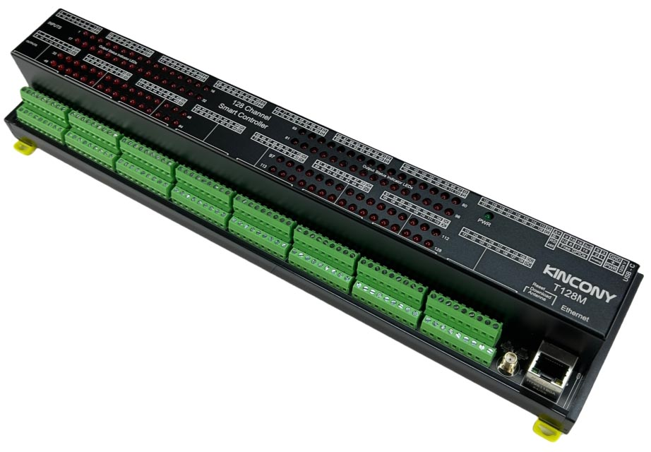

## Resources

- [ESP32 pin define details](https://www.kincony.com/forum/showthread.php?tid=8247)

## ESPHome Configuration

Here is an example YAML configuration for the KinCony T128M board.

```yaml
esphome:
  name: t128m
  friendly_name: t128m

esp32:
  board: esp32-s3-devkitc-1
  framework:
    type: esp-idf

# Enable logging
logger:
  hardware_uart: USB_SERIAL_JTAG

# Enable Home Assistant API
api:

ota:
  platform: esphome

ethernet:
  type: W5500
  clk_pin: GPIO42
  mosi_pin: GPIO43
  miso_pin: GPIO44
  cs_pin: GPIO41
  interrupt_pin: GPIO2
  reset_pin: GPIO1

i2c:
   - id: bus_a
     sda: 48
     scl: 47
     scan: true
     frequency: 400kHz
   - id: bus_b
     sda: 12
     scl: 11
     scan: true
     frequency: 400kHz

pcf8574:
  - id: 'pcf8574_hub_out_1'  # for output channel 1-16
    i2c_id: bus_a
    address: 0x27
    pcf8575: true

  - id: 'pcf8574_hub_out_2'  # for output channel 17-32
    i2c_id: bus_a
    address: 0x26
    pcf8575: true

  - id: 'pcf8574_hub_out_3'  # for output channel 33-48
    i2c_id: bus_a
    address: 0x23
    pcf8575: true

  - id: 'pcf8574_hub_out_4'  # for output channel 49-64
    i2c_id: bus_a
    address: 0x22
    pcf8575: true

  - id: 'pcf8574_hub_out_5'  # for output channel 65-80
    i2c_id: bus_a
    address: 0x25
    pcf8575: true

  - id: 'pcf8574_hub_out_6'  # for output channel 81-96
    i2c_id: bus_a
    address: 0x24
    pcf8575: true

  - id: 'pcf8574_hub_out_7'  # for output channel 97-112
    i2c_id: bus_a
    address: 0x21
    pcf8575: true

  - id: 'pcf8574_hub_out_8'  # for output channel 113-128
    i2c_id: bus_a
    address: 0x20
    pcf8575: true

  - id: 'pcf8574_hub_in_1'  # for input channel 1-16
    i2c_id: bus_b
    address: 0x27
    pcf8575: true

  - id: 'pcf8574_hub_in_2'  # for input channel 17-32
    i2c_id: bus_b
    address: 0x26
    pcf8575: true

  - id: 'pcf8574_hub_in_3'  # for input channel 33-48
    i2c_id: bus_b
    address: 0x23
    pcf8575: true

  - id: 'pcf8574_hub_in_4'  # for input channel 49-64
    i2c_id: bus_b
    address: 0x22
    pcf8575: true

  - id: 'pcf8574_hub_in_5'  # for input channel 65-80
    i2c_id: bus_b
    address: 0x25
    pcf8575: true

  - id: 'pcf8574_hub_in_6'  # for input channel 81-96
    i2c_id: bus_b
    address: 0x24
    pcf8575: true

  - id: 'pcf8574_hub_in_7'  # for input channel 97-112
    i2c_id: bus_b
    address: 0x21
    pcf8575: true

  - id: 'pcf8574_hub_in_8'  # for input channel 113-128
    i2c_id: bus_b
    address: 0x20
    pcf8575: true

switch:
  - platform: gpio
    name: "t128m-output01"
    id: "t128m_output01"
    pin:
      pcf8574: pcf8574_hub_out_1
      number: 0
      mode: OUTPUT
      inverted: true

  - platform: gpio
    name: "t128m-output02"
    id: "t128m_output02"
    pin:
      pcf8574: pcf8574_hub_out_1
      number: 1
      mode: OUTPUT
      inverted: true

  - platform: gpio
    name: "t128m-output03"
    id: "t128m_output03"
    pin:
      pcf8574: pcf8574_hub_out_1
      number: 2
      mode: OUTPUT
      inverted: true

  - platform: gpio
    name: "t128m-output04"
    id: "t128m_output04"
    pin:
      pcf8574: pcf8574_hub_out_1
      number: 3
      mode: OUTPUT
      inverted: true

  - platform: gpio
    name: "t128m-output05"
    id: "t128m_output05"
    pin:
      pcf8574: pcf8574_hub_out_1
      number: 4
      mode: OUTPUT
      inverted: true

  - platform: gpio
    name: "t128m-output06"
    id: "t128m_output06"
    pin:
      pcf8574: pcf8574_hub_out_1
      number: 5
      mode: OUTPUT
      inverted: true

  - platform: gpio
    name: "t128m-output07"
    id: "t128m_output07"
    pin:
      pcf8574: pcf8574_hub_out_1
      number: 6
      mode: OUTPUT
      inverted: true

  - platform: gpio
    name: "t128m-output08"
    id: "t128m_output08"
    pin:
      pcf8574: pcf8574_hub_out_1
      number: 7
      mode: OUTPUT
      inverted: true

  - platform: gpio
    name: "t128m-output09"
    id: "t128m_output09"
    pin:
      pcf8574: pcf8574_hub_out_1
      number: 8
      mode: OUTPUT
      inverted: true

  - platform: gpio
    name: "t128m-output10"
    id: "t128m_output10"
    pin:
      pcf8574: pcf8574_hub_out_1
      number: 9
      mode: OUTPUT
      inverted: true

  - platform: gpio
    name: "t128m-output11"
    id: "t128m_output11"
    pin:
      pcf8574: pcf8574_hub_out_1
      number: 10
      mode: OUTPUT
      inverted: true

  - platform: gpio
    name: "t128m-output12"
    id: "t128m_output12"
    pin:
      pcf8574: pcf8574_hub_out_1
      number: 11
      mode: OUTPUT
      inverted: true

  - platform: gpio
    name: "t128m-output13"
    id: "t128m_output13"
    pin:
      pcf8574: pcf8574_hub_out_1
      number: 12
      mode: OUTPUT
      inverted: true

  - platform: gpio
    name: "t128m-output14"
    id: "t128m_output14"
    pin:
      pcf8574: pcf8574_hub_out_1
      number: 13
      mode: OUTPUT
      inverted: true

  - platform: gpio
    name: "t128m-output15"
    id: "t128m_output15"
    pin:
      pcf8574: pcf8574_hub_out_1
      number: 14
      mode: OUTPUT
      inverted: true

  - platform: gpio
    name: "t128m-output16"
    id: "t128m_output16"
    pin:
      pcf8574: pcf8574_hub_out_1
      number: 15
      mode: OUTPUT
      inverted: true

  - platform: gpio
    name: "t128m-output17"
    id: "t128m_output17"
    pin:
      pcf8574: pcf8574_hub_out_2
      number: 0
      mode: OUTPUT
      inverted: true

  - platform: gpio
    name: "t128m-output18"
    id: "t128m_output18"
    pin:
      pcf8574: pcf8574_hub_out_2
      number: 1
      mode: OUTPUT
      inverted: true

  - platform: gpio
    name: "t128m-output19"
    id: "t128m_output19"
    pin:
      pcf8574: pcf8574_hub_out_2
      number: 2
      mode: OUTPUT
      inverted: true

  - platform: gpio
    name: "t128m-output20"
    id: "t128m_output20"
    pin:
      pcf8574: pcf8574_hub_out_2
      number: 3
      mode: OUTPUT
      inverted: true

  - platform: gpio
    name: "t128m-output21"
    id: "t128m_output21"
    pin:
      pcf8574: pcf8574_hub_out_2
      number: 4
      mode: OUTPUT
      inverted: true

  - platform: gpio
    name: "t128m-output22"
    id: "t128m_output22"
    pin:
      pcf8574: pcf8574_hub_out_2
      number: 5
      mode: OUTPUT
      inverted: true

  - platform: gpio
    name: "t128m-output23"
    id: "t128m_output23"
    pin:
      pcf8574: pcf8574_hub_out_2
      number: 6
      mode: OUTPUT
      inverted: true

  - platform: gpio
    name: "t128m-output24"
    id: "t128m_output24"
    pin:
      pcf8574: pcf8574_hub_out_2
      number: 7
      mode: OUTPUT
      inverted: true

  - platform: gpio
    name: "t128m-output25"
    id: "t128m_output25"
    pin:
      pcf8574: pcf8574_hub_out_2
      number: 8
      mode: OUTPUT
      inverted: true

  - platform: gpio
    name: "t128m-output26"
    id: "t128m_output26"
    pin:
      pcf8574: pcf8574_hub_out_2
      number: 9
      mode: OUTPUT
      inverted: true

  - platform: gpio
    name: "t128m-output27"
    id: "t128m_output27"
    pin:
      pcf8574: pcf8574_hub_out_2
      number: 10
      mode: OUTPUT
      inverted: true

  - platform: gpio
    name: "t128m-output28"
    id: "t128m_output28"
    pin:
      pcf8574: pcf8574_hub_out_2
      number: 11
      mode: OUTPUT
      inverted: true

  - platform: gpio
    name: "t128m-output29"
    id: "t128m_output29"
    pin:
      pcf8574: pcf8574_hub_out_2
      number: 12
      mode: OUTPUT
      inverted: true

  - platform: gpio
    name: "t128m-output30"
    id: "t128m_output30"
    pin:
      pcf8574: pcf8574_hub_out_2
      number: 13
      mode: OUTPUT
      inverted: true

  - platform: gpio
    name: "t128m-output31"
    id: "t128m_output31"
    pin:
      pcf8574: pcf8574_hub_out_2
      number: 14
      mode: OUTPUT
      inverted: true

  - platform: gpio
    name: "t128m-output32"
    id: "t128m_output32"
    pin:
      pcf8574: pcf8574_hub_out_2
      number: 15
      mode: OUTPUT
      inverted: true

  - platform: gpio
    name: "t128m-output33"
    id: "t128m_output33"
    pin:
      pcf8574: pcf8574_hub_out_3
      number: 0
      mode: OUTPUT
      inverted: true

  - platform: gpio
    name: "t128m-output34"
    id: "t128m_output34"
    pin:
      pcf8574: pcf8574_hub_out_3
      number: 1
      mode: OUTPUT
      inverted: true

  - platform: gpio
    name: "t128m-output35"
    id: "t128m_output35"
    pin:
      pcf8574: pcf8574_hub_out_3
      number: 2
      mode: OUTPUT
      inverted: true

  - platform: gpio
    name: "t128m-output36"
    id: "t128m_output36"
    pin:
      pcf8574: pcf8574_hub_out_3
      number: 3
      mode: OUTPUT
      inverted: true

  - platform: gpio
    name: "t128m-output37"
    id: "t128m_output37"
    pin:
      pcf8574: pcf8574_hub_out_3
      number: 4
      mode: OUTPUT
      inverted: true

  - platform: gpio
    name: "t128m-output38"
    id: "t128m_output38"
    pin:
      pcf8574: pcf8574_hub_out_3
      number: 5
      mode: OUTPUT
      inverted: true

  - platform: gpio
    name: "t128m-output39"
    id: "t128m_output39"
    pin:
      pcf8574: pcf8574_hub_out_3
      number: 6
      mode: OUTPUT
      inverted: true

  - platform: gpio
    name: "t128m-output40"
    id: "t128m_output40"
    pin:
      pcf8574: pcf8574_hub_out_3
      number: 7
      mode: OUTPUT
      inverted: true

  - platform: gpio
    name: "t128m-output41"
    id: "t128m_output41"
    pin:
      pcf8574: pcf8574_hub_out_3
      number: 8
      mode: OUTPUT
      inverted: true

  - platform: gpio
    name: "t128m-output42"
    id: "t128m_output42"
    pin:
      pcf8574: pcf8574_hub_out_3
      number: 9
      mode: OUTPUT
      inverted: true

  - platform: gpio
    name: "t128m-output43"
    id: "t128m_output43"
    pin:
      pcf8574: pcf8574_hub_out_3
      number: 10
      mode: OUTPUT
      inverted: true

  - platform: gpio
    name: "t128m-output44"
    id: "t128m_output44"
    pin:
      pcf8574: pcf8574_hub_out_3
      number: 11
      mode: OUTPUT
      inverted: true

  - platform: gpio
    name: "t128m-output45"
    id: "t128m_output45"
    pin:
      pcf8574: pcf8574_hub_out_3
      number: 12
      mode: OUTPUT
      inverted: true

  - platform: gpio
    name: "t128m-output46"
    id: "t128m_output46"
    pin:
      pcf8574: pcf8574_hub_out_3
      number: 13
      mode: OUTPUT
      inverted: true

  - platform: gpio
    name: "t128m-output47"
    id: "t128m_output47"
    pin:
      pcf8574: pcf8574_hub_out_3
      number: 14
      mode: OUTPUT
      inverted: true

  - platform: gpio
    name: "t128m-output48"
    id: "t128m_output48"
    pin:
      pcf8574: pcf8574_hub_out_3
      number: 15
      mode: OUTPUT
      inverted: true

  - platform: gpio
    name: "t128m-output49"
    id: "t128m_output49"
    pin:
      pcf8574: pcf8574_hub_out_4
      number: 0
      mode: OUTPUT
      inverted: true

  - platform: gpio
    name: "t128m-output50"
    id: "t128m_output50"
    pin:
      pcf8574: pcf8574_hub_out_4
      number: 1
      mode: OUTPUT
      inverted: true

  - platform: gpio
    name: "t128m-output51"
    id: "t128m_output51"
    pin:
      pcf8574: pcf8574_hub_out_4
      number: 2
      mode: OUTPUT
      inverted: true

  - platform: gpio
    name: "t128m-output52"
    id: "t128m_output52"
    pin:
      pcf8574: pcf8574_hub_out_4
      number: 3
      mode: OUTPUT
      inverted: true

  - platform: gpio
    name: "t128m-output53"
    id: "t128m_output53"
    pin:
      pcf8574: pcf8574_hub_out_4
      number: 4
      mode: OUTPUT
      inverted: true

  - platform: gpio
    name: "t128m-output54"
    id: "t128m_output54"
    pin:
      pcf8574: pcf8574_hub_out_4
      number: 5
      mode: OUTPUT
      inverted: true

  - platform: gpio
    name: "t128m-output55"
    id: "t128m_output55"
    pin:
      pcf8574: pcf8574_hub_out_4
      number: 6
      mode: OUTPUT
      inverted: true

  - platform: gpio
    name: "t128m-output56"
    id: "t128m_output56"
    pin:
      pcf8574: pcf8574_hub_out_4
      number: 7
      mode: OUTPUT
      inverted: true

  - platform: gpio
    name: "t128m-output57"
    id: "t128m_output57"
    pin:
      pcf8574: pcf8574_hub_out_4
      number: 8
      mode: OUTPUT
      inverted: true

  - platform: gpio
    name: "t128m-output58"
    id: "t128m_output58"
    pin:
      pcf8574: pcf8574_hub_out_4
      number: 9
      mode: OUTPUT
      inverted: true

  - platform: gpio
    name: "t128m-output59"
    id: "t128m_output59"
    pin:
      pcf8574: pcf8574_hub_out_4
      number: 10
      mode: OUTPUT
      inverted: true

  - platform: gpio
    name: "t128m-output60"
    id: "t128m_output60"
    pin:
      pcf8574: pcf8574_hub_out_4
      number: 11
      mode: OUTPUT
      inverted: true

  - platform: gpio
    name: "t128m-output61"
    id: "t128m_output61"
    pin:
      pcf8574: pcf8574_hub_out_4
      number: 12
      mode: OUTPUT
      inverted: true

  - platform: gpio
    name: "t128m-output62"
    id: "t128m_output62"
    pin:
      pcf8574: pcf8574_hub_out_4
      number: 13
      mode: OUTPUT
      inverted: true

  - platform: gpio
    name: "t128m-output63"
    id: "t128m_output63"
    pin:
      pcf8574: pcf8574_hub_out_4
      number: 14
      mode: OUTPUT
      inverted: true

  - platform: gpio
    name: "t128m-output64"
    id: "t128m_output64"
    pin:
      pcf8574: pcf8574_hub_out_4
      number: 15
      mode: OUTPUT
      inverted: true

  - platform: gpio
    name: "t128m-output65"
    id: "t128m_output65"
    pin:
      pcf8574: pcf8574_hub_out_5
      number: 0
      mode: OUTPUT
      inverted: true

  - platform: gpio
    name: "t128m-output66"
    id: "t128m_output66"
    pin:
      pcf8574: pcf8574_hub_out_5
      number: 1
      mode: OUTPUT
      inverted: true

  - platform: gpio
    name: "t128m-output67"
    id: "t128m_output67"
    pin:
      pcf8574: pcf8574_hub_out_5
      number: 2
      mode: OUTPUT
      inverted: true

  - platform: gpio
    name: "t128m-output68"
    id: "t128m_output68"
    pin:
      pcf8574: pcf8574_hub_out_5
      number: 3
      mode: OUTPUT
      inverted: true

  - platform: gpio
    name: "t128m-output69"
    id: "t128m_output69"
    pin:
      pcf8574: pcf8574_hub_out_5
      number: 4
      mode: OUTPUT
      inverted: true

  - platform: gpio
    name: "t128m-output70"
    id: "t128m_output70"
    pin:
      pcf8574: pcf8574_hub_out_5
      number: 5
      mode: OUTPUT
      inverted: true

  - platform: gpio
    name: "t128m-output71"
    id: "t128m_output71"
    pin:
      pcf8574: pcf8574_hub_out_5
      number: 6
      mode: OUTPUT
      inverted: true

  - platform: gpio
    name: "t128m-output72"
    id: "t128m_output72"
    pin:
      pcf8574: pcf8574_hub_out_5
      number: 7
      mode: OUTPUT
      inverted: true

  - platform: gpio
    name: "t128m-output73"
    id: "t128m_output73"
    pin:
      pcf8574: pcf8574_hub_out_5
      number: 8
      mode: OUTPUT
      inverted: true

  - platform: gpio
    name: "t128m-output74"
    id: "t128m_output74"
    pin:
      pcf8574: pcf8574_hub_out_5
      number: 9
      mode: OUTPUT
      inverted: true

  - platform: gpio
    name: "t128m-output75"
    id: "t128m_output75"
    pin:
      pcf8574: pcf8574_hub_out_5
      number: 10
      mode: OUTPUT
      inverted: true

  - platform: gpio
    name: "t128m-output76"
    id: "t128m_output76"
    pin:
      pcf8574: pcf8574_hub_out_5
      number: 11
      mode: OUTPUT
      inverted: true

  - platform: gpio
    name: "t128m-output77"
    id: "t128m_output77"
    pin:
      pcf8574: pcf8574_hub_out_5
      number: 12
      mode: OUTPUT
      inverted: true

  - platform: gpio
    name: "t128m-output78"
    id: "t128m_output78"
    pin:
      pcf8574: pcf8574_hub_out_5
      number: 13
      mode: OUTPUT
      inverted: true

  - platform: gpio
    name: "t128m-output79"
    id: "t128m_output79"
    pin:
      pcf8574: pcf8574_hub_out_5
      number: 14
      mode: OUTPUT
      inverted: true

  - platform: gpio
    name: "t128m-output80"
    id: "t128m_output80"
    pin:
      pcf8574: pcf8574_hub_out_5
      number: 15
      mode: OUTPUT
      inverted: true

  - platform: gpio
    name: "t128m-output81"
    id: "t128m_output81"
    pin:
      pcf8574: pcf8574_hub_out_6
      number: 0
      mode: OUTPUT
      inverted: true

  - platform: gpio
    name: "t128m-output82"
    id: "t128m_output82"
    pin:
      pcf8574: pcf8574_hub_out_6
      number: 1
      mode: OUTPUT
      inverted: true

  - platform: gpio
    name: "t128m-output83"
    id: "t128m_output83"
    pin:
      pcf8574: pcf8574_hub_out_6
      number: 2
      mode: OUTPUT
      inverted: true

  - platform: gpio
    name: "t128m-output84"
    id: "t128m_output84"
    pin:
      pcf8574: pcf8574_hub_out_6
      number: 3
      mode: OUTPUT
      inverted: true

  - platform: gpio
    name: "t128m-output85"
    id: "t128m_output85"
    pin:
      pcf8574: pcf8574_hub_out_6
      number: 4
      mode: OUTPUT
      inverted: true

  - platform: gpio
    name: "t128m-output86"
    id: "t128m_output86"
    pin:
      pcf8574: pcf8574_hub_out_6
      number: 5
      mode: OUTPUT
      inverted: true

  - platform: gpio
    name: "t128m-output87"
    id: "t128m_output87"
    pin:
      pcf8574: pcf8574_hub_out_6
      number: 6
      mode: OUTPUT
      inverted: true

  - platform: gpio
    name: "t128m-output88"
    id: "t128m_output88"
    pin:
      pcf8574: pcf8574_hub_out_6
      number: 7
      mode: OUTPUT
      inverted: true

  - platform: gpio
    name: "t128m-output89"
    id: "t128m_output89"
    pin:
      pcf8574: pcf8574_hub_out_6
      number: 8
      mode: OUTPUT
      inverted: true

  - platform: gpio
    name: "t128m-output90"
    id: "t128m_output90"
    pin:
      pcf8574: pcf8574_hub_out_6
      number: 9
      mode: OUTPUT
      inverted: true

  - platform: gpio
    name: "t128m-output91"
    id: "t128m_output91"
    pin:
      pcf8574: pcf8574_hub_out_6
      number: 10
      mode: OUTPUT
      inverted: true

  - platform: gpio
    name: "t128m-output92"
    id: "t128m_output92"
    pin:
      pcf8574: pcf8574_hub_out_6
      number: 11
      mode: OUTPUT
      inverted: true

  - platform: gpio
    name: "t128m-output93"
    id: "t128m_output93"
    pin:
      pcf8574: pcf8574_hub_out_6
      number: 12
      mode: OUTPUT
      inverted: true

  - platform: gpio
    name: "t128m-output94"
    id: "t128m_output94"
    pin:
      pcf8574: pcf8574_hub_out_6
      number: 13
      mode: OUTPUT
      inverted: true

  - platform: gpio
    name: "t128m-output95"
    id: "t128m_output95"
    pin:
      pcf8574: pcf8574_hub_out_6
      number: 14
      mode: OUTPUT
      inverted: true

  - platform: gpio
    name: "t128m-output96"
    id: "t128m_output96"
    pin:
      pcf8574: pcf8574_hub_out_6
      number: 15
      mode: OUTPUT
      inverted: true

  - platform: gpio
    name: "t128m-output97"
    id: "t128m_output97"
    pin:
      pcf8574: pcf8574_hub_out_7
      number: 0
      mode: OUTPUT
      inverted: true

  - platform: gpio
    name: "t128m-output98"
    id: "t128m_output98"
    pin:
      pcf8574: pcf8574_hub_out_7
      number: 1
      mode: OUTPUT
      inverted: true

  - platform: gpio
    name: "t128m-output99"
    id: "t128m_output99"
    pin:
      pcf8574: pcf8574_hub_out_7
      number: 2
      mode: OUTPUT
      inverted: true

  - platform: gpio
    name: "t128m-output100"
    id: "t128m_output100"
    pin:
      pcf8574: pcf8574_hub_out_7
      number: 3
      mode: OUTPUT
      inverted: true

  - platform: gpio
    name: "t128m-output101"
    id: "t128m_output101"
    pin:
      pcf8574: pcf8574_hub_out_7
      number: 4
      mode: OUTPUT
      inverted: true

  - platform: gpio
    name: "t128m-output102"
    id: "t128m_output102"
    pin:
      pcf8574: pcf8574_hub_out_7
      number: 5
      mode: OUTPUT
      inverted: true

  - platform: gpio
    name: "t128m-output103"
    id: "t128m_output103"
    pin:
      pcf8574: pcf8574_hub_out_7
      number: 6
      mode: OUTPUT
      inverted: true

  - platform: gpio
    name: "t128m-output104"
    id: "t128m_output104"
    pin:
      pcf8574: pcf8574_hub_out_7
      number: 7
      mode: OUTPUT
      inverted: true

  - platform: gpio
    name: "t128m-output105"
    id: "t128m_output105"
    pin:
      pcf8574: pcf8574_hub_out_7
      number: 8
      mode: OUTPUT
      inverted: true

  - platform: gpio
    name: "t128m-output106"
    id: "t128m_output106"
    pin:
      pcf8574: pcf8574_hub_out_7
      number: 9
      mode: OUTPUT
      inverted: true

  - platform: gpio
    name: "t128m-output107"
    id: "t128m_output107"
    pin:
      pcf8574: pcf8574_hub_out_7
      number: 10
      mode: OUTPUT
      inverted: true

  - platform: gpio
    name: "t128m-output108"
    id: "t128m_output108"
    pin:
      pcf8574: pcf8574_hub_out_7
      number: 11
      mode: OUTPUT
      inverted: true

  - platform: gpio
    name: "t128m-output109"
    id: "t128m_output109"
    pin:
      pcf8574: pcf8574_hub_out_7
      number: 12
      mode: OUTPUT
      inverted: true

  - platform: gpio
    name: "t128m-output110"
    id: "t128m_output110"
    pin:
      pcf8574: pcf8574_hub_out_7
      number: 13
      mode: OUTPUT
      inverted: true

  - platform: gpio
    name: "t128m-output111"
    id: "t128m_output111"
    pin:
      pcf8574: pcf8574_hub_out_7
      number: 14
      mode: OUTPUT
      inverted: true

  - platform: gpio
    name: "t128m-output112"
    id: "t128m_output112"
    pin:
      pcf8574: pcf8574_hub_out_7
      number: 15
      mode: OUTPUT
      inverted: true

  - platform: gpio
    name: "t128m-output113"
    id: "t128m_output113"
    pin:
      pcf8574: pcf8574_hub_out_8
      number: 0
      mode: OUTPUT
      inverted: true

  - platform: gpio
    name: "t128m-output114"
    id: "t128m_output114"
    pin:
      pcf8574: pcf8574_hub_out_8
      number: 1
      mode: OUTPUT
      inverted: true

  - platform: gpio
    name: "t128m-output115"
    id: "t128m_output115"
    pin:
      pcf8574: pcf8574_hub_out_8
      number: 2
      mode: OUTPUT
      inverted: true

  - platform: gpio
    name: "t128m-output116"
    id: "t128m_output116"
    pin:
      pcf8574: pcf8574_hub_out_8
      number: 3
      mode: OUTPUT
      inverted: true

  - platform: gpio
    name: "t128m-output117"
    id: "t128m_output117"
    pin:
      pcf8574: pcf8574_hub_out_8
      number: 4
      mode: OUTPUT
      inverted: true

  - platform: gpio
    name: "t128m-output118"
    id: "t128m_output118"
    pin:
      pcf8574: pcf8574_hub_out_8
      number: 5
      mode: OUTPUT
      inverted: true

  - platform: gpio
    name: "t128m-output119"
    id: "t128m_output119"
    pin:
      pcf8574: pcf8574_hub_out_8
      number: 6
      mode: OUTPUT
      inverted: true

  - platform: gpio
    name: "t128m-output120"
    id: "t128m_output120"
    pin:
      pcf8574: pcf8574_hub_out_8
      number: 7
      mode: OUTPUT
      inverted: true

  - platform: gpio
    name: "t128m-output121"
    id: "t128m_output121"
    pin:
      pcf8574: pcf8574_hub_out_8
      number: 8
      mode: OUTPUT
      inverted: true

  - platform: gpio
    name: "t128m-output122"
    id: "t128m_output122"
    pin:
      pcf8574: pcf8574_hub_out_8
      number: 9
      mode: OUTPUT
      inverted: true

  - platform: gpio
    name: "t128m-output123"
    id: "t128m_output123"
    pin:
      pcf8574: pcf8574_hub_out_8
      number: 10
      mode: OUTPUT
      inverted: true

  - platform: gpio
    name: "t128m-output124"
    id: "t128m_output124"
    pin:
      pcf8574: pcf8574_hub_out_8
      number: 11
      mode: OUTPUT
      inverted: true

  - platform: gpio
    name: "t128m-output125"
    id: "t128m_output125"
    pin:
      pcf8574: pcf8574_hub_out_8
      number: 12
      mode: OUTPUT
      inverted: true

  - platform: gpio
    name: "t128m-output126"
    id: "t128m_output126"
    pin:
      pcf8574: pcf8574_hub_out_8
      number: 13
      mode: OUTPUT
      inverted: true

  - platform: gpio
    name: "t128m-output127"
    id: "t128m_output127"
    pin:
      pcf8574: pcf8574_hub_out_8
      number: 14
      mode: OUTPUT
      inverted: true

  - platform: gpio
    name: "t128m-output128"
    id: "t128m_output128"
    pin:
      pcf8574: pcf8574_hub_out_8
      number: 15
      mode: OUTPUT
      inverted: true

binary_sensor:
  - platform: gpio
    name: "t128m-input01"
    pin:
      pcf8574: pcf8574_hub_in_1
      number: 0
      mode: INPUT
      inverted: true

  - platform: gpio
    name: "t128m-input02"
    pin:
      pcf8574: pcf8574_hub_in_1
      number: 1
      mode: INPUT
      inverted: true

  - platform: gpio
    name: "t128m-input03"
    pin:
      pcf8574: pcf8574_hub_in_1
      number: 2
      mode: INPUT
      inverted: true

  - platform: gpio
    name: "t128m-input04"
    pin:
      pcf8574: pcf8574_hub_in_1
      number: 3
      mode: INPUT
      inverted: true

  - platform: gpio
    name: "t128m-input05"
    pin:
      pcf8574: pcf8574_hub_in_1
      number: 4
      mode: INPUT
      inverted: true

  - platform: gpio
    name: "t128m-input06"
    pin:
      pcf8574: pcf8574_hub_in_1
      number: 5
      mode: INPUT
      inverted: true

  - platform: gpio
    name: "t128m-input07"
    pin:
      pcf8574: pcf8574_hub_in_1
      number: 6
      mode: INPUT
      inverted: true

  - platform: gpio
    name: "t128m-input08"
    pin:
      pcf8574: pcf8574_hub_in_1
      number: 7
      mode: INPUT
      inverted: true

  - platform: gpio
    name: "t128m-input09"
    pin:
      pcf8574: pcf8574_hub_in_1
      number: 8
      mode: INPUT
      inverted: true

  - platform: gpio
    name: "t128m-input10"
    pin:
      pcf8574: pcf8574_hub_in_1
      number: 9
      mode: INPUT
      inverted: true

  - platform: gpio
    name: "t128m-input11"
    pin:
      pcf8574: pcf8574_hub_in_1
      number: 10
      mode: INPUT
      inverted: true

  - platform: gpio
    name: "t128m-input12"
    pin:
      pcf8574: pcf8574_hub_in_1
      number: 11
      mode: INPUT
      inverted: true

  - platform: gpio
    name: "t128m-input13"
    pin:
      pcf8574: pcf8574_hub_in_1
      number: 12
      mode: INPUT
      inverted: true

  - platform: gpio
    name: "t128m-input14"
    pin:
      pcf8574: pcf8574_hub_in_1
      number: 13
      mode: INPUT
      inverted: true

  - platform: gpio
    name: "t128m-input15"
    pin:
      pcf8574: pcf8574_hub_in_1
      number: 14
      mode: INPUT
      inverted: true

  - platform: gpio
    name: "t128m-input16"
    pin:
      pcf8574: pcf8574_hub_in_1
      number: 15
      mode: INPUT
      inverted: true

  - platform: gpio
    name: "t128m-input17"
    pin:
      pcf8574: pcf8574_hub_in_2
      number: 0
      mode: INPUT
      inverted: true

  - platform: gpio
    name: "t128m-input18"
    pin:
      pcf8574: pcf8574_hub_in_2
      number: 1
      mode: INPUT
      inverted: true

  - platform: gpio
    name: "t128m-input19"
    pin:
      pcf8574: pcf8574_hub_in_2
      number: 2
      mode: INPUT
      inverted: true

  - platform: gpio
    name: "t128m-input20"
    pin:
      pcf8574: pcf8574_hub_in_2
      number: 3
      mode: INPUT
      inverted: true

  - platform: gpio
    name: "t128m-input21"
    pin:
      pcf8574: pcf8574_hub_in_2
      number: 4
      mode: INPUT
      inverted: true

  - platform: gpio
    name: "t128m-input22"
    pin:
      pcf8574: pcf8574_hub_in_2
      number: 5
      mode: INPUT
      inverted: true

  - platform: gpio
    name: "t128m-input23"
    pin:
      pcf8574: pcf8574_hub_in_2
      number: 6
      mode: INPUT
      inverted: true

  - platform: gpio
    name: "t128m-input24"
    pin:
      pcf8574: pcf8574_hub_in_2
      number: 7
      mode: INPUT
      inverted: true

  - platform: gpio
    name: "t128m-input25"
    pin:
      pcf8574: pcf8574_hub_in_2
      number: 8
      mode: INPUT
      inverted: true

  - platform: gpio
    name: "t128m-input26"
    pin:
      pcf8574: pcf8574_hub_in_2
      number: 9
      mode: INPUT
      inverted: true

  - platform: gpio
    name: "t128m-input27"
    pin:
      pcf8574: pcf8574_hub_in_2
      number: 10
      mode: INPUT
      inverted: true

  - platform: gpio
    name: "t128m-input28"
    pin:
      pcf8574: pcf8574_hub_in_2
      number: 11
      mode: INPUT
      inverted: true

  - platform: gpio
    name: "t128m-input29"
    pin:
      pcf8574: pcf8574_hub_in_2
      number: 12
      mode: INPUT
      inverted: true

  - platform: gpio
    name: "t128m-input30"
    pin:
      pcf8574: pcf8574_hub_in_2
      number: 13
      mode: INPUT
      inverted: true

  - platform: gpio
    name: "t128m-input31"
    pin:
      pcf8574: pcf8574_hub_in_2
      number: 14
      mode: INPUT
      inverted: true

  - platform: gpio
    name: "t128m-input32"
    pin:
      pcf8574: pcf8574_hub_in_2
      number: 15
      mode: INPUT
      inverted: true

  - platform: gpio
    name: "t128m-input33"
    pin:
      pcf8574: pcf8574_hub_in_3
      number: 0
      mode: INPUT
      inverted: true

  - platform: gpio
    name: "t128m-input34"
    pin:
      pcf8574: pcf8574_hub_in_3
      number: 1
      mode: INPUT
      inverted: true

  - platform: gpio
    name: "t128m-input35"
    pin:
      pcf8574: pcf8574_hub_in_3
      number: 2
      mode: INPUT
      inverted: true

  - platform: gpio
    name: "t128m-input36"
    pin:
      pcf8574: pcf8574_hub_in_3
      number: 3
      mode: INPUT
      inverted: true

  - platform: gpio
    name: "t128m-input37"
    pin:
      pcf8574: pcf8574_hub_in_3
      number: 4
      mode: INPUT
      inverted: true

  - platform: gpio
    name: "t128m-input38"
    pin:
      pcf8574: pcf8574_hub_in_3
      number: 5
      mode: INPUT
      inverted: true

  - platform: gpio
    name: "t128m-input39"
    pin:
      pcf8574: pcf8574_hub_in_3
      number: 6
      mode: INPUT
      inverted: true

  - platform: gpio
    name: "t128m-input40"
    pin:
      pcf8574: pcf8574_hub_in_3
      number: 7
      mode: INPUT
      inverted: true

  - platform: gpio
    name: "t128m-input41"
    pin:
      pcf8574: pcf8574_hub_in_3
      number: 8
      mode: INPUT
      inverted: true

  - platform: gpio
    name: "t128m-input42"
    pin:
      pcf8574: pcf8574_hub_in_3
      number: 9
      mode: INPUT
      inverted: true

  - platform: gpio
    name: "t128m-input43"
    pin:
      pcf8574: pcf8574_hub_in_3
      number: 10
      mode: INPUT
      inverted: true

  - platform: gpio
    name: "t128m-input44"
    pin:
      pcf8574: pcf8574_hub_in_3
      number: 11
      mode: INPUT
      inverted: true

  - platform: gpio
    name: "t128m-input45"
    pin:
      pcf8574: pcf8574_hub_in_3
      number: 12
      mode: INPUT
      inverted: true

  - platform: gpio
    name: "t128m-input46"
    pin:
      pcf8574: pcf8574_hub_in_3
      number: 13
      mode: INPUT
      inverted: true

  - platform: gpio
    name: "t128m-input47"
    pin:
      pcf8574: pcf8574_hub_in_3
      number: 14
      mode: INPUT
      inverted: true

  - platform: gpio
    name: "t128m-input48"
    pin:
      pcf8574: pcf8574_hub_in_3
      number: 15
      mode: INPUT
      inverted: true

  - platform: gpio
    name: "t128m-input49"
    pin:
      pcf8574: pcf8574_hub_in_4
      number: 0
      mode: INPUT
      inverted: true

  - platform: gpio
    name: "t128m-input50"
    pin:
      pcf8574: pcf8574_hub_in_4
      number: 1
      mode: INPUT
      inverted: true

  - platform: gpio
    name: "t128m-input51"
    pin:
      pcf8574: pcf8574_hub_in_4
      number: 2
      mode: INPUT
      inverted: true

  - platform: gpio
    name: "t128m-input52"
    pin:
      pcf8574: pcf8574_hub_in_4
      number: 3
      mode: INPUT
      inverted: true

  - platform: gpio
    name: "t128m-input53"
    pin:
      pcf8574: pcf8574_hub_in_4
      number: 4
      mode: INPUT
      inverted: true

  - platform: gpio
    name: "t128m-input54"
    pin:
      pcf8574: pcf8574_hub_in_4
      number: 5
      mode: INPUT
      inverted: true

  - platform: gpio
    name: "t128m-input55"
    pin:
      pcf8574: pcf8574_hub_in_4
      number: 6
      mode: INPUT
      inverted: true

  - platform: gpio
    name: "t128m-input56"
    pin:
      pcf8574: pcf8574_hub_in_4
      number: 7
      mode: INPUT
      inverted: true

  - platform: gpio
    name: "t128m-input57"
    pin:
      pcf8574: pcf8574_hub_in_4
      number: 8
      mode: INPUT
      inverted: true

  - platform: gpio
    name: "t128m-input58"
    pin:
      pcf8574: pcf8574_hub_in_4
      number: 9
      mode: INPUT
      inverted: true

  - platform: gpio
    name: "t128m-input59"
    pin:
      pcf8574: pcf8574_hub_in_4
      number: 10
      mode: INPUT
      inverted: true

  - platform: gpio
    name: "t128m-input60"
    pin:
      pcf8574: pcf8574_hub_in_4
      number: 11
      mode: INPUT
      inverted: true

  - platform: gpio
    name: "t128m-input61"
    pin:
      pcf8574: pcf8574_hub_in_4
      number: 12
      mode: INPUT
      inverted: true

  - platform: gpio
    name: "t128m-input62"
    pin:
      pcf8574: pcf8574_hub_in_4
      number: 13
      mode: INPUT
      inverted: true

  - platform: gpio
    name: "t128m-input63"
    pin:
      pcf8574: pcf8574_hub_in_4
      number: 14
      mode: INPUT
      inverted: true

  - platform: gpio
    name: "t128m-input64"
    pin:
      pcf8574: pcf8574_hub_in_4
      number: 15
      mode: INPUT
      inverted: true

  - platform: gpio
    name: "t128m-input65"
    pin:
      pcf8574: pcf8574_hub_in_5
      number: 0
      mode: INPUT
      inverted: true

  - platform: gpio
    name: "t128m-input66"
    pin:
      pcf8574: pcf8574_hub_in_5
      number: 1
      mode: INPUT
      inverted: true

  - platform: gpio
    name: "t128m-input67"
    pin:
      pcf8574: pcf8574_hub_in_5
      number: 2
      mode: INPUT
      inverted: true

  - platform: gpio
    name: "t128m-input68"
    pin:
      pcf8574: pcf8574_hub_in_5
      number: 3
      mode: INPUT
      inverted: true

  - platform: gpio
    name: "t128m-input69"
    pin:
      pcf8574: pcf8574_hub_in_5
      number: 4
      mode: INPUT
      inverted: true

  - platform: gpio
    name: "t128m-input70"
    pin:
      pcf8574: pcf8574_hub_in_5
      number: 5
      mode: INPUT
      inverted: true

  - platform: gpio
    name: "t128m-input71"
    pin:
      pcf8574: pcf8574_hub_in_5
      number: 6
      mode: INPUT
      inverted: true

  - platform: gpio
    name: "t128m-input72"
    pin:
      pcf8574: pcf8574_hub_in_5
      number: 7
      mode: INPUT
      inverted: true

  - platform: gpio
    name: "t128m-input73"
    pin:
      pcf8574: pcf8574_hub_in_5
      number: 8
      mode: INPUT
      inverted: true

  - platform: gpio
    name: "t128m-input74"
    pin:
      pcf8574: pcf8574_hub_in_5
      number: 9
      mode: INPUT
      inverted: true

  - platform: gpio
    name: "t128m-input75"
    pin:
      pcf8574: pcf8574_hub_in_5
      number: 10
      mode: INPUT
      inverted: true

  - platform: gpio
    name: "t128m-input76"
    pin:
      pcf8574: pcf8574_hub_in_5
      number: 11
      mode: INPUT
      inverted: true

  - platform: gpio
    name: "t128m-input77"
    pin:
      pcf8574: pcf8574_hub_in_5
      number: 12
      mode: INPUT
      inverted: true

  - platform: gpio
    name: "t128m-input78"
    pin:
      pcf8574: pcf8574_hub_in_5
      number: 13
      mode: INPUT
      inverted: true

  - platform: gpio
    name: "t128m-input79"
    pin:
      pcf8574: pcf8574_hub_in_5
      number: 14
      mode: INPUT
      inverted: true

  - platform: gpio
    name: "t128m-input80"
    pin:
      pcf8574: pcf8574_hub_in_5
      number: 15
      mode: INPUT
      inverted: true

  - platform: gpio
    name: "t128m-input81"
    pin:
      pcf8574: pcf8574_hub_in_6
      number: 0
      mode: INPUT
      inverted: true

  - platform: gpio
    name: "t128m-input82"
    pin:
      pcf8574: pcf8574_hub_in_6
      number: 1
      mode: INPUT
      inverted: true

  - platform: gpio
    name: "t128m-input83"
    pin:
      pcf8574: pcf8574_hub_in_6
      number: 2
      mode: INPUT
      inverted: true

  - platform: gpio
    name: "t128m-input84"
    pin:
      pcf8574: pcf8574_hub_in_6
      number: 3
      mode: INPUT
      inverted: true

  - platform: gpio
    name: "t128m-input85"
    pin:
      pcf8574: pcf8574_hub_in_6
      number: 4
      mode: INPUT
      inverted: true

  - platform: gpio
    name: "t128m-input86"
    pin:
      pcf8574: pcf8574_hub_in_6
      number: 5
      mode: INPUT
      inverted: true

  - platform: gpio
    name: "t128m-input87"
    pin:
      pcf8574: pcf8574_hub_in_6
      number: 6
      mode: INPUT
      inverted: true

  - platform: gpio
    name: "t128m-input88"
    pin:
      pcf8574: pcf8574_hub_in_6
      number: 7
      mode: INPUT
      inverted: true

  - platform: gpio
    name: "t128m-input89"
    pin:
      pcf8574: pcf8574_hub_in_6
      number: 8
      mode: INPUT
      inverted: true

  - platform: gpio
    name: "t128m-input90"
    pin:
      pcf8574: pcf8574_hub_in_6
      number: 9
      mode: INPUT
      inverted: true

  - platform: gpio
    name: "t128m-input91"
    pin:
      pcf8574: pcf8574_hub_in_6
      number: 10
      mode: INPUT
      inverted: true

  - platform: gpio
    name: "t128m-input92"
    pin:
      pcf8574: pcf8574_hub_in_6
      number: 11
      mode: INPUT
      inverted: true

  - platform: gpio
    name: "t128m-input93"
    pin:
      pcf8574: pcf8574_hub_in_6
      number: 12
      mode: INPUT
      inverted: true

  - platform: gpio
    name: "t128m-input94"
    pin:
      pcf8574: pcf8574_hub_in_6
      number: 13
      mode: INPUT
      inverted: true

  - platform: gpio
    name: "t128m-input95"
    pin:
      pcf8574: pcf8574_hub_in_6
      number: 14
      mode: INPUT
      inverted: true

  - platform: gpio
    name: "t128m-input96"
    pin:
      pcf8574: pcf8574_hub_in_6
      number: 15
      mode: INPUT
      inverted: true

  - platform: gpio
    name: "t128m-input97"
    pin:
      pcf8574: pcf8574_hub_in_7
      number: 0
      mode: INPUT
      inverted: true

  - platform: gpio
    name: "t128m-input98"
    pin:
      pcf8574: pcf8574_hub_in_7
      number: 1
      mode: INPUT
      inverted: true

  - platform: gpio
    name: "t128m-input99"
    pin:
      pcf8574: pcf8574_hub_in_7
      number: 2
      mode: INPUT
      inverted: true

  - platform: gpio
    name: "t128m-input100"
    pin:
      pcf8574: pcf8574_hub_in_7
      number: 3
      mode: INPUT
      inverted: true

  - platform: gpio
    name: "t128m-input101"
    pin:
      pcf8574: pcf8574_hub_in_7
      number: 4
      mode: INPUT
      inverted: true

  - platform: gpio
    name: "t128m-input102"
    pin:
      pcf8574: pcf8574_hub_in_7
      number: 5
      mode: INPUT
      inverted: true

  - platform: gpio
    name: "t128m-input103"
    pin:
      pcf8574: pcf8574_hub_in_7
      number: 6
      mode: INPUT
      inverted: true

  - platform: gpio
    name: "t128m-input104"
    pin:
      pcf8574: pcf8574_hub_in_7
      number: 7
      mode: INPUT
      inverted: true

  - platform: gpio
    name: "t128m-input105"
    pin:
      pcf8574: pcf8574_hub_in_7
      number: 8
      mode: INPUT
      inverted: true

  - platform: gpio
    name: "t128m-input106"
    pin:
      pcf8574: pcf8574_hub_in_7
      number: 9
      mode: INPUT
      inverted: true

  - platform: gpio
    name: "t128m-input107"
    pin:
      pcf8574: pcf8574_hub_in_7
      number: 10
      mode: INPUT
      inverted: true

  - platform: gpio
    name: "t128m-input108"
    pin:
      pcf8574: pcf8574_hub_in_7
      number: 11
      mode: INPUT
      inverted: true

  - platform: gpio
    name: "t128m-input109"
    pin:
      pcf8574: pcf8574_hub_in_7
      number: 12
      mode: INPUT
      inverted: true

  - platform: gpio
    name: "t128m-input110"
    pin:
      pcf8574: pcf8574_hub_in_7
      number: 13
      mode: INPUT
      inverted: true

  - platform: gpio
    name: "t128m-input111"
    pin:
      pcf8574: pcf8574_hub_in_7
      number: 14
      mode: INPUT
      inverted: true

  - platform: gpio
    name: "t128m-input112"
    pin:
      pcf8574: pcf8574_hub_in_7
      number: 15
      mode: INPUT
      inverted: true

  - platform: gpio
    name: "t128m-input113"
    pin:
      pcf8574: pcf8574_hub_in_8
      number: 0
      mode: INPUT
      inverted: true

  - platform: gpio
    name: "t128m-input114"
    pin:
      pcf8574: pcf8574_hub_in_8
      number: 1
      mode: INPUT
      inverted: true

  - platform: gpio
    name: "t128m-input115"
    pin:
      pcf8574: pcf8574_hub_in_8
      number: 2
      mode: INPUT
      inverted: true

  - platform: gpio
    name: "t128m-input116"
    pin:
      pcf8574: pcf8574_hub_in_8
      number: 3
      mode: INPUT
      inverted: true

  - platform: gpio
    name: "t128m-input117"
    pin:
      pcf8574: pcf8574_hub_in_8
      number: 4
      mode: INPUT
      inverted: true

  - platform: gpio
    name: "t128m-input118"
    pin:
      pcf8574: pcf8574_hub_in_8
      number: 5
      mode: INPUT
      inverted: true

  - platform: gpio
    name: "t128m-input119"
    pin:
      pcf8574: pcf8574_hub_in_8
      number: 6
      mode: INPUT
      inverted: true

  - platform: gpio
    name: "t128m-input120"
    pin:
      pcf8574: pcf8574_hub_in_8
      number: 7
      mode: INPUT
      inverted: true

  - platform: gpio
    name: "t128m-input121"
    pin:
      pcf8574: pcf8574_hub_in_8
      number: 8
      mode: INPUT
      inverted: true

  - platform: gpio
    name: "t128m-input122"
    pin:
      pcf8574: pcf8574_hub_in_8
      number: 9
      mode: INPUT
      inverted: true

  - platform: gpio
    name: "t128m-input123"
    pin:
      pcf8574: pcf8574_hub_in_8
      number: 10
      mode: INPUT
      inverted: true

  - platform: gpio
    name: "t128m-input124"
    pin:
      pcf8574: pcf8574_hub_in_8
      number: 11
      mode: INPUT
      inverted: true

  - platform: gpio
    name: "t128m-input125"
    pin:
      pcf8574: pcf8574_hub_in_8
      number: 12
      mode: INPUT
      inverted: true

  - platform: gpio
    name: "t128m-input126"
    pin:
      pcf8574: pcf8574_hub_in_8
      number: 13
      mode: INPUT
      inverted: true

  - platform: gpio
    name: "t128m-input127"
    pin:
      pcf8574: pcf8574_hub_in_8
      number: 14
      mode: INPUT
      inverted: true

  - platform: gpio
    name: "t128m-input128"
    pin:
      pcf8574: pcf8574_hub_in_8
      number: 15
      mode: INPUT
      inverted: true

## pull-up resistance on PCB
  - platform: gpio
    name: "t128m-W1-io15"
    pin:
      number: 15
      inverted: true

  - platform: gpio
    name: "t128m-W1-io16"
    pin:
      number: 16
      inverted: false

  - platform: gpio
    name: "t128m-W1-io17"
    pin:
      number: 17
      inverted:  false

  - platform: gpio
    name: "t128m-W1-io18"
    pin:
      number: 18
      inverted:  false

## without pull-up resistance on PCB
  - platform: gpio
    name: "t128m-io0"
    pin:
      number: 0
      inverted:  false

  - platform: gpio
    name: "t128m-io8"
    pin:
      number: 8
      inverted:  false

  - platform: gpio
    name: "t128m-io9"
    pin:
      number: 9
      inverted:  false

  - platform: gpio
    name: "t128m-io10"
    pin:
      number: 10
      inverted:  false

sensor:
  - platform: adc
    pin: 7
    name: "t128m A1 Voltage"
    update_interval: 5s
    attenuation: 11db
    filters:
      - lambda:
          if (x >= 3.11) {
            return x * 1.60256;
          } else if (x <= 0.15) {
            return 0;
          } else {
            return x * 1.51;
          }
  - platform: adc
    pin: 6
    name: "t128m A2 Voltage"
    update_interval: 5s
    attenuation: 11db
    filters:
      # - multiply: 1.51515
      - lambda:
          if (x >= 3.11) {
            return x * 1.60256;
          } else if (x <= 0.15) {
            return 0;
          } else {
            return x * 1.51;
          }
  - platform: adc
    pin: 5
    name: "t128m A3 Current"
    update_interval: 5s
    unit_of_measurement: mA
    attenuation: 11db
    filters:
      - multiply: 6.66666666
  - platform: adc
    pin: 4
    name: "t128m A4 Current"
    update_interval: 5s
    unit_of_measurement: mA
    attenuation: 11db
    filters:
      - multiply: 6.66666666
```
