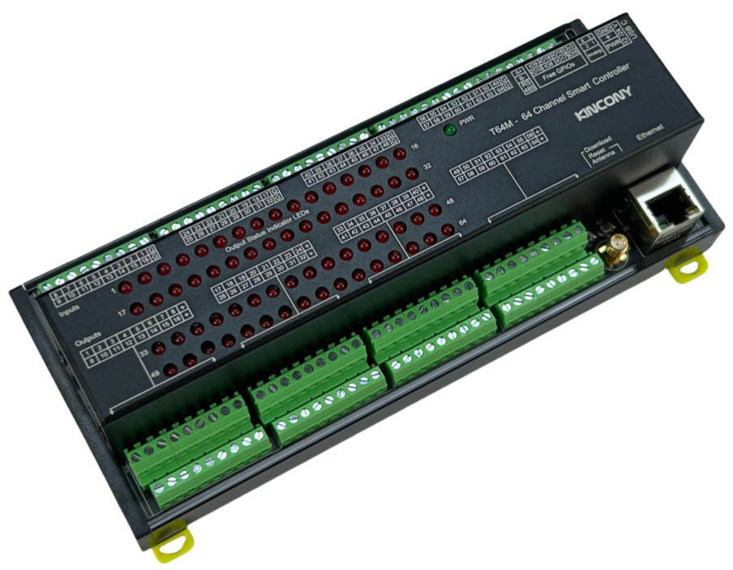

## Resources

- [ESP32 pin define details](https://www.kincony.com/forum/showthread.php?tid=7996)

## ESPHome Configuration

Here is an example YAML configuration for the KinCony T64M board.

```yaml
esphome:
  name: t64m
  friendly_name: t64m

esp32:
  board: esp32-s3-devkitc-1
  framework:
    type: esp-idf

# Enable logging
logger:
  hardware_uart: USB_SERIAL_JTAG
# Enable Home Assistant API
api:

ethernet:
  type: W5500
  clk_pin: GPIO42
  mosi_pin: GPIO43
  miso_pin: GPIO44
  cs_pin: GPIO41
  interrupt_pin: GPIO2
  reset_pin: GPIO1

i2c:
   - id: bus_a
     sda: 48
     scl: 47
     scan: true
     frequency: 400kHz
   - id: bus_b
     sda: 12
     scl: 11
     scan: true
     frequency: 400kHz

pcf8574:
  - id: 'pcf8574_hub_out_1'  # for output channel 1-16
    i2c_id: bus_a
    address: 0x25
    pcf8575: true

  - id: 'pcf8574_hub_out_2'  # for output channel 17-32
    i2c_id: bus_a
    address: 0x24
    pcf8575: true

  - id: 'pcf8574_hub_out_3'  # for output channel 33-48
    i2c_id: bus_a
    address: 0x21
    pcf8575: true

  - id: 'pcf8574_hub_out_4'  # for output channel 49-64
    i2c_id: bus_a
    address: 0x20
    pcf8575: true


  - id: 'pcf8574_hub_in_1'  # for input channel 1-16
    i2c_id: bus_b
    address: 0x25
    pcf8575: true

  - id: 'pcf8574_hub_in_2'  # for input channel 17-32
    i2c_id: bus_b
    address: 0x24
    pcf8575: true

  - id: 'pcf8574_hub_in_3'  # for input channel 33-48
    i2c_id: bus_b
    address: 0x21
    pcf8575: true

  - id: 'pcf8574_hub_in_4'  # for input channel 49-64
    i2c_id: bus_b
    address: 0x20
    pcf8575: true

switch:
  - platform: gpio
    name: "t64m-output01"
    id: "t64m_output01"
    pin:
      pcf8574: pcf8574_hub_out_1
      number: 0
      mode: OUTPUT
      inverted: true

  - platform: gpio
    name: "t64m-output02"
    id: "t64m_output02"
    pin:
      pcf8574: pcf8574_hub_out_1
      number: 1
      mode: OUTPUT
      inverted: true

  - platform: gpio
    name: "t64m-output03"
    id: "t64m_output03"
    pin:
      pcf8574: pcf8574_hub_out_1
      number: 2
      mode: OUTPUT
      inverted: true

  - platform: gpio
    name: "t64m-output04"
    id: "t64m_output04"
    pin:
      pcf8574: pcf8574_hub_out_1
      number: 3
      mode: OUTPUT
      inverted: true

  - platform: gpio
    name: "t64m-output05"
    id: "t64m_output05"
    pin:
      pcf8574: pcf8574_hub_out_1
      number: 4
      mode: OUTPUT
      inverted: true

  - platform: gpio
    name: "t64m-output06"
    id: "t64m_output06"
    pin:
      pcf8574: pcf8574_hub_out_1
      number: 5
      mode: OUTPUT
      inverted: true

  - platform: gpio
    name: "t64m-output07"
    id: "t64m_output07"
    pin:
      pcf8574: pcf8574_hub_out_1
      number: 6
      mode: OUTPUT
      inverted: true

  - platform: gpio
    name: "t64m-output08"
    id: "t64m_output08"
    pin:
      pcf8574: pcf8574_hub_out_1
      number: 7
      mode: OUTPUT
      inverted: true

  - platform: gpio
    name: "t64m-output09"
    id: "t64m_output09"
    pin:
      pcf8574: pcf8574_hub_out_1
      number: 8
      mode: OUTPUT
      inverted: true

  - platform: gpio
    name: "t64m-output10"
    id: "t64m_output10"
    pin:
      pcf8574: pcf8574_hub_out_1
      number: 9
      mode: OUTPUT
      inverted: true

  - platform: gpio
    name: "t64m-output11"
    id: "t64m_output11"
    pin:
      pcf8574: pcf8574_hub_out_1
      number: 10
      mode: OUTPUT
      inverted: true

  - platform: gpio
    name: "t64m-output12"
    id: "t64m_output12"
    pin:
      pcf8574: pcf8574_hub_out_1
      number: 11
      mode: OUTPUT
      inverted: true

  - platform: gpio
    name: "t64m-output13"
    id: "t64m_output13"
    pin:
      pcf8574: pcf8574_hub_out_1
      number: 12
      mode: OUTPUT
      inverted: true

  - platform: gpio
    name: "t64m-output14"
    id: "t64m_output14"
    pin:
      pcf8574: pcf8574_hub_out_1
      number: 13
      mode: OUTPUT
      inverted: true

  - platform: gpio
    name: "t64m-output15"
    id: "t64m_output15"
    pin:
      pcf8574: pcf8574_hub_out_1
      number: 14
      mode: OUTPUT
      inverted: true

  - platform: gpio
    name: "t64m-output16"
    id: "t64m_output16"
    pin:
      pcf8574: pcf8574_hub_out_1
      number: 15
      mode: OUTPUT
      inverted: true

  - platform: gpio
    name: "t64m-output17"
    id: "t64m_output17"
    pin:
      pcf8574: pcf8574_hub_out_2
      number: 0
      mode: OUTPUT
      inverted: true

  - platform: gpio
    name: "t64m-output18"
    id: "t64m_output18"
    pin:
      pcf8574: pcf8574_hub_out_2
      number: 1
      mode: OUTPUT
      inverted: true

  - platform: gpio
    name: "t64m-output19"
    id: "t64m_output19"
    pin:
      pcf8574: pcf8574_hub_out_2
      number: 2
      mode: OUTPUT
      inverted: true

  - platform: gpio
    name: "t64m-output20"
    id: "t64m_output20"
    pin:
      pcf8574: pcf8574_hub_out_2
      number: 3
      mode: OUTPUT
      inverted: true

  - platform: gpio
    name: "t64m-output21"
    id: "t64m_output21"
    pin:
      pcf8574: pcf8574_hub_out_2
      number: 4
      mode: OUTPUT
      inverted: true

  - platform: gpio
    name: "t64m-output22"
    id: "t64m_output22"
    pin:
      pcf8574: pcf8574_hub_out_2
      number: 5
      mode: OUTPUT
      inverted: true

  - platform: gpio
    name: "t64m-output23"
    id: "t64m_output23"
    pin:
      pcf8574: pcf8574_hub_out_2
      number: 6
      mode: OUTPUT
      inverted: true

  - platform: gpio
    name: "t64m-output24"
    id: "t64m_output24"
    pin:
      pcf8574: pcf8574_hub_out_2
      number: 7
      mode: OUTPUT
      inverted: true

  - platform: gpio
    name: "t64m-output25"
    id: "t64m_output25"
    pin:
      pcf8574: pcf8574_hub_out_2
      number: 8
      mode: OUTPUT
      inverted: true

  - platform: gpio
    name: "t64m-output26"
    id: "t64m_output26"
    pin:
      pcf8574: pcf8574_hub_out_2
      number: 9
      mode: OUTPUT
      inverted: true

  - platform: gpio
    name: "t64m-output27"
    id: "t64m_output27"
    pin:
      pcf8574: pcf8574_hub_out_2
      number: 10
      mode: OUTPUT
      inverted: true

  - platform: gpio
    name: "t64m-output28"
    id: "t64m_output28"
    pin:
      pcf8574: pcf8574_hub_out_2
      number: 11
      mode: OUTPUT
      inverted: true

  - platform: gpio
    name: "t64m-output29"
    id: "t64m_output29"
    pin:
      pcf8574: pcf8574_hub_out_2
      number: 12
      mode: OUTPUT
      inverted: true

  - platform: gpio
    name: "t64m-output30"
    id: "t64m_output30"
    pin:
      pcf8574: pcf8574_hub_out_2
      number: 13
      mode: OUTPUT
      inverted: true

  - platform: gpio
    name: "t64m-output31"
    id: "t64m_output31"
    pin:
      pcf8574: pcf8574_hub_out_2
      number: 14
      mode: OUTPUT
      inverted: true

  - platform: gpio
    name: "t64m-output32"
    id: "t64m_output32"
    pin:
      pcf8574: pcf8574_hub_out_2
      number: 15
      mode: OUTPUT
      inverted: true

  - platform: gpio
    name: "t64m-output33"
    id: "t64m_output33"
    pin:
      pcf8574: pcf8574_hub_out_3
      number: 0
      mode: OUTPUT
      inverted: true

  - platform: gpio
    name: "t64m-output34"
    id: "t64m_output34"
    pin:
      pcf8574: pcf8574_hub_out_3
      number: 1
      mode: OUTPUT
      inverted: true

  - platform: gpio
    name: "t64m-output35"
    id: "t64m_output35"
    pin:
      pcf8574: pcf8574_hub_out_3
      number: 2
      mode: OUTPUT
      inverted: true

  - platform: gpio
    name: "t64m-output36"
    id: "t64m_output36"
    pin:
      pcf8574: pcf8574_hub_out_3
      number: 3
      mode: OUTPUT
      inverted: true

  - platform: gpio
    name: "t64m-output37"
    id: "t64m_output37"
    pin:
      pcf8574: pcf8574_hub_out_3
      number: 4
      mode: OUTPUT
      inverted: true

  - platform: gpio
    name: "t64m-output38"
    id: "t64m_output38"
    pin:
      pcf8574: pcf8574_hub_out_3
      number: 5
      mode: OUTPUT
      inverted: true

  - platform: gpio
    name: "t64m-output39"
    id: "t64m_output39"
    pin:
      pcf8574: pcf8574_hub_out_3
      number: 6
      mode: OUTPUT
      inverted: true

  - platform: gpio
    name: "t64m-output40"
    id: "t64m_output40"
    pin:
      pcf8574: pcf8574_hub_out_3
      number: 7
      mode: OUTPUT
      inverted: true

  - platform: gpio
    name: "t64m-output41"
    id: "t64m_output41"
    pin:
      pcf8574: pcf8574_hub_out_3
      number: 8
      mode: OUTPUT
      inverted: true

  - platform: gpio
    name: "t64m-output42"
    id: "t64m_output42"
    pin:
      pcf8574: pcf8574_hub_out_3
      number: 9
      mode: OUTPUT
      inverted: true

  - platform: gpio
    name: "t64m-output43"
    id: "t64m_output43"
    pin:
      pcf8574: pcf8574_hub_out_3
      number: 10
      mode: OUTPUT
      inverted: true

  - platform: gpio
    name: "t64m-output44"
    id: "t64m_output44"
    pin:
      pcf8574: pcf8574_hub_out_3
      number: 11
      mode: OUTPUT
      inverted: true

  - platform: gpio
    name: "t64m-output45"
    id: "t64m_output45"
    pin:
      pcf8574: pcf8574_hub_out_3
      number: 12
      mode: OUTPUT
      inverted: true

  - platform: gpio
    name: "t64m-output46"
    id: "t64m_output46"
    pin:
      pcf8574: pcf8574_hub_out_3
      number: 13
      mode: OUTPUT
      inverted: true

  - platform: gpio
    name: "t64m-output47"
    id: "t64m_output47"
    pin:
      pcf8574: pcf8574_hub_out_3
      number: 14
      mode: OUTPUT
      inverted: true

  - platform: gpio
    name: "t64m-output48"
    id: "t64m_output48"
    pin:
      pcf8574: pcf8574_hub_out_3
      number: 15
      mode: OUTPUT
      inverted: true

  - platform: gpio
    name: "t64m-output49"
    id: "t64m_output49"
    pin:
      pcf8574: pcf8574_hub_out_4
      number: 0
      mode: OUTPUT
      inverted: true

  - platform: gpio
    name: "t64m-output50"
    id: "t64m_output50"
    pin:
      pcf8574: pcf8574_hub_out_4
      number: 1
      mode: OUTPUT
      inverted: true

  - platform: gpio
    name: "t64m-output51"
    id: "t64m_output51"
    pin:
      pcf8574: pcf8574_hub_out_4
      number: 2
      mode: OUTPUT
      inverted: true

  - platform: gpio
    name: "t64m-output52"
    id: "t64m_output52"
    pin:
      pcf8574: pcf8574_hub_out_4
      number: 3
      mode: OUTPUT
      inverted: true

  - platform: gpio
    name: "t64m-output53"
    id: "t64m_output53"
    pin:
      pcf8574: pcf8574_hub_out_4
      number: 4
      mode: OUTPUT
      inverted: true

  - platform: gpio
    name: "t64m-output54"
    id: "t64m_output54"
    pin:
      pcf8574: pcf8574_hub_out_4
      number: 5
      mode: OUTPUT
      inverted: true

  - platform: gpio
    name: "t64m-output55"
    id: "t64m_output55"
    pin:
      pcf8574: pcf8574_hub_out_4
      number: 6
      mode: OUTPUT
      inverted: true

  - platform: gpio
    name: "t64m-output56"
    id: "t64m_output56"
    pin:
      pcf8574: pcf8574_hub_out_4
      number: 7
      mode: OUTPUT
      inverted: true

  - platform: gpio
    name: "t64m-output57"
    id: "t64m_output57"
    pin:
      pcf8574: pcf8574_hub_out_4
      number: 8
      mode: OUTPUT
      inverted: true

  - platform: gpio
    name: "t64m-output58"
    id: "t64m_output58"
    pin:
      pcf8574: pcf8574_hub_out_4
      number: 9
      mode: OUTPUT
      inverted: true

  - platform: gpio
    name: "t64m-output59"
    id: "t64m_output59"
    pin:
      pcf8574: pcf8574_hub_out_4
      number: 10
      mode: OUTPUT
      inverted: true

  - platform: gpio
    name: "t64m-output60"
    id: "t64m_output60"
    pin:
      pcf8574: pcf8574_hub_out_4
      number: 11
      mode: OUTPUT
      inverted: true

  - platform: gpio
    name: "t64m-output61"
    id: "t64m_output61"
    pin:
      pcf8574: pcf8574_hub_out_4
      number: 12
      mode: OUTPUT
      inverted: true

  - platform: gpio
    name: "t64m-output62"
    id: "t64m_output62"
    pin:
      pcf8574: pcf8574_hub_out_4
      number: 13
      mode: OUTPUT
      inverted: true

  - platform: gpio
    name: "t64m-output63"
    id: "t64m_output63"
    pin:
      pcf8574: pcf8574_hub_out_4
      number: 14
      mode: OUTPUT
      inverted: true

  - platform: gpio
    name: "t64m-output64"
    id: "t64m_output64"
    pin:
      pcf8574: pcf8574_hub_out_4
      number: 15
      mode: OUTPUT
      inverted: true

binary_sensor:
  - platform: gpio
    name: "t64m-input01"
    pin:
      pcf8574: pcf8574_hub_in_1
      number: 0
      mode: INPUT
      inverted: true

  - platform: gpio
    name: "t64m-input02"
    pin:
      pcf8574: pcf8574_hub_in_1
      number: 1
      mode: INPUT
      inverted: true

  - platform: gpio
    name: "t64m-input03"
    pin:
      pcf8574: pcf8574_hub_in_1
      number: 2
      mode: INPUT
      inverted: true

  - platform: gpio
    name: "t64m-input04"
    pin:
      pcf8574: pcf8574_hub_in_1
      number: 3
      mode: INPUT
      inverted: true

  - platform: gpio
    name: "t64m-input05"
    pin:
      pcf8574: pcf8574_hub_in_1
      number: 4
      mode: INPUT
      inverted: true

  - platform: gpio
    name: "t64m-input06"
    pin:
      pcf8574: pcf8574_hub_in_1
      number: 5
      mode: INPUT
      inverted: true

  - platform: gpio
    name: "t64m-input07"
    pin:
      pcf8574: pcf8574_hub_in_1
      number: 6
      mode: INPUT
      inverted: true

  - platform: gpio
    name: "t64m-input08"
    pin:
      pcf8574: pcf8574_hub_in_1
      number: 7
      mode: INPUT
      inverted: true

  - platform: gpio
    name: "t64m-input09"
    pin:
      pcf8574: pcf8574_hub_in_1
      number: 8
      mode: INPUT
      inverted: true

  - platform: gpio
    name: "t64m-input10"
    pin:
      pcf8574: pcf8574_hub_in_1
      number: 9
      mode: INPUT
      inverted: true

  - platform: gpio
    name: "t64m-input11"
    pin:
      pcf8574: pcf8574_hub_in_1
      number: 10
      mode: INPUT
      inverted: true

  - platform: gpio
    name: "t64m-input12"
    pin:
      pcf8574: pcf8574_hub_in_1
      number: 11
      mode: INPUT
      inverted: true

  - platform: gpio
    name: "t64m-input13"
    pin:
      pcf8574: pcf8574_hub_in_1
      number: 12
      mode: INPUT
      inverted: true

  - platform: gpio
    name: "t64m-input14"
    pin:
      pcf8574: pcf8574_hub_in_1
      number: 13
      mode: INPUT
      inverted: true

  - platform: gpio
    name: "t64m-input15"
    pin:
      pcf8574: pcf8574_hub_in_1
      number: 14
      mode: INPUT
      inverted: true

  - platform: gpio
    name: "t64m-input16"
    pin:
      pcf8574: pcf8574_hub_in_1
      number: 15
      mode: INPUT
      inverted: true

  - platform: gpio
    name: "t64m-input17"
    pin:
      pcf8574: pcf8574_hub_in_2
      number: 0
      mode: INPUT
      inverted: true

  - platform: gpio
    name: "t64m-input18"
    pin:
      pcf8574: pcf8574_hub_in_2
      number: 1
      mode: INPUT
      inverted: true

  - platform: gpio
    name: "t64m-input19"
    pin:
      pcf8574: pcf8574_hub_in_2
      number: 2
      mode: INPUT
      inverted: true

  - platform: gpio
    name: "t64m-input20"
    pin:
      pcf8574: pcf8574_hub_in_2
      number: 3
      mode: INPUT
      inverted: true

  - platform: gpio
    name: "t64m-input21"
    pin:
      pcf8574: pcf8574_hub_in_2
      number: 4
      mode: INPUT
      inverted: true

  - platform: gpio
    name: "t64m-input22"
    pin:
      pcf8574: pcf8574_hub_in_2
      number: 5
      mode: INPUT
      inverted: true

  - platform: gpio
    name: "t64m-input23"
    pin:
      pcf8574: pcf8574_hub_in_2
      number: 6
      mode: INPUT
      inverted: true

  - platform: gpio
    name: "t64m-input24"
    pin:
      pcf8574: pcf8574_hub_in_2
      number: 7
      mode: INPUT
      inverted: true

  - platform: gpio
    name: "t64m-input25"
    pin:
      pcf8574: pcf8574_hub_in_2
      number: 8
      mode: INPUT
      inverted: true

  - platform: gpio
    name: "t64m-input26"
    pin:
      pcf8574: pcf8574_hub_in_2
      number: 9
      mode: INPUT
      inverted: true

  - platform: gpio
    name: "t64m-input27"
    pin:
      pcf8574: pcf8574_hub_in_2
      number: 10
      mode: INPUT
      inverted: true

  - platform: gpio
    name: "t64m-input28"
    pin:
      pcf8574: pcf8574_hub_in_2
      number: 11
      mode: INPUT
      inverted: true

  - platform: gpio
    name: "t64m-input29"
    pin:
      pcf8574: pcf8574_hub_in_2
      number: 12
      mode: INPUT
      inverted: true

  - platform: gpio
    name: "t64m-input30"
    pin:
      pcf8574: pcf8574_hub_in_2
      number: 13
      mode: INPUT
      inverted: true

  - platform: gpio
    name: "t64m-input31"
    pin:
      pcf8574: pcf8574_hub_in_2
      number: 14
      mode: INPUT
      inverted: true

  - platform: gpio
    name: "t64m-input32"
    pin:
      pcf8574: pcf8574_hub_in_2
      number: 15
      mode: INPUT
      inverted: true

  - platform: gpio
    name: "t64m-input33"
    pin:
      pcf8574: pcf8574_hub_in_3
      number: 0
      mode: INPUT
      inverted: true

  - platform: gpio
    name: "t64m-input34"
    pin:
      pcf8574: pcf8574_hub_in_3
      number: 1
      mode: INPUT
      inverted: true

  - platform: gpio
    name: "t64m-input35"
    pin:
      pcf8574: pcf8574_hub_in_3
      number: 2
      mode: INPUT
      inverted: true

  - platform: gpio
    name: "t64m-input36"
    pin:
      pcf8574: pcf8574_hub_in_3
      number: 3
      mode: INPUT
      inverted: true

  - platform: gpio
    name: "t64m-input37"
    pin:
      pcf8574: pcf8574_hub_in_3
      number: 4
      mode: INPUT
      inverted: true

  - platform: gpio
    name: "t64m-input38"
    pin:
      pcf8574: pcf8574_hub_in_3
      number: 5
      mode: INPUT
      inverted: true

  - platform: gpio
    name: "t64m-input39"
    pin:
      pcf8574: pcf8574_hub_in_3
      number: 6
      mode: INPUT
      inverted: true

  - platform: gpio
    name: "t64m-input40"
    pin:
      pcf8574: pcf8574_hub_in_3
      number: 7
      mode: INPUT
      inverted: true

  - platform: gpio
    name: "t64m-input41"
    pin:
      pcf8574: pcf8574_hub_in_3
      number: 8
      mode: INPUT
      inverted: true

  - platform: gpio
    name: "t64m-input42"
    pin:
      pcf8574: pcf8574_hub_in_3
      number: 9
      mode: INPUT
      inverted: true

  - platform: gpio
    name: "t64m-input43"
    pin:
      pcf8574: pcf8574_hub_in_3
      number: 10
      mode: INPUT
      inverted: true

  - platform: gpio
    name: "t64m-input44"
    pin:
      pcf8574: pcf8574_hub_in_3
      number: 11
      mode: INPUT
      inverted: true

  - platform: gpio
    name: "t64m-input45"
    pin:
      pcf8574: pcf8574_hub_in_3
      number: 12
      mode: INPUT
      inverted: true

  - platform: gpio
    name: "t64m-input46"
    pin:
      pcf8574: pcf8574_hub_in_3
      number: 13
      mode: INPUT
      inverted: true

  - platform: gpio
    name: "t64m-input47"
    pin:
      pcf8574: pcf8574_hub_in_3
      number: 14
      mode: INPUT
      inverted: true

  - platform: gpio
    name: "t64m-input48"
    pin:
      pcf8574: pcf8574_hub_in_3
      number: 15
      mode: INPUT
      inverted: true

  - platform: gpio
    name: "t64m-input49"
    pin:
      pcf8574: pcf8574_hub_in_4
      number: 0
      mode: INPUT
      inverted: true

  - platform: gpio
    name: "t64m-input50"
    pin:
      pcf8574: pcf8574_hub_in_4
      number: 1
      mode: INPUT
      inverted: true

  - platform: gpio
    name: "t64m-input51"
    pin:
      pcf8574: pcf8574_hub_in_4
      number: 2
      mode: INPUT
      inverted: true

  - platform: gpio
    name: "t64m-input52"
    pin:
      pcf8574: pcf8574_hub_in_4
      number: 3
      mode: INPUT
      inverted: true

  - platform: gpio
    name: "t64m-input53"
    pin:
      pcf8574: pcf8574_hub_in_4
      number: 4
      mode: INPUT
      inverted: true

  - platform: gpio
    name: "t64m-input54"
    pin:
      pcf8574: pcf8574_hub_in_4
      number: 5
      mode: INPUT
      inverted: true

  - platform: gpio
    name: "t64m-input55"
    pin:
      pcf8574: pcf8574_hub_in_4
      number: 6
      mode: INPUT
      inverted: true

  - platform: gpio
    name: "t64m-input56"
    pin:
      pcf8574: pcf8574_hub_in_4
      number: 7
      mode: INPUT
      inverted: true

  - platform: gpio
    name: "t64m-input57"
    pin:
      pcf8574: pcf8574_hub_in_4
      number: 8
      mode: INPUT
      inverted: true

  - platform: gpio
    name: "t64m-input58"
    pin:
      pcf8574: pcf8574_hub_in_4
      number: 9
      mode: INPUT
      inverted: true

  - platform: gpio
    name: "t64m-input59"
    pin:
      pcf8574: pcf8574_hub_in_4
      number: 10
      mode: INPUT
      inverted: true

  - platform: gpio
    name: "t64m-input60"
    pin:
      pcf8574: pcf8574_hub_in_4
      number: 11
      mode: INPUT
      inverted: true

  - platform: gpio
    name: "t64m-input61"
    pin:
      pcf8574: pcf8574_hub_in_4
      number: 12
      mode: INPUT
      inverted: true

  - platform: gpio
    name: "t64m-input62"
    pin:
      pcf8574: pcf8574_hub_in_4
      number: 13
      mode: INPUT
      inverted: true

  - platform: gpio
    name: "t64m-input63"
    pin:
      pcf8574: pcf8574_hub_in_4
      number: 14
      mode: INPUT
      inverted: true

  - platform: gpio
    name: "t64m-input64"
    pin:
      pcf8574: pcf8574_hub_in_4
      number: 15
      mode: INPUT
      inverted: true

## pull-up resistance on PCB
  - platform: gpio
    name: "t64m-W1-io15"
    pin:
      number: 15
      inverted: true

  - platform: gpio
    name: "t64m-W1-io16"
    pin:
      number: 16
      inverted: false

  - platform: gpio
    name: "t64m-W1-io17"
    pin:
      number: 17
      inverted:  false

  - platform: gpio
    name: "t64m-W1-io18"
    pin:
      number: 18
      inverted:  false

## without pull-up resistance on PCB
  - platform: gpio
    name: "t64m-io0"
    pin:
      number: 0
      inverted:  false

  - platform: gpio
    name: "t64m-io8"
    pin:
      number: 8
      inverted:  false

  - platform: gpio
    name: "t64m-io9"
    pin:
      number: 9
      inverted:  false

  - platform: gpio
    name: "t64m-io10"
    pin:
      number: 10
      inverted:  false

sensor:
  - platform: adc
    pin: 7
    name: "t64m A1 Voltage"
    update_interval: 5s
    attenuation: 11db
    filters:
      - lambda:
          if (x >= 3.11) {
            return x * 1.60256;
          } else if (x <= 0.15) {
            return 0;
          } else {
            return x * 1.51;
          }
  - platform: adc
    pin: 6
    name: "t64m A2 Voltage"
    update_interval: 5s
    attenuation: 11db
    filters:
      # - multiply: 1.51515
      - lambda:
          if (x >= 3.11) {
            return x * 1.60256;
          } else if (x <= 0.15) {
            return 0;
          } else {
            return x * 1.51;
          }
  - platform: adc
    pin: 5
    name: "t64m A3 Current"
    update_interval: 5s
    unit_of_measurement: mA
    attenuation: 11db
    filters:
      - multiply: 6.66666666
  - platform: adc
    pin: 4
    name: "t64m A4 Current"
    update_interval: 5s
    unit_of_measurement: mA
    attenuation: 11db
    filters:
      - multiply: 6.66666666
```
