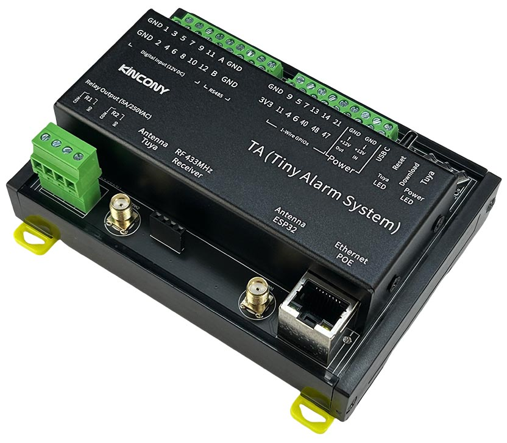
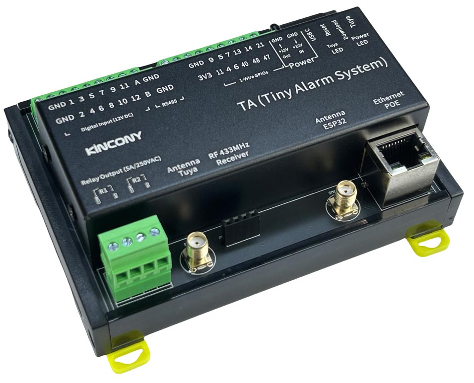
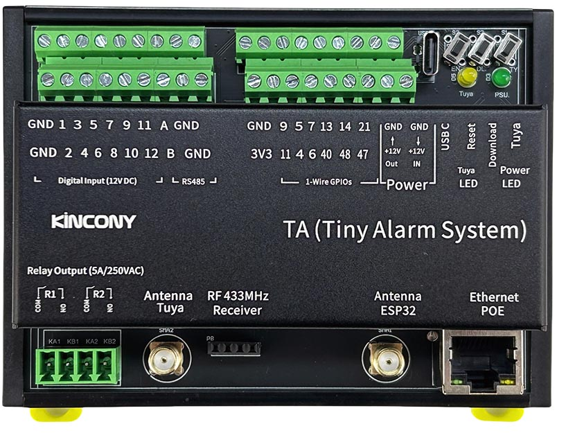

## Resources

- [ESP32 pin define details](https://www.kincony.com/forum/showthread.php?tid=7896)
- [YouTube video tour](https://youtu.be/zdLj-lA1DWY)

## ESPHome Configuration

Here is an example YAML configuration for the KinCony-TA board with Tuya integration.

```yaml
esphome:
  name: ta
  friendly_name: TA
esp32:
  board: esp32-s3-devkitc-1
  framework:
    type: arduino

# Enable logging
#logger:
#  level: DEBUG
#   hardware_uart: USB_SERIAL_JTAG

# Enable Home Assistant API
api:
  ethernet:
    type: W5500
    clk_pin: GPIO1
    mosi_pin: GPIO2
    miso_pin: GPIO41
    cs_pin: GPIO42
    interrupt_pin: GPIO43
    reset_pin: GPIO44

i2c:
  - id: bus_a
    sda: 8
    scl: 18
    scan: true
    frequency: 400kHz

pcf8574:
  - id: pcf8574_hub_out_1 # for output channel 1-16
    i2c_id: bus_a
    address: 0x22
    pcf8575: true

uart:
  - id: uart_1 #RS485
    baud_rate: 9600
    debug:
      direction: BOTH
      dummy_receiver: true
      after:
        timeout: 10ms
    tx_pin: 39
    rx_pin: 38

switch:
  - platform: uart
    uart_id: uart_1
    name: "RS485 Button"
    data: [0x11, 0x22, 0x33, 0x44, 0x55]

  - platform: gpio
    name: "ta-output01"
    id: "ta_output01"
    pin:
      pcf8574: pcf8574_hub_out_1
      number: 14
      mode: OUTPUT
      inverted: true
  - platform: gpio
    name: "ta-output02"
    id: "ta_output02"
    pin:
      pcf8574: pcf8574_hub_out_1
      number: 15
      mode: OUTPUT
      inverted: true

binary_sensor:
  - platform: gpio
    name: "ta-input01"
    id: "ta_input01"
    pin:
      pcf8574: pcf8574_hub_out_1
      number: 0
      mode: INPUT
      inverted: true
  - platform: gpio
    name: "ta-input02"
    id: "ta_input02"
    pin:
      pcf8574: pcf8574_hub_out_1
      number: 1
      mode: INPUT
      inverted: true
  - platform: gpio
    name: "ta-input03"
    id: "ta_input03"
    pin:
      pcf8574: pcf8574_hub_out_1
      number: 2
      mode: INPUT
      inverted: true
  - platform: gpio
    name: "ta-input04"
    id: "ta_input04"
    pin:
      pcf8574: pcf8574_hub_out_1
      number: 3
      mode: INPUT
      inverted: true
  - platform: gpio
    name: "ta-input05"
    id: "ta_input05"
    pin:
      pcf8574: pcf8574_hub_out_1
      number: 4
      mode: INPUT
      inverted: true
  - platform: gpio
    name: "ta-input06"
    id: "ta_input06"
    pin:
      pcf8574: pcf8574_hub_out_1
      number: 5
      mode: INPUT
      inverted: true
  - platform: gpio
    name: "ta-input07"
    id: "ta_input07"
    pin:
      pcf8574: pcf8574_hub_out_1
      number: 6
      mode: INPUT
      inverted: true
  - platform: gpio
    name: "ta-input08"
    id: "ta_input08"
    pin:
      pcf8574: pcf8574_hub_out_1
      number: 7
      mode: INPUT
      inverted: true
  - platform: gpio
    name: "ta-input09"
    id: "ta_input09"
    pin:
      pcf8574: pcf8574_hub_out_1
      number: 8
      mode: INPUT
      inverted: true
  - platform: gpio
    name: "ta-input10"
    id: "ta_input10"
    pin:
      pcf8574: pcf8574_hub_out_1
      number: 9
      mode: INPUT
      inverted: true
  - platform: gpio
    name: "ta-input11"
    id: "ta_input11"
    pin:
      pcf8574: pcf8574_hub_out_1
      number: 10
      mode: INPUT
      inverted: true
  - platform: gpio
    name: "ta-input12"
    id: "ta_input12"
    pin:
      pcf8574: pcf8574_hub_out_1
      number: 11
      mode: INPUT
      inverted: true

  ##pull-up resistance on PCB
  - platform: gpio
    name: "ta-io09"
    pin:
      number: 9
      inverted: true

  - platform: gpio
    name: "ta-io11"
    pin:
      number: 11
      inverted: true

  - platform: gpio
    name: "ta-io05"
    pin:
      number: 5
      inverted: true

  - platform: gpio
    name: "ta-io04"
    pin:
      number: 4
      inverted: true

  - platform: gpio
    name: "ta-io07"
    pin:
      number: 7
      inverted: false

  - platform: gpio
    name: "ta-io06"
    pin:
      number: 6
      inverted: false

  - platform: gpio
    name: "ta-io13"
    pin:
      number: 13
      inverted: false

  - platform: gpio
    name: "ta-io40"
    pin:
      number: 40
      inverted: false

  - platform: gpio
    name: "ta-io14"
    pin:
      number: 14
      inverted: false

  - platform: gpio
    name: "ta-io48"
    pin:
      number: 48
      inverted: false

  - platform: gpio
    name: "ta-io21"
    pin:
      number: 21
      inverted: false

  - platform: gpio
    name: "ta-io47"
    pin:
      number: 47
      inverted: false

  - platform: gpio
    name: "ta-io0"
    pin:
      number: 0
      inverted: false

  - platform: gpio
    name: "ta-433M-R"
    pin:
      number: 12
      inverted: false

web_server:
  port: 80
```
