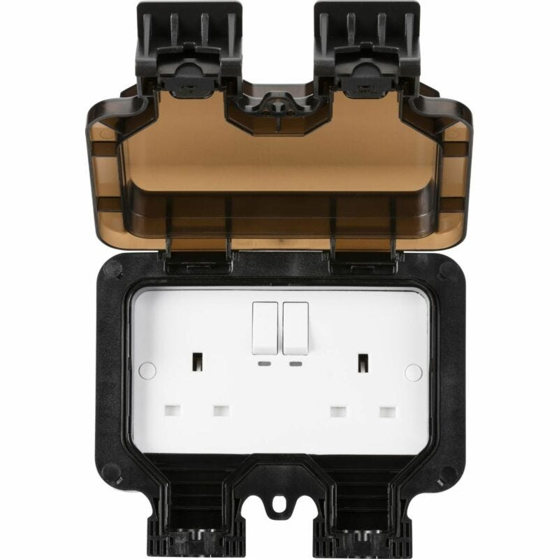
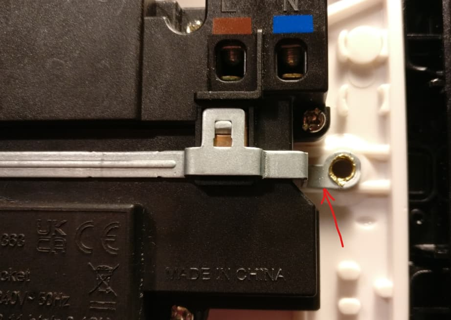
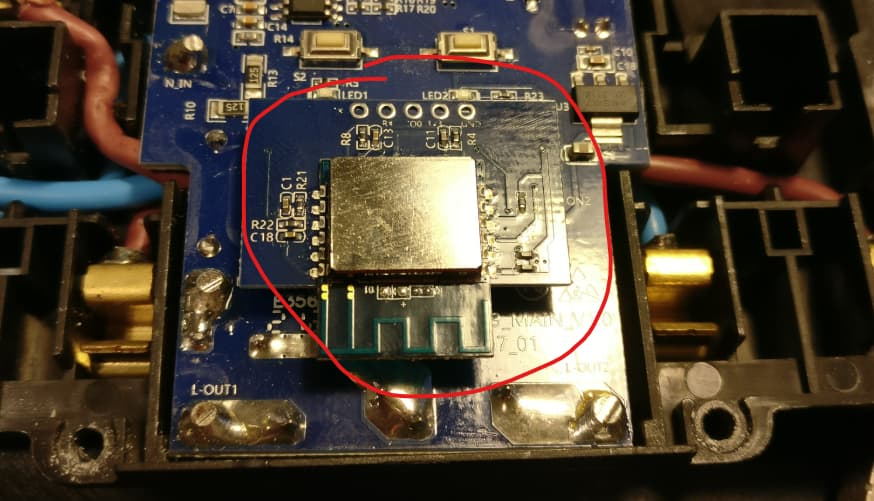

## General Notes

The Knightsbridge CU9KW is a UK-format smart wall socket that lets you switch two outlets on/off remotely and monitors real-time power usage and cumulative energy consumption over Wi-Fi. It fits a standard 2-gang back box and supports OTA updates via ESPHome.

The Knightsbridge OP9KW is the exact same product, with the outdoor case, so instructions will work exactly the same for both.

Manufacturer: [Knightsbridge (ML Accessories)](http://www.mlaccessories.co.uk)




## GPIO Pinout

| Pin    | Function                                 |
| ------ | ---------------------------------------- |
| GPIO15 | Relay output for Outlet 1                |
| GPIO4  | Relay output for Outlet 2                |
| GPIO2  | LED indicator for Outlet 1 (inverted)    |
| GPIO0  | LED indicator for Outlet 2 (inverted)    |
| GPIO16 | Push-button for Outlet 1                 |
| GPIO13 | Push-button for Outlet 2                 |
| GPIO12 | HLW8012 SEL pin (power/energy selector)  |
| GPIO5  | HLW8012 CF pin (power pulse)             |
| GPIO14 | HLW8012 CF1 pin (voltage pulse)          |

## Flashing

Based on the procedure shared by [maxwroc](https://community.home-assistant.io/t/smartknight-ml-accessories-ltd-smart-plug/504892/3) in the Home Assistant community forum:

1. **Remove the metal bracket**  
   Gently squeeze a screwdriver between the metal part and the plastic housing, then pry the metal bracket up around its ends to release it.  
   

2. **Extract the ESP8266 module**  
   Carefully lift the Wi-Fi module straight up from its plastic clips once the bracket is removed.  
   

3. **Wire for flashing**  
   - Solder a header or wires to the module’s pins (3.3 V, GND, TX, RX, and GPIO0).  
   - Connect TX→RX, RX→TX, GND→GND, and 3.3 V→3.3 V (do **not** use 5 V).  
   - Hold **GPIO0** to GND while applying power to enter the ESP8266 bootloader.  
   - Use your preferred flasher (e.g., `esptool.py`) to write the ESPHome firmware.  

> **Note:**  
> Disassembling the plug was easy but you need to be careful with the rivets, which must be pried open to do this mod.  
> These rivets both electrically bond the screws to earth **and** hold the entire earth assembly in place—when reassembling, be sure to “crush” each rivet head firmly back against the inside of the socket, otherwise pushing a plug in later will force the earth assembly apart.  
>
> Source: (DJBenson, Home Assistant Community Forum) https://community.home-assistant.io/t/smartknight-ml-accessories-ltd-smart-plug/504892/16

## ESPHome Example Configuration
Here is an example YAML configuration for Knightsbridge CU9KW. It defines all the hardware but nothing more than that.

```yaml
substitutions:
  name: knightsbridge-cu9kw
  friendly_name: Knightsbridge-CU9KW

esphome:
  name: $name

esp8266:
  board: esp01_1m

# Enable logging
logger:
improv_serial:

ota:
  - platform: esphome

wifi:
  ssid: !secret wifi_ssid
  password: !secret wifi_password

output:
  - platform: gpio
    id: relay_1
    pin: GPIO15
  - platform: gpio
    id: relay_2
    pin: GPIO4
  - platform: gpio
    id: led_1
    pin:
      number: GPIO2
      inverted: true
  - platform: gpio
    id: led_2
    pin:
      number: GPIO0
      inverted: true

switch:
  - platform: output
    output: relay_1
    name: "Outlet 1"
    id: cu9kw_socket_1
    icon: mdi:power-socket-uk
    on_turn_on:
      - output.turn_on: led_1
    on_turn_off:
      - output.turn_off: led_1

  - platform: output
    output: relay_2
    name: "Outlet 2"
    id: cu9kw_socket_2
    icon: mdi:power-socket-uk
    on_turn_on:
      - output.turn_on: led_2
    on_turn_off:
      - output.turn_off: led_2

binary_sensor:
  - platform: gpio
    id: button_1
    pin:
      number: GPIO16
      mode:
        input: true
        pullup: false
      inverted: false
    on_press:
      - switch.toggle: cu9kw_socket_1

  - platform: gpio
    id: button_2
    pin:
      number: GPIO13
      mode:
        input: true
        pullup: true
      inverted: false
    on_press:
      - switch.toggle: cu9kw_socket_2

sensor:
  # Power Monitoring
  - platform: hlw8012
    model: BL0937
    sel_pin:
      number: GPIO12
      inverted: true
    cf_pin: GPIO5
    cf1_pin: GPIO14
    update_interval: 10s
```

## ESPHome Configuration with Power Monitoring
Here is a YAML configuration which exposes power monitoring sensors to Home Assistant, including calibration coefficients. To perform the calibration, put a known load on the plug and in HA got to `Developer Tools` -> `Actions` -> `<device_name>_calibrate_current` and enter the correct amount for the known load. Repeat for voltage and power.

```yaml
substitutions:
  # Short placeholders for reuse in the config
  name: knightsbridge-cu9kw             # Used as the device hostname/mDNS name
  friendly_name: Knightsbridge-CU9KW    # Human-readable label for UIs

esphome:
  name: $name
  on_boot:
    priority: 300
    then:
      # Initialise multipliers if they haven't been set yet
      - lambda: |-
          if (id(voltage_multiply) <= 0) id(voltage_multiply) = 0.3;
          if (id(power_multiply)   <= 0) id(power_multiply)   = 0.133;
          if (id(current_multiply) <= 0) id(current_multiply) = 0.805;
      - globals.set:
          id: setupComplete
          value: "true"               # Flag indicating calibration values are initialised

esp8266:
  board: esp01_1m

# Enable logging
logger:

# Enable Home Assistant API and calibration services
api:
  services:
    - service: calibrate_voltage
      variables:
        actual_value: float
      then:
        - lambda: |-
            id(voltage_multiply) = actual_value / id(voltage).raw_state;
        - number.set:
            id: voltage_factor
            value: !lambda "return id(voltage_multiply);"
    - service: calibrate_power
      variables:
        actual_value: float
      then:
        - lambda: |-
            id(power_multiply) = actual_value / id(power).raw_state;
        - number.set:
            id: power_factor
            value: !lambda "return id(power_multiply);"
    - service: calibrate_current
      variables:
        actual_value: float
      then:
        - lambda: |-
            id(current_multiply) = actual_value / id(current).raw_state;
        - number.set:
            id: current_factor
            value: !lambda "return id(current_multiply);"

improv_serial:

ota:
  - platform: esphome

wifi:
  ssid: !secret wifi_ssid
  password: !secret wifi_password
  ap:
    ssid: "$friendly_name Hotspot"          # Fallback AP if station mode fails

web_server:
  port: 80

captive_portal:

output:
  - platform: gpio
    id: relay_1
    pin: GPIO15
  - platform: gpio
    id: relay_2
    pin: GPIO4
  - platform: gpio
    id: led_1
    pin:
      number: GPIO2
      inverted: true
  - platform: gpio
    id: led_2
    pin:
      number: GPIO0
      inverted: true

switch:
  - platform: output
    output: relay_1
    name: "Outlet 1"
    id: cu9kw_socket_1
    icon: mdi:power-socket-uk
    on_turn_on:
      - output.turn_on: led_1
    on_turn_off:
      - output.turn_off: led_1

  - platform: output
    output: relay_2
    name: "Outlet 2"
    id: cu9kw_socket_2
    icon: mdi:power-socket-uk
    on_turn_on:
      - output.turn_on: led_2
    on_turn_off:
      - output.turn_off: led_2

binary_sensor:
  - platform: gpio
    id: button_1
    pin:
      number: GPIO16                            # Physical button pin
      mode:
        input: true
        pullup: false
      inverted: false
    on_press:
      - switch.toggle: cu9kw_socket_1

  - platform: gpio
    id: button_2
    pin:
      number: GPIO13
      mode:
        input: true
        pullup: true
      inverted: false
    on_press:
      - switch.toggle: cu9kw_socket_2

sensor:
  # Power Monitoring with calibration filters
  - platform: hlw8012
    model: BL0937
    sel_pin:
      number: GPIO12
      inverted: true
    cf_pin: GPIO5
    cf1_pin: GPIO14
    update_interval: 10s

    voltage:
      id: voltage
      name: "$friendly_name voltage"
      filters:
        - lambda: |-
            return x * id(voltage_multiply);

    power:
      id: power
      name: "$friendly_name power"
      filters:
        - lambda: |-
            return x * id(power_multiply);

    current:
      name: "$friendly_name current"
      id: current
      filters:
        - lambda: |-
            return x * id(current_multiply);

    energy:
      id: energy
      name: "$friendly_name energy"

  # Uptime & Wi-Fi
  - platform: uptime
    name: Uptime Sensor
    id: uptime_sensor
    update_interval: 60s
    on_raw_value:
      then:
        - text_sensor.template.publish:
            id: uptime_human
            state: !lambda |-
              int seconds = round(id(uptime_sensor).raw_state);
              int days    = seconds / (24 * 3600);
              seconds %= 24 * 3600;
              int hours   = seconds / 3600;
              seconds %= 3600;
              int minutes = seconds / 60;
              seconds %= 60;
              return (
                (days    ? to_string(days)    + "d " : "") +
                (hours   ? to_string(hours)   + "h " : "") +
                (minutes ? to_string(minutes) + "m " : "") +
                (to_string(seconds) + "s")
              ).c_str();

  - platform: wifi_signal
    name: "$friendly_name WiFi Signal Sensor"
    update_interval: 60s

  - platform: uptime
    name: "$friendly_name Uptime Sensor"

button:
  - platform: restart
    name: "Restart"
  - platform: safe_mode
    name: "Restart (Safe Mode)"
  - platform: factory_reset
    name: "Factory Reset"

text_sensor:
  - platform: wifi_info
    ip_address:
      name: "IP Address"
    ssid:
      name: "SSID"
    bssid:
      name: "BSSID"
    mac_address:
      name: "Mac Address"

  - platform: template
    name: Uptime Human Readable
    id: uptime_human
    icon: mdi:clock-start

# Calibration globals
globals:
  - id: voltage_multiply
    type: float
    restore_value: true
    initial_value: "0.3"                  # Default voltage multiplier
  - id: power_multiply
    type: float
    restore_value: true
    initial_value: "0.133"                # Default power multiplier
  - id: current_multiply
    type: float
    restore_value: true
    initial_value: "0.805"                # Default current multiplier
  - id: setupComplete
    type: bool
    restore_value: no
    initial_value: "false"                # Flag set after initial boot

# Expose calibration factors in Home Assistant
number:
  - platform: template
    name: "Voltage Calibration Factor"
    id: voltage_factor
    icon: mdi:sine-wave
    min_value: 0
    max_value: 10
    step: 0.001
    entity_category: diagnostic
    mode: box
    lambda: |-
      return id(voltage_multiply);
    set_action:
      lambda: |-
        id(voltage_multiply) = x;

  - platform: template
    name: "Power Calibration Factor"
    id: power_factor
    icon: mdi:flash
    min_value: 0
    max_value: 10
    step: 0.001
    entity_category: diagnostic
    mode: box
    lambda: |-
      return id(power_multiply);
    set_action:
      lambda: |-
        id(power_multiply) = x;

  - platform: template
    name: "Current Calibration Factor"
    id: current_factor
    icon: mdi:current-ac
    min_value: 0
    max_value: 10
    step: 0.001
    entity_category: diagnostic
    mode: box
    lambda: |-
      return id(current_multiply);
    set_action:
      lambda: |-
        id(current_multiply) = x;
```
