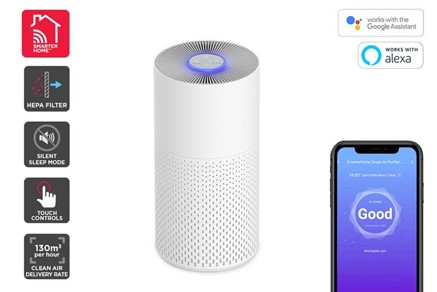

[Product Listing](https://www.kogan.com/au/buy/kogan-smarterhome-4-stage-air-purifier-2s-with-h13-filter-130-cadr/)

[Flashing Tips (Home Assistant Thread)](https://community.home-assistant.io/t/tuya-tywe1s-flash-help/273747/).

[Tear down, mods/enhancements, Home Assistant configs, and more detailed write up (Home Assistant Thread)](https://community.home-assistant.io/t/kogan-smart-air-purifier-2s-working-with-esphome/390526)

## GPIO Pinout

| Pin   | Function |
| ----- | -------- |
| GPIO13 | RX      |
| GPIO15 | TX      |

## Basic Config

```yaml
substitutions:
  name: kogan-air-purifier

esphome:
  name: "${name}"
  platform: ESP8266
  board: esp01_1m
  
# OTA flashing
ota:
  - platform: esphome

wifi: # Your Wifi network details
  
# Enable fallback hotspot in case wifi connection fails  
  ap:

# Enabling the logging component
logger:
  baud_rate: 0
# Enable Home Assistant API
api:

# Enable the captive portal
captive_portal:

uart:
  #Serial connection between the TYWE1S and the Tuya MCU
  - id: uart_0
    rx_pin: GPIO13
    tx_pin: GPIO15
    baud_rate: 9600

#Tuya component: https://esphome.io/components/tuya.html
tuya:
  uart_id: uart_0

#Tuya Fan: https://esphome.io/components/fan/tuya.html
fan:
  - platform: tuya
    name: ${kogan-air-purifier}
    switch_datapoint: 1 #ON, OFF
    speed_datapoint: 4 # 0 = off, 1 = sleep, 2 = high, 3 = auto
    speed_count: 3

number:
  #19 Timer Mode
  - platform: tuya
    name: "${name} Timer Mode"
    number_datapoint: 19 # 0 = off, 1 = 4hr, 2 = 8hr
    min_value: 0
    max_value: 2
    step: 1

  #20 Timer Countdown
  - platform: tuya
    name: "${name} Timer Countdown Mins"
    number_datapoint: 20 #counts down from inital timer mode value of 4hr = 240min or 8hr = 480min
    min_value: 0
    max_value: 480
    step: 1

  #101 LED Brightness
  - platform: tuya
    name: "${name} LED Brightness"
    number_datapoint: 101 #0 = off, 1 = mid, 2 = high
    min_value: 0
    max_value: 2
    step: 1

  #22 Air Quality Level
  - platform: tuya
    name: "${name} Air Quality Level"
    #Only seems to report air quality when in auto mode. 0 = Good, 1 = Yellow/Poor ,2 = Red/Bad
    number_datapoint: 22
    min_value: 0
    max_value: 2
    step: 1
#5 Unknown
# - platform: tuya
# name: "${name} DP5 Unknown" #Unknown. Could be % filter Left?
# number_datapoint: 5
# min_value: 0
# max_value: 200
# step: 1

#11 Unknown
# switch:
# - platform: tuya
# name: "${name} DP11 Unknown" #Unknown. Could maybe be reset button or wifi connection?. Have not tested.
# entity_category: config
# switch_datapoint: 11
```
