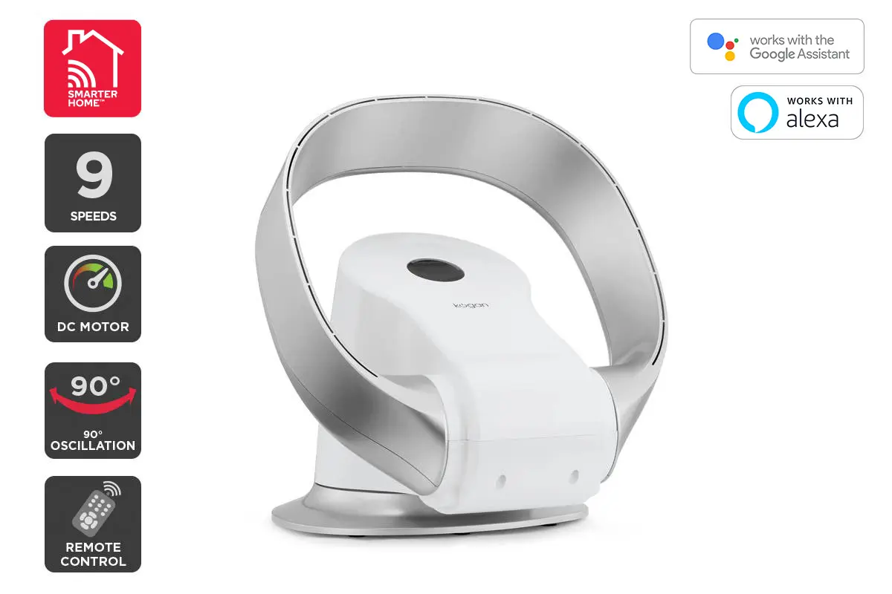

[Product Listing](https://www.kogan.com/au/buy/kogan-smarterhome-bladeless-dc-motor-turbo-smart-fan-silver/)

## GPIO Pinout

| Pin   | Function |
| ----- | -------- |
| GPIO3 | RX      |
| GPIO1 | TX      |

## Basic Config

```yaml
substitutions:
  name: Kogan Smart Bladeless Fan

esphome:
  name: "${name}"
  platform: ESP8266
  board: esp01_1m
  
# OTA flashing
ota:
  - platform: esphome

wifi: # Your Wifi network details
  
# Enable fallback hotspot in case wifi connection fails  
  ap:

# Enabling the logging component
logger:

# Enable Home Assistant API
api:

# Enable the captive portal
captive_portal:

uart:
    rx_pin: GPIO3
    tx_pin: GPIO1
    baud_rate: 9600

tuya:

fan:
  - platform: tuya
    name: Your Fan Name
    switch_datapoint: 1
    speed_datapoint: 2
    speed_count: 9
    oscillation_datapoint: 8
```
