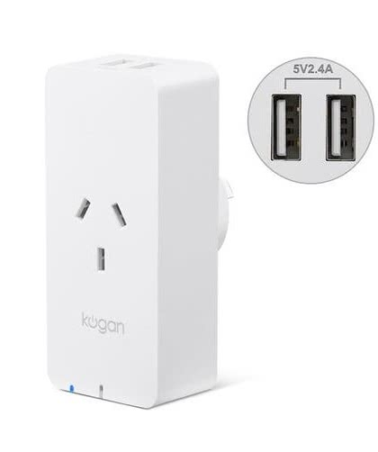

  

[https://www.kogan.com/au/buy/kogan-smarterhome-smart-plug-energy-meter-5v-24a-usb-ports/](https://www.kogan.com/au/buy/kogan-smarterhome-smart-plug-energy-meter-5v-24a-usb-ports/)

## GPIO Pinout

| Pin    | Function                   |
|--------|----------------------------|
| GPIO03 | Push Button                |
| GPIO13 | Green LED (Inverted: true) |
| GPIO14 | Relay                      |
| GPIO12 | HLW8012 SEL Pin            |
| GPIO04 | HLW8012 CF Pin             |
| GPIO05 | HLW8012 CF1 Pin            |

## Basic Config

```yaml
substitutions:
  device_name: kogan_plug_1
  device_icon: mdi:power-socket-au
  device_restore: ALWAYS_ON
  
  # Higher value gives lower watt readout
  current_res: "0.00225"
  # Lower value gives lower voltage readout
  voltage_div: "805"

esphome:
  name: ${device_name}
  platform: ESP8266
  board: esp8285
  
# OTA flashing
ota:
  - platform: esphome

wifi: # Your Wifi network details
  
# Enable fallback hotspot in case wifi connection fails  
  ap:

# Enabling the logging component
logger:

# Enable Home Assistant API
api:

# Enable the captive portal
captive_portal:

binary_sensor:
  - platform: gpio
    pin:
      number: 03
      mode: INPUT_PULLUP
      inverted: true
    name: "${device_name}_button"
    on_press:
      - switch.toggle: relay

  - platform: status
    name: "${device_name}_status"

switch:
  - platform: gpio
    id: led
    pin:
      number: GPIO13
      inverted: true

  - platform: gpio
    name: "${device_name}_plug"
    pin: GPIO14
    id: relay
    icon: ${device_icon}
    restore_mode: ${device_restore}
    on_turn_on:
      - switch.turn_on: led
    on_turn_off:
      - switch.turn_off: led

sensor:
  - platform: hlw8012
    sel_pin:
      number: GPIO12
      inverted: true
    cf_pin: GPIO04
    cf1_pin: GPIO05
    current:
      name: "${device_name}_current"
      unit_of_measurement: A
    voltage:
      name: "${device_name}_voltage"
      unit_of_measurement: V
    power:
      id: ${device_name}_wattage
      name: "${device_name}_wattage"
      unit_of_measurement: W
    current_resistor: ${current_res}
    voltage_divider: ${voltage_div}
    change_mode_every: 8
    update_interval: 15s

  - platform: total_daily_energy
    name: "${device_name}_daily_energy"
    power_id: ${device_name}_wattage
    filters:
      - multiply: 0.001
    unit_of_measurement: kWh

  - platform: wifi_signal
    name: "${device_name}_rssi"
    update_interval: 5min

  - platform: uptime
    id: uptime_sensor
    name: "${device_name}_uptime"
    update_interval: 5min
    on_raw_value:
      then:
        - text_sensor.template.publish:
            id: uptime_human
            state: !lambda |-
              int seconds = round(id(uptime_sensor).raw_state);
              int days = seconds / (24 * 3600);
              seconds = seconds % (24 * 3600);
              int hours = seconds / 3600;
              seconds = seconds % 3600;
              int minutes = seconds /  60;
              seconds = seconds % 60;
              return (
                (days ? to_string(days) + "d " : "") +
                (hours ? to_string(hours) + "h " : "") +
                (minutes ? to_string(minutes) + "m " : "") +
                (to_string(seconds) + "s")
              ).c_str();

text_sensor:
  - platform: template
    name: "${device_name}_uptime_human"
    id: uptime_human
    entity_category: diagnostic
    icon: mdi:clock-start

time:
  - platform: homeassistant
    id: homeassistant_time
```

## Appendix

If you are seeing incorrect power/current readings at higher power draws (i.e. current of 5A@240V while power is showing ~2000W), your unit most likely has a `BL0937` chip. You can verify this by looking at underside of the PCB, in the general area of the ESP chip. To get correct sensor results, make the following config changes:

```yaml
(...)
substitutions:
  current_res: "0.001" # visually verified the shunt resistor is 1m0
  voltage_div: "1720" # rough value, tested against multimeter readout
(...)
sensor:
  - platform: hlw8012
    (...)
    model: BL0937
(...)
```

The readings should be correct from now on.
