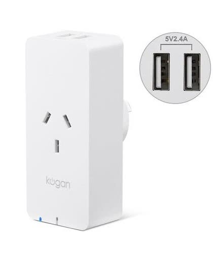

  

[https://www.kogan.com/au/buy/kogan-smarterhome-smart-plug-energy-meter-5v-24a-usb-ports/](https://www.kogan.com/au/buy/kogan-smarterhome-smart-plug-energy-meter-5v-24a-usb-ports/)

## GPIO Pinout

| Pin    | Function                   |
|--------|----------------------------|
| GPIO03 | Push Button                |
| GPIO13 | Green LED (Inverted: true) |
| GPIO14 | Relay                      |
| GPIO12 | HLW8012 SEL Pin            |
| GPIO04 | HLW8012 CF Pin             |
| GPIO05 | HLW8012 CF1 Pin            |

## Basic Config

```yaml file=config.yaml
```

## Appendix

If you are seeing incorrect power/current readings at higher power draws (i.e. current of 5A@240V while power is showing
~2000W), your unit most likely has a `BL0937` chip. You can verify this by looking at underside of the PCB, in the
general area of the ESP chip. To get correct sensor results, make the following config changes:

```yaml inline
substitutions:
  current_res: "0.001" # visually verified the shunt resistor is 1m0
  voltage_div: "1720" # rough value, tested against multimeter readout
sensor:
  - platform: hlw8012
    model: BL0937
```

The readings should be correct from now on.
