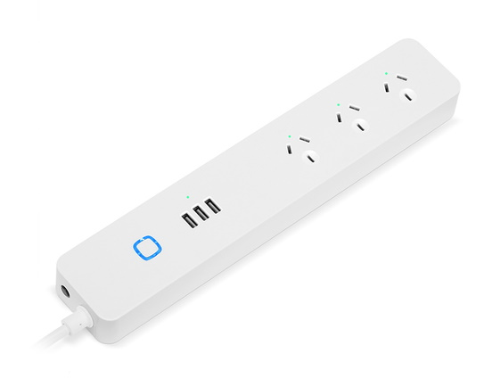

  

[https://www.kogan.com/au/buy/kogan-smarterhome-smart-power-board-with-usb-ports-energy-meter/](https://www.kogan.com/au/buy/kogan-smarterhome-smart-power-board-with-usb-ports-energy-meter/)

## GPIO Pinout

| Pin    | Function                   |
|--------|----------------------------|
| GPIO00 | Push Button                |
| GPIO01 | Green LED (Inverted: true) |
| GPIO13 | Relay 1                    |
| GPIO14 | Relay 2                    |
| GPIO03 | Relay 3                    |
| GPIO15 | Relay USB                  |
| GPIO12 | HLW8012 SEL Pin            |
| GPIO04 | HLW8012 CF Pin             |
| GPIO05 | HLW8012 CF1 Pin            |

**Note:** In the below configuration, the push button (and surrounding LED) is configured to only control Relay 3 (End Plug)

## Basic Config

```yaml
substitutions:
  device_name: kogan_strip_1
  device_ip: 192.168.x.x
  plug_icon: mdi:power-socket-au
  usb_icon: mdi:usb-port
  plug1_restore: ALWAYS_ON
  plug2_restore: ALWAYS_OFF
  plug3_restore: ALWAYS_OFF
  usb_restore: ALWAYS_ON
  
  # Higher value gives lower watt readout
  current_res: "0.00250"
  # Lower value gives lower voltage readout
  voltage_div: "799"

esphome:
  name: ${device_name}
  platform: ESP8266
  board: esp8285
  
# OTA flashing
ota:
  - platform: esphome

wifi: # Your Wifi network details
  
# Enable fallback hotspot in case wifi connection fails  
  ap:

# Enabling the logging component
logger:

# Enable Home Assistant API
api:

# Enable the captive portal
captive_portal:

web_server:
  port: 80
 
binary_sensor:
  - platform: gpio
    pin:
      number: GPIO0
      mode: INPUT_PULLUP
      inverted: true
    name: "${device_name}_button"
    on_press:
      - switch.toggle: relay3

  - platform: status
    name: "${device_name}_status"

switch:
  - platform: gpio
    id: green_led
    pin:
      number: GPIO1
      inverted: true
    restore_mode: ALWAYS_OFF

  - platform: gpio
    name: "${device_name}_plug1"
    pin: GPIO13
    id: relay1
    icon: ${plug_icon}
    restore_mode: ${plug1_restore}

  - platform: gpio
    name: "${device_name}_plug2"
    pin: GPIO14
    id: relay2
    icon: ${plug_icon}
    restore_mode: ${plug2_restore}

  - platform: gpio
    name: "${device_name}_plug3"
    pin: GPIO3
    id: relay3
    icon: ${plug_icon}
    restore_mode: ${plug3_restore}
    on_turn_on:
      - switch.turn_on: green_led
    on_turn_off:
      - switch.turn_off: green_led

  - platform: gpio
    name: "${device_name}_usb"
    pin: GPIO15
    id: relayusb
    icon: ${usb_icon}
    restore_mode: ${usb_restore}

sensor:
  - platform: hlw8012
    sel_pin:
      number: GPIO12
      inverted: true
    cf_pin: GPIO04
    cf1_pin: GPIO05
    current:
      name: "${device_name}_current"
      unit_of_measurement: A
    voltage:
      name: "${device_name}_voltage"
      unit_of_measurement: V
    power:
      id: ${device_name}_wattage
      name: "${device_name}_wattage"
      unit_of_measurement: W
    current_resistor: ${current_res}
    voltage_divider: ${voltage_div}
    change_mode_every: 8
    update_interval: 15s

  - platform: total_daily_energy
    name: "${device_name}_daily_energy"
    power_id: ${device_name}_wattage
    filters:
      - multiply: 0.001
    unit_of_measurement: kWh

  - platform: wifi_signal
    name: "${device_name}_rssi"
    update_interval: 5min

  - platform: uptime
    id: uptime_sec
    name: "${device_name}_uptime"
    update_interval: 5min

text_sensor:
  - platform: template
    name: "${device_name}_upformat"
    lambda: |-
      uint32_t dur = id(uptime_sec).state;
      int dys = 0;
      int hrs = 0;
      int mnts = 0;
      if (dur > 86399) {
        dys = trunc(dur / 86400);
        dur = dur - (dys * 86400);
      }
      if (dur > 3599) {
        hrs = trunc(dur / 3600);
        dur = dur - (hrs * 3600);
      }
      if (dur > 59) {
        mnts = trunc(dur / 60);
        dur = dur - (mnts * 60);
      }
      char buffer[17];
      sprintf(buffer, "%ud %02uh %02um %02us", dys, hrs, mnts, dur);
      return {buffer};
    icon: mdi:clock-start
    update_interval: 5min

time:
  - platform: homeassistant
    id: homeassistant_time
```
