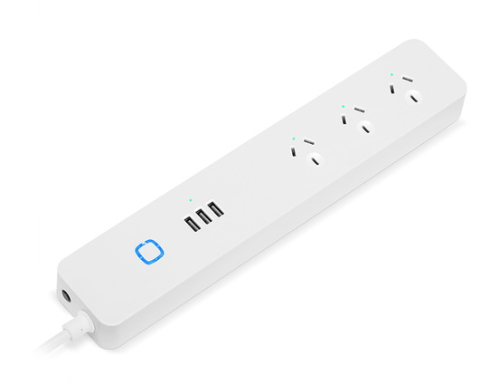
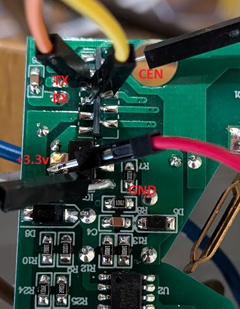

  

[Kogan SmarterHome™ Smart Power Board With USB Ports & Energy Meter - (KASPS30WACB) - Manual](https://help.kogan.com/s/article/Kogan-SmarterHome-30W-PD-Smart-Power-Board-with-Energy-Metre-3-Outlets-2-USB-C-Ports---KASPS30WACB---Manuals-and-Support)

## Programming Notes

**Warning** This board is mains powered. Do not do ANYTHING while the board is powered. 
Power the board via the 3.3v and GND pin and do not connect the board to the mains until you are fully disconnected and the board is fully reassembled.

To program the board you will need to disassemble the powerboard and solder jumper cables to the CEN, TX, RX, 3.3v and GND pins.
You will also need to bridge the CSN pin on the back of the module to GND (e.g back of the chip) to put the board into programming mode.



Attach 3.3v, GND, TX and RX to your serial adapter and tap CEN to GND while attempting to flash the board in ltchiptool.
It may take a couple attempts to get the timing right, but you should see the board flash and then disconnect the CEN-GND bridge after flashing is complete.

## GPIO Pinout

| Pin       | Function                     |
|-----------|------------------------------|
| P9 (TX1)  | BL0942 UART TX               |
| P10 (RX1) | BL0942 UART RX               |
| P6 (PWM0) | Port 1 relay                 |
| P7 (PWM1) | Port 2 relay                 |
| P26(PWM2) | Port 3 relay                 |
| P24(PWM4) | Push button                  |
| P8 (PWM5) | Status LED (inverted)        |

**Note:** The button and LED are not configured to do anything in this configuration, but they are included for completeness.

## Basic Config

```yaml
wifi:
  ssid: !secret wifi_ssid
  password: !secret wifi_password
  manual_ip:
    static_ip: 192.168.x.xx
    gateway: 192.168.x.x
    subnet: 255.255.255.0

# Enable logging
logger:

# Enable Home Assistant API
api:

ota:

esphome:
  name: powerboard
  platformio_options:
    build_flags:
      - -DLWIP_DHCP_DOES_ACD_CHECK=0

bk72xx:
  board: cb2s
  framework:
    version: latest
    debug:
      - WIFI


uart:
  tx_pin: "TX1"
  rx_pin:
    number: "RX1"
    mode:
      pullup: true
      input: true
  baud_rate: 4800

binary_sensor:
  - platform: gpio
    pin:
      number: "PWM4"
      mode:
        input: true
        pullup: true
      inverted: true
    name: "Button"

sensor:
  - platform: bl0942
    voltage:
      name: "BL0942 Voltage"
    current:
      name: "BL0942 Current"
    power:
      name: "BL0942 Power"
      filters:
        - multiply: -1
    energy:
      name: "BL0942 Energy"
    frequency:
      name: "BL0942 Frequency"

switch:
  - platform: gpio
    name: "Port 1"
    pin: "PWM0"
    restore_mode: RESTORE_DEFAULT_ON
  - platform: gpio
    name: "Port 2"
    pin: "PWM1"
    restore_mode: RESTORE_DEFAULT_ON
  - platform: gpio
    name: "Port 3"
    pin: "PWM2"
    restore_mode: RESTORE_DEFAULT_ON
  - platform: gpio
    name: "LED"
    pin: "PWM5"
    restore_mode: RESTORE_DEFAULT_ON
    inverted: true
```
