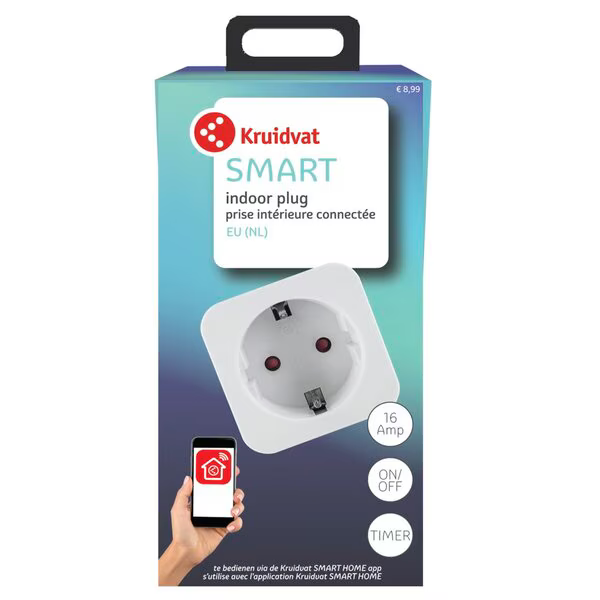
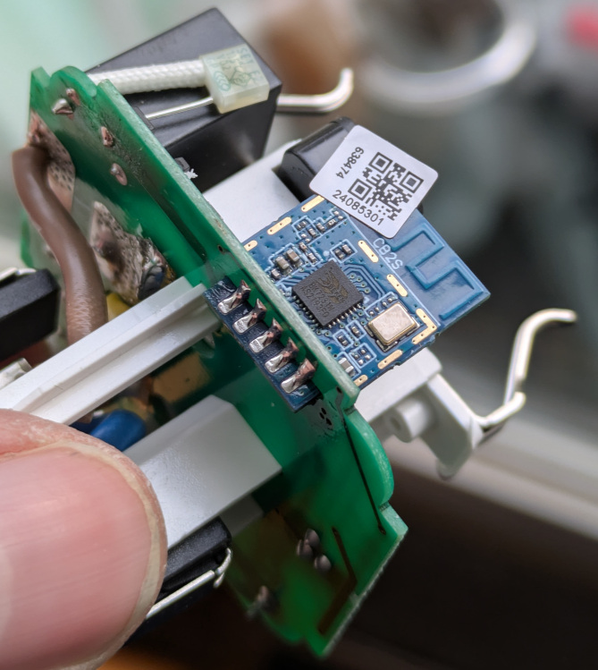
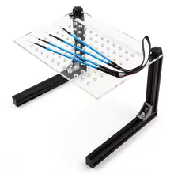

Bought at Kruidvat, a Dutch retailer, in the hope it could be flashed over the air. Alas the firmware is upgraded to 1.1.17 so tuya-cloudcutter could not flash it. I opened it up to see whether I would be able to determine what board and chip it used. The board turned out to be a CB2S containing a Beken BK7231N as shown in the following picture.



The board is connected to the main PCB with 11 pins, 5 on the outside (CEN, EDC, P8, P7, P6) and 6 on the inside (3v3, GND, RX1, TX1, P24, P26)

## Programming

Based on [available documentation](https://docs.libretiny.eu/) I assumed this chip can be programmed using OpenBeken tools using

- RX1 to receive data
- TX1 to transmit data
- CEN to trigger reset and programming mode.
The 3V3, GND, RX1 and TX1 pads are almost inaccessible due to the limited space between CB2S and relay-housing behind it. After some attempts to connect to those pins with the probes of my BDM-frame (picture below) I decided to desolder the CB2S from the main PCB for programming. 



After desoldering the board, I soldered a small wire to CEN, and taped the CB2S board with CEN down to my workbench, keeping it in place. This allowed me to put a BDM frame and probes on top of the board to connect to the 4 other pins: 3V3, GND, RX1 and TX1 without soldering. I used a 5th BDM probe to touch the wire soldered to CEN to make the chip enter programming mode. This required several attempts to get the timing correct (+- 1/4 of the second I had read online somewhere, or saw in a video).

I used an FT232RL USB(-C)-to-serial converter. As power supply (3v3) I used power out on my USB-to-serial converter. I flashed using [ltchiptool](https://docs.libretiny.eu/docs/flashing/tools/ltchiptool/) in a Python venv, which prevented the GUI from running. So I used the commandline. I was unable to find the commandline to dissect and analyze the factory firmware for settings however. To get the settings, I later used [bk7231tools](https://github.com/tuya-cloudcutter/bk7231tools) to dissect the factory firmware. This gave me a 'user_param_key.json' file which I could paste into [https://upk.libretiny.eu/](https://upk.libretiny.eu/) to generate a configuration for ESPHome. My advice for others (and next time) is to run [ltchiptool](https://docs.libretiny.eu/docs/flashing/tools/ltchiptool/) in a container to get a working GUI. Much easier.

## GPIO Pinout

| Pin   | Function          |
| ----- | ----------------- |
| P06   | relay             |
| P07   | switch (Inverted) |
| P08   | output LED        |
| P24   | unknown           |
| P26   | status LED        |

## Basic ESPHome config

Note this is only the device-specific part shown here - make sure to extend with your ESPHome-specific settings (such as wifi, passwords, OTA, etc...).

Note also the analysis of the firmware dump did not provide any indication of the On/Off delay needed to debounce the relay. This required some iterations to find out. With a smaller delay, Home Assistant would return the switch to the Off position shortly after turning it On, while it was still On in practice. Home Assistant would also not allow me to actually turn it off. That could only be done via the portal of the switch itself. The portal of the switch itself (http://smartplug.local in my case) would work correctly. With the 1 second delay as show in the configuration below, the Home Assistant 'bounce back' issue is gone.

```yaml
esphome:
  comment: "Kruidvat Smart indoor plug - Tuya SH.33.401"

bk72xx:
  board: cb2s

text_sensor:
  - platform: libretiny
    version:
      name: LibreTiny Version

output:
  - platform: libretiny_pwm
    id: output_led_1
    pin: P8

light:
  - platform: monochromatic
    id: light_switch_1
    output: output_led_1

switch:
  - platform: gpio
    id: switch_1
    name: Relay 1
    pin: P6
    on_turn_on:
      - light.turn_on: light_switch_1
    on_turn_off:
      - light.turn_off: light_switch_1

binary_sensor:
  - platform: gpio
    id: binary_switch_all
    pin:
      number: P7
      inverted: true
      mode: INPUT_PULLUP
    on_press:
      then:
        - switch.toggle: switch_1
    filters:
      - delayed_on_off: 1s

status_led:
  pin: P26
```
