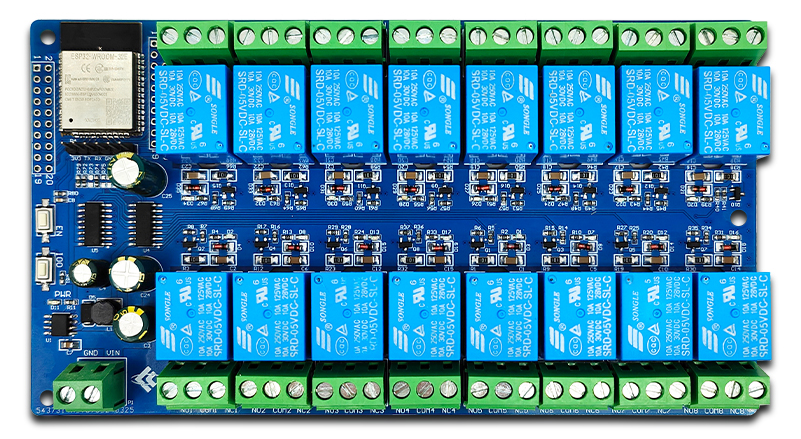

## Product description

This is a 16-relay board with an ESP32-WROOM-E and two 74HC595 shift registers.

Each relay has COM+NO+NC exposed. Each relay supports 10Amp max load (Songle SRD-05VDC-SL-C).

Many vendors advertise that this board can be powered with 5-12VDC.
The manufacturer LCTech literature lists it as a 5V product.

I bought it from: https://www.aliexpress.us/item/3256808359095569.html

LCTech Wiki page: http://www.chinalctech.com/cpzx/Programmer/Relay_Module/735.html

## Input voltage considerations

The XL1509-3.3 Converter supports up to 40V, but the 470uF input capacitor
(C3) is rated at 25V max on at least some variations of these boards.

The `Vin` supply is fed directly to the relay coils without any regulation or
conversion.  Voltages higher than 5V may lead to unacceptable power dissipation
or shortened relay life.

There does not appear to be any simple solution for reducing the voltage across
the relay coils.  A naive swap of the 1N4148 snubber diode for a 5V Zener will
lead to high power dissipation across the BJT.


📝 **NOTE:**

**The best course of action is to feed this board with 5V on
the VIN terminal.**

## Serial Progamming Pinout

This board has a 6 pin header for programming.
Some images show this header pre-installed.
My board shipped the 1x6 header separately and required soldering.
The silkscreen labeling of this header was clear on my board.
Does expose `GPIO0`, but does not route `EN` for automated flash support.

| Pin | Comment                                                            |
| --- | -------------------------------------------------------------------|
| 3V3 | Use 3.3V only                                                      |
| TX  | TTL / 3.3V Serial TX pin                                           |
| RX  | TTL / 3.3V Serial RX pin                                           |
| GND |                                                                    |
| GND |                                                                    |
| IO0 | GPIO0 pin also connected to pushbutton labeled IO0 for programming |

## GPIO Pinout

This board has two 2x10 headers which provide access to all GPIO pins on its ESP32.

⚠️ **CAUTION:**

The silkscreen labels on my board did not exactly match the
schematic or manual continuity tracing.

**Verify correct pinout prior to use!**

Header P3 is located closest to the board edge with odd numbered pins closest to the edge

| Pin | Comment                                                  |
| --- | -------------------------------------------------------- |
|  1  | GND                                                      |
|  2  | 3V3                                                      |
|  3  | SVP                                                      |
|  4  | EN Tied to button labeled EN                             |
|  5  | GPIO34                                                   |
|  6  | SVN                                                      |
|  7  | GPIO32                                                   |
|  8  | GPIO35                                                   |
|  9  | GPIO25                                                   |
| 10  | GPIO33                                                   |
| 11  | GPIO27                                                   |
| 12  | GPIO26                                                   |
| 13  | GPIO12 / RCK / 74HC595 RCLK                              |
| 14  | GPIO14 / SI / 74HC595 SER                                |
| 15  | SD2                                                      |
| 16  | GPIO13 / SCK / 74HC595 SRCLK                             |
| 17  | CMD                                                      |
| 18  | SD3                                                      |
| 19  | GND                                                      |
| 20  | 3V3                                                      |

Header P2 is located closest to the relay modules with odd numbered pins
closest to the board edge

| Pin | Comment                                                  |
| --- | -------------------------------------------------------- |
|  1  | GND                                                      |
|  2  | GPIO23                                                   |
|  3  | GPIO22                                                   |
|  4  | TX                                                       |
|  5  | RX                                                       |
|  6  | GPIO 21                                                  |
|  7  | GND                                                      |
|  8  | GPIO19                                                   |
|  9  | GPIO18                                                   |
| 10  | GPIO5 / G / 74HC595 OE                                   |
| 11  | GPIO17                                                   |
| 12  | GPIO16                                                   |
| 13  | GPIO4 / SCLR / 74HC595 SRCLR                             |
| 14  | GPIO0 Tied to button labeled IO0                         |
| 15  | GPIO2                                                    |
| 16  | GPIO15                                                   |
| 17  | SD1                                                      |
| 18  | SD0                                                      |
| 19  | CLK                                                      |
| 20  | 3V3                                                      |

## Basic Config

```yaml
esphome:
  name: ESP32 relayboard

esp32:
  board: esp32dev

# IO0 button can be configured as a binary_sensor
binary_sensor:
  - platform: gpio
    name: "button1"
    pin: GPIO0

# SPI or GPIO configuration of 74HC595 for access to relays
spi:
  - id: "spi_bus"
    clk_pin: GPIO13
    mosi_pin: GPIO14

sn74hc595:
  - id: "sn74hc595_hub"
    type: spi
    spi_id: "spi_bus"
    latch_pin: GPIO12
    oe_pin: GPIO5
    sr_count: 2

# 16 relay outputs, exposed as switches in Home Assistant
switch:
    - &common_relay
    platform: gpio
    id: "relay1"
    pin: &common_pin
      sn74hc595: "sn74hc595_hub"
      number: 0
  - <<: *common_relay
    id: "relay2"
    pin:
      <<: *common_pin
      number: 1
  - <<: *common_relay
    id: "relay3"
    pin:
      <<: *common_pin
      number: 2
  - <<: *common_relay
    id: "relay4"
    pin:
      <<: *common_pin
      number: 3
  - <<: *common_relay
    id: "relay5"
    pin:
      <<: *common_pin
      number: 4
  - <<: *common_relay
    id: "relay6"
    pin:
      <<: *common_pin
      number: 5
  - <<: *common_relay
    id: "relay7"
    pin:
      <<: *common_pin
      number: 6
  - <<: *common_relay
    id: "relay8"
    pin:
      <<: *common_pin
      number: 7
  - <<: *common_relay
    id: "relay9"
    pin:
      <<: *common_pin
      number: 8
  - <<: *common_relay
    id: "relay10"
    pin:
      <<: *common_pin
      number: 9
  - <<: *common_relay
    id: "relay11"
    pin:
      <<: *common_pin
      number: 10
  - <<: *common_relay
    id: "relay12"
    pin:
      <<: *common_pin
      number: 11
  - <<: *common_relay
    id: "relay13"
    pin:
      <<: *common_pin
      number: 12
  - <<: *common_relay
    id: "relay14"
    pin:
      <<: *common_pin
      number: 13
  - <<: *common_relay
    id: "relay15"
    pin:
      <<: *common_pin
      number: 14
  - <<: *common_relay
    id: "relay16"
    pin:
      <<: *common_pin
      number: 15
```
