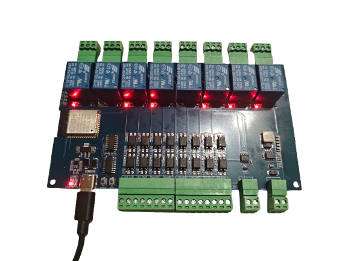

This is an 8-relay board with an ESP32-WROOM-32E using 74HC595 (outputs)
and 74HC165 (inputs) shift registers on a **shared bus**.

Each relay has COM+NO+NC exposed and supports 10Amp max load.

## ⚠️ Important: Shared Bus Architecture

Unlike older ESP32 relay boards where each relay was connected to a
direct GPIO, this version uses shift registers with **shared Clock and
Latch lines**.

You cannot trigger relays by simply setting a GPIO to HIGH. You must
"shift out" the data through the shared bus.

## Why Lambda Instead of Standard ESPHome Components?

This board uses a **shared bus** architecture where 74HC595 (outputs) and
74HC165 (inputs) share the same Clock (GPIO26) and Latch (GPIO25) lines.

### The Problem

When using standard ESPHome components:

```yaml
sn74hc595:
  - id: relay_hub
    ...
sn74hc165:
  - id: input_hub
    ...
```

**Result:** Components interfere with each other. Relay 1 controls all
relays, inputs don't work.

### The Solution

Manual control via lambda with proper timing:

1. Write to 74HC595 (relays)
2. Read from 74HC165 (inputs)
3. Restore relay state after reading

```yaml
switch:
  - platform: template  # not gpio!
    lambda: return id(relay_state) & 0x01;
    turn_on_action:
      - lambda: id(relay_state) |= 0x01;
      - script.execute: write_relays
```

## GPIO Pinout

| GPIO | Function | Chip Pin |
|------|----------|----------|
| GPIO13 | OE (Enable, Active LOW) | 74HC595 pin 13 |
| GPIO25 | LATCH (shared) | 74HC595 pin 12, 74HC165 pin 1 |
| GPIO26 | CLOCK (shared) | 74HC595 pin 11, 74HC165 pin 2 |
| GPIO27 | DATA IN | 74HC165 pin 9 |
| GPIO33 | DATA OUT | 74HC595 pin 14 |

## Relay Mapping (74HC595)

| Relay | Bit | Hex |
|-------|-----|-----|
| 1 | 0 | 0x01 |
| 2 | 1 | 0x02 |
| 3 | 2 | 0x04 |
| 4 | 3 | 0x08 |
| 5 | 4 | 0x10 |
| 6 | 5 | 0x20 |
| 7 | 6 | 0x40 |
| 8 | 7 | 0x80 |

## Input Mapping (74HC165)

| Input | Bit | Hex |
|-------|-----|-----|
| IN1 | 4 | 0x10 |
| IN2 | 3 | 0x08 |
| IN3 | 5 | 0x20 |
| IN4 | 2 | 0x04 |
| IN5 | 6 | 0x40 |
| IN6 | 1 | 0x02 |
| IN7 | 7 | 0x80 |
| IN8 | 0 | 0x01 |

## Optocoupled Inputs

- **Optocoupler:** P785 (PC817 compatible)
- **Series resistor:** 4.7kΩ (472)
- **Recommended voltage:** 12-24V DC (5V marginal)

| Voltage | Current | Status |
|---------|---------|--------|
| 5V | 0.8mA | ⚠️ Marginal |
| 12V | 2.3mA | ✅ OK |
| 24V | 4.9mA | ✅ Best |

### Wiring

```text
+12V/24V ──► INx
     GND ──► GND (near input)
```

### Optional indicator LED

```text
+12V/24V ──┬──► INx
           │
          LED + 1kΩ (for 12V) or 2.2kΩ (for 24V)
           │
          GND
```

## Boot Sequence

To prevent relay activation on power-up, the configuration uses two-stage boot:

| Stage | Priority | Action |
|-------|----------|--------|
| 1 | 900 | Set OE = HIGH (outputs disabled) |
| 2 | 600 | Wait 500ms, initialize pins, clear register, set OE = LOW |

## Basic Config

```yaml
esphome:
  name: ESP32 relayboard
  on_boot:
    - priority: 900
      then:
        - lambda: |-
            pinMode(13, OUTPUT);
            digitalWrite(13, HIGH);
    - priority: 600
      then:
        - delay: 500ms
        - lambda: |-
            pinMode(25, OUTPUT);
            pinMode(26, OUTPUT);
            pinMode(33, OUTPUT);
            pinMode(27, INPUT);
            digitalWrite(25, LOW);
            shiftOut(33, 26, MSBFIRST, 0xFF);
            digitalWrite(25, HIGH);
            digitalWrite(13, LOW);

esp32:
  board: esp32dev
  framework:
    type: arduino

globals:
  - id: relay_state
    type: uint8_t
    initial_value: '0'
  - id: input_state
    type: uint8_t
    initial_value: '0xFF'
  - id: last_input
    type: uint8_t
    initial_value: '0xFF'

script:
  - id: write_relays
    then:
      - lambda: |-
          digitalWrite(25, LOW);
          shiftOut(33, 26, MSBFIRST, ~id(relay_state));
          digitalWrite(25, HIGH);

interval:
  - interval: 100ms
    then:
      - lambda: |-
          digitalWrite(25, LOW);
          delayMicroseconds(10);
          digitalWrite(25, HIGH);

          uint8_t v = 0;
          for (int i = 0; i < 8; i++) {
            v <<= 1;
            if (digitalRead(27)) v |= 1;
            digitalWrite(26, HIGH);
            delayMicroseconds(2);
            digitalWrite(26, LOW);
            delayMicroseconds(2);
          }

          id(input_state) = v;
          uint8_t pressed = (v ^ id(last_input)) & ~v;

          if (pressed & 0x10) id(relay1).toggle();
          if (pressed & 0x08) id(relay2).toggle();
          if (pressed & 0x20) id(relay3).toggle();
          if (pressed & 0x04) id(relay4).toggle();
          if (pressed & 0x40) id(relay5).toggle();
          if (pressed & 0x02) id(relay6).toggle();
          if (pressed & 0x80) id(relay7).toggle();
          if (pressed & 0x01) id(relay8).toggle();

          id(last_input) = v;

          digitalWrite(25, LOW);
          shiftOut(33, 26, MSBFIRST, ~id(relay_state));
          digitalWrite(25, HIGH);

switch:
  - platform: template
    name: "Relay 1"
    id: relay1
    restore_mode: ALWAYS_OFF
    lambda: return id(relay_state) & 0x01;
    turn_on_action:
      - lambda: id(relay_state) |= 0x01;
      - script.execute: write_relays
    turn_off_action:
      - lambda: id(relay_state) &= ~0x01;
      - script.execute: write_relays

  - platform: template
    name: "Relay 2"
    id: relay2
    restore_mode: ALWAYS_OFF
    lambda: return id(relay_state) & 0x02;
    turn_on_action:
      - lambda: id(relay_state) |= 0x02;
      - script.execute: write_relays
    turn_off_action:
      - lambda: id(relay_state) &= ~0x02;
      - script.execute: write_relays

  - platform: template
    name: "Relay 3"
    id: relay3
    restore_mode: ALWAYS_OFF
    lambda: return id(relay_state) & 0x04;
    turn_on_action:
      - lambda: id(relay_state) |= 0x04;
      - script.execute: write_relays
    turn_off_action:
      - lambda: id(relay_state) &= ~0x04;
      - script.execute: write_relays

  - platform: template
    name: "Relay 4"
    id: relay4
    restore_mode: ALWAYS_OFF
    lambda: return id(relay_state) & 0x08;
    turn_on_action:
      - lambda: id(relay_state) |= 0x08;
      - script.execute: write_relays
    turn_off_action:
      - lambda: id(relay_state) &= ~0x08;
      - script.execute: write_relays

  - platform: template
    name: "Relay 5"
    id: relay5
    restore_mode: ALWAYS_OFF
    lambda: return id(relay_state) & 0x10;
    turn_on_action:
      - lambda: id(relay_state) |= 0x10;
      - script.execute: write_relays
    turn_off_action:
      - lambda: id(relay_state) &= ~0x10;
      - script.execute: write_relays

  - platform: template
    name: "Relay 6"
    id: relay6
    restore_mode: ALWAYS_OFF
    lambda: return id(relay_state) & 0x20;
    turn_on_action:
      - lambda: id(relay_state) |= 0x20;
      - script.execute: write_relays
    turn_off_action:
      - lambda: id(relay_state) &= ~0x20;
      - script.execute: write_relays

  - platform: template
    name: "Relay 7"
    id: relay7
    restore_mode: ALWAYS_OFF
    lambda: return id(relay_state) & 0x40;
    turn_on_action:
      - lambda: id(relay_state) |= 0x40;
      - script.execute: write_relays
    turn_off_action:
      - lambda: id(relay_state) &= ~0x40;
      - script.execute: write_relays

  - platform: template
    name: "Relay 8"
    id: relay8
    restore_mode: ALWAYS_OFF
    lambda: return id(relay_state) & 0x80;
    turn_on_action:
      - lambda: id(relay_state) |= 0x80;
      - script.execute: write_relays
    turn_off_action:
      - lambda: id(relay_state) &= ~0x80;
      - script.execute: write_relays

binary_sensor:
  - platform: template
    name: "Input 1"
    lambda: return !(id(input_state) & 0x10);

  - platform: template
    name: "Input 2"
    lambda: return !(id(input_state) & 0x08);

  - platform: template
    name: "Input 3"
    lambda: return !(id(input_state) & 0x20);

  - platform: template
    name: "Input 4"
    lambda: return !(id(input_state) & 0x04);

  - platform: template
    name: "Input 5"
    lambda: return !(id(input_state) & 0x40);

  - platform: template
    name: "Input 6"
    lambda: return !(id(input_state) & 0x02);

  - platform: template
    name: "Input 7"
    lambda: return !(id(input_state) & 0x80);

  - platform: template
    name: "Input 8"
    lambda: return !(id(input_state) & 0x01);

  - platform: status
    name: "Status"

```
