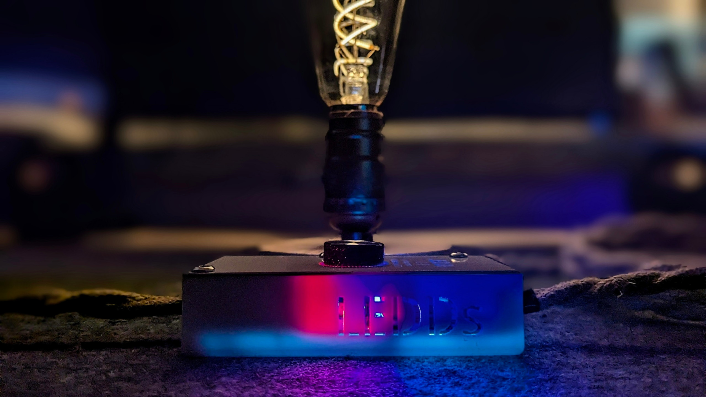
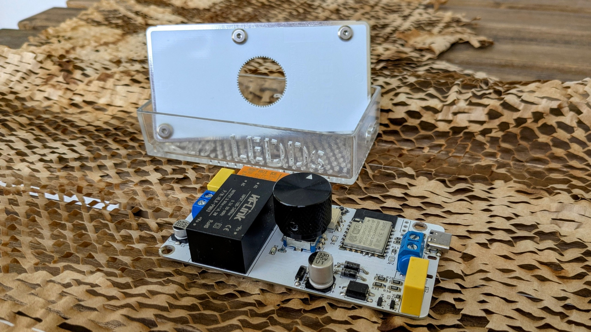

## Overview

**LEDDs** is an open-hardware, DIY, **trailing-edge** dimmer designed specifically for dimmable LED bulbs.
It is intended for DIY users who have experience with mains-powered electronics.

## Hardware

The project is fully open source, including:

- schematics and PCB files
- 3D printable enclosure



- **MCU module:** ESP32-C3-12F
- **Mains voltage:** 230 V AC, 50Hz
- **Dimming method:** trailing-edge phase cut
- **Load type:** dimmable LED bulbs (capacitive)

> ⚠️ **Warning:**
> This device operates at **mains voltage**. Building and using it requires experience with high-voltage electronics.
> Improper assembly can result in serious injury, fire, or equipment damage.

## ESPHome configuration

LEDDs is configured using ESPHome and exposes itself as a dimmable light entity.
Complete ESPHome YAML configurations are provided in the project repository: [https://github.com/VasilKalchev/LEDDs/tree/main/fw/esphome/yaml](https://github.com/VasilKalchev/LEDDs/tree/main/fw/esphome/yaml).

### Example, trimmed configuration for Home Assistant

```yaml
substitutions:
  device_friendly_name: "LEDDs 2"

  # user configuration
  dim_step: 6.25  # 10 % | 6.25 %
  gamma_correct: 2.2
  minimum_level: 15 %
  restore_mode: ALWAYS_OFF  # ALWAYS_OFF | ALWAYS_ON
  transition_length: 300 ms
  feedback_blink_length: 40 ms

  # IDs
  light_id: dimmer_light
  ac_dimmer_id: ac_dimmer_output
  rotary_encoder_id: rotary_encoder_sensor
  rotary_encoder_btn_id: rotary_encoder_btn_sensor
  feedback_led_id: red_led

  # pinout
  led_2_pin: GPIO2
  zc_pin: GPIO3
  re_b_pin: GPIO4
  re_a_pin: GPIO5
  led_1_pin: GPIO6
  gate_pin: GPIO7
  led_3_pin: GPIO8
  re_btn_pin: GPIO9
  relay_pin: GPIO10


esphome:
  name: "ledds2"
  friendly_name: ${device_friendly_name}
  comment: "trailing edge dimmer"
  project:
    name: "VasilKalchev.LEDDs"
    version: "2.0"

esp32:
  variant: esp32c3
  framework:
    type: esp-idf
    version: recommended

logger:
    level: WARN

wifi:
  ap:

captive_portal:

improv_serial:
  next_url: https://github.com/VasilKalchev/LEDDs/tree/v2.0

ota:
  platform: esphome
  on_begin:
    then:
      - output.turn_off:
          id: ${ac_dimmer_id}

api:

# =====

light:
  - platform: monochromatic
    id: ${light_id}
    name: "Bulb"
    output: ${ac_dimmer_id}
    icon: "mdi:lightbulb-variant"
    default_transition_length: ${transition_length}
    gamma_correct: ${gamma_correct}
    restore_mode: ${restore_mode}
    effects:
        - pulse:
            name: "Pulse (low, fast)"
            transition_length: 4s
            update_interval: 4s
            min_brightness: 1%
            max_brightness: 50%
        - pulse:
            name: "Pulse (low, slow)"
            transition_length: 7s
            update_interval: 7s
            min_brightness: 1%
            max_brightness: 50%
        - pulse:
            name: "Pulse (high, fast)"
            transition_length: 4s
            update_interval: 4s
            min_brightness: 50%
            max_brightness: 100%
        - pulse:
            name: "Pulse (high, slow)"
            transition_length: 7s
            update_interval: 7s
            min_brightness: 50%
            max_brightness: 100%
        - pulse:
            name: "Pulse (full, fast)"
            transition_length: 3s
            update_interval: 3s
            min_brightness: 1%
            max_brightness: 100%
        - pulse:
            name: "Pulse (full, slow)"
            transition_length: 10s
            update_interval: 10s
            min_brightness: 1%
            max_brightness: 100%
        - flicker:
            name: "Flicker (soft)"
            alpha: 85%
            intensity: 3%
        - flicker:
            name: "Flicker (intense)"
            alpha: 85%
            intensity: 4%


  - platform: monochromatic
    id: red_led
    name: "LED: red"
    output: led1
    icon: "mdi:led-outline"
    entity_category: "config"
    default_transition_length: 1000 ms
    restore_mode: RESTORE_DEFAULT_ON
    initial_state:
      state: on
      brightness: 100 %

  - platform: monochromatic
    id: blue_led
    name: "LED: blue"
    output: led2
    icon: "mdi:led-outline"
    entity_category: "config"
    default_transition_length: 1000 ms
    restore_mode: RESTORE_DEFAULT_ON
    initial_state:
      state: on
      brightness: 100 %

  - platform: monochromatic
    id: white_led
    name: "LED: white"
    output: led3
    icon: "mdi:led-outline"
    entity_category: "config"
    default_transition_length: 1000 ms
    restore_mode: RESTORE_DEFAULT_ON
    initial_state:
      state: on
      brightness: 100 %


  - platform: status_led
    id: blue_status_led
    pin:
      number: ${led_1_pin}
      allow_other_uses: true


sensor:
  - platform: rotary_encoder
    id: ${rotary_encoder_id}
    name: "Knob"
    icon: "mdi:knob"
    internal: true
    pin_a: ${re_a_pin}
    pin_b: ${re_b_pin}
    min_value: -1
    max_value: 1
    publish_initial_value: true
    restore_mode: ALWAYS_ZERO
    filters:
      - debounce: 20 ms
    on_clockwise:
      then:
        - if:
            condition:
              - binary_sensor.is_off: ${rotary_encoder_btn_id}
            then:
              - script.execute:
                  id: feedback_blink
                  condition: !lambda 'return id(${light_id}).remote_values.get_brightness() < 1.0;'
              - light.dim_relative:
                  id: ${light_id}
                  relative_brightness: ${dim_step} %
                  transition_length: 0 ms
            else:
              - script.execute:
                  id: feedback_blink
                  condition: !lambda 'return id(${light_id}).get_current_effect_index() < (uint32_t)id(${light_id}).get_effect_count();'
              - script.execute:
                  id: walk_effects
                  forward: true

    on_anticlockwise:
      then:
        - if:
            condition:
              - binary_sensor.is_off: ${rotary_encoder_btn_id}
            then:
              - script.execute:
                  id: feedback_blink
                  condition: !lambda 'return id(${light_id}).remote_values.get_state() > 0.0;'
              - light.dim_relative:
                  id: ${light_id}
                  relative_brightness: !lambda 'return (${dim_step} * -1) / 100.0;'
                  transition_length: 0 ms
            else:
              - script.execute:
                  id: feedback_blink
                  condition: !lambda 'return id(${light_id}).get_current_effect_index() > 0;'
              - script.execute:
                  id: walk_effects
                  forward: false

binary_sensor:
  - platform: gpio
    id: ${rotary_encoder_btn_id}
    name: "Knob button"
    internal: true
    pin:
      number: ${re_btn_pin}
      inverted: true
      ignore_strapping_warning: true
    entity_category: diagnostic
    use_interrupt: true
    interrupt_type: ANY
    filters:
      - delayed_on_off: 10 ms
    on_click:
      min_length: 50 ms
      max_length: 500 ms
      then:
        - light.toggle:
            id: ${light_id}

button:
  - platform: restart
    id: restart_button
    name: "Restart"
    entity_category: config
    device_class: restart

text_sensor:
  - platform: version
    name: "ESPHome version"
    hide_timestamp: true


power_supply:
  - id: ac_live
    pin:
      number: ${relay_pin}
      inverted: false
    enable_time: 100 ms
    keep_on_time: 500 ms
    enable_on_boot: false

output:
  - platform: ac_dimmer
    id: ${ac_dimmer_id}
    gate_pin:
      number: ${gate_pin}
      inverted: yes
    zero_cross_pin:
      number: ${zc_pin}
      inverted: no
      mode:
        input: true
    method: trailing
    init_with_half_cycle: true
    zero_means_zero: true
    min_power: ${minimum_level}
    max_power: 100 %
    power_supply: ac_live

  - platform: ledc
    id: led1
    pin:
      number: ${led_1_pin}
      allow_other_uses: true
    frequency: 200 Hz
  - platform: ledc
    id: led2
    frequency: 200 Hz
    pin:
      number: ${led_2_pin}
      ignore_strapping_warning: true
  - platform: ledc
    id: led3
    frequency: 200 Hz
    pin:
      number: ${led_3_pin}
      ignore_strapping_warning: true


script:
  - id: walk_effects
    parameters:
      forward: bool
    then:
      - light.turn_on:
          id: ${light_id}
          effect: !lambda |-
            size_t const effects_count = id(${light_id}).get_effect_count();
            ESP_LOGV("walk_effects", "effects count: %d\n", effects_count);

            uint32_t effect_ndx = id(${light_id}).get_current_effect_index();
            ESP_LOGV("walk_effects", "effect ndx: %d (%s)\n", effect_ndx, id(${light_id}).get_effect_name_by_index(effect_ndx).c_str());

            if (forward == true) {
              if (effect_ndx < effects_count) {
                effect_ndx += 1;
              }
            } else {
              if (effect_ndx > 0) {
                effect_ndx -= 1;
              }
            }
            ESP_LOGV("walk_effects", "new ndx: %d (%s)\n", effect_ndx, id(${light_id}).get_effect_name_by_index(effect_ndx).c_str());

            return id(${light_id}).get_effect_name_by_index(effect_ndx);

  - id: feedback_blink
    parameters:
      condition: bool
    then:
      - if:
          condition:
            lambda: 'return condition == true;'
          then:
            - light.toggle:
                id: ${feedback_led_id}
                transition_length: 0 s
            - delay: ${feedback_blink_length}
            - light.toggle:
                id: ${feedback_led_id}
                transition_length: 0 s


```

## Installation

This device is **not pre-flashed** and **not commercially available**.

To use it you must:

1. Build the hardware yourself
2. Flash the ESP32 using ESPHome
3. Configure and calibrate dimming parameters

Refer to the project documentation for detailed build and setup instructions.
