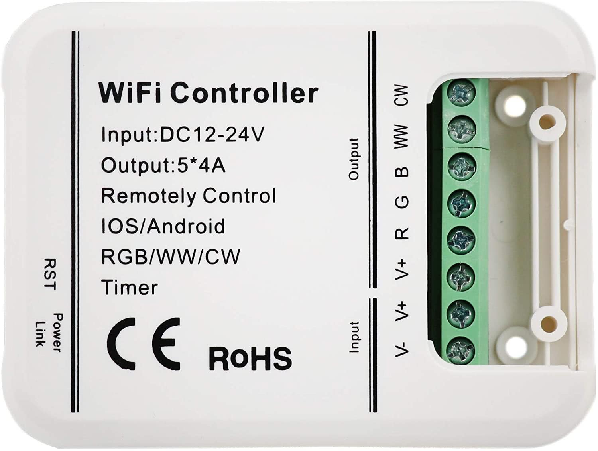

## General Notes

LEDENET Smart WiFi LED controller compatible with MagicHome.

Manufacturer: [LEDENET](http://www.ledenet.com/products/smart-wifi-led-controller-5-channels-control-4a5ch-cwww-rgb-rgbw-rgbww-led-light-timer-music-group-sync-controller/)



## GPIO Pinout

| Pin    | Function           |
| ------ | ------------------ |
| GPIO0  | Reset Button       |
| GPIO2  | Link LED (Green)   |
| GPIO14 | Red Channel        |
| GPIO12 | Green Channel      |
| GPIO13 | Blue Channel       |
| GPIO5  | Cold White Channel |
| GPIO15 | Warm White Channel |

## RGB/WW/CW Config

```yaml
substitutions:
  device_name: "magichome5ch"
  friendly_name: "Magic Home RGB/WW/CW"
  cold_temp: 6536 K
  warm_temp: 2000 K

esphome:
  name: ${device_name}
  platform: ESP8266
  board: esp8285
  
# OTA flashing
ota:
  - platform: esphome

wifi: # Your Wifi network details
  
# Enable fallback hotspot in case wifi connection fails  
  ap:

# Enabling the logging component
logger:

# Enable Home Assistant API
api:

# Enable the captive portal
captive_portal:

web_server:
  port: 80

status_led:
  pin:
    number: GPIO2
    inverted: true

binary_sensor:
  - platform: gpio
    name: "${device_name} Reset Button"
    id: button
    pin:
      number: GPIO0
      inverted: true

light:
  - platform: rgbww
    name: ${friendly_name}
    id: ${device_name}
    red: red_channel
    green: green_channel
    blue: blue_channel
    cold_white: cold_white_channel
    warm_white: warm_white_channel
    cold_white_color_temperature: ${cold_temp}
    warm_white_color_temperature: ${warm_temp}

output:
  - platform: esp8266_pwm
    id: red_channel
    pin: GPIO14
  - platform: esp8266_pwm
    id: green_channel
    pin: GPIO12
  - platform: esp8266_pwm
    id: blue_channel
    pin: GPIO13
  - platform: esp8266_pwm
    id: cold_white_channel
    pin: GPIO5
  - platform: esp8266_pwm
    id: warm_white_channel
    pin: GPIO15
```

## RGBW Config

```yaml
substitutions:
  device_name: "magichome5ch"
  friendly_name: "Magic Home RGB/WW/CW"

esphome:
  name: ${device_name}
  platform: ESP8266
  board: esp8285
  
# OTA flashing
ota:
  - platform: esphome

wifi: # Your Wifi network details
  
# Enable fallback hotspot in case wifi connection fails  
  ap:

# Enabling the logging component
logger:

# Enable Home Assistant API
api:

# Enable the captive portal
captive_portal:

web_server:
  port: 80

status_led:
  pin:
    number: GPIO2
    inverted: true

binary_sensor:
  - platform: gpio
    name: "${device_name} Reset Button"
    id: button
    pin:
      number: GPIO0
      inverted: true

light:
  - platform: rgbw
    name: ${friendly_name}
    id: ${device_name}
    red: red_channel
    green: green_channel
    blue: blue_channel
    white: cold_white_channel
    color_interlock: true

output:
  - platform: esp8266_pwm
    id: red_channel
    pin: GPIO14
  - platform: esp8266_pwm
    id: green_channel
    pin: GPIO12
  - platform: esp8266_pwm
    id: blue_channel
    pin: GPIO13
  - platform: esp8266_pwm
    id: cold_white_channel
    pin: GPIO5
  - platform: esp8266_pwm
    id: warm_white_channel
    pin: GPIO15
```

## RGB Config

```yaml
substitutions:
  device_name: "magichome5ch"
  friendly_name: "Magic Home RGB/WW/CW"

esphome:
  name: ${device_name}
  platform: ESP8266
  board: esp8285
  
# OTA flashing
ota:
  - platform: esphome

wifi: # Your Wifi network details
  
# Enable fallback hotspot in case wifi connection fails  
  ap:

# Enabling the logging component
logger:

# Enable Home Assistant API
api:

# Enable the captive portal
captive_portal:

web_server:
  port: 80

status_led:
  pin:
    number: GPIO2
    inverted: true

binary_sensor:
  - platform: gpio
    name: "${device_name} Reset Button"
    id: button
    pin:
      number: GPIO0
      inverted: true

light:
  - platform: rgb
    name: ${friendly_name}
    id: ${device_name}
    red: red_channel
    green: green_channel
    blue: blue_channel

output:
  - platform: esp8266_pwm
    id: red_channel
    pin: GPIO14
  - platform: esp8266_pwm
    id: green_channel
    pin: GPIO12
  - platform: esp8266_pwm
    id: blue_channel
    pin: GPIO13
  - platform: esp8266_pwm
    id: cold_white_channel
    pin: GPIO5
  - platform: esp8266_pwm
    id: warm_white_channel
    pin: GPIO15
```
