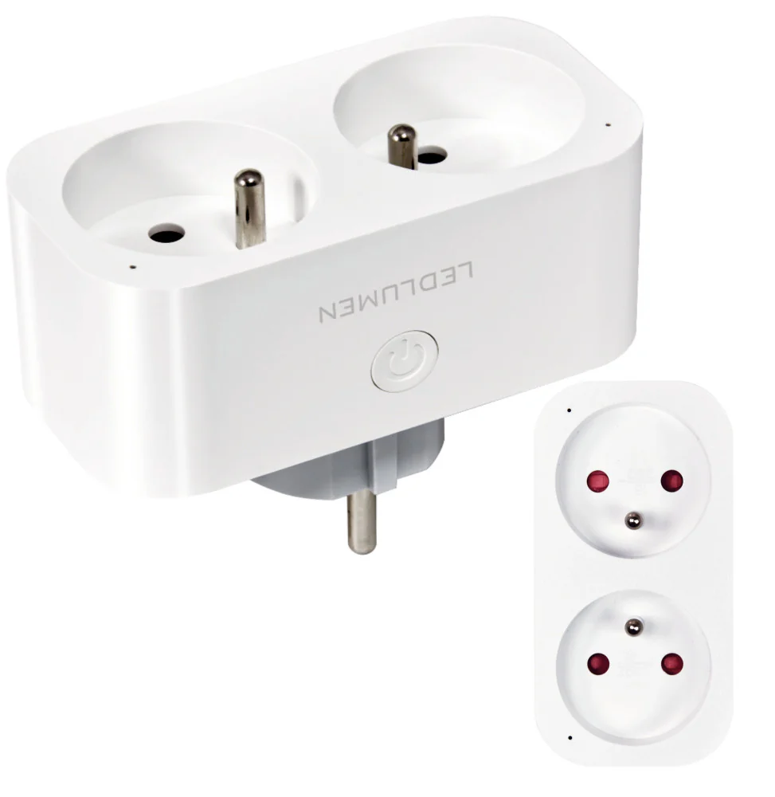

## Product Images



## GPIO Pinout

| Pin | Function      |
| --- | ------------- |
| P6  | Switch button |
| P7  | CF pin        |
| P8  | CF1 pin       |
| P10 | Status LED    |
| P23 | SEL pin       |
| P24 | Relay 2       |
| P26 | Relay 1       |

## Basic configuration

```yml
esphome:
  name: ledlumen-sp03

bk72xx:
  board: cb2s
  
# OTA flashing
ota:
  - platform: esphome

wifi: # Your Wifi network details
  
# Enable fallback hotspot in case wifi connection fails  
  ap:

# Enabling the logging component
logger:

# Enable Home Assistant API
api:

# Enable the captive portal
captive_portal:

web_server:

text_sensor:
  - platform: libretiny
    version:
      name: LibreTiny Version

binary_sensor:
  - platform: gpio
    id: binary_switch_1
    pin:
      number: P6
      inverted: true
      mode: INPUT_PULLUP

switch:
  - platform: gpio
    id: switch_1
    name: Relay 1
    pin: P26
  - platform: gpio
    id: switch_2
    name: Relay 2
    pin: P24

status_led:
  pin:
    number: P10
    inverted: true

sensor:
  - platform: hlw8012
    model: BL0937
    cf_pin:
      number: P7
      inverted: true
    cf1_pin:
      number: P8
      inverted: true
    sel_pin:
      number: P23
      inverted: true
    current:
      name: BL0937 Current
      filters:
        - multiply: 0.5
    voltage:
      name: BL0937 Voltage
    power:
      name: BL0937 Power
    energy:
      name: BL0937 Energy
    voltage_divider: 775
    current_resistor: 0.001 ohm
    update_interval: 1s
    change_mode_every: 1
```
