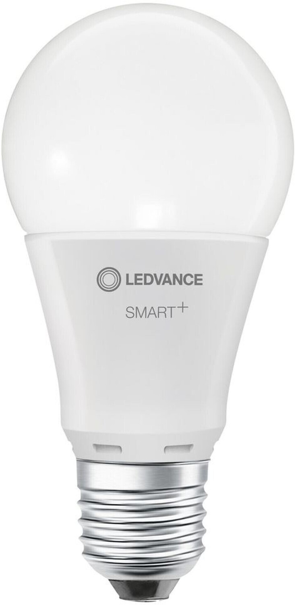

Product ID: AC33908

Can be flashed with esphome kickstart via [tuya-cloudcutter](https://github.com/tuya-cloudcutter/tuya-cloudcutter)!

## Product Images



## GPIO Pinout

| Function      | GPIO-Pin |
| ------------- | -------- |
| PWM_brighness | P9       |

## Basic Configuration

```yaml
esphome:
  name: ledvance-e27-dim
  comment: LEDVANCE E27 DIM Bulb
  friendly_name: LEDVANCE E27 DIM Bulb

bk72xx:
  board: generic-bk7231t-qfn32-tuya

# Make sure logging is not using the serial port
logger:
  baud_rate: 0

# Enable Home Assistant API
api:

ota:
  - platform: esphome

# WiFi connection
wifi:
  ap:

captive_portal:

# Enable Web server
web_server:

output:
  - platform: libretiny_pwm
    id: output_brightness
    pin: P9

light:
  - platform: monochromatic
    name: None
    output: output_brightness
    effects:
      - flicker:
          name: "Flicker"
      - pulse:
          name: "Pulse"
```
