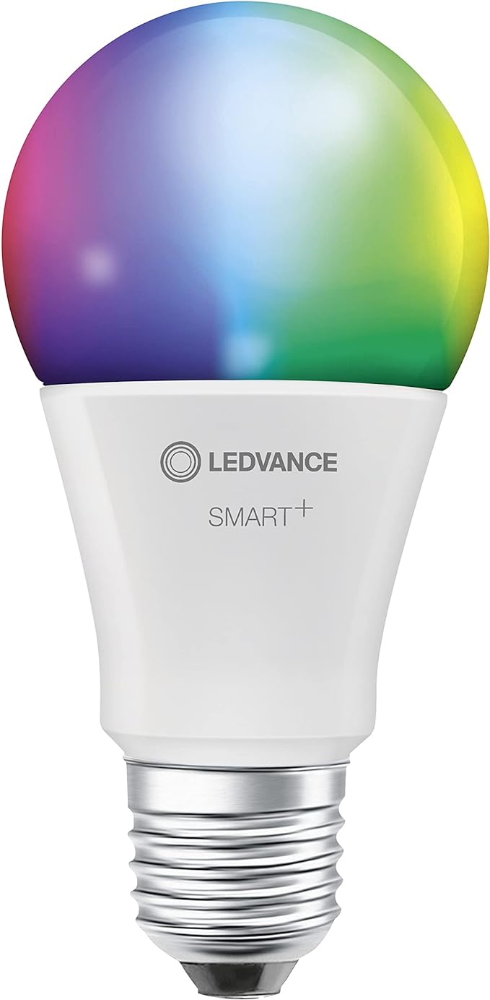

Product ID: AC33911

Can be flashed with esphome kickstart via [tuya-cloudcutter](https://github.com/tuya-cloudcutter/tuya-cloudcutter)!

## Product Images



## GPIO Pinout

| Function   | GPIO-Pin |
| ---------- | -------- |
| PWM_red    | P7       |
| PWM_green  | P8       |
| PWM_blue   | P9       |
| PWM_white  | P24      |

## Basic Configuration

```yaml
esphome:
  name: ledvance-e27-rgbw
  comment: LEDVANCE E27 RGBW Bulb
  friendly_name: LEDVANCE E27 RGBW Bulb

bk72xx:
  board: generic-bk7231t-qfn32-tuya

# Make sure logging is not using the serial port
logger:
  baud_rate: 0

# Enable Home Assistant API
api:

ota:
  - platform: esphome

# WiFi connection
wifi:
  ap:

captive_portal:

# Enable Web server
web_server:

output:
  - platform: libretiny_pwm
    id: output_green
    pin: P8
  - platform: libretiny_pwm
    id: output_blue
    pin: P9
  - platform: libretiny_pwm
    id: output_red
    pin: P7
  - platform: libretiny_pwm
    id: output_white
    pin: P24

light:
  - platform: rgbw
    id: light_rgbw
    name: None
    color_interlock: true
    red: output_red
    green: output_green
    blue: output_blue
    white: output_white
    effects:
      - random:
          name: "Random"
      - flicker:
          name: "Flicker"
```
