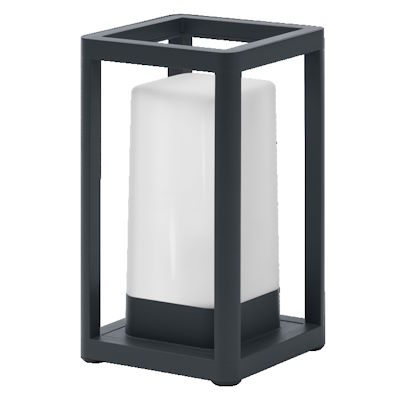
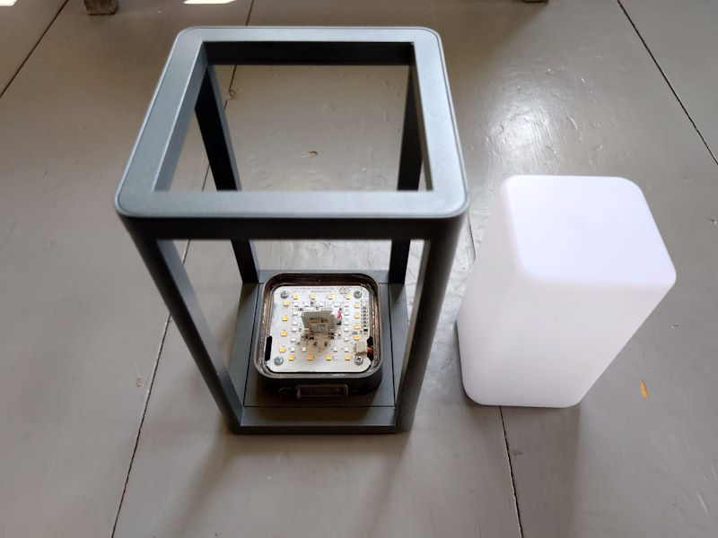
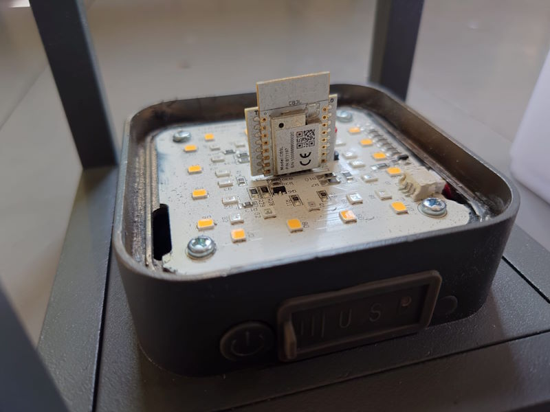

LEDVANCE SMART+ TABLE FRAME MULTICOLOR

## Product Details

- [SMART+ Wifi Frame Table Powerbank USB RGB + W](https://ledvance.com/en-int/home-lighting/products/smart-home/smart-luminaires/smart-outdoor-luminaires/smart-outdoor-table-luminaires/table-luminaire-rechargeable-via-usb-with-wifi-technology-c169539?productId=30539)
- GTIN/EAN 4058075564466



## GPIO Pinout

| Pin    | Function       |
| ------ | -------------- |
| GPIO7  | White Led PWM  |
| GPIO8  | Red Led PWM    |
| GPIO24 | Green Led PWM  |
| GPIO26 | Blue Led PWM   |

## Flashing Instructions

- Unknown if this light can be flashed without disassembly.
- Diffuser is glued/caulked in place, can be cleanly removed by clamping the base in a vise and applying force.
- cb3l module can be removed from base PCB for flashing using ltchiptool. See [flashing instructions](https://docs.libretiny.eu/docs/platform/beken-72xx/) at libretiny.





## Basic Configuration

```yaml
substitutions:
  device_name: light-table-frame

esphome:
  name: ${device_name}
  friendly_name: ${device_name}
  min_version: 2024.7.0

bk72xx:
  board: cb3l

logger:

api:

ota:

wifi:
  ssid: !secret wifi_ssid
  password: !secret wifi_password
  ap:

captive_portal:

# Custom PWM lookup table to allow for dimming at lowest level
# Every 1% increment is mapped to 10-bit pwm value.
globals:
  - id: pwm_lookup
    type: "std::vector<int>"
    initial_value: >-
      {0,1,2,3,4,5,6,7,8,9,10,11,12,13,14,15,16,17,18,19,20,
       21,22,23,25,27,29,31,33,35,37,39,41,43,45,48,51,54,57,
       60,63,66,69,73,77,81,85,89,94,99,104,109,114,120,126,
       132,138,145,152,159,167,175,183,192,201,211,221,231,242,
       253,265,277,290,304,318,333,348,364,381,399,417,436,456,
       477,499,522,546,571,597,624,653,683,714,747,781,817,854,
       893,934,977,1023}

# Define PWM output channels
output:
  - platform: template
    type: float
    id: output_white
    write_action:
      - lambda: |-
          float clamped_state = std::max(0.0f, std::min(1.0f, state));  // Clamp between 0 and 1
          int index = static_cast<int>(roundf(clamped_state * 100));  // Scale and round to nearest integer
          int pwm_value = id(pwm_lookup)[index];  // Get mapped value
          analogWriteResolution(10);
          analogWriteFrequency(1000);
          analogWrite(7, pwm_value);  // Directly write raw PWM value
  - platform: template
    type: float
    id: output_red
    write_action:
      - lambda: |-
          float clamped_state = std::max(0.0f, std::min(1.0f, state));  // Clamp between 0 and 1
          int index = static_cast<int>(roundf(clamped_state * 100));  // Scale and round to nearest integer
          int pwm_value = id(pwm_lookup)[index];  // Get mapped value
          analogWriteResolution(10);
          analogWriteFrequency(1000);
          analogWrite(8, pwm_value);  // Directly write raw PWM value
  - platform: template
    type: float
    id: output_green
    write_action:
      - lambda: |-
          float clamped_state = std::max(0.0f, std::min(1.0f, state));  // Clamp between 0 and 1
          int index = static_cast<int>(roundf(clamped_state * 100));  // Scale and round to nearest integer
          int pwm_value = id(pwm_lookup)[index];  // Get mapped value
          analogWriteResolution(10);
          analogWriteFrequency(1000);
          analogWrite(24, pwm_value);  // Directly write raw PWM value
  - platform: template
    type: float
    id: output_blue
    write_action:
      - lambda: |-
          float clamped_state = std::max(0.0f, std::min(1.0f, state));  // Clamp between 0 and 1
          int index = static_cast<int>(roundf(clamped_state * 100));  // Scale and round to nearest integer
          int pwm_value = id(pwm_lookup)[index];  // Get mapped value
          analogWriteResolution(10);
          analogWriteFrequency(1000);
          analogWrite(26, pwm_value);  // Directly write raw PWM value

light:
  - platform: rgbw
    name: "Light"
    red: output_red
    green: output_green
    blue: output_blue
    white: output_white
    restore_mode: RESTORE_AND_ON
    color_interlock: True
    gamma_correct: 1.0 # this is handled by custom lookup table

```