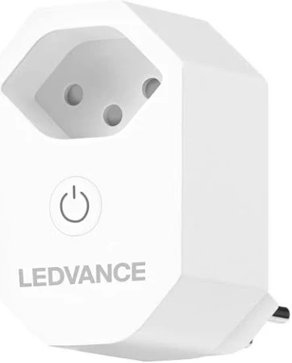

LEDVANCE SMART PLUS PLUG CH based on BK7231T chip (WB2S).
Can be flashed with esphome kickstart via tuya-cloudcutter.
On publish date you need to use ESP-Home beta to build bk72xx targets.
`voltage_divider` and `current_resistor` are estimated.

## Product Image



## GPIO Pinout

| Pin     | Function                           |
| ------- | ---------------------------------- |
| GPIO6   | Relay                              |
| GPIO7   | Button                             |
| GPIO10  | LED                                |
| GPIO11  | BBL0937SEL                         |
| GPIO24  | BL0937CF1                          |
| GPIO26  | BL0937CF                           |

## Basic Configuration

```yaml
# LEDVANCE SMART+ PLUG CH
substitutions:
  device_name: ledvance-pm-ch
  device_name_letters: ledvancepmch
  device_description: LEDVANCE SmartPlus Plug CH
  friendly_name: LEDVANCE SmartPlus Plug CH
  update_interval_seconds: "10s"

esphome:
  name: ${device_name}
  friendly_name: ${friendly_name}

# LibreTiny Platform
bk72xx:
  board: wb2s

# Enable logging
logger:

# Enable Web server
web_server:
  port: 80

# Enable Home Assistant API
api:
  encryption:
    key: <set here>

# Enable upload binaries over-the-air
ota:
  - platform: esphome
    password: <set here>

# Wifi Settings
wifi:
  ssid: <set here>
  password: <set here>

  # Enable fallback hotspot (captive portal) in case wifi connection fails
  ap:
    ssid: ${device_name}_fallback
    password: <set here>
captive_portal:

button:
  - platform: restart
    name: Restart ${device_name}

debug:
  update_interval: ${update_interval_seconds}

text_sensor:
  - platform: debug
    reset_reason:
      name: Reset Reason
  - platform: libretiny
    version:
      name: LibreTiny Version
  - platform: wifi_info
    ip_address:
      name: ESP IP Address
    ssid:
      name: ESP Connected SSID
    bssid:
      name: ESP Connected BSSID
    mac_address:
      name: ESP Mac Wifi Address

sensor:
  - platform: uptime
    name: Uptime
    unit_of_measurement: minutes
    filters:
      - lambda: return x / 60.0;

  - platform: wifi_signal
    name: Wifi Signal
    update_interval: 60s

  - platform: hlw8012
    model: BL0937
    cf_pin:
      number: P26
      inverted: true
    cf1_pin:
      number: P24
      inverted: true
    sel_pin:
      number: P11
      inverted: true
    current:
      name: BL0937 Current
    voltage:
      name: BL0937 Voltage
    power:
      name: BL0937 Power
    energy:
      name: BL0937 Energy
    update_interval: ${update_interval_seconds}
    voltage_divider: 800
    current_resistor: 0.001 ohm

binary_sensor:
  - platform: gpio
    id: binary_switch_1
    pin:
      number: P7
      inverted: true
      mode: INPUT_PULLUP
    on_press:
      then:
        - switch.toggle: switch_1

switch:
  - platform: gpio
    id: switch_1
    name: Relay 1
    pin: P6
    on_turn_on:
      - light.turn_on: light_status
    on_turn_off:
      - light.turn_off: light_status

light:
  - platform: status_led
    id: light_status
    pin: P10
```
