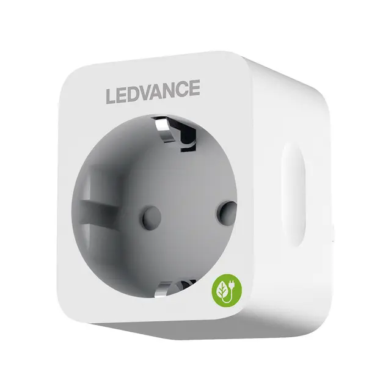

LEDVANCE SMART PLUS PLUG EU based on BK7231T chip (WB2S).
Can be flashed with esphome kickstart via tuya-cloudcutter.
On publish date you need to use ESP-Home beta to build bk72xx targets.
voltage_divider and current_resistor are estimated.

## Product Image



## GPIO Pinout

| Pin     | Function                           |
| ------- | ---------------------------------- |
| GPIO6   | Button                             |
| GPIO7   | BL0937CF                           |
| GPIO8   | BL0937CF1                          |
| GPIO10  | LED inverted                       |
| GPIO24  | Relay                              |
| GPIO26  | BBL0937SEL                         |

## Basic Configuration

```yaml
# LEDVANCE SMART+ PLUG EU
substitutions:
  device_name: ledvance-smart-plug
  device_name_letters: ledvancesmartplug
  device_description: LEDVANCE SmartPlus Plug
  friendly_name: LEDVANCE SmartPlus Plug
  update_interval_seconds: "30s"

esphome:
  name: ${device_name}
  comment: ${device_description}

bk72xx:
  board: wb2s
  
# OTA flashing
ota:
  - platform: esphome

wifi: # Your Wifi network details
  
# Enable fallback hotspot in case wifi connection fails  
  ap:

# Enabling the logging component
logger:

# Enable Home Assistant API
api:

# Enable the captive portal
captive_portal:

# Enable Web server
web_server:
  port: 80

# Sync time with Home Assistant
time:
  - platform: homeassistant
    id: homeassistant_time

text_sensor:
  - platform: wifi_info
    ip_address:
      name: ESP IP Address
    ssid:
      name: ESP Connected SSID
    bssid:
      name: ESP Connected BSSID
    mac_address:
      name: ESP Mac Wifi Address

light:
  - platform: status_led
    name: "led"
    internal: true
    id: led
    pin:
      number: P10
      inverted: true

binary_sensor:
  - platform: gpio
    pin:
      number: P6
      inverted: true
    id: button1
    filters:
      - delayed_on: 10ms
      - delayed_off: 10ms
    on_click:
      - switch.toggle: outlet

  - platform: status
    name: ${friendly_name} status

switch:
  - platform: gpio
    name: ${friendly_name} Outlet
    id: outlet
    pin: P24
    icon: mdi:power-socket-eu
    on_turn_on:
      - light.turn_on: led
    on_turn_off:
      - light.turn_off: led
  # Switch to restart the plug
  - platform: restart
    name: ${friendly_name} Restart Switch

#
# power monitoring
#
sensor:
    # PC191HA includes a BL0937 chip for measuring power consumption
    #     and BL0937 is a variation of hlw8012, but using inverted SEL pin functionality
  - platform: hlw8012
    model: BL0937     # note that the model must be specified to use special calculation parameters
    sel_pin:          # I believe that cf_pin reports either Voltage or Current depending on this select pin
      inverted: true  # determine whether true reports Voltage
      number: P26
    cf_pin:           # current or voltage (ele_pin: 7)
      inverted: true  # the logic of BL0937 is opposite from HLW8012
      number: P7
    cf1_pin:          #  Power (vi_pin: 8)
      inverted: true  # the logic of BL0937 is opposite from HLW8012
      number: P8
    update_interval: $update_interval_seconds # How often to measure and report values

    # PC191HA measures and returns Voltage OR Current according to the value of sel_pin,
    #     but it can change the value of sel_pin periodically
    initial_mode: "VOLTAGE"             # reports VOLTAGE or CURRENT
    change_mode_every: "4294967295"            # do NOT swap between reporting Volts or Amps (well, swap after 4000 years)
        #   reporting Voltage or Current. Note that the first value reported should be ignored as inaccurate

    # Adjust according to the actual resistor values on board to calibrate the specific unit
    voltage_divider:  "4456"               # LOWER VALUE GIVES LOWER VOLTAGE
    current_resistor: "0.00045"          # HIGHER VALUE GIVES LOWER WATTAGE

# how the power monitoring values are returned to ESPHome
    voltage:
      name: $friendly_name Voltage
      id:   ${device_name_letters}_voltage
      unit_of_measurement: V
      accuracy_decimals: 1
      filters:
        - skip_initial: 2
    power:
      name: $friendly_name Power
      id:   ${device_name_letters}_power
      unit_of_measurement: W
      accuracy_decimals: 2
      filters:
        - skip_initial: 2

    # power is simply current x voltage -- except that the pc191ha doesn't follow that formula.
        # Setting current_resistor to give an accurate Amperage does NOT also give the correct Wattage
        # my work-around is to calculate current from power / voltage
  - platform: template  
    name: $friendly_name Current
    id:   ${device_name_letters}_current
    unit_of_measurement: A
    accuracy_decimals: 2
    update_interval: $update_interval_seconds
    lambda: |-
      return (id(${device_name_letters}_power).state / id(${device_name_letters}_voltage).state);
    filters:  
      - skip_initial: 5     # give time for data to settle to avoid NaN

  - platform: uptime
    name: ${friendly_name} Uptime
    unit_of_measurement: minutes
    filters:
      - lambda: return x / 60.0;

  - platform: wifi_signal
    name: ${friendly_name} Signal
    update_interval: 60s
```
