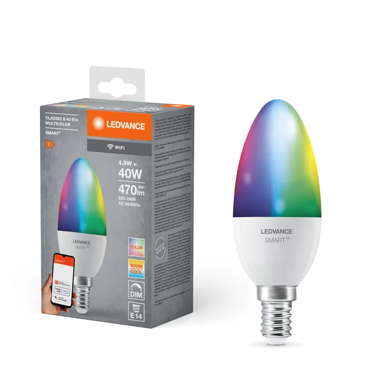

LEDVANCE SMART WIFI B40 based on BK7231T chip (WB2L) and using BP1658CJ led driver.
Can be flashed with esphome kickstart via tuya-cloudcutter.
Profile name: 1.0.3 - BK7231T / oem_bk7231s_light_ty_oldDp.

## Product Image



## GPIO Pinout

| Pin    | Function                           |
| ------ | ---------------------------------- |
| GPIO8  | BP1658CJ Data Pin  |
| GPIO9  | BP1658CJ Clock Pin          |

## Basic Configuration

```yaml
substitutions:
  devicename: ledvance-e14

esphome:
  name: $devicename
  friendly_name: ledvance-e14

bk72xx:
  board: generic-bk7231t-qfn32-tuya
  
# OTA flashing
ota:
  - platform: esphome

wifi: # Your Wifi network details
  
# Enable fallback hotspot in case wifi connection fails  
  ap:

# Enabling the logging component
logger:

# Enable Home Assistant API
api:

# Enable the captive portal
captive_portal:

button:
  - platform: restart
    name: Restart

debug:
  update_interval: 30s

text_sensor:
  - platform: debug
    reset_reason:
      name: Reset Reason

sensor:
  - platform: uptime
    name: Uptime

bp1658cj:
  clock_pin: P9
  data_pin: P8
  max_power_color_channels: 4
  max_power_white_channels: 3

output:
  - platform: bp1658cj
    id: output_red
    channel: 2
  - platform: bp1658cj
    id: output_green
    channel: 1
  - platform: bp1658cj
    id: output_blue
    channel: 0
  - platform: bp1658cj
    id: output_cold
    channel: 4
  - platform: bp1658cj
    id: output_warm
    channel: 3

light:
  - platform: rgbww
    id: light_rgbww
    name: Light
    color_interlock: true
    cold_white_color_temperature: 6500 K
    warm_white_color_temperature: 2700 K
    red: output_red
    green: output_green
    blue: output_blue
    cold_white: output_cold
    warm_white: output_warm
```
