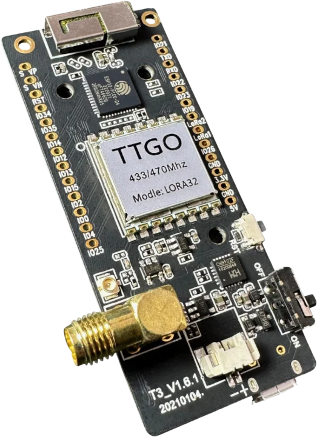

Model reference: T3 LoRa32 V1.6.1

Manufacturer: [LILYGO](https://lilygo.cc/)

## Product Description

The LILYGO T3 LoRa32 V1.6.1 is a development board featuring an ESP32 microcontroller with integrated
WiFi, Bluetooth, and a Semtech SX1276/SX1278 LoRa radio transceiver. It includes a 0.96" OLED display and is
designed for IoT applications requiring long-range wireless communication.

### Key Features

- ESP32 dual-core processor @ 240MHz
- 4MB Flash memory
- SX1276/SX1278 LoRa radio (433MHz or 868/915MHz variants)
- 0.96" OLED display (128x64)
- WiFi 802.11 b/g/n
- Bluetooth Classic and BLE
- Micro-USB connector
- LiPo battery connector with charging circuit
- SD card slot
- Onboard CP2104 USB-to-UART bridge

## GPIO Pinout

### LoRa SX127x Pins

| Function | GPIO |
|----------|------|
| SPI CLK  | GPIO5 |
| SPI MOSI | GPIO27 |
| SPI MISO | GPIO19 |
| CS       | GPIO18 |
| RST      | GPIO23 |
| DIO0     | GPIO26 |
| DIO2     | GPIO32 |

### Display (OLED)

| Function | GPIO |
|----------|------|
| SDA      | GPIO21 |
| SCL      | GPIO22 |
| RST      | GPIO16 |

### Other Pins

| Function | GPIO |
|----------|------|
| Button   | GPIO0 |
| LED      | GPIO25 |
| Battery ADC | GPIO35 |

## Basic Configuration

Minimum configuration required for the LILYGO TTGO T3 LoRa32 V1.6.1:

```yaml
esphome:
  name: "t3-lora32"

esp32:
  board: esp32dev
  cpu_frequency: 240MHZ
  framework:
    type: esp-idf

logger:

api:

ota:
  platform: esphome

wifi:
  ssid: !secret wifi_ssid
  password: !secret wifi_password

# SPI bus for LoRa radio
spi:
  clk_pin: GPIO5
  mosi_pin: GPIO27
  miso_pin: GPIO19

# I2C for OLED display
i2c:
  sda: GPIO21
  scl: GPIO22
```

## LoRa Radio Configuration

Complete configuration with LoRa modulation:

```yaml
# LoRa Radio Configuration (SX1276/SX1278)
sx127x:
  dio0_pin: GPIO26
  cs_pin: GPIO18
  rst_pin: GPIO23
  pa_pin: BOOST
  pa_power: 10
  bandwidth: 125_0kHz
  crc_enable: true
  frequency: 433920000
  modulation: LORA
  rx_start: true
  sync_value: 0x12
  preamble_size: 8
  spreading_factor: 7
  coding_rate: CR_4_6
  on_packet:
    then:
      - lambda: |-
          ESP_LOGD("lora", "Received packet RSSI: %.2f dBm, SNR: %.2f dB, Data: %s",
                   rssi, snr, format_hex(x).c_str());

# Example button to send LoRa packet
button:
  - platform: template
    name: "Send LoRa Packet"
    on_press:
      then:
        - sx127x.send_packet:
            data: [0xDE, 0xAD, 0xBE, 0xEF, 0xCA, 0xFE, 0xBA, 0xBE]
```

## FSK Modulation

Configuration for FSK modulation in packet mode:

```yaml
# FSK Radio Configuration (SX1276/SX1278)
sx127x:
  dio0_pin: GPIO26
  cs_pin: GPIO18
  rst_pin: GPIO23
  pa_pin: BOOST
  pa_power: 10
  bitrate: 4800
  bitsync: true
  crc_enable: true
  frequency: 433920000
  modulation: FSK
  packet_mode: true
  payload_length: 8
  rx_start: true
  sync_value: [0x33, 0x33]
  preamble_size: 4
  preamble_detect: 2
  on_packet:
    then:
      - lambda: |-
          ESP_LOGD("fsk", "Received packet: %s", format_hex(x).c_str());

# Example button to send FSK packet
button:
  - platform: template
    name: "Send FSK Packet"
    on_press:
      then:
        - sx127x.send_packet:
            data: [0xC5, 0x51, 0x78, 0x82, 0xB7, 0xF9, 0x9C, 0x5C]
```

## OOK Modulation with Remote Transmitter/Receiver

Configuration for OOK modulation in continuous mode using the remote transmitter and receiver components:

```yaml
# OOK Radio Configuration (SX1276/SX1278)
sx127x:
  cs_pin: GPIO18
  rst_pin: GPIO23
  frequency: 433920000
  modulation: OOK
  packet_mode: false
  bitsync: false
  rx_start: true
  bandwidth: 50_0kHz
  rx_floor: -85
  pa_pin: BOOST
  pa_power: 10

# Remote receiver on DIO2
remote_receiver:
  pin:
    number: GPIO32
    allow_other_uses: true
    mode:
      input: true
      output: true
      pullup: true
      open_drain: true
  filter: 50us
  dump: raw
  idle: 1ms
  tolerance: 100us

# Remote transmitter on DIO2 (shared with receiver)
remote_transmitter:
  pin:
    number: GPIO32
    allow_other_uses: true
    mode:
      input: true
      output: true
      pullup: true
      open_drain: true
  eot_level: false
  carrier_duty_percent: 100%
  on_transmit:
    then:
      - sx127x.set_mode_standby
      - remote_transmitter.digital_write: false
      - sx127x.set_mode_tx
  on_complete:
    then:
      - sx127x.set_mode_standby
      - remote_transmitter.digital_write: true
      - sx127x.set_mode_rx

# Example button to transmit OOK signal
button:
  - platform: template
    name: "Transmit OOK"
    on_press:
      then:
        - remote_transmitter.transmit_raw:
            code: [614, -614, 600, -614, 614, -614, 601, -614]
```

## OLED Display Configuration

Configuration to use the onboard 0.96" OLED display:

```yaml
# I2C for OLED display
i2c:
  sda: GPIO21
  scl: GPIO22
  frequency: 400kHz

# OLED Display
display:
  - platform: ssd1306_i2c
    model: "SSD1306 128x64"
    reset_pin: GPIO16
    address: 0x3C
    lambda: |-
      it.printf(0, 0, id(font), "T3 LoRa32");
      it.printf(0, 16, id(font), "V1.6.1");
      it.printf(0, 32, id(font), "%.1f dBm", id(wifi_signal_db).state);

font:
  - file: "gfonts://Roboto"
    id: font
    size: 14

sensor:
  - platform: wifi_signal
    id: wifi_signal_db
    name: "WiFi Signal"
    update_interval: 60s
```

## Battery Monitoring

Configuration to monitor LiPo battery voltage:

```yaml
sensor:
  - platform: adc
    pin: GPIO35
    name: "Battery Voltage"
    attenuation: 11db
    filters:
      - multiply: 2.0  # Voltage divider correction
    update_interval: 60s
```

## SD Card

The board includes an SD card slot on the following pins:

| Function | GPIO |
|----------|------|
| CS       | GPIO13 |
| MOSI     | GPIO15 |
| MISO     | GPIO2 |
| CLK      | GPIO14 |

## Links

- [Product Page](https://lilygo.cc/products/lora3)
- [GitHub Repository](https://github.com/Xinyuan-LilyGO/LilyGo-LoRa-Series)
- [Schematic](https://github.com/Xinyuan-LilyGO/LilyGo-LoRa-Series/blob/master/schematic/T3_V1.6.1.pdf)
