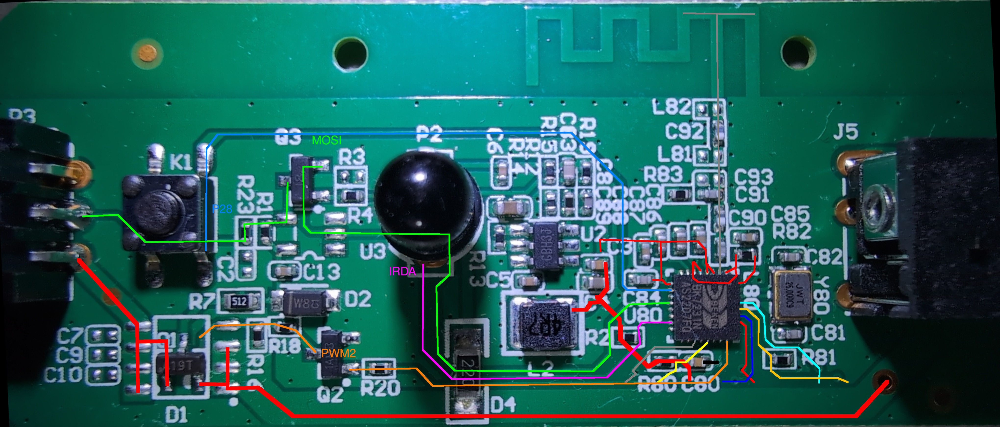

## General Notes


This configuration is for the [LSC Battletron Desk Strip 3 meter - 3206528](https://www.action.com/nl-nl/p/3206528/battletron-bureau-led-lichtstrip-razer-chroma/) which comes as a color changing LED strip with controller and power adapter. The LED controller itself takes it's power from a 24 volt power source, the adapter is local to each region. The led strip with original firmware works with the [razer chroma](https://www.razer.com/chroma) software suite, however compatibility with home assistant requires a [seperate integration](https://www.razer.com/chroma).

The original firmware is based upon the TuyaOS v3.3.40 based on the BS 40.00.

```text
TuyaOS V:3.3.40 BS:40.00_PT:2.3_LAN:3.5_CAD:1.0.5_CD:1.0.0 >
< BUILD AT:2023_02_15_14_08_59 BY ci_manage FOR tuyaos-iot AT bk7231n
```

Battletron is a LCS Smart Connect label.

## Teardown

The PCB top contains all functions, the bottom is mostly a ground plane, with very few traces. It's generally designed quite well. The power to the LED strip is 24V and can be turned on/off via D1/Q1, a population option. There are 72 LEDs per meter, thus 216 LEDs in total, controlled in groups of 6 LEDs. In other words, to ESPHome there are only 36 LEDs.




## GPIO Pinout

| Pin    | Function      |
| ------ | ------------- |
| P8     | Power for LEDs|
| P16    | WS2812        |
| P26    | IR-Receiver   |
| P28    | Button        |

## Programming

To program the board it is not possible to use [tuya cloudcutter](https://github.com/tuya-cloudcutter/tuya-cloudcutter/issues/744), as the stock firmware is built using a patched tuya SDK. Connecting a USB to serial adapter (FTDI etc) to UART1_RX, UART1_TX and GND pins (Make sure to connect USB UART RX to OCLS26 TX) and triggering a reset by connecting CEN to Ground. Power can be supplied with the supplied transformer. Flashing can then be done either directly via ESPHome or by downloading the uf2 file from a 'manual' download, and flashing it using [ltchiptool](https://github.com/libretiny-eu/ltchiptool).

> __Note:__ Not all USB adapters are equal. A PL2303 seemed not able to perform the flash, but worked fine for reading the log output on UART2_TX. A proper FTDI controller may be required.

```console
ltchiptool flash write -d /dev/ttyUSBn lsc-battletron-desk-strip-3m.uf2
```

> __Warning:__ The BK7231N is quite sensitive to trigger flash mode, and several attempts to reset the board using CEN may be required. There are no known cases where the BK7231N is unable to enter flash mode.

## Basic hardware configuration

```yaml
bk72xx:
  board: generic-bk7231n-qfn32-tuya

power_supply:
    id: led_power
    pin: P8

light:
  - platform: beken_spi_led_strip
    id: color_light
    name: "Color Light"
    pin: P16
    chipset: WS2812
    num_leds: 36
    rgb_order: GRB
    power_supply: led_power
```

## Complete hardware configuration

```yaml
substitutions:
  device_name: "lsc-battletron-strip-3m"
  friendly_name: "LSC Battletron Desk Strip 3 meter"
  device_description: "3 meter 'neon' LED strip from Action, the Battletron Desk strip, by LSC Smart Connect - 3206528"

esphome:
  name: ${device_name}
  friendly_name: ${friendly_name}
  comment: ${device_description}
  name_add_mac_suffix: true
  min_version: 2024.6.6

bk72xx:
  board: generic-bk7231n-qfn32-tuya

logger:

api:
  encryption:
    key: !secret api_encryption_key

ota:
  - platform: esphome
    password: !secret ota_password

wifi:
  ssid: !secret wifi_ssid
  password: !secret wifi_password

  ap:
    password: !secret fallback_hotspot_password

captive_portal:

web_server:
  port: 80
  auth:
    username: !secret web_server_user
    password: !secret web_server_password

improv_serial:

time:
  - platform: homeassistant

text_sensor:
  - platform: version
    name: "ESPHome Version"
    hide_timestamp: true

  - platform: wifi_info
    ip_address:
      name: IP
    mac_address:
      name: MAC
    ssid:
      name: SSID
    bssid:
      name: BSSID

button:
  - platform: restart
    name: Restart
    entity_category: diagnostic

  - platform: safe_mode
    name: Safe mode
    entity_category: diagnostic

  - platform: factory_reset
    name: Factory reset
    entity_category: diagnostic

remote_receiver:
  pin:
    number: P26
    inverted: true
    mode:
      input: true

binary_sensor:
  - platform: gpio
    name: "Button"
    pin:
      number: P28
      inverted: true
      mode:
        input: true
        pullup: true
    on_press:
      - light.toggle: color_light

  - platform: remote_receiver
    name: "Light On"
    nec:
      address: 0xFF00
      command: 0xBA45
    on_press:
      then:
        - light.turn_on: color_light

  - platform: remote_receiver
    name: "Light Off"
    nec:
      address: 0xFF00
      command: 0xB847
    on_press:
      then:
        - light.turn_off: color_light

  - platform: remote_receiver
    name: "Color Red"
    nec:
      address: 0xFF00
      command: 0xBB44
    on_press:
      then:
        - light.turn_on:
            id: color_light
            effect: "none"
        - light.addressable_set:
            id: color_light
            red: 100%
            green: 0%
            blue: 0%

  - platform: remote_receiver
    name: "Color Green"
    nec:
      address: 0xFF00
      command: 0xBF40
    on_press:
      then:
        - light.turn_on:
            id: color_light
            effect: "none"
        - light.addressable_set:
            id: color_light
            red: 0%
            green: 100%
            blue: 0%

  - platform: remote_receiver
    name: "Color Blue"
    nec:
      address: 0xFF00
      command: 0xBC43
    on_press:
      then:
        - light.turn_on:
            id: color_light
            effect: "none"
        - light.addressable_set:
            id: color_light
            red: 0%
            green: 0%
            blue: 100%

  - platform: remote_receiver
    name: "Color Orange"
    nec:
      address: 0xFF00
      command: 0xF807
    on_press:
      then:
        - light.turn_on:
            id: color_light
            effect: "none"
        - light.addressable_set:
            id: color_light
            red: 100%
            green: 50%
            blue: 0%

  - platform: remote_receiver
    name: "Color Light Green"
    nec:
      address: 0xFF00
      command: 0xEA15
    on_press:
      then:
        - light.turn_on:
            id: color_light
            effect: "none"
        - light.addressable_set:
            id: color_light
            red: 50%
            green: 100%
            blue: 50%

  - platform: remote_receiver
    name: "Color Cyan"
    nec:
      address: 0xFF00
      command: 0xF609
    on_press:
      then:
        - light.turn_on:
            id: color_light
            effect: "none"
        - light.addressable_set:
            id: color_light
            red: 0%
            green: 100%
            blue: 100%

  - platform: remote_receiver
    name: "Color Yellow"
    nec:
      address: 0xFF00
      command: 0xE916
    on_press:
      then:
        - light.turn_on:
            id: color_light
            effect: "none"
        - light.addressable_set:
            id: color_light
            red: 100%
            green: 100%
            blue: 0%

  - platform: remote_receiver
    name: "Color Random"
    nec:
      address: 0xFF00
      command: 0xE619
    on_press:
      then:
        - light.turn_on:
            id: color_light
            effect: "Random"

  - platform: remote_receiver
    name: "Color Magenta"
    nec:
      address: 0xFF00
      command: 0xF20D
    on_press:
      then:
        - light.turn_on:
            id: color_light
            effect: "none"
        - light.addressable_set:
            id: color_light
            red: 100%
            green: 0%
            blue: 100%

  - platform: remote_receiver
    name: "Brighter"
    nec:
      address: 0xFF00
      command: 0xF30C
    on_press:
      then:
        - light.dim_relative:
            id: color_light
            relative_brightness: +5%

  - platform: remote_receiver
    name: "Color White"
    nec:
      address: 0xFF00
      command: 0xE718
    on_press:
      then:
        - light.turn_on:
            id: color_light
            effect: "none"
        - light.addressable_set:
            id: color_light
            red: 100%
            green: 100%
            blue: 100%

  - platform: remote_receiver
    name: "Dimmer"
    nec:
      address: 0xFF00
      command: 0xA15E
    on_press:
      then:
        - light.dim_relative:
            id: color_light
            relative_brightness: -5%

  - platform: remote_receiver
    name: "Color Wipe"
    nec:
      address: 0xFF00
      command: 0xF708
    on_press:
      then:
        - light.turn_on:
            id: color_light
            effect: "Color Wipe"

  - platform: remote_receiver
    name: "Color Rainbow"
    nec:
      address: 0xFF00
      command: 0xE31C
    on_press:
      then:
        - light.turn_on:
            id: color_light
            effect: "Rainbow"

  - platform: remote_receiver
    name: "Color Twinkle"
    nec:
      address: 0xFF00
      command: 0xA55A
    on_press:
      then:
        - light.turn_on:
            id: color_light
            effect: "Twinkle"

power_supply:
    id: led_power
    pin: P8

light:
  - platform: beken_spi_led_strip
    id: color_light
    name: "Color Light"
    pin: P16
    chipset: WS2812
    num_leds: 36
    rgb_order: GRB
    power_supply: led_power
    effects:
     - random:
     - pulse:
     - strobe:
     - flicker:
     - addressable_rainbow:
     - addressable_color_wipe:
     - addressable_scan:
     - addressable_twinkle:
     - addressable_random_twinkle:
     - addressable_fireworks:

sensor:
  - platform: uptime
    name: "Uptime"
```
