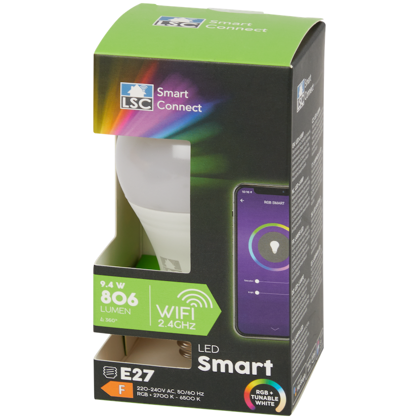

## Warning

The latest LSC Light White Ambiance 2578539 devices use the Tuya BK7231T module, which is not compatible with ESPHome!

## Notice

- This light is flashable using the latest tuya-cloudcutter with a compiled ESPHome binary.
- The LEDs are controlled by i2C using a BP5758d chip (Tuya)

## Product Images



## GPIO Pinout

bp5758d:
| Pin    | Function                            |
| ------ | ----------------------------------- |
| P26    | Data Pin                            |
| P24    | Clock Pin                           |

| Channel | Function                            |
| ------- | ----------------------------------- |
| 2       | Red                                 |
| 1       | Green                               |
| 3       | Blue                                |
| 4       | Warm White                          |
| 5       | Cold White                          |

## Basic configuration

```yml
substitutions:
  name: lsc-light-rgb-01
  friendly_name: lsc-light-rgb-01
esphome:
  name: ${name}
  friendly_name: ${friendly_name}

libretuya:
  board: generic-bk7231t-qfn32-tuya
  framework:
    version: dev

# Enable logging
logger:

# Enable Home Assistant API
api:
  encryption:
    key: !secret api_encryption_key

ota:
  password: !secret ota_password

wifi:
  ssid: !secret wifi_ssid
  password: !secret wifi_password

  # Enable fallback hotspot in case wifi connection fails
  ap:
    ssid: "Lsc-Light-Rgb-01"
    password: ""

web_server:
  port: 80
  
sensor:
  - platform: wifi_signal
    name: "WiFi Signal Sensor"
    update_interval: 60s

  - platform: uptime
    name: Uptime Sensor
    id: uptime_sensor
    update_interval: 60s
    on_raw_value:
      then:
        - text_sensor.template.publish:
            id: uptime_human
            state: !lambda |-
              int seconds = round(id(uptime_sensor).raw_state);
              int days = seconds / (24 * 3600);
              seconds = seconds % (24 * 3600);
              int hours = seconds / 3600;
              seconds = seconds % 3600;
              int minutes = seconds /  60;
              seconds = seconds % 60;
              return (
                (days ? to_string(days) + "d " : "") +
                (hours ? to_string(hours) + "h " : "") +
                (minutes ? to_string(minutes) + "m " : "") +
                (to_string(seconds) + "s")
              ).c_str();

text_sensor:
  - platform: template
    name: Uptime Human Readable
    id: uptime_human
    icon: mdi:clock-start
  - platform: wifi_info
    ip_address:
      name: IP Address
      entity_category: diagnostic


binary_sensor:
  - platform: status
    name: Status
    entity_category: diagnostic

button:
  - platform: restart
    id: restart_button
    name: Restart
    entity_category: diagnostic

bp5758d:
  data_pin: P26
  clock_pin: P24

output:
  - platform: bp5758d
    id: output_red
    channel: 2
  - platform: bp5758d
    id: output_green
    channel: 1
  - platform: bp5758d
    id: output_blue
    channel: 3
  - platform: bp5758d
    id: output_cold_white
    channel: 5
  - platform: bp5758d
    id: output_warm_white
    channel: 4

light:
  - platform: rgbww
    name: ${friendly_name}
    id: the_light
    restore_mode: ALWAYS_OFF
    red: output_red
    green: output_green
    blue: output_blue
    cold_white: output_cold_white
    warm_white: output_warm_white
    cold_white_color_temperature: 6500 K
    warm_white_color_temperature: 2700 K
    color_interlock: true
    constant_brightness: true
    effects:
      - random:
          name: "Slow Random"
          transition_length: 30s
          update_interval: 30s
      - random:
          name: "Fast Random"
          transition_length: 4s
          update_interval: 5s
      - strobe:
      - flicker:
          alpha: 50% #The percentage that the last color value should affect the light. More or less the “forget-factor” of an exponential moving average. Defaults to 95%.
          intensity: 50% #The intensity of the flickering, basically the maximum amplitude of the random offsets. Defaults to 1.5%.
      - lambda:
          name: Throb
          update_interval: 1s
          lambda: |-
            static int state = 0;
            auto call = id(the_light).turn_on();
            // Transtion of 1000ms = 1s
            call.set_transition_length(1000);
            if (state == 0) {
              call.set_brightness(1.0);
            } else {
              call.set_brightness(0.01);
            }
            call.perform();
            state += 1;
            if (state == 2)
              state = 0;

## Blink the light if we aren't connected to WiFi.
## Uncomment below
#interval:
#- interval: 500ms
#  then:
#  - if:
#      condition:
#        not:
#          wifi.connected:
#      then:
#        - light.turn_on:
#            id: the_light
#            brightness: 50%
#            transition_length: 0s
#        - delay: 250ms
#        - light.turn_off:
#            id: the_light
#            transition_length: 250ms
```
