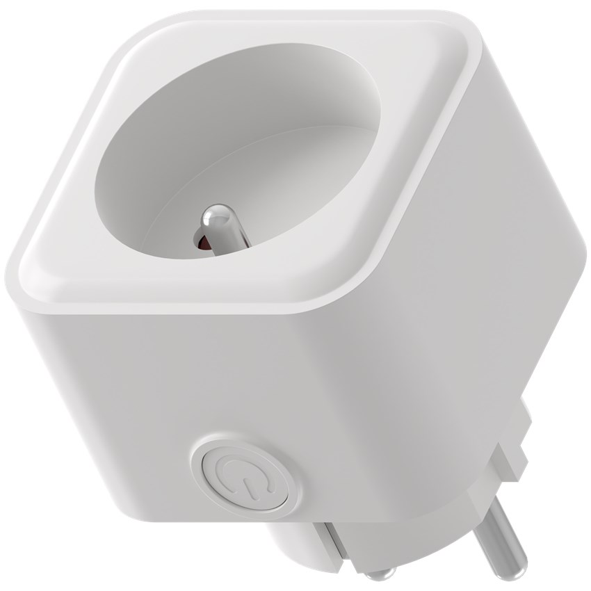

## Warning

The latest LSC smart plug 2578685 devices use the Tuya BK7231N module, which is not compatible with ESPHome!

## Notice

- This smart plug is flashable using the latest tuya-cloudcutter with a compiled ESPHome binary. I recommend following this [Youtube Video](https://youtu.be/sSj8f-HCHQ0).
- There is a version with BK7231N and a version with BK7231T. Both should work but you need to make sure to use the right version. I recommend to use the the configuration gererated by ltchiptool and esphome-kickstart as shown in the video instead of this configuration, because it might change.
- The second configuration is the version that worked for me (Version 1.1.8 in the App and with BK7231N)

## Product Images




## GPIO Pinout

Pinout for Version with BK7231T

| Pin | Function      |
| --- | ------------- |
| P7  | Switch button |
| P26 | Blue LED      |
| P6  | Red LED       |
| P8  | Relay         |

Pinout for Version with BK7231N (Relay and LED Swapped)

| Pin | Function      |
| --- | ------------- |
| P7  | Switch button |
| P26 | Blue LED      |
| P8  | Red LED       |
| P6  | Relay         |

## Basic configuration

Version for BK7231T:

```yml
substitutions:
  name: lsc-switch-01
  friendly_name: lsc-switch-01
esphome:
  name: ${name}
  friendly_name: ${friendly_name}

libretuya:
  board: generic-bk7231t-qfn32-tuya
  framework:
    version: dev
  
# OTA flashing
ota:
  - platform: esphome

wifi: # Your Wifi network details
  
# Enable fallback hotspot in case wifi connection fails  
  ap:

# Enabling the logging component
logger:

# Enable Home Assistant API
api:

# Enable the captive portal
captive_portal:

#web_server:
#  port: 80

binary_sensor:

  - platform: gpio
    pin:
      number: P7
      mode:
        input: true
        pullup: true
      inverted: true
    name: "Power Button"
    on_press:
      - switch.toggle: relay

switch:

  - platform: gpio
    # RED
    id: led_1
    pin:
      number: P6
      inverted: false

  - platform: gpio
    # BLUE
    id: led_2
    pin:
      number: P26
      inverted: false

  - platform: gpio
    name: Switch
    pin: P8
    id: relay

    # Turn off red LED to show blue when turned on
    on_turn_on:
      - switch.turn_on: led_2
      - switch.turn_off: led_1

    # Turns on the red LED once the plug is turned off
    on_turn_off:
      - switch.turn_off: led_2
      - switch.turn_on: led_1

button:
  - platform: restart
    id: restart_button
    name: Restart
    entity_category: diagnostic
```

Version for BK7231N:

```yml
esphome:
  name: lsc-plug-1

bk72xx:
  board: generic-bk7231n-qfn32-tuya
  
# OTA flashing
ota:
  - platform: esphome

wifi: # Your Wifi network details
  
# Enable fallback hotspot in case wifi connection fails  
  ap:

# Enabling the logging component
logger:

# Enable Home Assistant API
api:

# Enable the captive portal
captive_portal:

#web_server:
#  port: 80

status_led:
  pin: P26

binary_sensor:
  - platform: status
    name: lsc-plug-1_status
  - platform: gpio
    pin:
      number: P7
      mode: INPUT_PULLUP
      inverted: true
    name: lsc-plug-1_button
    internal: true
    on_press:
      - switch.toggle: relay

output:
  - platform: gpio
    id: relay_led
    pin: P8

switch:
  - platform: gpio
    id: relay
    name: lsc-plug-1_relay
    pin: P6
    on_turn_on:
      - output.turn_on: relay_led
    on_turn_off:
      - output.turn_off: relay_led
```
