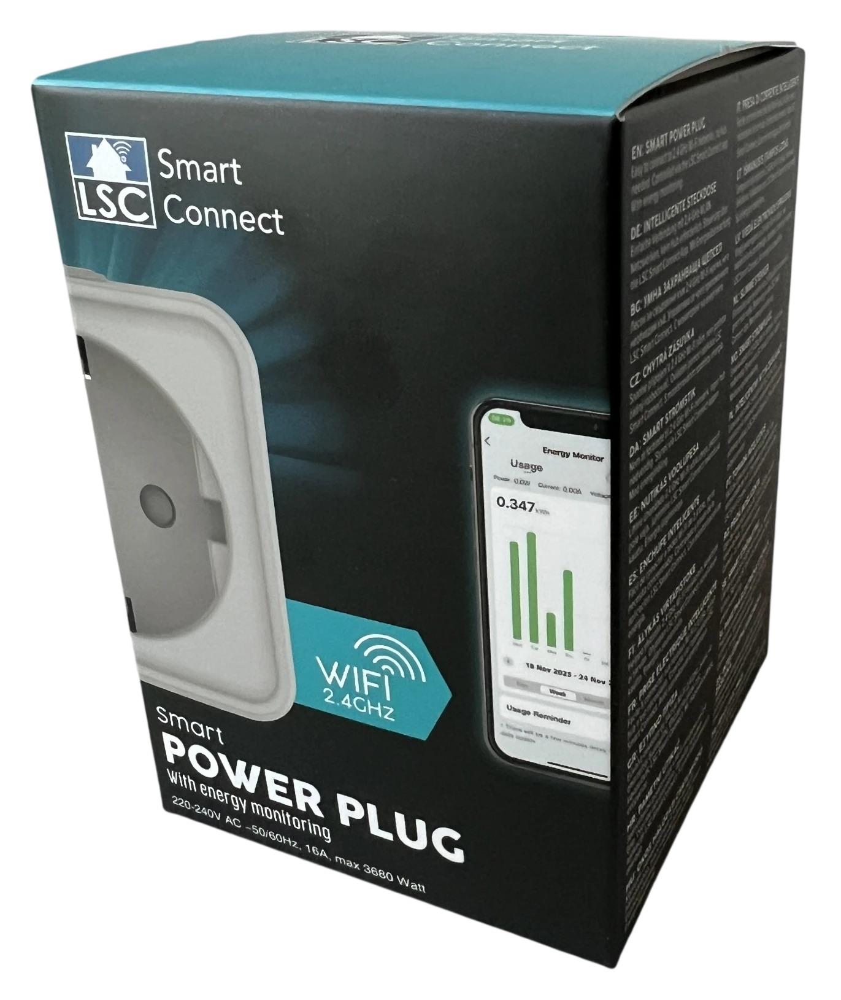
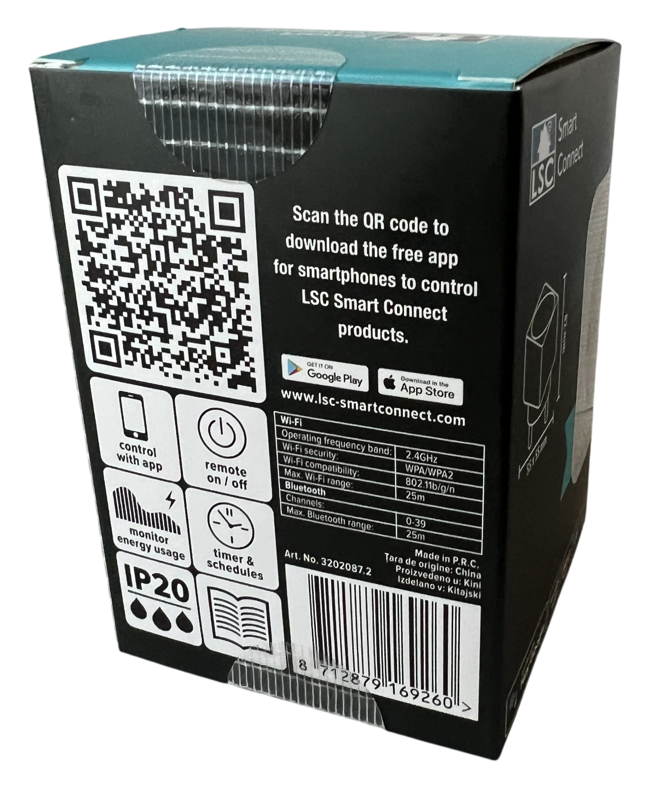
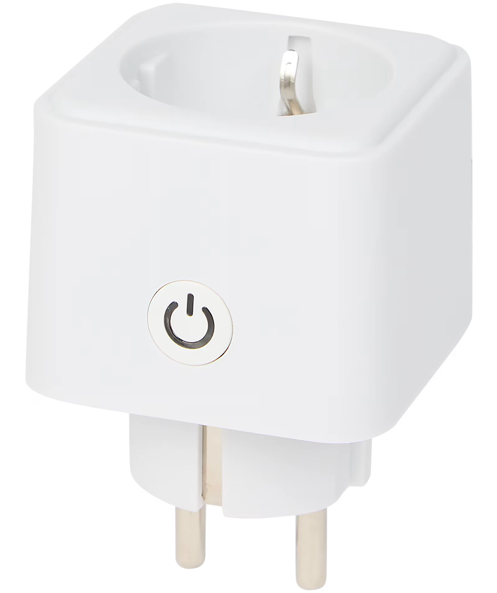
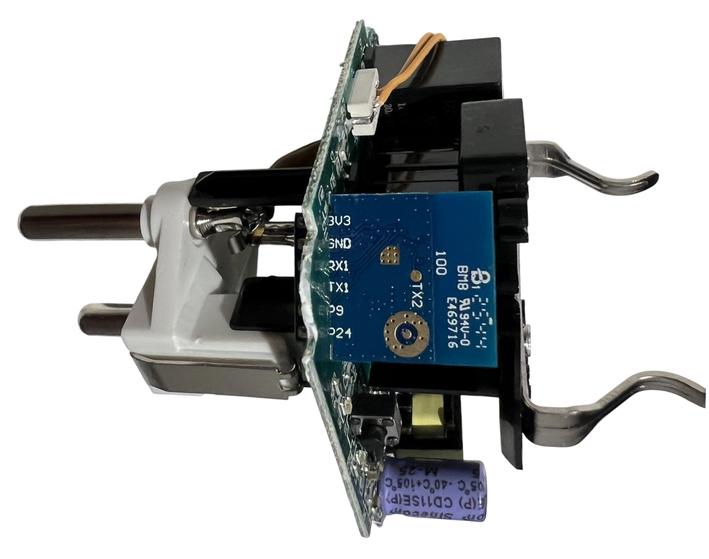
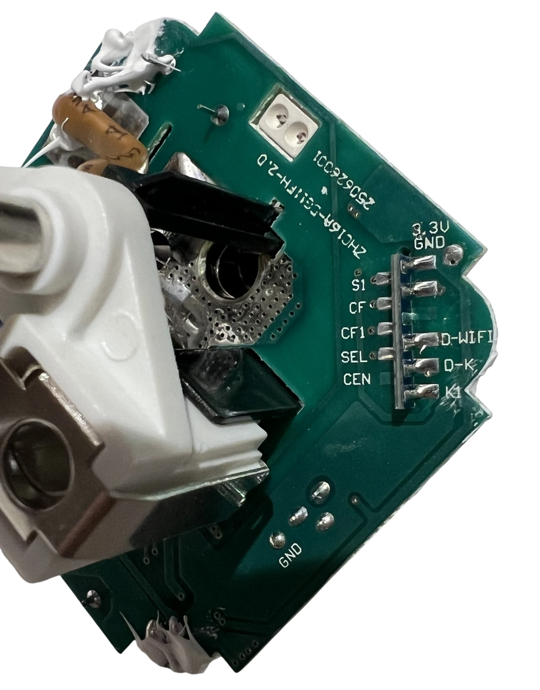
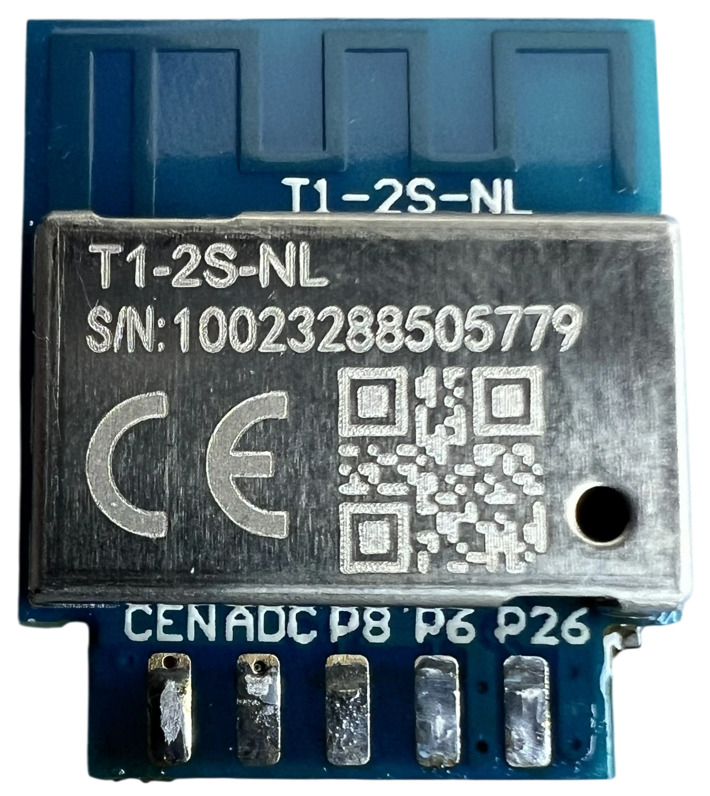
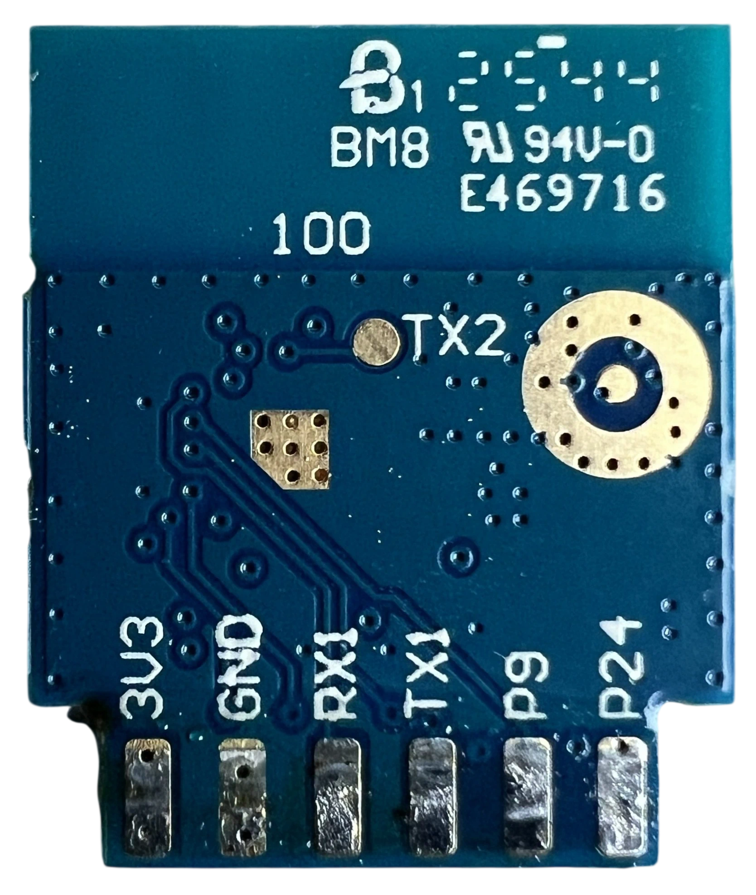

## Overview

The LSC Smart Connect Power Plug 3202087.2 is a 2.4 GHz EU smart plug with a single relay, a front-panel button, and BL0937-based energy monitoring. The unit documented here uses a Tuya T1-2S-NL module.

## Product Images







## Board and Module Photos









The module photos are useful because the side castellations are clearly labelled. On this board you can see `3V3`, `GND`, `RX1`, `TX1`, `P9`, and `P24` on one side, and `CEN`, `P1` (ADC/SEL), `P8`, `P6`, and `P26` on the other.

## Opening and Flashing

This device is not flashable without opening the enclosure. To install ESPHome you need to disassemble the plug and solder temporary wires to the UART pads.

1. Unplug the device from mains power before opening it.
2. Solder to `3V3`, `GND`, `RX1`, and `TX1` on the module or its matching breakout pads on the PCB.
3. Cross the UART lines when connecting your adapter: adapter TX to device RX1, adapter RX to device TX1.
4. Use 3.3 V UART levels only. Many USB-to-UART adapters can handle the serial connection but cannot supply enough current to power the whole board reliably, so if flashing is unstable or the board keeps resetting, power the PCB from a separate regulated 3.3 V supply and connect its `GND` to the adapter `GND`.
5. If your flashing workflow needs a reset line, the board also exposes `CEN`.

Because the Wi-Fi status LED is wired to `P11` / `TX1`, the example configuration disables UART logging with `logger:` `baud_rate: 0`.

## BK7238 Support Status

At the time of writing, BK7238 support is still being worked on in ESPHome/LibreTiny. The example configuration therefore pins the Beken SDK version and pulls LibreTiny from the BK7238 feature branch:

```yaml
custom_versions.beken-bdk: 3.0.78
framework:
  version: 0.0.0
  source: https://github.com/libretiny-eu/libretiny#feature/bk7238
```

Once BK7238 support lands in regular releases, these overrides may no longer be required.

## GPIO Pinout

The PCB silkscreen is clear and matches the working ESPHome mapping below.

| Pin | PCB silk | Module silk | Function                |
| --- | -------- | ----------- | ----------------------- |
| P26 | S1       | P26         | Front button            |
| P6  | CF       | P6          | BL0937 CF               |
| P8  | CF1      | P8          | BL0937 CF1              |
| P1  | SEL      | P1          | BL0937 SEL (inverted)   |
| P11 | D-WIFI   | TX1         | Wi-Fi status LED        |
| P9  | D-K      | P9          | Relay LED               |
| P24 | K1       | P24         | Relay                   |

## Basic Configuration

The base configuration below covers the relay, button, both LEDs, the internal temperature sensor, and BL0937 power monitoring. Add your own `wifi:`, `api:`, and `ota:` sections before flashing. The example also leaves out passwords and `!secret` references so you can merge it into your own setup and fill in your local credentials separately.

```yaml file=config.yaml
```

## Advanced Configuration

The advanced fragment below adds common diagnostic entities on top of the base config. Merge it into your own setup after you add networking.

```yaml file=advanced.yaml
```

## BL0937 Calibration

Start with the values shown in `config.yaml` and calibrate them with a trusted external meter plus a resistive load such as a kettle or heater.

1. Adjust `voltage_divider` until the reported voltage matches your reference meter.
2. Adjust `current_resistor` until current and power match under the same load.
3. Re-check with a second resistive load and fine-tune if needed.

The `0.450158` current filter used in the example config is worth keeping. In practice it is best to leave that factor in place, calibrate `voltage_divider` first, and only then fine-tune `current_resistor`.
