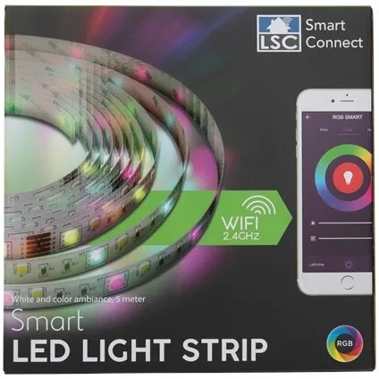

## Warning

As of July 2020 this device comes with a Tuya WB3S module, which is not compatible with ESPHome!

## Notice

- This light is flashable using <https://github.com/kueblc/tuya-convert>
- Not tested yet with tuya-cloudcutter

## Product Images



## GPIO Pinout

| Channel | Function |
| ------- | -------- |
| 4       | Red      |
| 12      | Green    |
| 14      | Blue     |
| 13      | White    |

## Basic configuration

```yml
substitutions:
  device_name: lsc-rgbw-strip

esphome:
  name: ${device_name}

esp8266:
  board: esp01_1m
  
# OTA flashing
ota:
  - platform: esphome

wifi: # Your Wifi network details
  
# Enable fallback hotspot in case wifi connection fails  
  ap:

# Enabling the logging component
logger:

# Enable Home Assistant API
api:

# Enable the captive portal
captive_portal:

# Enable the Web Server component 
webserver:

sensor:
  - platform: wifi_signal
    name: ${device_name} Wifi Signal Strength
    update_interval: 60s
  - platform: uptime
    name: ${device_name} Uptime

remote_receiver:
  pin:
    number: 0
    inverted: true
  dump: all
#  filter: 50us

output:
  - platform: esp8266_pwm
    id: pwm_red
    pin: 4
    frequency: 1000 Hz
  - platform: esp8266_pwm
    id: pwm_blue
    pin: 14
    frequency: 1000 Hz
  - platform: esp8266_pwm
    id: pwm_green
    pin: 12
    frequency: 1000 Hz
  - platform: esp8266_pwm
    id: pwm_white
    pin: 13
    frequency: 1000 Hz

light:
  - platform: rgbw
    id: strip
    name: ${device_name}
    red: pwm_red
    green: pwm_green
    blue: pwm_blue
    white: pwm_white
    effects:
      - strobe:
          name: strobe
          colors:
            - state: true
              brightness: 100%
              red: 100%
              green: 0%
              blue: 0%
              white: 0%
              duration: 1000ms
            - state: true
              brightness: 100%
              red: 0%
              green: 100%
              blue: 0%
              white: 0%
              duration: 1000ms
            - state: true
              brightness: 100%
              red: 0%
              green: 0%
              blue: 100%
              white: 0%
              duration: 1000ms

binary_sensor:
  - platform: remote_receiver
    id: aan
    internal: true
    name: "Remote On"
    nec:
      address: 0x00F7
      command: 0xC03F
    on_press:
      then:
        light.turn_on:
          id: strip

  - platform: remote_receiver
    id: uit
    internal: true
    name: "Remote Off"
    nec:
      address: 0x00F7
      command: 0x40BF
    on_press:
      - then:
          light.turn_off:
            id: strip

  - platform: remote_receiver
    id: white
    internal: true
    name: "Remote white"
    nec:
      address: 0x00F7
      command: 0xE01F
    on_press:
      - then:
          light.turn_on:
            id: strip
            brightness: 100%
            red: 0%
            green: 0%
            blue: 0%
            white: 100%

  - platform: remote_receiver
    id: blue
    internal: true
    name: "Remote blue"
    nec:
      address: 0x00F7
      command: 0x609F
    on_press:
      - then:
          light.turn_on:
            id: strip
            brightness: 100%
            red: 0%
            green: 0%
            blue: 100%
            white: 0%

  - platform: remote_receiver
    id: red
    internal: true
    name: "Remote red"
    nec:
      address: 0x00F7
      command: 0x20DF
    on_press:
      - then:
          light.turn_on:
            id: strip
            brightness: 100%
            red: 100%
            green: 0%
            blue: 0%
            white: 0%

  - platform: remote_receiver
    id: green
    internal: true
    name: "Remote green"
    nec:
      address: 0x00F7
      command: 0xA05F
    on_press:
      - then:
          light.turn_on:
            id: strip
            brightness: 100%
            red: 0%
            green: 100%
            blue: 0%
            white: 0%

  - platform: remote_receiver
    id: strobe
    internal: true
    name: "Remote Strobe"
    nec:
      address: 0x00F7
      command: 0xF00F
    on_press:
      - then:
          - light.turn_on:
              id: strip
              effect: strobe
```
