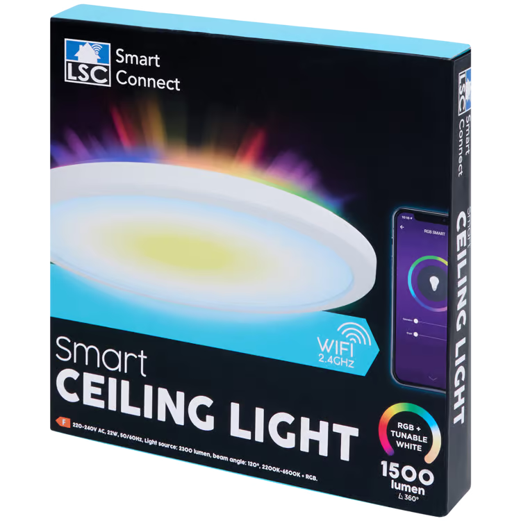

<!--
## Notice

(not checked if that works)
- This light is flashable using the latest tuya-cloudcutter with a compiled ESPHome binary.
-->

## Product Images



## GPIO Pinout

| Pin | Function           |
| --- | ------------------ |
| P16 | PWM 47 (outer rgb) |
| P24 | PWM 5  (main warm) |
| P26 | PWM 4  (main cold) |

## Basic configuration

```yml
substitutions:
  name: lsc-ceiling-light
  friendly_name: lsc-ceiling-light

esphome:
  name: ${name}
  friendly_name: ${friendly_name}

bk72xx:
  board: generic-bk7231n-qfn32-tuya

logger:

api:
  encryption:
    key: !secret api_encryption_key

ota:
  password: !secret ota_password

wifi:
  ssid: !secret wifi_ssid
  password: !secret wifi_password

  ap:
    ssid: "LSC-ceiling-Light"
    password: ""

light:
  - platform: beken_spi_led_strip
    name: "Outer RGB"
    pin: P16
    chipset: SM16703
    num_leds: 120 # copied from OpenBekenIOT (not verified)
    rgb_order: RGB
    effects:
     - random:
     - pulse:
     - strobe:
     - flicker:
     - addressable_rainbow:
     - addressable_color_wipe:
     - addressable_scan:
     - addressable_twinkle:
     - addressable_random_twinkle:
     - addressable_fireworks:
     - addressable_flicker:
    restore_mode: RESTORE_DEFAULT_ON
  - platform: cwww
    id: light_cwww
    name: "Main"
    cold_white_color_temperature: 6500 K
    warm_white_color_temperature: 2700 K
    cold_white: output_cold
    warm_white: output_warm
    restore_mode: RESTORE_DEFAULT_ON

output:
  - platform: libretiny_pwm
    id: output_cold
    pin: P26
  - platform: libretiny_pwm
    id: output_warm
    pin: P24
```

<!--
Source: https://www.elektroda.com/rtvforum/topic4095226.html
{
  "vendor": "Action",
  "bDetailed": "0",
  "name": "LSC Smart Connect 1500lm 22W Ceiling Lamp",
  "model": "3206306",
  "chip": "BK7231N",
  "board": "on PCB",
  "flags": "267264",
  "keywords": [
    "Deckenlampe",
    "light"
  ],
  "pins": {
    "16": "SM16703P_DIN;47",
    "24": "PWM;5",
    "26": "PWM;4"
  },
  "command": "startDriver SM16703P; SM16703P_Init 120; startDriver PixelAnim;",
  "image": "https://obrazki.elektroda.pl/2568990700_1735106079.png",
  "wiki": "https://www.elektroda.com/rtvforum/topic4095226.html"
}
-->
