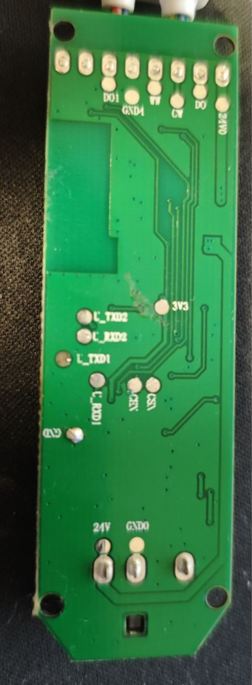
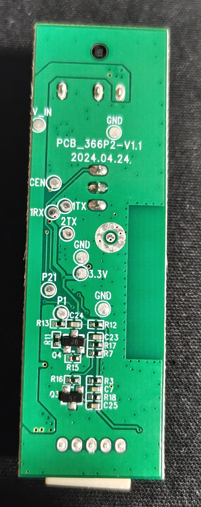

## General Notes

This configuration is for the second version of the [LSC Smart Connect XXL-LED-Strip 3202086](https://www.action.com/pl-pl/p/3202086/tasma-xxl-led-lsc-smart-connect/)
which comes as a colour changing LED strip with controller and transformer.

## This is for the new version of the LED strip!
The original version is here (insert original)

The main diffrences between the two versions are diffrent board layout and diffrent pins for the LEDs

To check what version you have open up the controller and look at the back of the board

| Old | New |
| --- | -------------- |
|  |  |


## How to flash
To flash the controller, open up the controller and take the board out.
On the back of the board there are 4 pins you need to solder
| GND | 3.3V | 1TX | 1RX |
### Warning: It is important to connect the board to a stable 3.3V supply, unstable supplies may cause the flash to fail!

Connect the 1TX pin to the RX pin on your flasher and connect the 1RX pin to the TX pin on your flasher.
Use the ltchiptool to take a backup and flash the board with a new firmware
The tool should automatically detect what port the flasher is on
#### To take a backup
If you are not using the GUI tool take a backup using
```
ltchiptool flash <command> <boardfamily> <backupname>
```
#### To flash the chip 
Create an empty configuration with the yaml below
Download the compiled firmware file
If you are not using the GUI tool flash the chip using
```
ltchiptool flash <command> <boardfamily> <backupname>
```
## GPIO Pinout

| Pin | Function       |
| --- | -------------- |
| P24  | Cold White     |
| P6 | Warm White     |
| P16 | WS2812         |
| P22  | Power for the white LEDs |
| P20  | Button         |
| P26 | IR-Receiver    |
| P23   | Microphone (unused)|

```yaml

esphome:
  name: lsc-10m-leds
  friendly_name: LSC XXL 10m LED Strip  

bk72xx:
  board: generic-bk7231n-qfn32-tuya

# Enable Home Assistant API
api:
  encryption:
    key: ""

ota:
  - platform: esphome
    password: ""

wifi:
  ssid: !secret wifi_ssid
  password: !secret wifi_password

  # Enable fallback hotspot (captive portal) in case wifi connection fails
ap:
  ssid: "Lsc-10M-Led Fallback Hotspot"
  password: ""

captive_portal:

# Enable logging
logger:
  baud_rate: 0


light:
  - platform: cwww
    id: white_light
    name: "White Light"
    cold_white: output_cw
    warm_white: output_ww
    cold_white_color_temperature: 6500 K
    warm_white_color_temperature: 2700 K
    on_turn_on:
      - light.turn_off: color_light
    effects: 
      - pulse:
      - flicker:
      - random:


  - platform: beken_spi_led_strip
    id: color_light
    name: "Color Light"
    pin: P16
    chipset: WS2812
    num_leds: 40
    rgb_order: RBG
    power_supply: led_power
    effects:
      - random:
      - pulse:
      - strobe:
      - flicker:
      - addressable_rainbow:
      - addressable_color_wipe:
      - addressable_scan:
      - addressable_twinkle:
      - addressable_random_twinkle:
      - addressable_fireworks:
      - addressable_flicker:
    on_turn_on:
      - light.turn_off: white_light

output:
  - platform: libretiny_pwm
    id: output_cw
    pin: P24
    power_supply: led_power
  - platform: libretiny_pwm
    id: output_ww
    pin: P6
    power_supply: led_power

power_supply:
  - id: led_power
    pin: P22

remote_receiver:
  pin:
    number: P26
    mode:
      input: true
      pullup: true
  dump: all

binary_sensor:
  - platform: gpio
    pin:
      number: P20
      inverted: True
      mode:
        input: True
        pullup: True
    name: "Button"
    on_press:
      - light.toggle: white_light
    on_double_click: 
      then:
        - light.toggle: color_light
      
  - platform: status #For diagnostic purpouses
    name: "Status"
```
