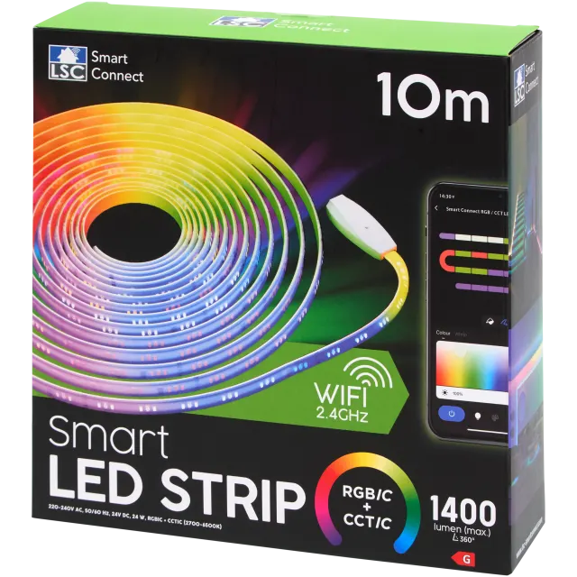
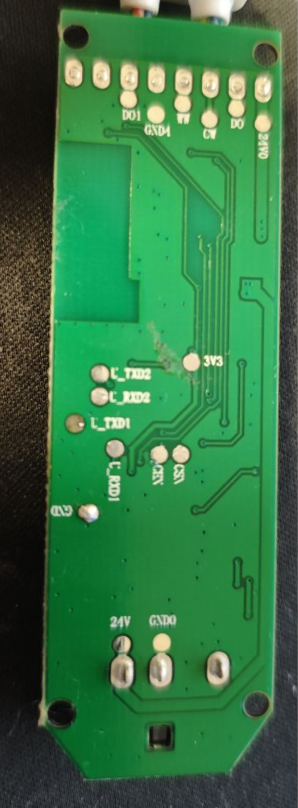
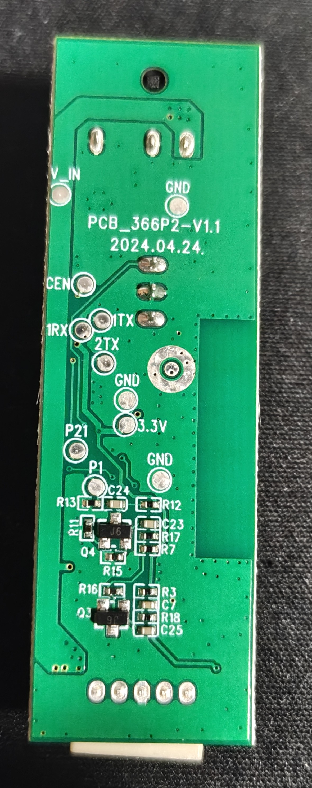
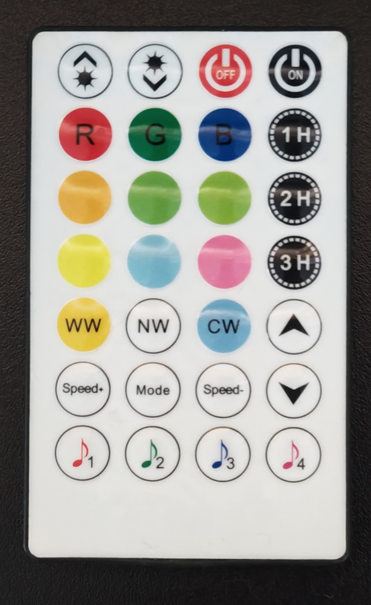

## General Notes

This configuration is for the second version of the [LSC Smart Connect XXL-LED-Strip 3202086](https://www.action.com/pl-pl/p/3202086/tasma-xxl-led-lsc-smart-connect/)
which comes as a colour changing LED strip with controller and transformer.



## This is for the new version of the LED strip

The original version is here (insert original)

The main differences between the two versions are different board layout and different pins for the LEDs

To check what version you have open up the controller and look at the back of the board

| Old | New |
| --- | -------------- |
|  |  |

## How to flash

To flash the controller, open up the controller and take the board out.
On the back of the board there are 4 pins you need to solder
| GND | 3.3V | 1TX | 1RX |

#### Warning: It is important to connect the board to a stable 3.3V supply, unstable supplies may cause the flash to fail**

Connect the 1TX pin to the RX pin on your flasher and connect the 1RX pin to the TX pin on your flasher.
Use the ltchiptool to take a backup and flash the board with a new firmware
The tool should automatically detect what port the flasher is on

#### To take a backup

If you are not using the GUI tool take a backup using

```bash
ltchiptool flash <command> <boardfamily> <backupname>
```

#### To flash the chip

Create an empty configuration with the yaml below
Download the compiled firmware file
If you are not using the GUI tool flash the chip using

```bash
ltchiptool flash <command> <firmwarefile>
```

## GPIO Pinout

| Pin | Function       |
| --- | -------------- |
| P24  | Cold White     |
| P6 | Warm White     |
| P16 | WS2812         |
| P22  | Power for the white LEDs |
| P20  | Button         |
| P26 | IR-Receiver    |
| P23   | Microphone (unused)|

```yaml

esphome:
  name: lsc-10m-leds
  friendly_name: LSC XXL 10m LED Strip  

bk72xx:
  board: generic-bk7231n-qfn32-tuya

# Enable Home Assistant API
api:
  encryption:
    key: ""

ota:
  - platform: esphome
    password: ""

wifi:
  ssid: !secret wifi_ssid
  password: !secret wifi_password

  # Enable fallback hotspot (captive portal) in case wifi connection fails
ap:
  ssid: "Lsc-10M-Led Fallback Hotspot"
  password: ""

captive_portal:

# Enable logging
logger:
  baud_rate: 0

light:
  - platform: cwww
    id: white_light
    name: "White Light"
    cold_white: output_cw
    warm_white: output_ww
    cold_white_color_temperature: 6500 K
    warm_white_color_temperature: 2700 K
    on_turn_on:
      - light.turn_off: color_light
    effects: 
      - pulse:
      - flicker:
      - random:


  - platform: beken_spi_led_strip
    id: color_light
    name: "Color Light"
    pin: P16
    chipset: WS2812
    num_leds: 40
    rgb_order: RBG
    power_supply: led_power
    effects:
      - random:
      - pulse:
      - strobe:
      - flicker:
      - addressable_rainbow:
      - addressable_color_wipe:
      - addressable_scan:
      - addressable_twinkle:
      - addressable_random_twinkle:
      - addressable_fireworks:
      - addressable_flicker:
    on_turn_on:
      - light.turn_off: white_light

output:
  - platform: libretiny_pwm
    id: output_cw
    pin: P24
    power_supply: led_power
  - platform: libretiny_pwm
    id: output_ww
    pin: P6
    power_supply: led_power

power_supply:
  - id: led_power
    pin: P22

remote_receiver:
  pin:
    number: P26
    mode:
      input: true
      pullup: true
  dump: all

binary_sensor:
  - platform: gpio
    pin:
      number: P20
      inverted: True
      mode:
        input: True
        pullup: True
    name: "Button"
    on_press:
      - light.toggle: white_light
    on_double_click: 
      then:
        - light.toggle: color_light
      
  - platform: status # For diagnostic purpouses
    name: "Status"
```

### Remote Receiver

In case you want to use the remote that comes with this device i have dumped all the ir codes and turned them into yaml
Note: I have tried to match some of the functionality, but not everything can be replicated in ESPHome, in these cases i left the actions empty.

Picture of the remote that comes with this LED Strip



```yaml

remote_receiver:
  id: ir_rx
  pin:
    number: P26
    inverted: true
    mode:
      input: true
      pullup: true
#  dump: pioneer # For dumping the remote codes

  on_pioneer: 
# === 1st Row ===

    # Power OFF (0x0001)
    - if:
        condition:
          lambda: 'return x.rc_code_1 == 0x0001;'
        then:
          - light.turn_off: color_light
          - light.turn_off: white_light

    # Power ON (0x0006)
    - if:
        condition:
          lambda: 'return x.rc_code_1 == 0x0006;'
        then:
          - light.turn_on: white_light

    # Brightness UP (0x0010)
    - if:
        condition:
          lambda: 'return x.rc_code_1 == 0x0010;'
        then:
         - if:
            condition: 
              light.is_on: white_light
            then:
              - light.dim_relative:
                  id: white_light
                  relative_brightness: 10%
                  transition_length: 0.2s
         - if:
            condition: 
              light.is_on: color_light
            then:
              - light.dim_relative:
                  id: color_light
                  relative_brightness: 10%
                  transition_length: 0.2s

    # Brightness DOWN (0x0003)
    - if:
        condition:
          lambda: 'return x.rc_code_1 == 0x0003;'
        then:
         - if:
            condition: 
              light.is_on: white_light
            then:
              - light.dim_relative:
                  id: white_light
                  relative_brightness: -10%
                  transition_length: 0.2s
         - if:
            condition: 
              light.is_on: color_light
            then:
              - light.dim_relative:
                  id: color_light
                  relative_brightness: -10%
                  transition_length: 0.2s     

# === 2 Row ===

    # Red (0x0009)
    - if:
        condition:
          lambda: 'return x.rc_code_1 == 0x0009;'
        then:
          - light.turn_on:
              id: color_light
              red: 100%
              green: 0%
              blue: 0%
#              brightness: 100%

    # Green (0x001D)
    - if:
        condition:
          lambda: 'return x.rc_code_1 == 0x001D;'
        then:
          - light.turn_on:
              id: color_light
              red: 0%
              green: 100%
              blue: 0%
#              brightness: 100%

    # Blue (0x001F)
    - if:
        condition:
          lambda: 'return x.rc_code_1 == 0x001F;'
        then:
          - light.turn_on:
              id: color_light
              red: 0%
              green: 0%
              blue: 100%
#              brightness: 100%

    # 1h Timer (0x000D)
    - if:
        condition:
          lambda: 'return x.rc_code_1 == 0x000D;'
        then:


# === 3rd Row ===

    # Orange (0x0019)
    - if:
        condition:
          lambda: 'return x.rc_code_1 == 0x0019;'
        then:
          - light.turn_on:
              id: color_light
              red: 100%
              green: 50%
              blue: 0%
#              brightness: 100%

    # Light Green (0x001B)
    - if:
        condition:
          lambda: 'return x.rc_code_1 == 0x001B;'
        then:
          - light.turn_on:
              id: color_light
              red: 0%
              green: 100%
              blue: 30%
#              brightness: 100%

    # Even Lighter Green (0x0011)
    - if:
        condition:
          lambda: 'return x.rc_code_1 == 0x0011;'
        then:
          - light.turn_on:
              id: color_light
              red: 60%
              green: 80%
              blue: 0%
#              brightness: 100%

    # 2h Timer (0x0015)
    - if:
        condition:
          lambda: 'return x.rc_code_1 == 0x0015;'
        then:
          - light.turn_on:
              id: white_light
              color_temperature: 3700K

# === 4th Row ===

    # Yellow (0x0017)
    - if:
        condition:
          lambda: 'return x.rc_code_1 == 0x0017;'
        then:
          - light.turn_on:
              id: color_light
              red: 100%
              green: 100%
              blue: 0%
#              brightness: 100%

    # Light Blue (0x0012)
    - if:
        condition:
          lambda: 'return x.rc_code_1 == 0x0012;'
        then:
          - light.turn_on:
              id: color_light
              red: 0%
              green: 70%
              blue: 100%
#              brightness: 100%

    # Pink (0x0016)
    - if:
        condition:
          lambda: 'return x.rc_code_1 == 0x0016;'
        then:
          - light.turn_on:
              id: color_light
              red: 100%
              green: 0%
              blue: 40%
#              brightness: 100%

    # 3h Timer (0x004D)
    - if:
        condition:
          lambda: 'return x.rc_code_1 == 0x004D;'
        then:

# === 5th Row ===

    # Warm White (0x0040)
    - if:
        condition:
          lambda: 'return x.rc_code_1 == 0x0040;'
        then:
          - light.turn_on:
              id: white_light
              color_temperature: 2700 K
#              brightness: 100%

    # Neutral White (0x004C)
    - if:
        condition:
          lambda: 'return x.rc_code_1 == 0x004C;'
        then:
          - light.turn_on:
              id: white_light
              color_temperature: 4200 K
#              brightness: 100%

    # Cool White (0x0004)
    - if:
        condition:
          lambda: 'return x.rc_code_1 == 0x0004;'
        then:
          - light.turn_on:
              id: white_light
              color_temperature: 6500 K
#              brightness: 100%    

    # Up Button (0x0000)
    - if:
        condition:
          lambda: 'return x.rc_code_1 == 0x0000;'
        then:
          - light.turn_on:
              id: color_light
              effect: none
              
# === 6th Row ===

    # Speed + (0x000A)
    - if:
        condition:
          lambda: 'return x.rc_code_1 == 0x0000A;'
        then:

    # Mode Button (0x001E) - Cycle through color_light effects
    - if:
        condition:
          lambda: 'return x.rc_code_1 == 0x001E;'
        then:
         - lambda: |-
              static int effect_index = 0;
              const char* effects[] = {
                //"Pulse",
                //"Strobe",
                //"Flicker",
                "Rainbow",
                "Color Wipe",
                "Scan",
                "Twinkle",
                "Random Twinkle",
                "Fireworks",

              };
              const int total_effects = sizeof(effects) / sizeof(effects[0]);
              auto call = id(color_light).turn_on();
              call.set_effect(effects[effect_index]);
              call.perform();
              effect_index = (effect_index + 1) % total_effects;
              // ESP_LOGI("remote", "Effect changed to %s", effects[effect_index]);

    # Speed - (0x000E)
    - if:
        condition:
          lambda: 'return x.rc_code_1 == 0x0000E;'
        then:

    # Down button (0x001A)
    - if:
        condition:
          lambda: 'return x.rc_code_1 == 0x0001A;'
        then:


# === 7th Row ===

    # Mode Music Button 1 (0x001C)
    - if:
        condition:
          lambda: 'return x.rc_code_1 == 0x001C;'
        then:

    # Mode Music Button 2 (0x0014)
    - if:
        condition:
          lambda: 'return x.rc_code_1 == 0x0014;'
        then:

    # Mode Music Button 3 (0x000F)
    - if:
        condition:
          lambda: 'return x.rc_code_1 == 0x000F;'
        then:

    # Mode Music Button 4 (0x000C)
    - if:
        condition:
          lambda: 'return x.rc_code_1 == 0x000C;'
        then:
```

#### If you want to use some of the buttons in Home Assistant, this will expose them as binary sensors

```yaml
# binary_sensor:

# === Remote Receiver Buttons ===

  - platform: remote_receiver 
    name: "Mode 1"
    filters:

      - delayed_off: 100ms # Without the delay the buttons won't register in HA, bug
    pioneer:
      rc_code_1: 0x001C

  - platform: remote_receiver 
    name: "Mode 2"
    filters:

      - delayed_off: 100ms
    pioneer:
      rc_code_1: 0x0014

  - platform: remote_receiver 
    name: "Mode 3"
    filters:

      - delayed_off: 100ms
    pioneer:
      rc_code_1: 0x000F         
      
  - platform: remote_receiver 
    name: "Mode 4"
    filters:

      - delayed_off: 100ms
    pioneer:
      rc_code_1: 0x000C  

  - platform: remote_receiver 
    name: "Speed +"
    filters:
      - delayed_off: 100ms
    pioneer:
      rc_code_1: 0x000A      

  - platform: remote_receiver 
    name: "Speed -"
    filters:
      - delayed_off: 100ms
    pioneer:
      rc_code_1: 0x000E
```

#### If you want to expose the built in IR receiver to Home Assistant

```yaml
infrared:
  # IR receiver proxy for HA, Optional
  - platform: ir_rf_proxy
    name: IR LED Receiver
    id: ir_proxy_rx
    remote_receiver_id: ir_rx
```
