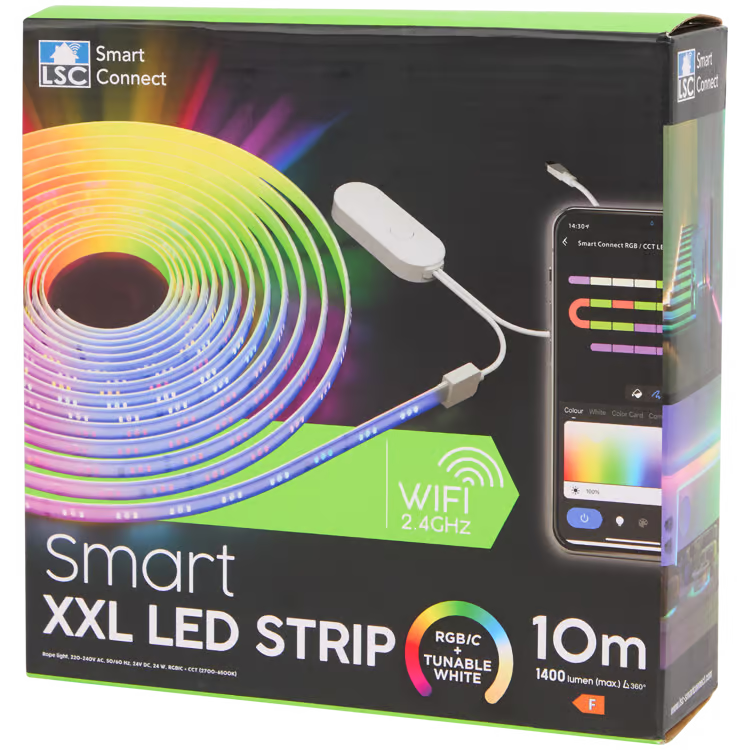

## General Notes

This configuration is for the [LSC Smart Connect XXL-LED-Stripe 3202086](https://www.action.com/de-at/p/3202086/lsc-smart-connect-xxl-led-streifen/)
which comes as a colour changing LED strip with controller and transformer.



## GPIO Pinout

| Pin    | Function      |
| ------ | ------------- |
| P9     | Cold White    |
| P24    | Warm White    |
| P16    | WS2812        |
| P6     | Power for LEDs|
| P7     | Button        |
| P26    | IR-Receiver   |

```yaml
# LSC Smart Connect XXL-LED-Stripe 3202086
esphome:
  name: terasse-led-stripe
  comment: LSC Smart Connect XXL-LED-Stripe 3202086
  friendly_name: LSC Smart Connect XXL-LED-Stripe

bk72xx:
  board: generic-bk7231n-qfn32-tuya

# Enable logging
logger:
  baud_rate: 0

# Enable Home Assistant API
api:

ota:
  - platform: esphome

# Enable Web server
web_server:

# WiFi connection
wifi:
  ap:

captive_portal:

light:
  - platform: cwww
    id: white_light
    name: "White Light"
    cold_white: output_cw
    warm_white: output_ww
    cold_white_color_temperature: 6500 K
    warm_white_color_temperature: 2700 K
    on_turn_on:
      - light.turn_off: color_light

  - platform: beken_spi_led_strip
    id: color_light
    name: "Color Light"
    pin: P16
    chipset: WS2812
    num_leds: 40
    rgb_order: RBG
    power_supply: led_power
    effects:
     - random:
     - pulse:
     - strobe:
     - flicker:
     - addressable_rainbow:
     - addressable_color_wipe:
     - addressable_scan:
     - addressable_twinkle:
     - addressable_random_twinkle:
     - addressable_fireworks:
     - addressable_flicker:
    on_turn_on:
      - light.turn_off: white_light

output:
  - platform: libretiny_pwm
    id: output_cw
    pin: P9
    power_supply: led_power
  - platform: libretiny_pwm
    id: output_ww
    pin: P24
    power_supply: led_power

power_supply:
    id: led_power
    pin: P6

remote_receiver:
  pin:
    number: P26
    mode:
      input: true
      pullup: true
  dump: all

binary_sensor:
  - platform: gpio
    pin:
      number: P7
      inverted: True
      mode:
        input: True
        pullup: True
    name: "Button"
    on_press:
      - light.toggle: white_light
```
