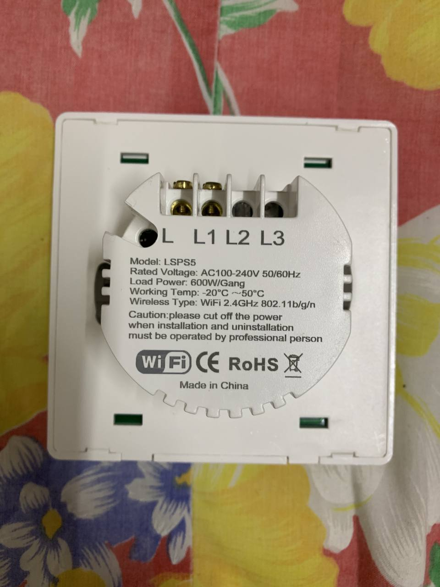
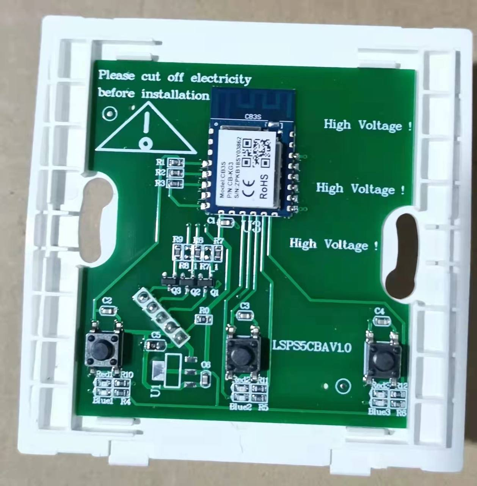

- Has a BK7231N chip.
- Push button wall switch
- Can be cloudcut using tuya-cloudcutter

## GPIO Pinout

### 1-Gang Version

| Pin    | Function           |
| ------ | ------------------ |
| GPIO26 | Button 1           |
| GPIO7  | Relay 1            |
| GPIO8  | Relay 1            |
| GPIO6  | Wifi LED indicator |

### 2-Gang Version

| Pin    | Function           |
| ------ | ------------------ |
| GPIO14 | Button 1           |
| GPIO24 | Button 2           |
| GPIO7  | Relay 1            |
| GPIO9  | Relay 2            |
| GPIO6  | Wifi LED indicator |

### 3-Gang Version

| Pin    | Function           |
| ------ | ------------------ |
| GPIO14 | Button 1           |
| GPIO26 | Button 2           |
| GPIO24 | Button 3           |
| GPIO7  | Relay 1            |
| GPIO8  | Relay 2            |
| GPIO9  | Relay 3            |
| GPIO6  | Wifi LED indicator |

## PCB



## Basic Configuration (1 gang)

```yaml
substitutions:
  devicename: 1gang-switch
  friendlyname: 1gang-switch

esphome:
  name: $devicename
  friendly_name: $friendlyname

bk72xx:
  board: generic-bk7231n-qfn32-tuya
  framework:
    version: latest

# Enable logging
logger:

# Enable Home Assistant API
api:

ota:
  - platform: esphome

wifi:
  ssid: !secret wifi_ssid
  password: !secret wifi_password

  # Enable fallback hotspot (captive portal) in case wifi connection fails
  ap:
    ssid: "1G-Beken Fallback Hotspot"
    password: !secret ap_password

captive_portal:

web_server:
  port: 80

sensor:
  - platform: uptime
    name: $friendlyname Uptime
    update_interval: 60s

switch:
  - platform: gpio
    name: $devicename Switch 1
    pin: GPIO8
    id: relay_1

binary_sensor:
  - platform: status
    name: $devicename Status

  - platform: gpio
    pin:
      number: GPIO26
      mode: INPUT_PULLUP
      inverted: True
    name: $devicename Button 1
    on_press:
      - switch.toggle: relay_1

status_led:
  pin:
    number: GPIO6
    inverted: False
```

## Basic Configuration (2 gang)

```yaml
substitutions:
  devicename: 2gang-switch
  friendlyname: 2gang-switch

esphome:
  name: $devicename
  friendly_name: $friendlyname

bk72xx:
  board: generic-bk7231n-qfn32-tuya
  framework:
    version: latest

# Enable logging
logger:

# Enable Home Assistant API
api:

ota:
  - platform: esphome

wifi:
  ssid: !secret wifi_ssid
  password: !secret wifi_password

  # Enable fallback hotspot (captive portal) in case wifi connection fails
  ap:
    ssid: "2G-Beken Fallback Hotspot"
    password: !secret ap_password

captive_portal:

web_server:
  port: 80

sensor:
  - platform: uptime
    name: $friendlyname Uptime
    update_interval: 60s

switch:
  - platform: gpio
    name: $devicename Switch 1
    pin: GPIO7
    id: relay_1

  - platform: gpio
    name: $devicename Switch 2
    pin: GPIO9
    id: relay_2

binary_sensor:
  - platform: status
    name: $devicename Status

  - platform: gpio
    pin:
      number: GPIO14
      mode: INPUT_PULLUP
      inverted: True
    name: $devicename Button 1
    on_press:
      - switch.toggle: relay_1

  - platform: gpio
    pin:
      number: GPIO24
      mode: INPUT_PULLUP
      inverted: True
    name: $devicename Button 2
    on_press:
      - switch.toggle: relay_2

status_led:
  pin:
    number: GPIO6
    inverted: False
```

## Basic Configuration (3 gang)

```yaml
substitutions:
  devicename: 3gang-switch
  friendlyname: 3gang-switch

esphome:
  name: $devicename
  friendly_name: $friendlyname

bk72xx:
  board: generic-bk7231n-qfn32-tuya
  framework:
    version: latest

# Enable logging
logger:

# Enable Home Assistant API
api:

ota:
  - platform: esphome

wifi:
  ssid: !secret wifi_ssid
  password: !secret wifi_password

  # Enable fallback hotspot (captive portal) in case wifi connection fails
  ap:
    ssid: "3G-Beken Fallback Hotspot"
    password: !secret ap_password

captive_portal:

web_server:
  port: 80

sensor:
  - platform: uptime
    name: $friendlyname Uptime
    update_interval: 60s

switch:
  - platform: gpio
    name: $devicename Switch 1
    pin: GPIO7
    id: relay_1

  - platform: gpio
    name: $devicename Switch 2
    pin: GPIO8
    id: relay_2
  #    restore_mode: ALWAYS_ON

  - platform: gpio
    name: $devicename Switch 3
    pin: GPIO9
    id: relay_3

binary_sensor:
  - platform: status
    name: $devicename Status

  - platform: gpio
    pin:
      number: GPIO14
      mode: INPUT_PULLUP
      inverted: True
    name: $devicename Button 1
    on_press:
      - switch.toggle: relay_1

  - platform: gpio
    pin:
      number: GPIO26
      mode: INPUT_PULLUP
      inverted: True
    name: $devicename Button 2
    on_press:
      - switch.toggle: relay_2

  - platform: gpio
    pin:
      number: GPIO24
      mode: INPUT_PULLUP
      inverted: True
    name: $devicename Button 3
    on_press:
      - switch.toggle: relay_3

status_led:
  pin:
    number: GPIO6
    inverted: False
```

## Decoupled mode & toggle/dimming lights using device group

Add this configuration below

### For lights

```yaml
external_components:
  - source: github://cossid/tasmotadevicegroupsforesphome@main
    components: [device_groups]
    refresh: 10 min

device_groups:
  - group_name: "cornerlights" # Tasmota device group name
    lights:
      - light_treatlife_corner

light:
  - platform: rgbww
    name: $devicename
    id: "light_treatlife_corner" #use the same id for device_groups
    red: output_red
    green: output_green
    blue: output_blue
    warm_white: output_warmwhite
    cold_white: output_coldwhite
    color_interlock: true
    cold_white_color_temperature: 6500 K
    warm_white_color_temperature: 2700 K
    default_transition_length: 0.5s
    restore_mode: RESTORE_DEFAULT_ON
```

### For switch

Example using button 2 to control lights in the same device group

```yaml
substitutions:
  devicename: 3gang-switch
  friendlyname: 3gang-switch

esphome:
  name: $devicename
  friendly_name: $friendlyname

bk72xx:
  board: generic-bk7231n-qfn32-tuya
  framework:
    version: latest

# Enable logging
logger:

# Enable Home Assistant API
api:

ota:
  - platform: esphome

wifi:
  ssid: !secret wifi_ssid
  password: !secret wifi_password

  # Enable fallback hotspot (captive portal) in case wifi connection fails
  ap:
    ssid: "3G-Beken Fallback Hotspot"
    password: !secret ap_password

captive_portal:

web_server:
  port: 80

globals:
  - id: counter
    type: int
    restore_value: False
    initial_value: "0"

  - id: bool_dim_or_bright #false = dim, true = brighten
    type: bool
    restore_value: no
    initial_value: "false"

sensor:
  - platform: uptime
    name: $friendlyname Uptime
    update_interval: 60s

external_components:
  - source: github://cossid/tasmotadevicegroupsforesphome@main
    components: [device_groups]
    refresh: 10 min

device_groups:
  - group_name: "cornerlights" # Tasmota device group name
    lights:
      - internal_light

output:
  - platform: template
    id: dummy_output
    type: float
    write_action:
      - lambda: return;

light:
  - platform: rgbww
    id: internal_light
    color_interlock: true
    cold_white_color_temperature: 6500 K
    warm_white_color_temperature: 2700 K
    red: dummy_output
    green: dummy_output
    blue: dummy_output
    cold_white: dummy_output
    warm_white: dummy_output

switch:
  - platform: gpio
    name: $devicename Switch 1
    pin: GPIO7
    id: relay_1

  - platform: gpio
    name: $devicename Switch 2
    pin: GPIO8
    id: relay_2
    restore_mode: ALWAYS_ON

  - platform: gpio
    name: $devicename Switch 3
    pin: GPIO9
    id: relay_3

binary_sensor:
  - platform: status
    name: $devicename Status

  - platform: gpio
    pin:
      number: GPIO14
      mode: INPUT_PULLUP
      inverted: True
    name: $devicename Button 1
    on_press:
      - switch.toggle: relay_1

  - platform: gpio
    pin:
      number: GPIO26
      mode: INPUT_PULLUP
      inverted: True
    name: $devicename Button 2
    id: button2
    on_multi_click:
      # single click
      - timing:
          - ON for at most 1s
          - OFF for at least 0.5s
        then:
          - if:
              condition:
                and:
                  - wifi.connected:
              # toggle light when wifi is conncected
              then:
                - light.toggle: internal_light
              # toggle relay in case  wifi is not connected
              else:
                - switch.toggle: relay_2
      # double click to switch to cold or warm light
      - timing:
          - ON for at most 1s
          - OFF for at most 1s
          - ON for at most 1s
          - OFF for at least 0.2s
        then:
          - lambda: |-
              auto call = id(internal_light).turn_on();

              if (id(counter) == 0) { //Cold white with 100% brightness
                call.set_cold_white(1.0);
                call.set_brightness(1.0);
              }

              if (id(counter) == 1) { //Warm white with 50% brightness
                call.set_cold_white(0.0);
                call.set_warm_white(1.0);
                call.set_brightness(0.5);
              }

              if (id(counter) < 1) { //Or your maximum effects
                id(counter) += 1;
              } else {
                id(counter) = 0;
              }

              call.perform();

    #long press for dimming
    on_press:
      then:
        - if:
            condition:
              lambda: |-
                return id(bool_dim_or_bright);
            # When above condition evaluates to true - brighter function else dimmer
            then:
              - delay: 0.5s
              - while:
                  condition:
                    binary_sensor.is_on: button2
                  then:
                    - light.dim_relative:
                        id: internal_light
                        relative_brightness: 5%
                        transition_length: 0.1s
                    - delay: 0.1s
              - lambda: |-
                  id(bool_dim_or_bright) = (false);
            else:
              - delay: 0.5s
              - while:
                  condition:
                    and:
                      - binary_sensor.is_on: button2
                  then:
                    - light.dim_relative:
                        id: internal_light
                        relative_brightness: -5%
                        transition_length: 0.1s
                    - delay: 0.1s
              - lambda: |-
                  id(bool_dim_or_bright) = (true);

  - platform: gpio
    pin:
      number: GPIO24
      mode: INPUT_PULLUP
      inverted: True
    name: $devicename Button 3
    on_press:
      - switch.toggle: relay_3

status_led:
  pin:
    number: GPIO6
    inverted: False
```
