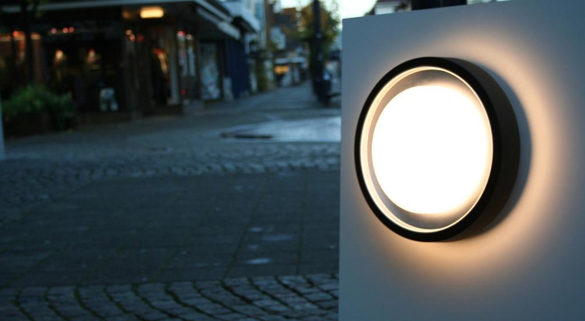

## Notes  
An older version (non WiZ) exists with 2xE27 socket and no wifi.
The LED driver hums when the brightness gets too high and the PWM frequency is too low.

## Flashing Procedure  
On the LED's driver board, there is a small PCB with an ESP32-WROOM-32 module. It's glued in and connected with a 2 MM pitched header. On the backside of the PCB are pads with 2.54 MM header that can be used to flash.

## Light Specifications  
Color: RGB+Warm+Cold White  
Color Temperature: 2700-6500K  
Warm White LEDs: 5x3  
Warm White LEDs: 5x3  
RGB LEDs: 6  
Brightness: 830 lumens  
Voltage: 110V~250V  
Power: 15W  
IP54 ingress protection  

## Product Images


## GPIO Pinout  
| Pin    | Function      |
| ------ | ------------- |
| GPIO13 | WW Output     |
| GPIO5  | CW Output     |
| GPIO25 | Red Output    |
| GPIO26 | Green Output  |
| GPIO27 | Blue Output   |

## Basic Configuration  
```yaml
esphome:
  name: lutec-origo
  friendly_name: Lutec Origo

esp32:
  board: esp32dev
  framework:
    type: arduino

output:
  - platform: ledc
    id: output_red
    pin: GPIO25
    frequency: 24000 Hz           
  - platform: ledc
    id: output_green
    pin: GPIO26
    frequency: 24000 Hz
  - platform: ledc
    id: output_blue
    pin: GPIO27
    frequency: 24000 Hz
  - platform: ledc
    id: output_warm_white
    pin: GPIO2
    frequency: 24000 Hz
  - platform: ledc
    id: output_cool_white
    pin: GPIO4
    frequency: 24000 Hz

light:
  - platform: rgbww
    name: "WC+RGB Light"
    red: output_red
    green: output_green
    blue: output_blue
    warm_white: output_warm_white
    cold_white: output_cool_white
    cold_white_color_temperature: 6500K
    warm_white_color_temperature: 2700K
    constant_brightness: true
    default_transition_length: 1s
    gamma_correct: 2.8
```
