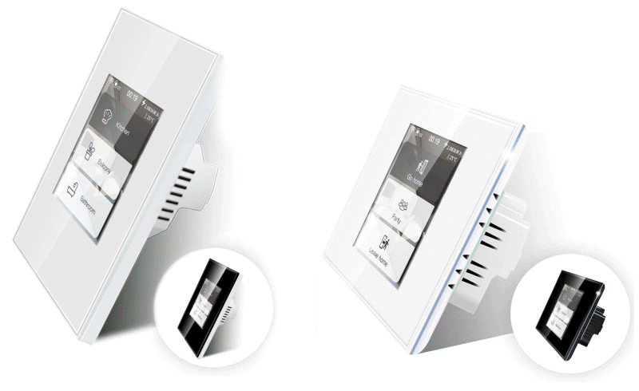
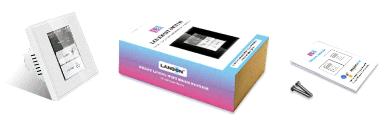
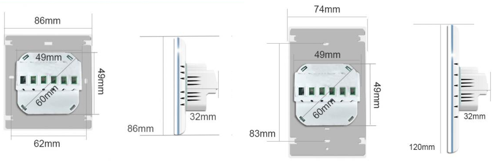
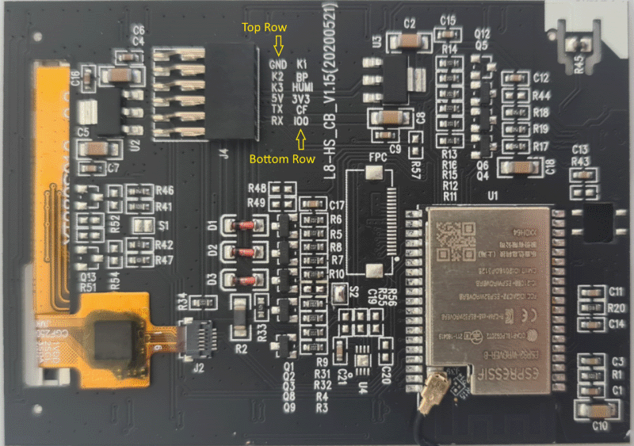

## Product Images




## Description

- L8-HS: 3 Relays - load up to 200W/gang
- L8-HD: 1 Dimmer - load up to 200W/gang
- L8-HB: Boiler switch - load up to 16A
- L8-HT: Thermostat switch - not tested!

Choose a model that works with Apple HomeKit (has this sticker on) because those are WiFi versions with the internal antenna connected to the ESP-WROOVER-B module. Do NOT buy a version that is powered by Tuya Smart Life because the internal antenna is connected to the Tuya chip. Those devices will have very bad WiFi reception of the ESP32!

### Features

- ESP32-WROVER-B
- FT6336U touch controller (capacitive)
- ST7789V display controller, driving a 240x320 LCD screen
- 8 MB flash
- 8 MB PSram
- Dimmable backlight (PWM)
- Mood LEDS (PWM, not uniform)
- Built-in PSU, input voltage 110-250V ~ 50-60Hz AC
- Energy monitoring (not all revisions)
- Standard wallmount form factor both EU and US



The models have the same recessed housing sliding into the wall, sized 50x50mm, with rounded corners creating a diameter of about 59mm. This makes them suitable for both EU and US wall fixtures. The EU model fits in a properly deployed, standard 60mm round wall box and can be fixed with two side screws (use the screws which belong to the box instead of the ones shipped with the device), the US model fits in the standard rectangular box and can be fixed through the oval holes located 3 1/4" apart. The depth of the wall box has to be at least 35-40mm because some room is needed for the wires coming out straight of the device.

Although the moodlight goes nicely around the case, coloring is not uniform, and this is not a software issue.

## GPIO Pinout

| Pin    | Function                  |
|--------|---------------------------|
| GPIO22 | SPI (Display) CS          |
| GPIO21 | SPI (Display) DC          |
| GPIO18 | Reset (Display)           |
| GPIO19 | SPI (Display) CLK         |
| GPIO23 | SPI (Display) MOSI        |
| GPIO25 | SPI (Display) MISO        |
| GPIO0  | I2C (Touchscreen) SCL     |
| GPIO4  | I2C (Touchscreen) SDA     |
| GPIO5  | Backlight (PWM out)       |
| GPIO26 | Moodlight Red (PWM out)   |
| GPIO32 | Moodlight Green (PWM out) |
| GPIO33 | Moodlight Blue (PWM out)  |
| GPIO35 | HLW8012 (CF)              |

Hardware revisions having energy monitoring are equipped with HLW8012 chip where `CF1` & `SEL` pins are not connected to the MCU, thus this meter only provides pulses depending of Power. Voltage and Current measurement is not possible.

### 3-gang version L8-HS

| Pin    | Function   |
|--------|------------|
| GPIO12 | Relay (K3) |
| GPIO14 | Relay      |
| GPIO27 | Relay      |

### Boiler version L8-HB

| Pin    | Function       |
|--------|----------------|
| GPIO27 | Relay 16A (K3) |

### Dimmer version L8-HD

| Pin    | Function       |
|--------|----------------|
| GPIO12 | Dimmer TX (K3) |

## Flashing

No need to solder to flash this device. All the pins required for flashing are available on the header that connects the plate to the base. Use thinner solid core wires (eg. salvaged from Ethernet cables) and insert them in the pin header (Dupont or breadboard wires are too thick).

Steps:

1. Disengage the high-voltage power.
2. Detach the panel from the PSU power supply.
3. Connect `RX`, `TX`, `IO0`, `GND` and `5V` pins to the female pinheader.
4. Because there is no `RESET` pin, you need to powercycle the board while `IO0` is connected to `GND` to activate flash mode.



Make sure you have a USB to TTL serial adapter than can provide sufficient power **on the 5V pin**.
Once the serial connections are made, you can erase flash, power-cycle the board and then flash the ESPHome modern format binary (`*-factory.bin`) using `esptool`.

You can follow this [flashing guide](https://blakadder.com/lanbon-L8-custom-firmware/) on [blakadder.com](https://blakadder.com) or [this discussion post](https://github.com/HASwitchPlate/openHASP/discussions/76) with instructions and photos to flash the firmware without having to open the device.

## Example main configuration for 3-gang version (L8-HS)

```yml
esphome:
  ...
  platformio_options:
    build_unflags: -Werror=all

esp32:
  board: esp-wrover-kit
  framework:
    type: esp-idf

psram:
  mode: octal
  speed: 80MHz

spi:
  clk_pin: GPIO19
  mosi_pin: GPIO23
  interface: hardware

i2c:
  sda: GPIO4
  scl:
    number: GPIO0
    ignore_strapping_warning: true

output:
  - platform: ledc
    id: backlight_output
    frequency: 1220Hz
    pin:
      number: GPIO5
      ignore_strapping_warning: true
  - platform: ledc
    id: mood_red
    frequency: 1220Hz
    pin:
      number: GPIO26
  - platform: ledc
    id: mood_green
    frequency: 1220Hz
    pin:
      number: GPIO32
  - platform: ledc
    id: mood_blue
    frequency: 1220Hz
    pin:
      number: GPIO33

  - id: relay_1
    platform: gpio
    pin:
      number: GPIO12
      ignore_strapping_warning: true
  - id: relay_2
    platform: gpio
    pin: GPIO14
  - id: relay_3
    platform: gpio
    pin: GPIO27


light:
  - platform: monochromatic
    output: backlight_output
    name: LCD Backlight
    id: display_backlight
    restore_mode: ALWAYS_ON

  - platform: rgb
    name: Moodlight
    red: mood_red
    green: mood_green
    blue: mood_blue
    restore_mode: RESTORE_AND_OFF

  - platform: binary
    name: Relay 1
    output: relay_1
  - platform: binary
    name: Relay 2
    output: relay_2
  - platform: binary
    name: Relay 3
    output: relay_3

sensor:
  - platform: pulse_meter
    name: Load power
    pin: GPIO35
    device_class: power
    state_class: measurement
    unit_of_measurement: 'W'
    internal_filter_mode: PULSE
    accuracy_decimals: 1
    filters:
      - filter_out: nan
      - throttle_average: 60s
      - multiply: 0.0813287514318442  # Calibration may be needed

text_sensor:
  - platform: wifi_info
    ip_address:
      name: IP Address
      id: txt_ip
```

## Example display configuration using the classic graphics renderer

With this example configuration, after you connect the device to your network, the IP address will be shown on top of the screen. Long-pressing will draw red dots, this demonstrates the functionality of the touch screen.

```yml
font:
  - file: "gfonts://Roboto"
    id: roboto
    size: 22
    bpp: 4

touchscreen:
  - platform: ft63x6
    id: tft_touch
    display: tft_display
    update_interval: 50ms
    threshold: 1
    calibration:
      x_max: 240
      y_max: 320

display:
  - platform: ili9xxx
    model: st7789v
    id: tft_display
    dimensions:
      width: 240
      height: 320
    transform:
      swap_xy: false
      mirror_x: true
      mirror_y: true
    data_rate: 80MHz
    cs_pin: GPIO22
    dc_pin: GPIO21
    reset_pin: GPIO18
    auto_clear_enabled: false
    invert_colors: false
    update_interval: 1s
    lambda: |-
      it.printf(0, 0, id(roboto), Color(128, 128, 128), "%s", id(txt_ip).state.c_str(), display::COLOR_OFF);
      auto touch = id(tft_touch)->get_touch();
      if (touch) // or touch.has_value()
        it.filled_circle(touch.value().x, touch.value().y, 7, Color(255, 0, 0));
```

To calibrate the power values measured by the `pulse_meter` sensor, use an external power meter which is known to make correct measurements, and attach an ohmic load of about 70-100W (an incandescent bulb, or a small heater). In the config, replace the `multiply` value with `1`, and flash the device. Turn on the load and observe the reading on your external power meter and the value reported by the sensor. Your calibrated new `multiply` value will be external power meter measurement / the value reported.
