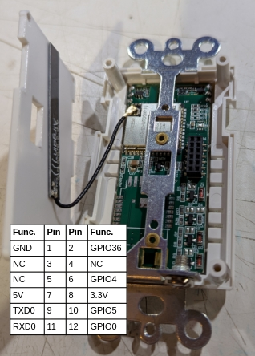

## Drivers

* Processor: ESP32-S3-WROOM-1U
* Touchscreen: FT6336U
* Display: ST7789V2
* mmWave Prescence: MoreSense 10G Hand Sweeping Series MS10-3007D26M4
* Power Sensor: HLW8012 (CF pin only)

## GPIO Pinout

### i80 Display

| Pin    | Function   |
| ------ | -----------|
| GPIO17 | DC Pin |
| GPIO21 | CS Pin |
| GPIO13 | WR Pin |
| GPIO18 | RD Pin |
| GPIO6  | Data D0 |
| GPIO7  | Data D1 |
| GPIO15 | Data D2 |
| GPIO16 | Data D3 |
| GPIO10 | Data D4 |
| GPIO9  | Data D5 |
| GPIO46 | Data D6 |
| GPIO3  | Data D7 |

### I²C (used for touchscreen)

| Pin    | Function   |
| ------ | -----------|
| GPIO0  | i2c SCL |
| GPIO35 | i2c SCA |

### General Purpose IO

| Pin    | Function   |
| ------ | -----------|
| GPIO32 | LCD Backlight (output, ledc) |
| GPIO36 | Load Relay (output, switch) |
| GPIO5  | HLW8012 CF Pin (input, pulse_meter)
| GPIO11 | mmWave Proximity Sensor (input, binary_sensor) |
| GPIO2  | mmWave Proximity Sensor (output, unknown) |
| GPIO1  | mmWave Proximity Sensor (output, unknown) |

Note, programming the proximity sensor for different sensitivity, etc. is not yet possible.

## How to Flash

1. Open the switch, by removing the terminal covers and the 4 small screws on the cornors.
1. The front part of hte switch should "pop off", with a small amount of pressure.
1. Connect a USB level shifter to the pin header on the front panel, using the pinout below.  Note, you must provide 5v power, while the Tx/Rx pins use a 3.3v level.  
1. Connect the GPIO0 pin to ground to put the ESP32 into the flash boot mode.
1. Once flashed, the screen should power up and display ESPHome, while powered via the 5v supply.



## Example Configuration


The following configuration implements the following features and examples from the LVGL component.

* Button with status update based on load relay gpio
* Screen time-out (backlight) and activation via touch or proximity
* Load power measurement via HLW8012
* Anti-burn
* Header icon showing API status
* Header label showing current time via SNTP
* Footer for page navigation

```yaml
esphome:
  name: lanbon-l9
  friendly_name: Lanbon L9

esp32:
  board: esp32-s3-devkitc-1
  framework:
    type: esp-idf

# Enable logging
logger:
  level: DEBUG
  baud_rate: 115200
  hardware_uart: UART0

# Enable Home Assistant API
api:
  encryption:
    key: !secret api_key
  reboot_timeout: 0s
  on_client_connected:
    - lvgl.label.update:
        id: label_apistatus
        text_color: 0x00FF00
  on_client_disconnected:
    - lvgl.label.update:
        id: label_apistatus
        text_color: 0xFF0000

ota:
  - platform: esphome
    password: !secret ota_password

wifi:
  ssid: !secret wifi_ssid
  password: !secret wifi_password

psram:
  speed: 80MHz

time:
  - platform: sntp
    id: my_sntp
    timezone: America/New_York
    on_time:
      - hours: 23,4
        minutes: 5
        seconds: 0
        then:
          - switch.turn_on: switch_antiburn
      - hours: 23,4
        minutes: 35
        seconds: 0
        then:
          - switch.turn_off: switch_antiburn
      - seconds: 0
        minutes: '*'
        then:
          - lvgl.label.update:
              id: label_time
              text:
                time_format: "%l:%M %p"
                time: my_sntp

output:
  - platform: ledc
    id: lcd_backlight_output
    pin:
      number: GPIO42
      inverted: false

light:
  - platform: monochromatic
    output: lcd_backlight_output
    name: Display Backlight
    id: display_backlight
    restore_mode: ALWAYS_ON

spi:
  type: octal
  id: display_spi
  clk_pin: GPIO21
  data_pins:
    - GPIO6
    - GPIO7
    - GPIO15
    - GPIO16
    - GPIO10
    - GPIO9
    - GPIO46
    - GPIO3

display:
  - platform: mipi_spi
    id: my_display
    model: st7789v
    spi_id: display_spi
    bus_mode: octal
    dc_pin: GPIO17
    dimensions:
      height: 320
      width: 170
      offset_height: 0
      offset_width: 35
    invert_colors: true
    show_test_card: false
    data_rate: 4MHz
    color_depth: 16BIT
    color_order: BGR
    auto_clear_enabled: false
    update_interval: 250ms

i2c:
  - id: touchscreen_i2c
    scl:
      number: GPIO0
      ignore_strapping_warning: true
    sda:
      number: GPIO35

touchscreen:
  - platform: ft63x6
    id: my_touchscreen
    display: my_display
    i2c_id: touchscreen_i2c
    calibration:
      x_min: 0
      y_min: 0
      x_max: 169
      y_max: 319
    on_release:
      - if:
          condition: lvgl.is_paused
          then:
            - if:
                condition: lvgl.is_paused
                then:
                  - logger.log: "LVGL resuming due to screen touch."
                  - lvgl.resume:
                  - lvgl.widget.redraw:
                  - light.turn_on: display_backlight

sensor:
  - platform: wifi_signal
    name: Wifi Signal
    update_interval: 60s
    entity_category: diagnostic

  - platform: uptime
    name: Uptime
    entity_category: diagnostic

  - platform: pulse_meter
    name: Power
    id: power_pulse_meter
    pin: GPIO5
    unit_of_measurement: 'W'
    device_class: power
    state_class: measurement
    internal_filter_mode: PULSE
    accuracy_decimals: 1
    filters:
      - filter_out: nan
      - throttle: 15s
      - multiply: 0.0813287514318442  # Calibration may be needed

binary_sensor:
  - platform: gpio
    name: Proximity Sensor
    id: proximity_sensor
    pin: GPIO11
    on_press:
      then:
        - if:
            condition: lvgl.is_paused
            then:
              - logger.log: "LVGL resuming due to proximity sensor."
              - lvgl.resume:
              - lvgl.widget.redraw:
              - light.turn_on: display_backlight

switch:
  - platform: gpio
    name: Relay
    id: relay
    pin:
      number: GPIO36
    on_turn_on:
      - lvgl.widget.update:
          id: light_switch
          state:
            checked: true
      - lvgl.label.update:
          id: label_light_switch
          text: "\U000F06E9"
          text_color: 0xFFEE00
    on_turn_off:
      - lvgl.widget.update:
          id: light_switch
          state:
            checked: false
      - lvgl.label.update:
          id: label_light_switch
          text: "\U000F0336"
          text_color: 0xFFFFFF

  - platform: template
    name: Antiburn
    id: switch_antiburn
    icon: mdi:television-shimmer
    optimistic: true
    entity_category: "config"
    turn_on_action:
      - logger.log: "Starting Antiburn"
      - if:
          condition: lvgl.is_paused
          then:
            - lvgl.resume:
            - lvgl.widget.redraw:
      - lvgl.pause:
          show_snow: true
      - light.turn_off: display_backlight
    turn_off_action:
      - logger.log: "Stopping Antiburn"
      - if:
          condition: lvgl.is_paused
          then:
            - lvgl.resume:
            - lvgl.widget.redraw:

font:
  - file: "https://github.com/Pictogrammers/pictogrammers.github.io/raw/refs/heads/main/@mdi/font/7.4.47/fonts/materialdesignicons-webfont.ttf"
    id: mdi_icons
    bpp: 4
    size: 52
    glyphs: [
      "\U000F0336",
      "\U000F06E9"
    ]

lvgl:
  displays:
    - my_display
  touchscreens:
    - my_touchscreen
  buffer_size: 25%
  log_level: WARN
  on_idle:
    timeout: 30s
    then:
      - logger.log: "LVGL is idle"
      - light.turn_off: display_backlight
      - lvgl.pause:
  style_definitions:
    - id: header_footer
      bg_color: 0x2F8CD8
      bg_grad_color: 0x005782
      bg_grad_dir: VER
      bg_opa: COVER
      border_opa: TRANSP
      radius: 0
      pad_all: 0
      pad_row: 0
      pad_column: 0
      border_color: 0x0077b3
      text_color: 0xFFFFFF
      width: 100%
      height: 30
  top_layer:
    widgets:
      - obj:
          align: TOP_MID
          styles: header_footer
          widgets:
          - label:
              text:
                time_format: "%l:%M %p"
                time: my_sntp
              id: label_time
              align: CENTER
              text_align: CENTER
              text_color: 0xFFFFFF
          - label:
              text: "\uF1EB"
              id: label_apistatus
              align: top_right
              x: -2
              y: 7
              text_align: right
              text_color: 0xFFFFFF
      - buttonmatrix:
          align: bottom_mid
          styles: header_footer
          pad_all: 0
          outline_width: 0
          id: top_layer
          items:
            styles: header_footer
          rows:
            - buttons:
              - id: page_prev
                text: "\uF053"
                on_press:
                  then:
                    lvgl.page.previous:
              - id: page_home
                text: "\uF015"
                on_press:
                  then:
                    lvgl.page.show: page_light_switch
              - id: page_next
                text: "\uF054"
                on_press:
                  then:
                    lvgl.page.next:
  pages:
    - id: page_light_switch
      widgets:
        - button:
            x: 35
            y: 60
            width: 100
            height: 200
            id: light_switch
            checkable: true
            on_click:
              switch.toggle: relay
            widgets:
              - label:
                  id: label_light_switch
                  align: CENTER
                  text: "\U000F0336"
                  text_align: CENTER
                  text_font: mdi_icons
```
