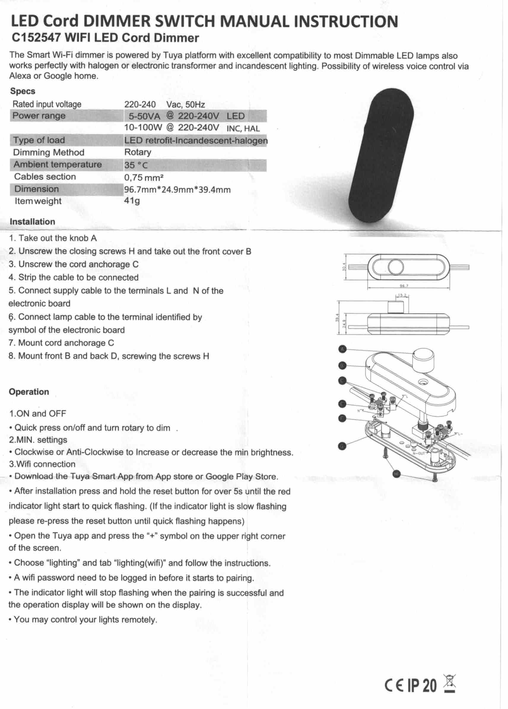
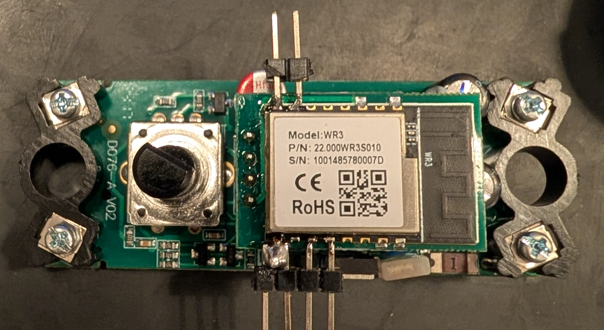
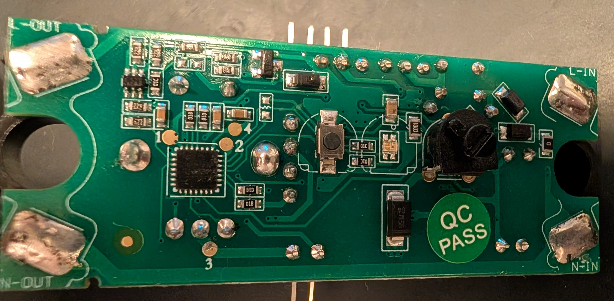
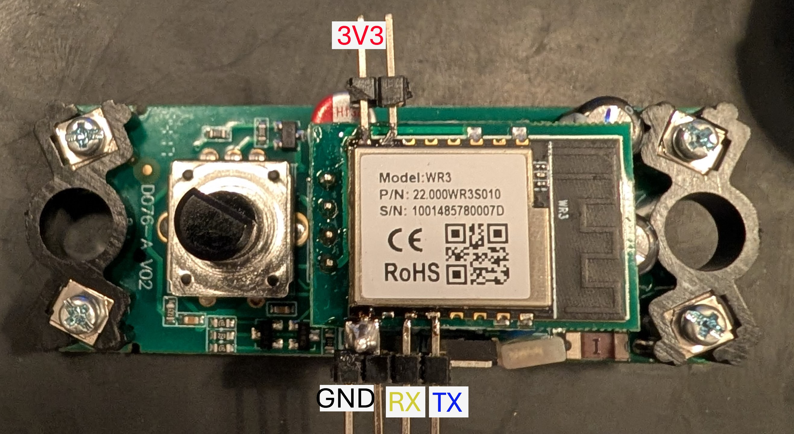

"The Smart Wi-Fi dimmer is powered by Tuya platform with excellent compatibility to most Dimmable LED lamps
also works pefectly with halogen or eclectronic transformer and incandescent lighting.
Possibiliity of wireless voice control via Alexa or Google home."

Also known as C152547 WIFI LED Cord Dimmer is a dimmer based on Tuya, with 2 microcontrollers.
The dimmer side is controlled by stm microcontroller (Tuya MCU), and the Wi-Fi functionality
by a [**Tuya WR3**](https://developer.tuya.com/en/docs/iot/wr3-module-datasheet?id=K9g3ainzbj9z1) module.

### Specs

|   Description     |    Value                          |
|-------------------|-----------------------------      |
|Rated input voltage| 220-240 Vac, 50Hz                 |
|Power range        | 5-50VA @ 220-240V LED             |
|Power range        | 10-100W @ 220-240 INC, HAL        |
|Type of load       | LED retrofit-Incandescent-halogen |
|Dimming Method     | Rotary                            |
|Ambient temperature| 35°C                              |
|Cables section     | 0.75 mm²                          |
|Dimension          | 96.7mm X 24.9mm X 39.4mm          |
|Item weight        | 41g                               |

### Original paperwork



## Pinout




| Pin | Function                                   |
| --- | ------------------------------------------ |
| GND | Ground connection                          |
| 3V3 | 3.3V input for powering the controller     |
| TX0 | Transmit pin connected to the Tuya MCU     |
| RX0 | Receive pin connected to the Tuya MCU      |
| TX2 | Transmit pin used for flashing/programming |
| RX2 | Receive pin used for flashing/programming  |

## Prerequisites



- Connect your **serial programming adapter** to the **WR3 module** as follows:

  - **GND** → GND
  - **3V3** → 3V3
  - **RX** → TX2 (TX in image)
  - **TX** → RX2 (RX in image)

    Refer to the image above for the pinout layout.

- If you haven’t already, download [**ltchiptool**](https://github.com/libretiny-eu/ltchiptool), a command-line utility
  for flashing and dumping firmware.  
  **Note**: The standard ESP flasher is not compatible with this device.

## Flashing

### IMPORTANT NOTE

> BY NO MEANS SHOULD THE DEVICE BE CONNECTED TO THE MAINS WHILE FLASHING OR DEALING WITH THE DEVICE.
**RISK OF INJURY OR DEATH**, AT MINIMUM **YOU WILL FRY YOUR PC** IF YOU TRY TO FLASH WHILE THE MAINS IS CONNECTED.

Before flashing or dumping firmware, the device must be placed in **download mode**:

1. **Short TX2 to GND.**
2. **Power on the device** by connecting 3.3V:
   - the **3.3V and GND lines** to an adjustable power supply, or the serial adapter.
3. Connect the programming adapter to your PC.
   > _ltchiptool will prompt you later to disconnect TX2 from GND._

**Note:** As an alternative to disconnecting and reconnecting power, you can also **power cycle** the device by shorting
the **EN** pin to **GND**

## Backing up the original firmware

Before flashing ESPHome, it’s highly recommended to back up the original firmware in case you want to restore
the stock tuya functionality later. Run:

```shell
ltchiptool flash read realtek-ambz lcds_backup.uf2
```

After issuing the command, disconnect TX2 from GND to begin the backup process.

### Flashing ESPHome

1. In the ESPHome device builder, after configuring your firmware, select:
   **Install > Manual download**, then click **UF2 package** to download the compiled binary.
2. Put the device back into download mode (short TX2 to GND, then power on).
3. Flash the new firmware using:

```shell
ltchiptool flash write realtek-ambz firmware.uf2
```

## Basic configuration

```yaml

esphome:
  name: Ledkia-LED-Cord-DIMMER
  friendly_name: Ledkia LED Cord DIMMER Switch

rtl87xx:
  board: wr3

# Enable logging
logger:

uart:
  rx_pin: RX0
  tx_pin: TX0
  baud_rate: 9600

tuya:

# Create a light using the dimmer
light:
  - platform: "tuya"
    name: "Dimmer"
    dimmer_datapoint: 2
    min_value_datapoint: 0
    switch_datapoint: 1
    max_value: 1000

# Enable Home Assistant API
api:
  encryption:
    key: !secret api_key

ota:
  - platform: esphome

wifi:
  ssid: !secret wifi_ssid
  password: !secret wifi_password

  # Enable fallback hotspot (captive portal) in case wifi connection fails
  ap:
    ssid: "Dimmer Fallback Hotspot"
    password: !secret fallback_wifi_password

captive_portal:
    
```

## ESP32 migration

Stability of WR3 is not the best, changing the WR3 for a ESP32 module is recommended.
I changed the WR3 for ESP12F WT0132C6-S5. You will have to check pad and footprint
compatibility if choosing other module.

Be aware of the thermal fuse in the board, it is 130C rated and will trigger pretty easilly.
It is very important to disable uart logging (baud_rate: 0), as the pins used by the
tuya MCU are the same as the default UART port of ESP12F WT0132C6-S5.

```yaml

esphome:
  name: Ledkia-LED-Cord-DIMMER
  friendly_name: Ledkia LED Cord DIMMER Switch

esp32:
  board: esp32-c6-devkitc-1
  framework:
    type: esp-idf

# Enable logging
logger:
  baud_rate: 0

uart:
  rx_pin: GPIO17
  tx_pin: GPIO16
  baud_rate: 9600

tuya:

# Create a light using the dimmer
light:
  - platform: "tuya"
    name: "Luz"
    dimmer_datapoint: 2
    switch_datapoint: 1
    max_value: 1000
    icon: mdi:lamp

# Enable Home Assistant API
api:
  encryption:
    key: !secret api_key
ota:
  - platform: esphome

wifi:
  ssid: !secret wifi_ssid
  password: !secret wifi_password

  # Enable fallback hotspot (captive portal) in case wifi connection fails
  ap:
    ssid: "Dimmer-C6 Fallback Hotspot"
    password: !secret wifi_password

captive_portal:

```
