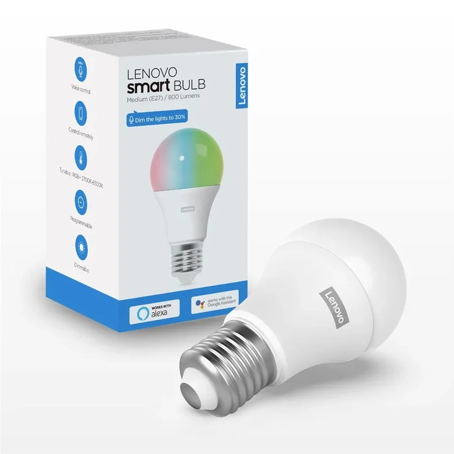

[Lenovo 800 lumen RGB + CCT bulb](https://www.lenovo.com/es/es/smart-bulb/).

## Flashing

This plug can be converted using [tuya-convert to flash ESPHome](/guides/tuya-convert) (as of June 2020).

## Temperature

Range temperature from 2700 Kelvin to 6500 Kelvin. Information extracted from product description.

## GPIO Pinout

| Pin    | Function          |
|--------|-------------------|
| GPIO04 | Red               |
| GPIO12 | Green             |
| GPIO14 | Blue              |
| GPIO05 | White Brightness  |
| GPIO13 | White Temperature |

## Basic Configuration

```yaml
substitutions:
  device_name: "lenovo-800lm-rgbcct"
  friendly_name: "Lenovo 800lm RGBCCT"

esphome:
  name: ${device_name}

esp8266:
  board: esp01_1m
  
# OTA flashing
ota:
  - platform: esphome

wifi: # Your Wifi network details
  
# Enable fallback hotspot in case wifi connection fails  
  ap:

# Enabling the logging component
logger:

# Enable Home Assistant API
api:

# Enable the captive portal
captive_portal:

sensor:
  - platform: uptime
    name: ${friendly_name} Uptime

  - platform: wifi_signal
    name: ${friendly_name} Signal Strength

output:
  - platform: esp8266_pwm
    id: output_r
    pin: GPIO4
  - platform: esp8266_pwm
    pin: GPIO12
    id: output_g
  - platform: esp8266_pwm
    pin: GPIO14
    id: output_b
  - platform: esp8266_pwm
    id: output_brightness
    pin: GPIO5
  - platform: esp8266_pwm
    pin:
      number: GPIO13
      inverted: true
    id: output_temp

light:
  - platform: rgbct
    color_interlock: true
    name: ${friendly_name}
    red: output_r
    green: output_g
    blue: output_b
    white_brightness: output_brightness
    color_temperature: output_temp
    cold_white_color_temperature: 6500 K
    warm_white_color_temperature: 2700 K
```
