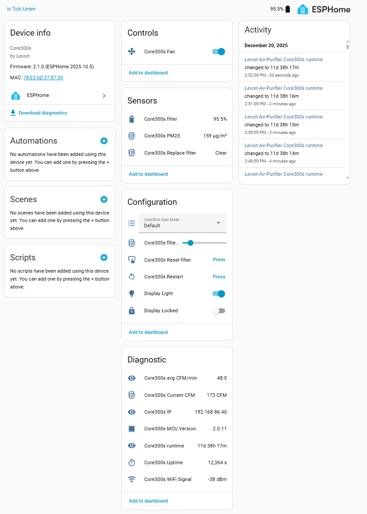
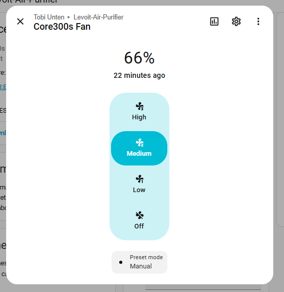

## Features

* Fan component with modes (Manual, Auto, Sleep)
* Display current and avg CFM value
* Filter life time 
  * Tracking based on current CFM value
  * Configurable via Home Assistant (1-12 Months)
  * Reset via Home Assistant
* Display run time in Home Assistant

## General Notes

A smart air purifier with 3-stage filtration. The ESP32 talks to the Tuya MCU using standard 8N1 115200-baud UART. Code
and configuration were obtained from
[Tuct's 'esphome-projects' repo](https://github.com/tuct/esphome-projects/tree/main/projects/levoit-core300s). 

I had issues with those two implementations:
[acvigue's 'esphome-levoit-air-purifier' repo](https://github.com/acvigue/esphome-levoit-air-purifier)
and
[mulcmu 'esphome-levoit-core300s' repo](https://github.com/mulcmu/esphome-levoit-core300s)

I also wanted a fully functional esphome fan, including the modes.

This solution is based on mulcmu's approach, enhanced the component (less chatty) and added template fan mapped

Manufacturer: [Levoit](http://www.levoit.com)

## Details and instructions

[Tuct's 'esphome-projects' repo](https://github.com/tuct/esphome-projects/tree/main/projects/levoit-core300s). 

