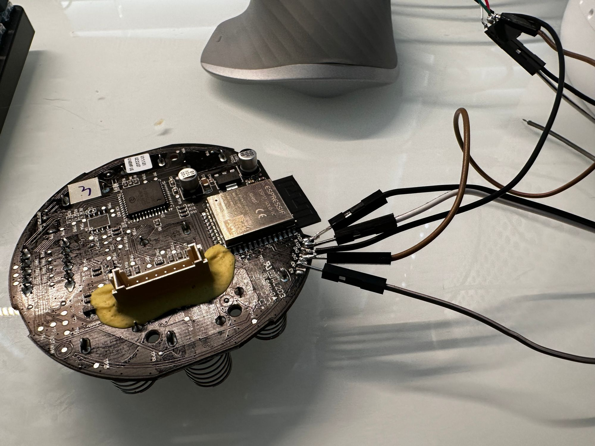

## General Notes

A smart air purifier with 3-stage filtration. The ESP32 talks to the Tuya MCU using standard 8N1 115200-baud UART. Code and configuration were obtained from [acvigue's 'esphome-levoit-air-purifier' repo](https://github.com/acvigue/esphome-levoit-air-purifier). It seems to be supporting the rest of the line-up, but the 300s is the only one tested by the author.

Manufacturer: [Levoit](http://www.levoit.com)


## GPIO Pinout

| Pin    | Function                                 |
| ------ | ---------------------------------------- |
| GPIO16 | TX Pin                                   |
| GPIO17 | RX Pin                                   |

## Flashing

Based on the procedure shared by [acvigue](https://github.com/acvigue/esphome-levoit-air-purifier) and [Aiden Vigue](https://vigue.me/posts/levoit-air-purifier-esphome-conversion)

### Disassembly

* Place upside down and remove base cover and filter to expose 8 screws (4 have washers)
* Remove all 8 screws. *Be careful, as these are made out of a soft metal*
* Using a pry tool slide in between tabs
* Separate base and top sleeve
* Unplug logic board

### Flash

* Solder a header or wires to the module’s pins (3.3 V, GND, TX, RX, and GPIO0)

* Connect TX→RX, RX→TX, GND→GND, and 3.3 V→3.3 V (do **not** use 5 V)
* Hold **GPIO0** to GND while applying power to enter the ESP32 bootloader
* Use your preferred flasher (e.g., `esptool.py`) to write the ESPHome firmware

## ESPHome Configuration

```yaml
esphome:
  name: levoit-air-purifier-core-300s
  friendly_name: Levoit Air Purifier Core 300s

esp32:
  board: esp32dev
  framework:
    type: esp-idf
    sdkconfig_options:
      CONFIG_FREERTOS_UNICORE: y

external_components:
  - source: github://acvigue/esphome-levoit-purifier
    components: [levoit]

logger:
  baud_rate: 115200

# Enable Home Assistant API
api:

ota:
  - platform: esphome

wifi:
  ssid: !secret wifi_ssid
  password: !secret wifi_password
  ap:
    ssid: "$friendly_name Hotspot"

captive_portal:

uart:
  tx_pin: GPIO17
  rx_pin: GPIO16
  baud_rate: 115200

levoit:
  id: levoit1

fan:
  - platform: levoit
    name: Levoit Purifier

sensor:
  # Uptime sensor.
  - platform: uptime
    name: Uptime

  # WiFi Signal sensor.
  - platform: wifi_signal
    name: WiFi Signal
    update_interval: 60s

  # PM2.5 sensor
  - platform: levoit
    pm_2_5:
      name: PM2.5
    air_quality:
      name: Air Quality Index

switch:
  - platform: levoit
    display_lock:
      name: "Display Lock"
    display_on:
      name: "Display On"
    power:
      name: "Master Power"

select:
  - platform: levoit
    fan_mode:
      name: "Fan Mode"
    auto_mode:
      name: "Auto Mode"
```
