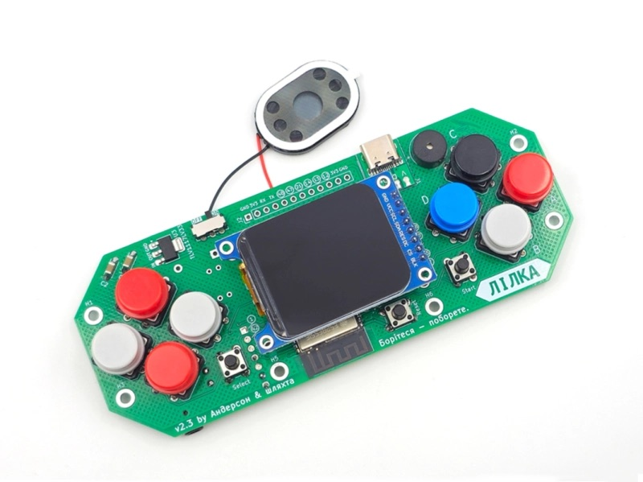

ESP32-S3 based modular handheld device designed as an educational and gaming open-hardware console (hardware v2.3). It is supplied as a self-assembly kit and features a 1.69” 280×240 IPS display (ST7789), physical navigation buttons, an internal speaker with I2S audio, microSD support, USB-C power, and expandable GPIO for custom projects.

## Product Images


## GPIO Pinout
| Pin | Function |
|-----|----------|
| 46  | Display power (GPIO output) |
| 1   | I2S LRCLK for speaker |
| 42  | I2S BCLK for speaker |
| 2   | I2S DOUT — audio output |
| 3   | ADC input for battery voltage |
| 18  | SPI CLK for display |
| 17  | SPI MOSI for display |
| 15  | ST7789 DC |
| 7   | ST7789 CS |
| 38  | Button Up |
| 41  | Button Down |
| 39  | Button Left |
| 40  | Button Right |
| 5   | Button A |
| 6   | Button B |
| 10  | Button C |
| 9   | Button D |
| 4   | Button Start |
| 0   | Button Select |

Notes: GPIO46 and GPIO16 must be set HIGH - the former controls display power, 
the latter drives display backlight and button power rail.

```yaml
esphome:
  name: lilka

esp32:
  board: esp32-s3-devkitc-1
  framework:
    type: esp-idf
    version: recommended
  flash_size: 16MB

psram:
  mode: octal
  speed: 80MHz

wifi:
  ssid: !secret wifi_ssid
  password: !secret wifi_password
  ap:
    ssid: "Lilka Fallback Hotspot"
    password: "lilka"

captive_portal:

logger:

api:

ota:

spi:
  clk_pin: 18
  mosi_pin: 17

display:
  - platform: mipi_spi
    model: ST7789V
    id: my_display
    dc_pin: 15
    cs_pin: 7
    rotation: 270
    invert_colors: true
    color_order: BGR
    pixel_mode: 16bit
    dimensions:
      width: 280
      height: 240
      offset_width: 20
    auto_clear_enabled: false

i2s_audio:
  - id: i2s_out
    i2s_lrclk_pin: GPIO1
    i2s_bclk_pin: GPIO42

speaker:
  - platform: i2s_audio
    id: lilka_speaker
    dac_type: external
    i2s_audio_id: i2s_out
    i2s_dout_pin: GPIO2
    channel: mono
    sample_rate: 16000
    bits_per_sample: 16bit

binary_sensor:
  - platform: gpio
    pin:
      number: 38
      mode: INPUT_PULLUP
      inverted: true
    id: button_up

  - platform: gpio
    pin:
      number: 41
      mode: INPUT_PULLUP
      inverted: true
    id: button_down

  - platform: gpio
    pin:
      number: 39
      mode: INPUT_PULLUP
      inverted: true
    id: button_left

  - platform: gpio
    pin:
      number: 40
      mode: INPUT_PULLUP
      inverted: true
    id: button_right

  - platform: gpio
    pin:
      number: 5
      mode: INPUT_PULLUP
      inverted: true
    id: button_a

  - platform: gpio
    pin:
      number: 6
      mode: INPUT_PULLUP
      inverted: true
    id: button_b

  - platform: gpio
    pin:
      number: 10
      mode: INPUT_PULLUP
      inverted: true
    id: button_c

  - platform: gpio
    pin:
      number: 9
      mode: INPUT_PULLUP
      inverted: true
    id: button_d

  - platform: gpio
    pin:
      number: 4
      mode: INPUT_PULLUP
      inverted: true
    id: button_start

  - platform: gpio
    pin:
      number: 0
      mode: INPUT_PULLUP
      inverted: true
    id: button_select
```
